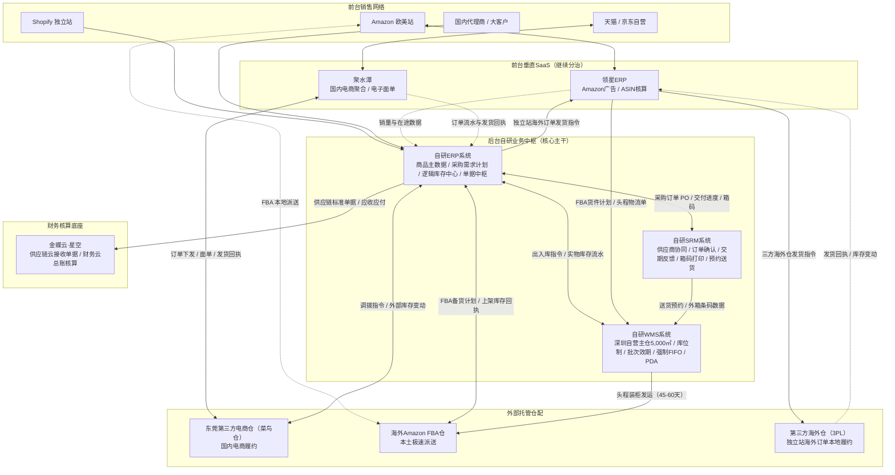
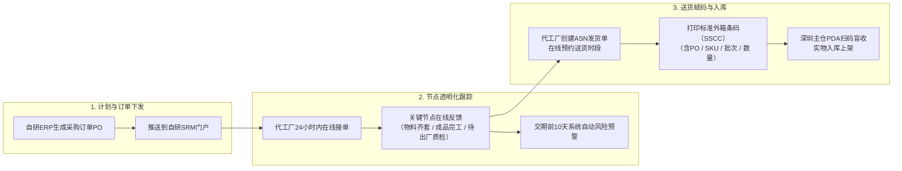
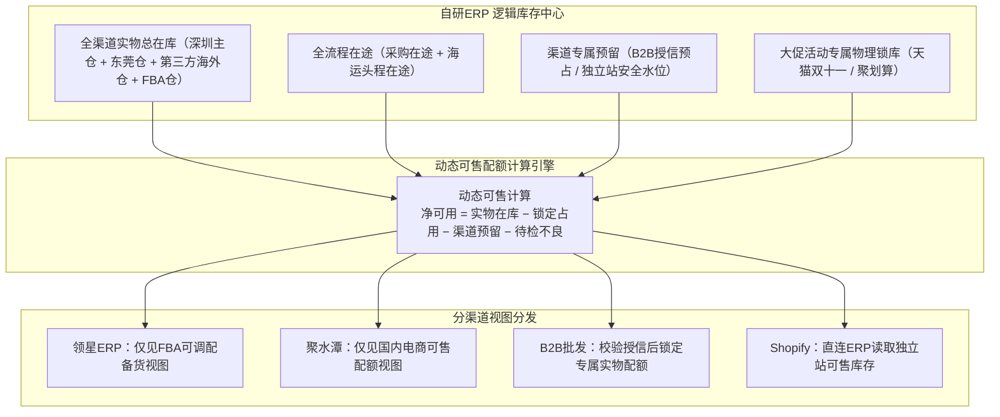
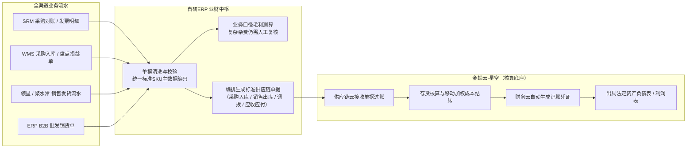

# 2019到2022年的强盛科技：盘子冲到7个亿，为什么必须自研系统？

> 本文涉及的时间、规模、财务指标与业务数据均为教学演练设计的模拟数据，不代表真实企业数据。强盛科技是“供应链产品经理训练营”配套的虚拟演练项目，旨在通过具象的业务场景与画面感，带大家搞懂业务痛点与系统演化，让抽象的供应链知识更容易理解。内容仅供大家学习参考，如果对整套项目的完整资料以及对“供应链产品经理训练营”感兴趣，欢迎私聊我报名参加。


## 一、长短周期交错，大单品出海

2019年初，林强在南山科技园的办公室里翻看2018年的财务报表。这一年营收刚跨过1.2亿，跨境出海占了六成，团队扩充到了近百人。

账面看着风光，林强心里却直打鼓。过去三年靠金蝶做底座、店小秘管跨境、旺店通管天猫、外挂几个IT脚本拼出来的系统班子，快被高速增长的业务冲散了架。

更严峻的考验来自产品本身的转型。2019年开始，华强北配件市场的贴牌通货毛利越来越薄，强盛决定砍掉低效杂品，全力押注自主研发的高客单精品：65W氮化镓双口快充头、大容量数显快充充电宝。为了把控核心产能，林强带头发力，战略参股了3家核心代工厂。

转型叠加多渠道放量，强盛的年营收在2019年迅速拉升到约3亿元，并在随后的几年里一路冲向接近7亿，团队也扩充到300多人。四条业务线在时间线上撞出了巨大的断层：

跨境B2C以亚马逊欧美站为主，占了半壁江山。代工厂备料生产需30至45天，国内装柜海运抵港加FBA上架还要45至60天，整条补货链路长达75至105天。海上漂着的货动辄押着几千万元资金，前端预测稍有闪失，要么断货跌出热销榜，要么爆仓被亚马逊收取天价仓储费。

国内B2C电商除天猫旗舰店外，2020年又入驻京东自营，平台考核48小时极速履约。大促开抢时，订单以秒计算，几分钟内就要锁死数千件库存。

海外独立站依托Shopify品牌官网，客单价高但对物流挑剔，主要从深圳自营仓直发，部分订单经第三方海外仓本地履约。

国内B2B批发维系着全国三十多家地市总代，单笔订单金额大、占用授信额度，必须严格核对账期与实物。

接近90天的跨国海运长周期，与3天甚至当天的国内短周期交织在同一盘货里。外采的标准SaaS改不动底层规则，多套系统各自为政。林强把周磊、阿兰、阿盛和IT负责人叫进会议室开了一整天闭门会。林强看着白板说：“不能再靠脚本打补丁了。这道关卡过不去，7个亿就是强盛的坟墓。后台主干，必须自己写。”

## 二、换掉拼装班子，后台收归自研

做自研，最怕的是两个极端：要么盲目花了几百万元引进国外巨型套装ERP，结果业务被系统捆死；要么脑子一热，把从前台到财务的几套软件全推倒重写，IT团队被活活拖垮。

> 强盛的选择非常务实：买成熟的前台系统，同时自研卡脖子的中枢型系统。

林强和IT团队算得很清：亚马逊前台的PPC广告投放、ASIN级关键词排名与投产比分析极其专业；国内天猫京东海量抓单、菜鸟电子面单高并发打印，市面垂直SaaS已经做得很成熟。

2020年，强盛果断升级：跨境前台换成领星ERP，国内电商换成聚水潭，两套系统继续各管一段。底层的财务核算，金蝶云·星空在存货核算、多币种结汇与法定报表上非常规范，继续保留作为财务底座。

强盛真正收归自研的，是跨系统无法仲裁的四大命脉：需求计划、供应商协同、主仓实物执行和业财单据中枢。

由此，强盛在阶段4确立了“后台主干自研（ERP+WMS+SRM）、前台渠道分治（领星+聚水潭）、金蝶回归财务底座”的三层架构。



这套架构既保住了前台业务开火的灵活性，又把供应链调度的主动权牢牢捏在了自己手里。

## 三、投了工厂，临门一脚还是缺料

从2019年到2022年，生意冲向7亿的过程中，强盛连撞了五个深水区大坑。

第一个坑，出在战略代工厂的交付上。

为了保质保量，强盛出资参股了3家核心代工厂。林强原以为成了股东、派了驻厂工程师，工厂就能和强盛拧成一股绳。可现实很快泼了冷水：工厂内部依然是各自为政的单机系统，生产进度全靠采购老李在微信里催问。

说到底，强盛和工厂之间只有一张成品采购订单。芯片、电芯这些原材料是代工厂自己去买的，强盛的系统里连BOM都不维护，料齐不齐、产线跑到哪一道工序，强盛天然看不见，只能等工厂开口。

2020年下半年，强盛重磅推出65W双口氮化镓充电头，计划全渠道首发。天猫预售页面挂出限时发货承诺，亚马逊美欧站点的推广黄金档期也全部排定，前期投入数十万元宣发费用。

离合同交货日只剩最后7天，老李催排车时，工厂负责人才道出实情：核心快充芯片缺料，两千套半成品卡在贴片工序，下周根本交不出来。

新品首发被迫紧急撤档，天猫预售遭遇大量退款投诉，亚马逊Listing错失流量窗口期，前期投流费用全部打了水漂。林强在复盘会上直言：“给钱参股管不住交付。看不到工厂物料齐套和真实进度，微信催货就是掩耳盗铃。”

为了彻底解决代工厂协同盲区，强盛在自研SRM（供应商关系管理系统）上线后，给200多家供应商定下交付铁律：

采购订单PO必须在SRM门户在线下发，代工厂跟单员须在24小时内系统接单并确认交期。生产过程中，工厂必须在系统里按阶段填报里程碑：物料齐套、成品完工、待出厂质检。系统内置预警机制，距交期前10天若物料未齐套，自动触发红色风控警报。

发货前，代工厂必须在SRM创建ASN发货单、预约进仓时段，并按标准格式打印包含PO号、SKU、批次和数量的唯一外箱条码。没有贴标准箱码、没有系统预约的货车，深圳主仓大门一律不许进。从下PO到送达，代工厂交付流程彻底透明化。


交付链路透明了，下一个问题浮出水面：PO该下多少。工厂能按时交货的前提是订单量本身靠谱，可当时的备货还靠人拍脑袋。



## 四、按经验备货一万五千件，全压在海上

第二个坑，出在长短周期混合的采购计划上。

2020年春夏，强盛一款GaN充电器在亚马逊美国站爆发，连续6周销量向上陡峭拉升。跨境运营主管判断这款产品能卖爆全年，向计划部提了15,000个的补货申请。

当时自研需求计划算法尚未上线，前台跨境系统只有单渠道的销售数据。计划员只能手工导出报表，再挨个打电话打听深圳仓在库与海运在途，在Excel里毛估一番后直接向代工厂下了15,000个的PO。

没想到次月亚马逊调整了类目推荐算法，同质化竞品扎堆上架，这款充电头的日销量瞬间腰斩。

代工厂那边料已备、线已开，退不了单。两个月后，15,000个充电头抵美入仓，实际动销却一落千丈，在海外仓的周转期被拉到7个月以上。每月的仓储租金不断吞噬利润，上百万元流动资金死死冻结在货架和太平洋上。

这就是供应链里典型的牛鞭效应：前端微小的需求波动，经过人工估算与两三个月的海运提前期层层放大，最终在后端砸出巨大的资金黑洞。

为了终结拍脑袋备货，自研ERP在2020年正式上线了内置的“采购需求计划模型”。

模型不再依赖个人经验，而是每日定时汇集全渠道真实动销：领星里的各站点日均销量与FBA结存、聚水潭里的国内电商流水、自研WMS里的主仓可用库存，以及采购在途和海运在途。系统按公式自动运算：

```text
目标库存 = 加权日均销量 ×（采购交付周期 + 安全库存天数）
净可用 = 全渠道实物在库 − 订单锁定占用 − 渠道专属预留 − 待检不良隔离
库存头寸 = 净可用 + 采购在途 + 头程在途
建议采购量 = max(0, 目标库存 − 库存头寸)
```

这里的采购交付周期涵盖了工厂生产（30至45天）、海运头程（45至60天）以及质检上架的完整提前期。

ERP系统按SKU逐行输出建议补货单PR。计划员审核时，若因双十一等特殊大促进行人工微调，必须在系统内填写原因留痕备查。审核确认后，PR一键转化为标准PO推向SRM。从经验估算到算法推导，长短周期的备货终于有了准绳。

备货量有了准绳，可货备回来之后怎么分给各渠道，又成了新的乱局。

## 五、大促夜三路抢货，现货被整车拉走

第三个坑，发生在多渠道争抢库存的现场。

2020年天猫双十一零点，聚划算开抢瞬间涌入海量订单，聚水潭按之前的快照锁定了某款充电头3,000件库存，并向深圳总仓发起向东莞电商履约仓的紧急调拨。

几乎同一时间，跨境运营在领星后台看到该SKU在深圳总仓尚有大批结存，顺手创建了800件发往美国FBA的海运装柜计划。

然而，聚水潭和领星的锁库只是软件里的逻辑占位，深圳总仓现场并没有收到任何实物预配指令。当天下午，一位长期合作的国内大B代理商开着货车直奔深圳仓，凭纸质提货单现场自提30箱（共1,500件）同款现货。仓管员按照以往“见单发货、现场先给”的惯性，直接指挥叉车装车放行。

到了傍晚各系统数据碰头，整个调度彻底瘫痪：总仓实物被大B直接拉走1,500件，导致东莞电商仓调拨缺货1,000多件，亚马逊准备装柜的800件货件也凑不齐整箱。天猫面临延迟发货赔付，亚马逊海运货代拖车空等，各渠道在现场吵成一团。

2017年双十一强盛也遭遇过多渠道抢货，但当年主要是金蝶里的一个账面数字对不上。到了2020年，抢货的战场变成了三套系统、三个仓库：领星、聚水潭、金蝶各看各的账，没有统一的指挥官来仲裁库存所有权。

2020年底，自研ERP内的“逻辑库存中心”全面投产。

逻辑库存中心把实物库存拆分为四类账目：物理在库量、在途量、渠道预留量与活动锁定量，并随时计算出全渠道可售库存。




在大促来临前，电商运营在ERP中提交“活动锁库申请”，系统将5,000件充电宝标记为天猫专属锁库。领星和B2B业务员读取到的可用库存会自动扣除这部分数量，从底层接口上切断了跨渠道抢货的可能。大促结束后，未消耗的配额一键释放回大盘，全渠道库存真正实现动态可视、按需分配。

库存账目理清了，可实物在仓库里怎么管，又是另一道坎。逻辑库存算得再准，货架上的货找不着、批次对不上，账实一样对不齐。

## 六、仓扩到五千平，老批次在底下发烂

第四个坑，发生在深圳自营主仓的货架深处。

为了支撑数亿元的吞吐量，2020年强盛将深圳自营仓搬迁扩建至5,000㎡，立起四层立体货架。当时仓库没有专门的WMS，沿用的是金蝶ERP自带的基础仓存模块。

金蝶系统里虽然划分了库位，知道哪个库位上放了多少件SKU，但管理颗粒度只停留在数量层面。为了图省事，入库时并未采集代工厂生产批号和电芯批次；打印出来的纸质拣货单上，也只简单写着“去某库位拣选某SKU多少件”。

拣货员走到货位前，图省事总是顺手搬通道外侧新入库的货。金蝶系统只要数量扣减对得上就不报错，根本无法校验出库的是新批次还是老批次。内侧那些半年前入库的快充充电宝（内置锂电芯），被一层层新货挡在深处，无人问津。

2020年年初，一批海运抵美的充电宝上架开售不久，亚马逊后台接连收到买家投诉：充电宝严重发热、无法充放电。平台随即开出违规警示函，强制下架了爆款Listing。

品质中心要求紧急倒查批次。然而金蝶系统里只记录了某天从某库位出库了多少台，根本没有采集和绑定代工厂的生产批号，线索彻底中断。阿盛只能组织仓库全员通宵拆箱排查。客诉那批货的源头已经查不实了，排查过程中还翻出了更要命的事：压在货架最底层的两千多件充电宝，库龄已经超过9个月，电芯长期自放电导致部分已经鼓包，直接报废损失高达数十万元。

没有系统级的批次规则和扫码拦截，效期管理、库龄控制与批次溯源就只能停留在口头上。

2020年自研WMS（仓库管理系统）在深圳主仓全面投产，彻底改造了仓储作业现场：

首先推行区、排、层、位四段库位制。全仓按四级编码划分库位，每个库位均有专属条码（如`B-02-03-01`）。代工厂送货抵仓后，仓管员持工业PDA扫描外箱条码盲收，WMS根据商品体积与周转率推荐最优上架库位，PDA指引上架并扫码确认。

其次配置灵活的批次分配策略。WMS内置了批次分配引擎，根据不同品类和渠道支持多样化规则：对带电芯充电宝执行先到期先出（FEFO）与库龄优先，对常规快充配件执行先进先出（FIFO），对线下大B订单支持指定批次出库，对跨境FBA调拨则自动校验渠道库龄准入门槛。出库任务下发时，系统自动锁定匹配的批次与库位，PDA生成最优拣货路径；如果拣货员随手扫描了不符合策略的货物，PDA会立刻蜂鸣报警并锁定屏幕，提示“批次不符，请按指定批次拣选”，实现物理防呆拦截。

同时，针对线下B2B大宗批发，自研ERP的信控模块与WMS出库实现硬锁互通。业务员录入销售订单SO后，ERP自动校验代理商信用额度与已用账期；超额则系统强行锁单，必须财务特批；信控通过后生成出库任务推给WMS，仓管员凭系统单据扫码核销放行，彻底终结了凭肉眼和人情放货的乱象。

入库、上架、拣选、复核、出库全流程与批次号深度绑定。一旦发生外部客诉，品质中心输入批次号，一分钟内就能正向查出该批次发往了哪些渠道，反向穿透出代工厂、生产日期和外箱编号。

仓库现场管住了，可到了月底算账的时候，阿兰那边的麻烦才刚开头。货在仓库里走了一圈，单据在各系统里散了一地，对不齐的杂费还是得靠人拼。

## 七、多币种杂费对不齐，月底算账熬成灾

第五个坑，依然卡在财务阿兰的月末表格里。

年营收冲到5亿、7亿之后，阿兰手下的财务团队增加到了七八个人。每到月初，办公室里就充斥着算账对账的压力。

领星导出的是亚马逊多站点、多币种的明细，聚水潭导出的是国内天猫京东海量发货流水，金蝶里记的是法定存货账。由于各系统商品编码不统一，财务必须先在Excel里手工做一遍SKU映射，再用VLOOKUP跨表关联。

物流费用更是对账的重灾区：聚水潭按国内订单包裹扣费，领星按跨境货件分摊头程，而货代和快递公司给金蝶寄来的是月度汇总账单。两头颗粒度对不上，对出差额是家常便饭。更让阿兰头疼的是亚马逊后端的FBA仓储费、站内广告费和退款扣费，口径与国内财务科目完全脱节。

全公司合并关账常常要拖整整7天。林强想知道某款65W快充头在欧美各站点的真实净利润，阿兰只能拿出一张布满估算公摊的粗略报表。

2021年，强盛对业财流程进行了彻底重构：金蝶云·星空正式退守为纯粹的“业财核算底座”，自研ERP接管全渠道业务单据的归集、清洗与编排。



自研ERP确立为全公司商品主数据的唯一发源地，统一标准SKU编码。全渠道的采购入库、销售发货、跨仓调拨、盘点损益等业务事实在ERP内部实时归集与清洗。

月末，ERP将清洗校验后的标准供应链单据，通过API批量推送至金蝶供应链云。金蝶自动完成单据过账与存货核算，按移动加权平均结转成本，核销往来账款，并驱动财务云一键生成会计凭证。

全公司合并关账时间从过去的7天压缩到2天左右。林强打开ERP看板，各品类、各渠道的毛利和存货周转一目了然，业财数据终于实现了账证相符。复杂杂费分摊仍需人工复核，凭证到原始单据的穿透式追溯，要等阶段5补上主数据平台后再彻底打通。

## 八、自研撑起七个亿，全盘调度还差一步

2022年底，强盛科技年营收逼近7亿元，员工突破300人，公司正式启动了上市前的股份制改造。

回看2019到2022这四年，强盛走通了从外采拼装到自研掌控的关键一程。2021年亚马逊爆发了行业震动的封号潮，许多纯靠铺货和买SaaS拼装的同行没能扛过去。而强盛凭借自主研发设计的精品路线，以及自主掌控的ERP、WMS、SRM后台主干，不仅站稳了脚跟，反而逆势扩张了天猫、京东自营和Shopify独立站，把全渠道业务稳稳做大。

强盛用自主研发的系统，把采购计划模型、战略代工厂在线协同、5,000㎡大仓精细化作业和业财一体核算这四大命脉，牢牢握在了自己手中。

但在向更大体量迈进、冲刺IPO的关口，这套“后台自研、前台分治”的架构，依然留下了几块尚未打通的硬骨头：

第一，跨渠道履约缺少中央调度大脑。前台渠道依然各自为政（聚水潭管国内、领星管跨境），系统内尚未建立统一的中央订单路由引擎（OMS）。订单无法根据买家地址、全网库存水位与时效成本进行跨仓智能寻源、就近分发与自动拆单，“一盘货”全盘动态调度仍差最后一步。

第二，单仓辐射全国的物流瓶颈。强盛全国仅有深圳一个自营主仓，华东、华北等地的订单跨区发货成本高、时效慢；随着后续品牌线下体验店规划落地，单仓模式难以支撑未来全国门店的就近补货。

第三，新零售线下触点的空白。当前的系统体系完全围绕线上电商和传统B2B设计，对于未来线下直营门店、体验店的POS收银、门店仓储以及线上线下一体化O2O履约，系统能力仍是一片空白。

第四，上市合规的穿透式审计要求。多系统之间在处理极其复杂的跨境杂费分摊时，仍保留了少量人工倒挤流程，指标统计口径在各部门之间尚未完全标准化，面对未来IPO严格的穿透式核查，仍需建立更加严密的数字化追溯体系。

2022年冬天的某个傍晚，林强站在深圳自营主仓的货架通道旁。工人们手持PDA熟练地扫码拣货，大屏幕上实时跳动着全渠道库存与代工厂交付看板。

从华强北那个几平米的玻璃柜台，到如今拥有自己的研发团队、手握自研供应链体系的拟上市企业，强盛科技已经完成了从商贸倒货到供应链链主的跃迁。

摆在林强面前的下一道大题已经清晰：如何从单仓走向全国区域仓网？如何自研中央OMS与新零售POS系统，把线下的品牌体验店接进这套自研体系？


那是强盛科技发家史阶段5（2023-2026：IPO冲刺与新零售期）的故事了。
