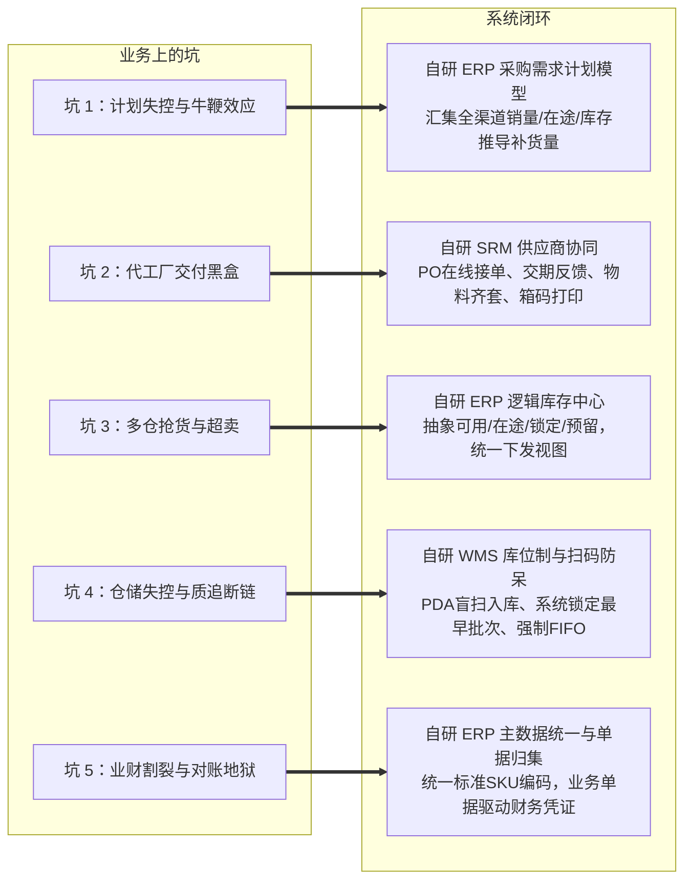

# 阶段4｜业务背景｜供应链深耕期｜2019-2022

> 口径说明：本文涉及的时间、规模、财务指标与业务数据均为教学演练设计的模拟数据，仅用于供应链产品经理课程推演与案例教学，不代表任何真实企业的公开经营数据。
>
> 当前阶段：供应链深耕期（2019年 - 2022年）  
> 核心特征：全球长短周期混流、深度供应链协同（参股代工）、后台主链条自研（ERP/WMS/SRM）、前台渠道SaaS继续分治、金蝶回归财务底座  
> 业务边界：强盛定位为品牌商与供应链链主（自主研发设计 + 品牌全渠道销售，生产委托深度代工）。生产制造由参股代工厂以自有系统组织，强盛不做BOM展开与车间排产；强盛自研系统聚焦采购需求计划、库存计划、供应商协同、成品仓储与业财中枢。
>
> 阅读方式：本文负责说明阶段4为什么出现、业务上要解决什么问题，以及为什么形成“后台自研、前台分治、财务外采”的组合。系统如何落地见《系统架构》，具体模块和规则见《功能清单》。

---

## 一、阶段演进：从“多渠道贸易”到“全球长短周期混合供应链”

阶段3（2016-2018年）通过金蝶做底座、店小秘与旺店通分治前台、外部仓协作，跑通了 1.2 亿元规模。但随着营收跨入 3-7 亿元区间，原有模式面临三大根本性转变：

1. 供应链周期割裂：跨境业务以 FBA 备货为主，国内发运至 FBA 上架需 45-60 天，代工厂生产需 30-45 天；而国内天猫、京东需 48 小时极速履约。接近 90 天的跨境长周期与 3 天国内短周期交织（跨境补货完整周期约 75-105 天），经验备货极易引发断货或数千万元资金积压。
2. 供应链管控下沉：由贴牌通货转向高客单精品研发（如 65W 氮化镓充电头、快充充电宝），并战略参股 3 家核心代工厂。资本绑定后，工厂端生产进度与物料齐套依然缺乏数字化透明度，协同仍停留在微信电话催货阶段。
3. 渠道风险对冲：2020 年下半年起，公司拓展京东自营与 Shopify 独立站；2021 年亚马逊封号潮进一步加速多渠道布局，天猫、京东与独立站持续加码。多渠道并行对跨渠道统一库存与防超卖调度提出更高要求。

在营收跨过亿元、逼近 3 亿的档口，外采工具拼凑已达上限，必须将供应链后台主链条收归自研。

这里的选择并不是把所有软件都换成自研，而是先收回必须保持一致的四个控制点：需求计划、跨渠道库存、主仓实物和业务到财务的单据链。Amazon 运营、国内电商打单和财务总账仍然保留成熟工具，因为这些系统在各自领域已经有较成熟的能力，替换成本高，也不是阶段4最核心的矛盾。于是，阶段4形成了”后台主链条自研、前台渠道继续分治、财务保留专业底座”的混合方案。阶段3 曾设想中央 OMS 一步到位收归自研，评估后拆成两步：阶段4 先建成 ERP 内的逻辑库存中心，统一全渠道库存视图；中央订单路由引擎留到阶段5，与区域仓网、门店触点一并建设。

---

## 二、公司概况与业务模式

### 2.1 基本经营面貌

| 维度 | 说明 |
| :--- | :--- |
| 公司性质 | 股份制改造进行中（拟上市辅导前夕） |
| 经营模式 | 自主研发设计 + 品牌全渠道运营 + 核心代工厂深度协同（不建重资产工厂） |
| 销售网络 | Amazon 全球站、天猫官方旗舰店、京东自营（新增）、Shopify 独立站（由阶段3试水转正式运营）、国内 B2B 代理网络 |
| 商品策略 | 活跃 SKU 精简至 3,500 左右，砍掉低效品，走大单品精品路线 |
| 营收规模 | 2019 年约 3 亿元，2022 年增长至接近 7 亿元 |
| 协同网络 | 200+ 家供应商，其中参股 3 家核心代工厂（线材、充电头、充电宝） |
| 组织规模 | 300+ 人，下设营销中心、产品中心、供应链中心（含品质中心）、数字化中心与财务中心 |

> 阶段3 试水的 eBay 店铺与淘宝店在阶段4 逐步收缩关停，渠道资源集中到 Amazon、天猫、京东与独立站四条主渠道。

### 2.2 四大业务线对比

| 业务线 | 渠道与客户 | 履约链路 | 结算节奏 | 供应链特征与诉求 |
| :--- | :--- | :--- | :--- | :--- |
| 跨境 B2C | Amazon 欧美站，海外 C 端 | 国内头程 → FBA 上架 → 亚马逊派送 | 14 天回款，扣佣金与 FBA 费 | 营收占比超 50%，补货完整周期 75-105 天（生产 30-45 天 + 海运 45-60 天），核心诉求是头程透明与防断货脱销。 |
| 海外独立站 | Shopify 品牌官网，海外 C 端 | 深圳自营仓直发为主，部分订单经第三方海外仓履约 | 支付通道实时或 T+2 结算 | 由阶段3试水转为正式业务线，毛利高但物流敏感，核心诉求是自建物流与库存实时同步。 |
| 国内 B2C 电商 | 天猫旗舰店 + 京东自营，国内 C 端 | 东莞第三方电商仓（菜鸟仓）发货，快递配送 | 平台定期结算账期 | 订单高频、大促脉冲强，核心诉求是高并发打单与跨仓防超卖。 |
| 国内 B2B 批发 | 30+ 代理商 + 企业大客户 | 深圳自营仓整车出库或自提 | 赊销月结，严格信控 | 稳定现金流来源，单笔货值大，核心诉求是授信管控与实物批次出库互锁。 |

### 2.3 仓储网络拓扑

东莞地处珠三角核心制造带，紧邻深圳总部与代工厂集中区，是 3C 电商最理想的发货枢纽。强盛在仓储网络上采用分层部署：

```text
                               ┌── 深圳自营主仓（5,000㎡，自研WMS） ──────── 用于 B2B 批发、大宗调拨、跨境头程集货装柜、独立站直发
强盛总库存（自研ERP业务中枢） ──┼── 东莞第三方电商仓（菜鸟仓/第三方运营） ── 用于天猫、京东国内电商高并发履约
                               └── Amazon FBA 仓（亚马逊托管） ──────────── 用于跨境电商海外极速派送
                                  + 第三方海外仓（3PL） ──────────────────── 用于独立站部分海外订单本地履约
```

深圳自营主仓由自研 WMS 管理现场物理执行；东莞电商仓、FBA 仓与第三方海外仓均为外部托管仓，由自研 ERP 通过逻辑库存进行可用量视图管理与调拨指令下发。

---

## 三、阶段演进时间线（2019-2022）

后台自研遵循业务依赖顺序：先统一物料主数据与业务中枢，再通过 SRM 规范供应商箱码，支撑 WMS 扫码入库；主数据与库存准确后，采购与备货计划才能稳定运行。

| 时间节点 | 业务与战略大事件 | 系统演进与自研推进 |
| :--- | :--- | :--- |
| 2019 年 | 参股 3 家核心代工厂，派驻厂工程师；聚焦 GaN 充电器等精品研发。 | 组建 IT 研发团队；启动自研 ERP，搭建商品主数据、ToB 批发与采购主链条。 |
| 2020 年上半年 | 疫情推动海外宅经济爆发，自营仓扩建至 5,000㎡。 | 自研 SRM 上线（在线接单与外箱条码）；自研 WMS 上线（PDA 扫码、库位制与 FIFO）。 |
| 2020 年下半年 | 拓展京东自营与 Shopify 独立站；多渠道数据割裂加剧。 | 前台升级：领星替换店小秘，聚水潭替换旺店通；自研 ERP 采购需求计划算法跑通，逻辑库存中心年底投产。 |
| 2021 年 | 亚马逊爆发行业封号潮；强盛加速国内电商与独立站布局。 | 金蝶退守业财核算底座（供应链云接收 ERP 推送单据、财务云出凭证）；自研 ERP 成为业务执行与单据编排中枢。 |
| 2022 年 | 营收逼近 7 亿元，团队超 300 人，启动上市前股改。 | 后台自研体系（ERP+WMS+SRM）成型，库存周转率与交付准时率显著提升。 |

按本案例的教学口径，阶段4能明确量化的变化主要有两项：经营规模从 2019 年约 3 亿元增长到 2022 年接近 7 亿元；财务关账从约 7 天缩短到约 2 天（口径说明：指全公司经营账合并关账；阶段3 的"平台数据整理约 7 天缩到约 3 天"是订单明细整理耗时，而阶段3 的合并关账常拖到每月 10 号之后，"约 7 天"即同一口径下对这段关账时长的表述，两者并不矛盾），主数据统一和单据自动编排是主要驱动，但复杂杂费分摊仍需人工复核，远未到"半天关账"的程度——那是阶段5补上主数据平台和穿透追溯链路后的目标。采购计划、供应商协同和仓储执行则主要体现为从人工拼接转向系统留痕、扫码作业和批次控制，暂不额外虚构统一的前后百分比。

---

## 四、组织架构与干系人职责

```text
总经理（林强）
├── 营销中心 ────── 亚马逊事业部（周磊）、国内电商事业部、独立站事业部、渠道事业部（B2B）
├── 产品中心 ────── 产品定义（PM）、工业设计（ID）、结构工程（ME）
├── 供应链中心 ──── 计划部、采购部、仓储物流部（阿盛统筹）、品质中心
├── 数字化中心 ──── IT产品经理、技术研发及全栈研发团队
└── 财务中心 ────── 财务主管（阿兰）、总账会计、结算专员
```

### 核心部门诉求与业务痛点

经营管理层（林强）关注营收增长、现金流安全、库存周转和渠道风险，但这些属于公司级经营目标，不与部门痛点并列。真正推动系统建设的，是各部门在日常业务中承担的目标和协作冲突：渠道希望保障供货，计划希望压低库存，采购希望提前锁定产能，仓储希望准确执行，财务希望账证可追溯。

| 核心部门 | 部门职责 | 业务目标 | 当前痛点 | 系统能力需求 |
| :--- | :--- | :--- | :--- | :--- |
| 营销中心 | 负责 Amazon、国内电商、独立站与 B2B 渠道的销售和履约目标 | 各渠道供货稳定，减少断货、超卖和平台处罚 | 多渠道共享库存但规则不一，大促时容易抢货；独立站和国内电商的履约方式也不一致 | 渠道可用库存视图、渠道配额、活动锁库与统一履约状态 |
| 供应链计划部 | 汇总销量、库存和在途，制定成品采购与备货计划 | 采购数量更准确，兼顾供货能力和库存周转 | 销售预测频繁变化，各系统数据分散；人工估算容易造成断货或资金积压 | 采购需求计划模型、在途汇总、计划调整留痕 |
| 采购与供应商协同组 | 承接采购订单、代工厂交期和供应商交付协同 | 交期可控，物料齐套，送货信息准确 | 工厂延期和物料齐套情况不透明，风险经常到最后才暴露 | SRM 在线接单、交期节点反馈、延期预警、ASN 与外箱条码 |
| 仓储物流部 | 负责深圳主仓实物作业、调拨和批次出库 | 找货准确、出库及时、批次和库龄可控 | 5,000㎡ 大仓找货困难，拣货依赖经验；调拨和批次状态难以持续追踪 | WMS 库位管理、PDA 扫码、路径规划、FIFO 与调拨在途 |
| 品质中心 | 负责来料质检、批次判定和质量追溯 | 及时隔离不良品，能够定位质量责任 | 发生质量客诉时，难以反向定位代工厂和原材料批次 | 质检单、批次流水、不良隔离和正反向追溯 |
| 财务中心 | 负责总账、成本归集、结算和业务凭证核算 | 快速关账，能够看清真实毛利和存货成本 | 多系统编码各异，月末依赖 Excel 拼表；业务单据与财务凭证难以对应 | 统一主数据、业务单据归集、凭证编排和原始单据关联 |
| 数字化中心 | 负责系统建设、接口治理、主数据和数据分析平台 | 控制系统边界，减少重复建设和接口维护 | 各部门分别提需求，系统烟囱林立，数据口径不一致 | 系统中枢、主数据治理、接口管理和指标口径统一 |

---

## 五、规模上来之后，五个绕不过去的坑

阶段4在规模跃升过程中暴露了五个坑，它们直接催生了后面的系统建设需求：

| 坑 | 一句话概括 |
| :--- | :--- |
| 坑 1：长短周期混流，计划全靠拍脑袋 | 90天跨国海运长周期遇上销售预测频繁波动，人工估算失误引发数千万元滞销 |
| 坑 2：参股了代工厂，交付还是黑盒 | 参股却管不住工厂物料齐套与交期，临门一脚缺料导致全渠道新品发布流产 |
| 坑 3：库存能看了，大促还是谁抢到算谁的 | 前台系统各自为政，高并发秒级抢库，超卖受罚与在途盲区并存 |
| 坑 4：仓大了，货反而找不到了 | 5,000㎡大仓经验找货，FIFO失效致电芯报废，海外客诉无法精准溯源 |
| 坑 5：账能月结了，单品赚没赚钱还是说不清 | 编码规则各异，数万行跨境杂费无法对齐，算不清单品与渠道真实毛利 |

### 坑 1：长短周期混流，计划全靠拍脑袋

2020 年某款 GaN 充电器在亚马逊上连续 6 周动销上涨，跨境运营凭趋势判断会持续爆单，向供应链提了 15,000 个的补货需求。采购手动导出 90 天销量、电话问了一圈在途，估算完直接给代工厂下了 PO，工厂按这个量备料开工。没想到次月亚马逊调整了推荐算法，同类竞品集中上架，销量直接腰斩。代工厂那边料已备、线已开，退不了单；等这批货海运到仓，周转期已经被拉到 7 个月以上，上百万元流动资金压在货架和海上动弹不得。

问题在于没有统一的采购需求计划模型。多渠道销量、采购在途、海运在途、多仓库存散在领星、聚水潭、金蝶和各仓的报表里，谁也拼不出一个完整的"还能备多少"的答案，只能靠人工估算，牛鞭效应就这么一层层放大出去。

### 坑 2：参股了代工厂，交付还是黑盒

强盛参股了 3 家代工厂，本想着资本绑定后协同更紧，结果工厂端还是单机系统组织生产，进度全靠采购每周微信问一遍，工厂回了句"在赶，没问题"，就算交代了。2020 年下半年一款新品全渠道首发，距离交货日只剩一周，工厂才突然说关键物料缺料、这批交不出来。天猫预售页上已经挂了发货承诺，亚马逊推广档期也排好了，前后投入的数十万元营销费用全部打水漂，新品只能往后挪。

PO 一旦下发出去，工厂接没接单、物料齐没齐套、产线动没动，在强盛这边全是黑的，交期风险非要到临门一脚才暴露。彼时自研 SRM 刚上线不久，代工厂还没全量接入，历史 PO 也尚未迁移进系统，协同实质上仍停留在微信电话催货阶段。

### 坑 3：库存能看了，大促还是谁抢到算谁的

2020 年双十一，天猫聚划算开抢瞬间锁掉 3,000 件某款充电头；几乎同一时间领星读取的还是几分钟前的旧库存快照，继续在亚马逊侧创建了 800 件 FBA 备货计划；更乱的是，一个大 B 客户当天直接开车到深圳自营仓现场提货 30 箱同款，仓管按实物放行，没去核对系统里的调拨占库。三路同时抢的是同一个 SKU 的可调配库存，等数据回传对上号，实物已经被提走、调拨单缺货、FBA 备货差了几百件，平台超时扣罚和 Listing 降权接踵而来。

这个剧本和 2017 年双十一高度相似——当年主要是天猫调拨备货与 B2B 大客户大单抢深圳仓同一款快充头，尚未演化为 2020 年这种三路并发。区别在于，2017 年抢的是金蝶里一个 SKU 的可用数，2020 年抢货的战场已经变成三套系统、三个仓：领星、聚水潭、金蝶各记各的账，没有一个逻辑库存中心在中间做全局的动态可售计算和配额锁库，大促时谁抢到算谁的。

### 坑 4：仓大了，货反而找不到了

深圳仓从 2,000㎡ 扩到 5,000㎡ 后，货架上堆得密密麻麻，但没有系统化的库位和扫码指引。老员工拣货习惯先搬通道外侧的新货，里层那些半年前进的充电宝（含锂电芯）一直压在底下没人动。2020 年年初一批发往海外的充电宝到货后接连出现过热客诉，平台发了下架警告。品质中心想倒查是哪天入库、哪个代工厂、哪批电芯，翻遍纸单也找不到批次绑定记录，最后只能全仓拆检，这批货里有存放超过 9 个月的，电芯自放电已经受损。

没有专业 WMS 做库位规划、批次追踪和 PDA 扫码防呆，FIFO 全靠员工自觉，一旦出质量问题，正向逆向都追不动。

### 坑 5：账能月结了，单品赚没赚钱还是说不清

每月初阿兰做月结，要从领星导出多币种亚马逊账单、从聚水潭导出国内发货明细、从金蝶导出成本账，三套系统的 SKU 编码还各不相同，得先用 Excel 做映射表对齐，再 VLOOKUP 拼到一起。一笔运费在聚水潭按单记，在金蝶按月汇总，两边能对出几百块差额，只能手工估个大概。跨境那边的佣金、FBA 仓储费、广告费，颗粒度和金蝶单据根本对不上。整个月结关账要拖 7 天，退款和运费分摊口径还年年打架，管理层想知道某个单品到底赚没赚、哪个渠道在隐形亏损，报表给不出答案。

商品主数据不统一、业务单据和财务凭证没有自动映射，业财之间隔着一层人工搬砖。

---

## 六、怎么应对：后台主链条自研，前台继续分治

### 6.1 为什么不能直接买一套现成系统

阶段4开始前，强盛评估过市面上的方案。跨境专属SaaS（领星、店小秘）擅长亚马逊运营，但不懂国内电商和B2B；国内电商SaaS（聚水潭、旺店通）擅长高并发打单，但不管理 FBA 头程在途；传统套装 ERP（金蝶、用友）能承担财务合规和基础进销存，却难以同时承接电商高频调度、代工厂协同和跨渠道库存。没有一套系统能横跨跨境、国内电商、代工厂协同与 B2B。

前台替换同样有明确理由：领星在 PPC 广告与 ASIN 级利润核算上明显强于店小秘，聚水潭在大促高并发打单与多店铺聚合上比旺店通更稳，所以阶段4 把前台升级为领星 + 聚水潭组合。

结论是：前台渠道继续用各自擅长的垂直SaaS，后台主链条（采购需求计划、采购、库存、仓储、供应商协同）自研，金蝶承接供应链单据过账与财务核算（业财一体）。

### 6.2 六大系统定位与分工

| 系统名称 | 建设属性 | 核心定位与管理边界 | 解决的核心坑 |
| :--- | :--- | :--- | :--- |
| 自研 ERP | 自研核心 | 后台业务中枢：主数据、采购需求计划、采购管理、批发管理、逻辑库存中心、单据中枢 | 坑 1（牛鞭效应）、坑 3（抢货）、坑 5（业财割裂） |
| 自研 WMS | 自研核心 | 深圳自营主仓执行：库位管理、上架、PDA 拣货、盘点、批次效期、强制 FIFO | 坑 4（仓储失控与质追断链） |
| 自研 SRM | 自研核心 | 供应商协同门户：PO 在线接单、交期反馈、物料齐套留痕、外箱条码、预约送货 | 坑 2（交付黑盒与履约断链） |
| 领星 ERP | 垂直外采 | 跨境专项运营：PPC 广告分析、ASIN 利润核算、FBA 索赔对账 | 承接亚马逊专属精细化规则 |
| 聚水潭 | 垂直外采 | 国内电商履约：天猫/京东多店铺订单聚合、电子面单打印、批量发货 | 承接国内电商大促高并发履约 |
| 金蝶云·星空 | 标准外采 | 业财核算底座：供应链云接收 ERP 推送的入库/出库/调拨/盘点单据，财务云做存货核算、应收应付与总账报表 | 提供合规审计级别的业财一体底座 |

### 6.3 五个坑怎么填



1. 采购需求计划模型：ERP 聚合领星销量与 FBA 库存、聚水潭销量、WMS 仓储库存及在途 PO，按模型公式推导：`目标库存 = 加权日均销量 ×（采购交付周期 + 安全库存天数）`；`净可用 = 全渠道实物在库 − 订单锁定占用 − 渠道专属预留 − 待检不良隔离`；`库存头寸 = 净可用 + 采购在途 + 头程在途`；`建议采购量 = max(0, 目标库存 − 库存头寸)`。计划员审核并留痕微调，一键生成采购订单下发 SRM。（注：采购交付周期覆盖供应商生产交付周期、海运在途与质检上架时间，即从下单到上架可售的完整周期；全渠道实物在库汇总深圳主仓、东莞电商仓、第三方海外仓与 FBA 在库。）
2. SRM 在线协同：PO 下发后供应商 24 小时内确认交期，分阶段反馈物料齐套与交付进度；发货前完成预约并打印标准外箱条码（含 PO、SKU、批次与数量），驻厂 QC 依节点抽检，距交期前 10 天进行交付风险预警。阶段5再根据供应商协同成熟度收紧为提前 7 天预警。
3. 逻辑库存中枢：ERP 统一维护全局实物、在途、渠道预留、活动锁定与可售库存，向领星和聚水潭输出配额后的可用量视图，大促前支持渠道独立安全水位锁库，降低跨渠道抢货与超卖风险。但阶段4仍缺少中央 OMS，跨仓调度和外部节点回传并未完全自动化。
4. WMS 库位与批次管理：货到后仓管 PDA 盲扫箱码收货，系统推荐库位上架；出库时按入库时间自动锁定最早批次，PDA 路径导航与扫码防呆拦截，按 FIFO 执行并记录全流程批次流水。当前案例以入库时间和库龄管理为主；若商品存在明确有效期，还需要补充 FEFO 规则。
5. 主数据统一与业财流转：自研 ERP 统一定义商品主数据并分发至各系统，阶段3 靠人工维护的组合装与赠品拆解规则也由 ERP 统一收口、聚水潭按分发规则执行；全渠道业务单据归集至 ERP，编排为标准供应链单据推送金蝶供应链云，驱动存货核算与应收应付后生成总账凭证，缩短关账时间。

---

## 七、阶段4留下的尾巴，阶段5来补

| 遗留短板 | 核心业务痛点 | 阶段5演进方向（2023-2026） |
| :--- | :--- | :--- |
| 全渠道调度缺乏统一中枢 | 前后台虽接口打通，但跨渠道库存无法智能互调（如天猫缺货无法直接调用自营仓）。 | 自研全渠道零售 ERP 中枢：建设中央订单中心（OMS）与调度引擎，实现全渠道一盘货。 |
| 自营仓单点辐射全国，跨区履约成本高 | 仅深圳一个自营仓辐射全国，华东、华北等地订单跨区发货运费高、时效慢；20-30 家门店落地后区域补货也缺乏就近仓支撑。 | 自营仓从 1 个深圳主仓扩展为 5 个区域仓（深圳/嘉兴/天津/成都/武汉），WMS 升级为五仓统一管理，就近履约与门店区域补货。 |
| 线下新零售触点空白 | 业务局限于线上与传统 B2B，无法支撑线下品牌体验店的门店零售与 O2O 履约。 | 自研新零售门店体系：建设自研 POS + 小程序，支持门店扫码购与就近发货。 |
| IPO 上市合规与指标一致性 | 多系统汇总仍存在复杂场景人工核算，各部门指标口径不一，难以应对穿透式审计。 | 主数据与分析平台（BI） + 业财合规：统一指标字典，建立凭证到业务原始单据的可追溯关联。 |

这四项短板也是阶段4与阶段5的承接点：阶段4先把计划、库存、主仓实物和业财单据链收回到后台，阶段5再继续补上中央订单路由、线下门店触点、统一的主数据和指标口径，并把自营仓从单仓扩展为区域仓网。
