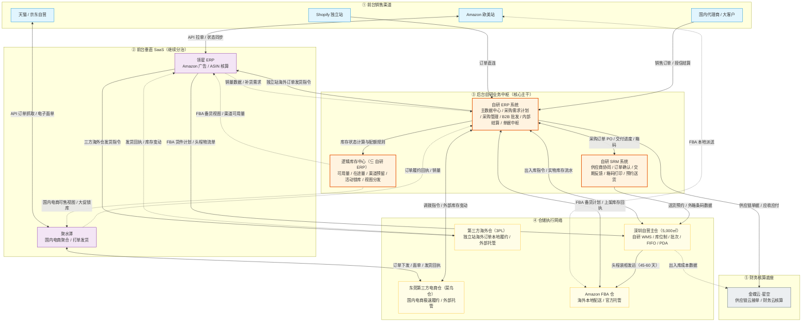
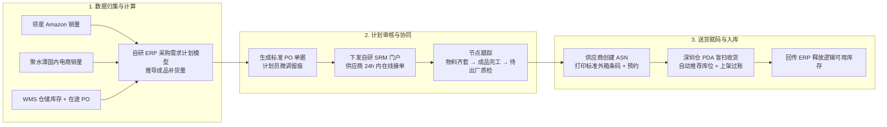
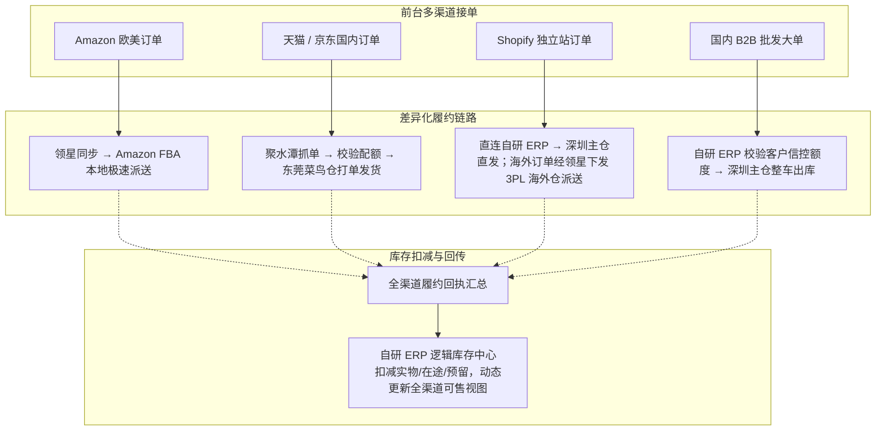
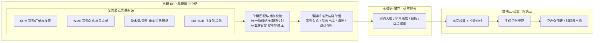

# 阶段4｜系统架构｜供应链深耕期｜2019-2022

> 口径说明：本文涉及的时间、规模、财务指标与业务数据均为教学演练设计的模拟数据，仅用于供应链产品经理课程推演与案例教学，不代表任何真实企业的公开经营数据。
>
> 阅读提示：本文不重复展开阶段4业务上的坑，而是回答三个问题：系统边界如何划分、数据和单据如何流转、哪些问题仍需阶段5解决。业务动因见《业务背景》，具体模块和规则见《功能清单》。
>
> 阶段特征：后台主链条自研化、供应链协同深化、仓储物理执行精细化、前台渠道继续分治、金蝶回归财务底座  
> 核心工具：自研 ERP + 自研 WMS + 自研 SRM + 领星 ERP + 聚水潭 + 金蝶云·星空

---

## 一、系统定义与业务价值

### 1.1 系统定义与演进脉络

2019 年进入阶段4后，强盛科技营收向 3-7 亿元跨越，团队持续扩张（2022 年超 300 人）。阶段3外采的“金蝶底座 + 店小秘 + 旺店通”组合在面对长短周期混合、高并发抢货、5,000㎡ 大仓找货以及战略代工厂协同等复杂场景时，通用功能改不动、外采工具买不到的矛盾集中爆发。

强盛管理层明确了“自研后台主链条、前台渠道继续分治、金蝶回归财务底座”的架构演进路线：

这是一种有边界的取舍：自研只覆盖需要跨渠道、跨仓和跨财务保持一致的控制点，前台平台运营、国内电商打单和法定财务总账继续使用各自成熟的工具。这样既能先解决库存、计划、仓储和单据链的核心问题，也避免为了追求“全套自研”而把项目拖入过大的建设范围。

| 时间节点 | 架构演进动作 | 承担角色与定位 |
| :--- | :--- | :--- |
| 2019 年 | 组建 IT 研发团队，启动自研 ERP 建设 | 后台业务中枢：商品统一主数据、采购需求计划、ToB 批发、业务单据中枢 |
| 2020 年上半年 | 上线自研 SRM 供应商协同系统 | 供应链上游门户：PO 在线确认、交期节点反馈、物料齐套留痕、标准外箱条码打印 |
| 2020 年上半年 | 上线自研 WMS 仓储管理系统 | 深圳自营主仓执行：库位管理、PDA 盲扫入库、路径导航、批次效期与强制 FIFO |
| 2020 年下半年 | 升级前台 SaaS：领星替代店小秘，聚水潭替代旺店通 | 前台渠道分治：领星承接 Amazon 精细化运营，聚水潭承接国内电商高并发履约 |
| 2021 年 | 金蝶云·星空退守业财核算底座 | 供应链云接收 ERP 推送单据；财务云负责总账、存货核算、多币种与合规报表 |

业务边界特别声明：强盛定位为品牌商与供应链链主（自主研发设计 + 品牌全渠道销售，生产委托深度代工）。代工厂以自有单机系统组织车间排产与物料 BOM 展开，强盛自研系统不介入代工厂车间内部工序；强盛自研系统聚焦采购需求计划、库存计划、供应商协同、自营仓执行与业财中枢。

从系统分工视角，阶段4架构形成了三大层级：

1. 后台自研中枢（自研 ERP + WMS + SRM）：接管全公司商品主数据、成品采购与批发主链条、5,000㎡ 自营仓实物执行与 200+ 供应商在线协同，收拢核心供应链命脉。
2. 前台垂直分治（领星 ERP + 聚水潭）：保留成熟 SaaS。领星处理复杂的亚马逊 PPC 广告与 ASIN 级利润核算，聚水潭处理天猫、京东多店铺订单聚合与海量面单打印。
3. 业财核算归口（金蝶云·星空）：退出业务执行主系统角色，保留供应链云承接 ERP 推送的标准单据，财务云负责存货核算、应收应付与总账凭证输出。

### 1.2 核心业务价值

比起阶段3的纯外采拼凑，这套自研与分治架构带来了五大核心业务价值（五个坑对应的系统解法详见《业务背景》§6.3，此处从价值视角归纳）：

* 计划中枢化：自研 ERP 聚合领星、聚水潭、WMS 仓储与在途数据，通过内置采购需求计划模型自动推导补货建议，终结拍脑袋采购与牛鞭效应。
* 协同透明化：自研 SRM 实现采购订单在线确认、关键交期节点跟踪与送货预约，标准外箱条码从源头规范，交付进度透明化破解代工厂交付黑盒。
* 仓储精细化：自研 WMS 引入区-排-层-位四段库位制与 PDA 扫码防呆，系统自动锁定最早批次并强制执行 FIFO，降低电池类产品长期积压和错发风险。
* 库存多层化：自研 ERP 内部建立逻辑库存中心，将实物库存抽象为可用量、在途量、渠道预留量与活动锁定量，按配额向各前台输出视图，防止跨渠道抢货超卖。
* 业财自动化：自研 ERP 统一定义全链路 SKU 主数据编码，集中编排全渠道业务出入库单据，推送金蝶供应链云过账后由财务云自动生成记账凭证，月结关账时间由约 7 天缩短到约 2 天。复杂杂费人工倒挤和跨系统对账，留到阶段5补上穿透追溯链路后再解决。

---

## 二、系统全景架构与多维业务流转

### 2.1 宏观系统全景架构图

阶段4架构呈现清晰的五层分层结构：前台渠道接入垂直 SaaS，自研 ERP 作为业务中枢统揽计划、主数据与逻辑库存，自研 WMS 专管自营主仓，外部电商仓、FBA 仓与第三方海外仓通过接口协同，底层对接金蝶财务。



### 2.2 架构数据流速览

| 流转步骤 | 作业角色与时机 | 涉及系统与单据 | 数据流转与底层机制 |
| :--- | :--- | :--- | :--- |
| 步骤 1：多渠道销售与订单接入 | 全球运营人员（实时） | 领星抓取 Amazon 订单；聚水潭接入天猫/京东订单；Shopify 与 B2B 直入自研 ERP | 前台 SaaS 独立处理电商高并发打单；独立站海外订单由 ERP 转领星下发第三方海外仓；B2B 在 ERP 内完成授信校验与锁库。 |
| 步骤 2：销量汇集与采购计划计算 | 供应链计划部（每日定时） | 领星/聚水潭/WMS → 自研 ERP | ERP 汇总全渠道日均销量、多仓实物与在途 PO，算法推导成品补货建议，计划员审核后一键下发 PO。 |
| 步骤 3：供应商协同与送货赋码 | 采购部 / 代工厂跟单（日常） | 自研 ERP → 自研 SRM | PO 下发至 SRM，供应商线上接单、回传物料齐套状态、预约送货并打印标准外箱条码。 |
| 步骤 4：仓储现场盲扫与防呆执行 | 仓管阿盛 / 拣货员（日常） | 自研 SRM → 自研 WMS | 货到使用 PDA 盲扫收货（扫描外箱条码），系统分配库位上架；出库按入库时间自动锁定批次，PDA 扫码校验强制 FIFO。 |
| 步骤 5：跨境头程集货装柜与在途管理 | 跨境物流组 / 深圳仓（按货件计划） | 领星 FBA 货件 → 自研 WMS → FBA 仓 | 深圳仓按领星 FBA 货件计划集货装柜出运，头程 45-60 天在途由 ERP 逻辑库存随物流节点更新；FBA 上架后回执回传，释放可售库存。 |
| 步骤 6：业务单据汇总与凭证过账 | 财务阿兰 / 结算专员（月末） | 自研 ERP → 金蝶供应链云 → 金蝶财务云 | ERP 编排采购入库/销售出库/调拨/盘点等标准单据推送金蝶过账，驱动存货核算与应收应付后生成总账凭证。 |

### 2.3 多维业务全景流转图

为了清晰展现多系统协同机制，将全公司复杂业务拆解为三条独立而互锁的主业务流：

#### 主线 1：计划、采购与供应商协同主链路

展示从前台销售拉动、ERP 计划运算、SRM 供应商协同到自营仓入库的全流程：



#### 主线 2：多渠道销售履约与库存扣减链路

展示四条不同属性业务线的差异化履约机制与 ERP 逻辑库存控制：



#### 主线 3：业务单据归集与业财一体化结转链路

展示业务单据如何汇集至自研 ERP 并驱动金蝶生成法定财务凭证：



---

## 三、核心单据与跨系统数据结构

阶段4在自研 ERP 内建立了三层单据体系（意图单据 → 执行单据 → 核算单据），作为串联 WMS、SRM 与前台 SaaS 的架构纽带。本节只回答「单据挂在哪、怎么跨系统流转」；菜单明细见《功能清单》§二～§三。

### 3.1 三层单据分工

| 层级 | 架构含义 | 典型单据 | 主要承载系统 |
| :--- | :--- | :--- | :--- |
| 意图层 | 表达计划或销售意图，触发预占与下游执行 | 成品补货建议单（PR）、采购订单（PO）、B2B 销售订单（SO） | 自研 ERP |
| 执行层 | 供应商协同、仓内扫码、渠道履约等现场作业 | 供应商接单确认、ASN/外箱条码、收货/上架任务、波次拣货单 | 自研 SRM、自研 WMS；领星/聚水潭承接渠道执行 |
| 核算层 | 库存过账、应收应付与财务凭证编排 | 采购入库过账、销售出库单（DN）、应收结算单（AR）、凭证推送任务池 | 自研 ERP → 金蝶云·星空 |

### 3.2 跨系统单据挂接关系

```text
【计划采购链】
ERP 补货建议（PR）→ 采购订单（PO）→ SRM 接单/进度反馈/ASN+箱码
    → WMS 盲扫收货/上架 → ERP 逻辑库存释放（采购在途 → 在库可用）

【B2B 销售链】
ERP 销售订单（SO，信控校验）→ WMS 波次拣货/FIFO 防呆 → ERP 出库过账（DN）→ 应收（AR）→ 金蝶凭证

【多渠道履约链】
领星/聚水潭 渠道订单与发货回执 → ERP 逻辑库存扣减/配额更新 → ERP 单据中枢汇总 → 金蝶凭证

【主数据分发】
ERP 标准 SKU 编码 → 同步至 SRM / WMS / 领星 / 聚水潭 / 金蝶（各系统维护平台侧映射表）
```

> 逻辑库存中心台账（可用量 / 在途量 / 渠道预留 / 活动锁库）是 ERP 内部模块，不单独成系统；其分层模型与配额规则见《功能清单》§2.4。

---

## 四、核心业务场景与多系统流转

前文已经说明了各系统的职责，这里不再重新讲五个坑，只选取六个典型场景，展示数据如何穿过 ERP、WMS、SRM 与外采 SaaS。每个场景重点看四件事：谁发起、哪个系统处理、什么状态发生变化、结果回到哪里。

### 场景 1：【ERP计划 + SRM协同】成品采购补货推导与战略代工厂交期全透明

* 业务痛点：长周期（头程发运至 FBA 上架 45-60 天）与短周期（国内 3 天）交织，采购人工估算引发严重牛鞭效应；战略代工厂进度不透明，临门一脚缺料导致全渠道新品流产。
* 跨系统流转机制：
  1. 数据定时归集：每日夜间，自研 ERP 自动通过 API 拉取领星（Amazon 全球各站点销量与 FBA 在库/在途）、聚水潭（天猫/京东 30 天动销）与自研 WMS（深圳主仓可用库存与已锁配额）。
  2. 补货模型计算：自研 ERP 运行采购需求计划模型（按 SKU 逐行计算，结果小于 0 时取 0）：
     $$\text{目标库存} = \text{加权日均销量} \times (\text{采购交付周期} + \text{安全库存天数})$$
     $$\text{净可用} = \text{全渠道实物在库} - \text{订单锁定占用} - \text{渠道专属预留} - \text{待检不良隔离}$$
     $$\text{库存头寸} = \text{净可用} + \text{采购在途} + \text{头程在途}$$
     $$\text{建议采购量} = \max(0,\ \text{目标库存} - \text{库存头寸})$$
     *（注：采购交付周期覆盖代工厂生产交付、海运头程在途与入库质检上架时间，即从本次下 PO 到可售的完整提前期；全渠道实物在库汇总深圳主仓、东莞电商仓、第三方海外仓与 FBA 在库。）*
  3. 计划审核与 PO 下发：计划员在 ERP 中审核建议清单，针对双十一等特殊大促人工调整参数并填写留痕说明，一键生成标准采购订单 PO。
  4. SRM 在线接单：PO 实时推送至自研 SRM 门户，代工厂跟单员须在 24 小时内线上确认接单并承诺交期；超时未接单系统自动标红预警并通知采购部。
  5. 关键节点在线跟踪：工厂通过 SRM 门户回传关键交付节点（物料齐套、成品完工、待出厂质检）；驻厂 QC 依据 SRM 节点抽检，距交期前 10 天进行交付风险预警。

### 场景 2：【SRM赋码 + WMS执行】标准箱码源头打印、PDA盲扫盲收与智能库位上架

* 业务痛点：供应商送货依赖手写纸单，仓库人工清点易错漏，账实不一致；没有库位管理导致新员工找货困难、货物随意堆放。
* 跨系统流转机制：
  1. 送货预约与外箱赋码：代工厂在 SRM 创建 ASN 发货单并预约送货时段，系统按包装规格自动生成标准外箱条码（包含 PO 号、SKU 编码、生产批次与装箱数量）。代工厂必须在外箱张贴标准条码方可出厂。
  2. 货车抵仓盲扫：货车抵达深圳仓后，仓管阿盛使用工业 PDA 扫描外箱条码，PDA 自动通过接口调用 ERP/SRM 调出期望收货数量与规格型号。
  3. 逐箱扫码校验：仓管持 PDA 逐箱盲扫外箱条码，系统自动累加实收数量；数量一致直接过账；若发现实收少于 PO 或商品条码不符，PDA 立即提示异常并自动生成差异单推送给采购部。
  4. 策略引擎库位推荐：WMS 依据商品体积、周转率与同类物料集中原则，自动计算并分配推荐库位（如 `B-02-03-01`）。
  5. 扫码确认上架：PDA 导航指引员工送达指定库位，员工扫描库位条码确认上架；WMS 将实收上架结果回传 ERP，ERP 逻辑库存中心实时将“采购在途”转化为“在库实物可用量”。

### 场景 3：【ERP中枢 + 多渠道SaaS】逻辑库存中心配额分发与大促跨渠道防超卖锁库

* 业务痛点：天猫大促高并发秒级抢库，跨境前台读取静态数据继续开单导致超卖受罚；多渠道共享库存缺乏统一调度与配额管控。
* 跨系统流转机制：
  1. 逻辑库存分层抽象：自研 ERP 逻辑库存中心统一维护实物在库、在途、渠道预留与活动锁定量。
  2. 渠道配额视图输出：ERP 向聚水潭输出“国内电商可售库存”，向领星输出“FBA 备货可调配库存”，前台系统仅能看到分配给本渠道的配额视图。
  3. 大促物理锁库：双十一前夕，电商运营在 ERP 提交“活动锁库申请”，系统将 5,000 件快充充电宝标记为“天猫双十一专属锁库”；此时领星与 B2B 渠道读取到的可用库存自动扣减该 5,000 件，其他渠道不能直接调用这部分配额。
  4. 动态配额释放：大促结束后，天猫未核销的剩余库存配额由运营在 ERP 一键释放，逻辑库存中心重新计算并恢复全渠道可用视图，减少跨渠道抢货和超卖。

### 场景 4：【ERP批发 + WMS批次】B2B 线下大宗批发信控授信与实物批次出库互锁

* 业务痛点：大 B 代理商赊销账期难管，销售随意开单引发坏账风险；现场提货与系统出库未互锁，仓管凭肉眼放行导致调拨库存被截留。
* 跨系统流转机制：
  1. 销售订单录入与信控检查：业务员在自研 ERP 录入代理商销售订单（SO），ERP 自动校验客户当前信用额度、已用账期与历史欠款；若超额则系统自动锁单，禁止转出库单，必须由财务阿兰特批放行。
  2. 生成出库任务与预占：信控通过后，ERP 自动锁定深圳主仓实物配额，生成出库任务下发至自研 WMS。
  3. WMS 批次锁定与拣货：WMS 依据订单要求生成波次拣选任务，按 FIFO 锁定对应批次实物库存，拣货员使用 PDA 扫码完成拣货与复核。
  4. 扫码放行与过账挂账：代理商货车在仓库月台提货，仓管凭系统生成的出库单扫码核销放行；WMS 过账扣减实物库存，回传 ERP 生成销售出库单（DN），系统自动挂接应收账款（AR）并起算账期。

### 场景 5：【ERP单据中枢 + 金蝶底座】全渠道多源单据集中编排与业财自动过账

* 业务痛点：多套系统编码规则不一，海量跨境平台杂费难以拆解，财务月末依赖人工 VLOOKUP 拼表对账，关账耗时长达 7 天且利润口径打架。
* 跨系统流转机制：
  1. 主数据编码唯一源头：自研 ERP 作为商品全局主数据的唯一源头，统一定义标准 SKU 编码（如 `QS-CAB-001`），自动同步分发至领星、聚水潭、WMS 与金蝶，消除物料名称错位。
  2. 业务单据集中编排：全渠道出入库流水实时汇总至 ERP 业务单据中枢，ERP 集中校验采购入库单、销售出库单、仓内调拨单与盘点损益单，自动匹配移动加权平均成本。
  3. 供应链单据推送金蝶：月末 ERP 自动编排标准供应链单据，通过 API 推送金蝶供应链云（采购入库、销售出库、调拨、盘点损益等），由财务云生成存货核算与应收应付凭证。
  4. 财务快速关账：金蝶接收凭证后自动完成总账核算与报表生成，财务月结时间从约 7 天压缩到约 2 天，账实一致性与审计合规性明显改善；剩余复杂杂费人工倒挤和跨系统对账，留到阶段5解决。

### 场景 6：【WMS精细化执行】库位最优路径拣选与 FIFO 批次强制防呆拦截

* 业务痛点：5,000㎡ 大仓拣货路径混乱，新员工效率低下；老批次充电宝长期沉睡导致电芯自放电损坏，海外客诉引发下架风险。
* 跨系统流转机制：
  1. 出库任务接收：自研 WMS 接收到发货指令后，波次引擎自动按订单品类聚合生成拣货任务。
  2. FIFO 批次强制锁定：系统按入库时间算法自动锁定在库时间最早的批次（如 `批次 20201105`，位于 `C-01-04-02` 库位）。
  3. 路径导航规划：WMS 路径算法根据库位编码坐标，自动规划”S型”最短行走拣货路线，下发至拣货员 PDA。
  4. 扫码防呆校验：拣货员到达指定库位，PDA 扫描库位条码与商品条码。如果拣货员随手抓取外侧新批次商品，PDA 立即蜂鸣报警并强行锁屏，提示“批次不符，请拣取指定批次”，减少对人工经验的依赖。
  5. 扣减与流水归档：正确扫描后 PDA 确认拣选完毕，实物批次台账实时扣减，出库批次流水同步回传 ERP 归档备查。

---

## 五、这套架构的局限与阶段5的方向

阶段4架构解决了后台主链条的自主可控，但仍属于"局部强、全局散"的典型过渡形态。四项遗留短板的业务痛点与阶段5演进方向，已在《业务背景》§七详细说明，此处只补充架构视角的成因：

- **全局调度缺统一中枢**：前台垂直 SaaS 各管一段，ERP 虽有逻辑库存但缺少中央订单路由引擎，跨仓调度只能靠人工协调。
- **自营仓单点辐射全国**：仅深圳一个自营仓辐射全国，华东、华北订单跨区履约成本高、时效慢，区域仓网与就近履约尚未成形。
- **线下新零售触点空白**：架构完全围绕线上电商与传统 B2B 设计，不支持门店 POS、门店仓储与 O2O 互通。
- **业财指标一致性挑战**：复杂杂费分摊仍需财务人工介入，多系统指标口径未标准化，难以应对 IPO 穿透式核查。

阶段5不是推翻阶段4，而是在保留 ERP、WMS、SRM 主链条的基础上，继续补上中央 OMS、门店触点和统一指标/审计链路。

---

## 六、阶段总结

阶段4完成了强盛科技从“纯外采拼装”到“核心供应链自研掌控”的一次关键转向。通过自研 ERP、WMS 与 SRM，强盛把采购需求计划、供应商在线协同、自营大仓物理执行与业财单据中枢收回到自己的控制范围，为营收向 7 亿规模增长提供了系统支撑。

更准确地说，阶段4收回的是供应链后台主链条，而不是全渠道经营中枢。“烟囱式”的多系统格局仍未完全消除：前台分治带来的渠道壁垒、自营仓单点辐射的跨区履约成本、线下新零售能力的空白以及上市合规对指标一致性的要求，共同构成了阶段5（IPO 冲刺与新零售期，2023-2026）的系统演进方向。因此，阶段5不是推翻阶段4，而是在保留 ERP、WMS、SRM 主链条的基础上，继续补上中央 OMS、门店触点和统一指标/审计链路。
