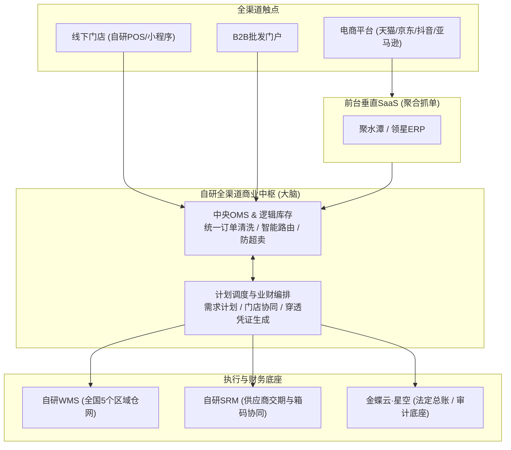
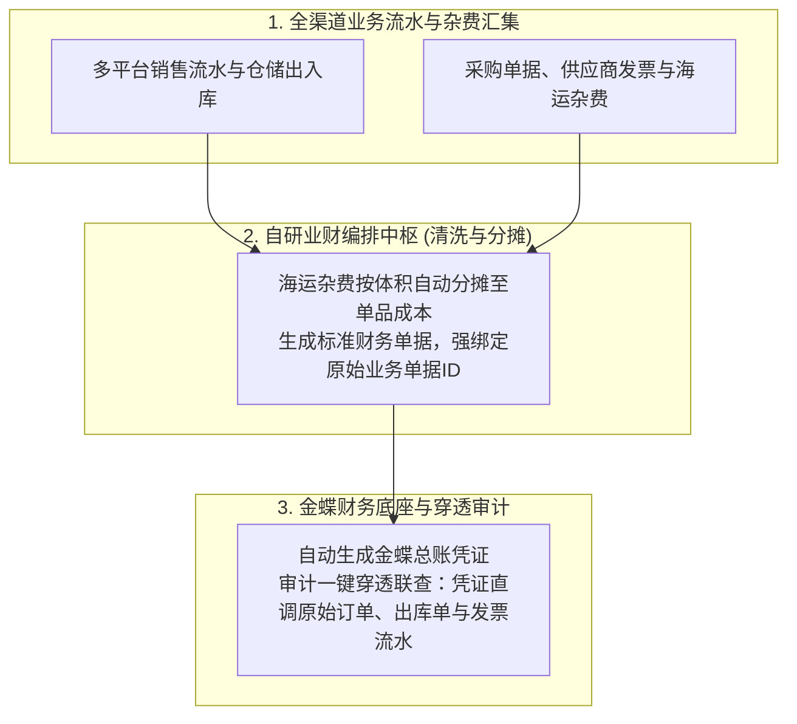
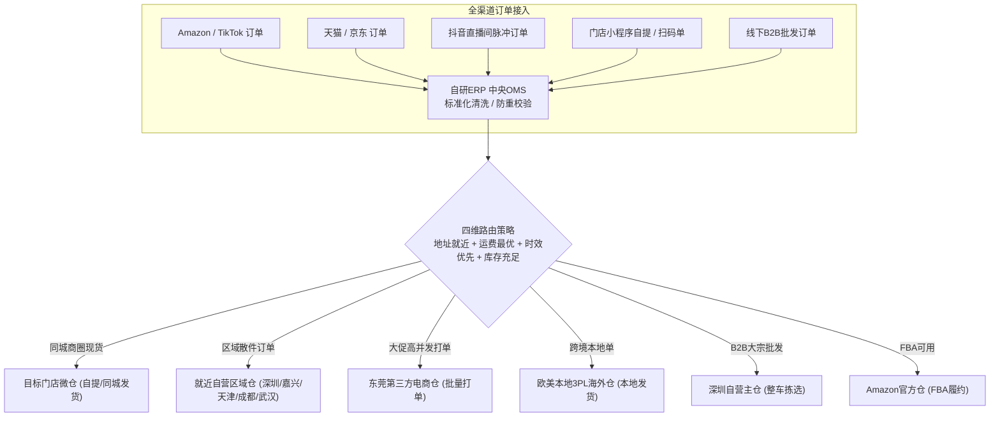
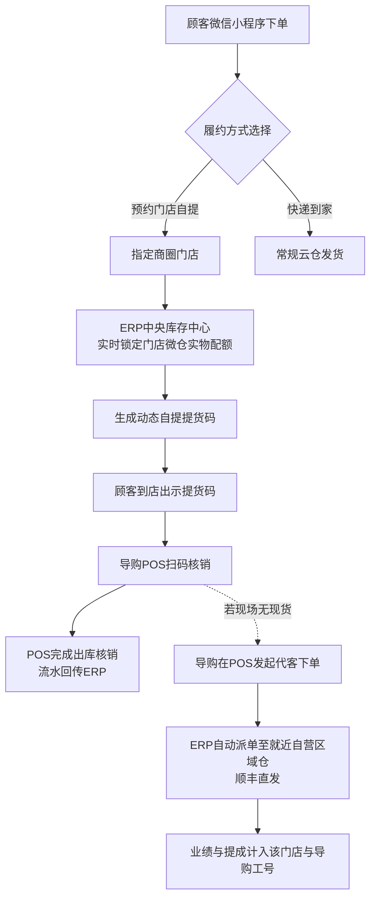
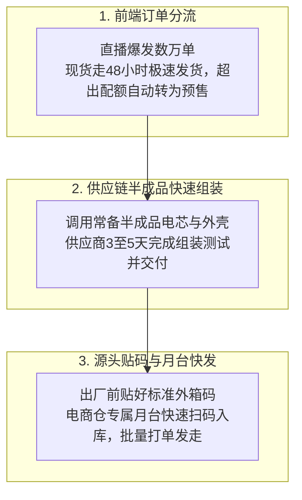

# 2023到2026年的强盛科技：冲IPO、开门店，供应链后台长成全渠道大脑

> 本文涉及的时间、规模、财务指标与业务数据均为教学演练设计的模拟数据，不代表真实企业数据。强盛科技是“供应链产品经理训练营”配套的虚拟演练项目，旨在通过具象的业务场景与画面感，带大家搞懂业务痛点与系统演化，让抽象的供应链知识更容易理解。内容仅供大家学习参考，如果对整套项目的完整资料以及对“供应链产品经理训练营”感兴趣，欢迎私聊我报名参加。

## 一、十个亿的门槛，撞上三股新力量

从华强北几平米的玻璃柜台走到深圳南山科技园，强盛科技用了整整十四年。

到了2023年，公司的年营收突破了8亿元，团队扩充到500多人，股份制改造正式启动，全面进入筹备上市阶段。生意越做越大，但创始人林强心里的压力，比以往任何时候都要重。刚送走第一批进场做上市合规审查的专业团队，他看着手里的问题清单，清楚地意识到现有的供应链后台已经到了不变不行的关口。

这盘生意冲向10亿规模的过程中，三股新压力几乎同时撞了上来：

第一，线上流量变贵，直播电商爆发。传统货架电商平台的获客成本一年比一年高，而抖音直播单场爆发就能涌进几万单，对库存周转和发货响应的速度提出了前所未有的要求。

第二，线下开店做品牌。光靠线上电商撑不起高客单价的品牌形象，强盛决定在全国核心商圈开出数十家直营和联营体验店。门店一旦落地，线上引流、线下体验、门店自提、就近发货的全渠道链路就必须完全打通。

第三，上市前的严格查账。外部审查团队进场后，随机抽查几万笔交易，要求每笔订单都能顺着查到对应的库存扣减、仓库发货、采购单、供应商发票、银行流水和财务记账凭证。整条链条只要有一处对不上，就会直接影响上市申报。

在阶段4的时候，强盛搭建的自研系统主干撑过了7亿体量和跨境电商的行业波动。但面对多渠道爆单、几十家线下门店和上市审计的严苛要求，原有的系统短板开始一个接一个露出来。

林强把周磊、阿兰、阿盛和数字化团队负责人叫进会议室。白板上原本的系统架构图旁边，林强写下了四个核心升级方向：统一订单调度、接入线下门店、统一数据与指标口径、单仓升级为区域多仓网络。

他给这次升级定了调：“阶段4我们把后台主干攥在了手里，这次要做的不是再加一根骨头，而是给这套系统装上一个全渠道的大脑。”

## 二、不另起炉灶，把控制点收进中枢

做大做全最怕两个极端：要么砸巨资买国外巨型ERP把业务捆死，要么冲动推倒全部系统把团队拖垮。

强盛的选择依然务实：买成熟的前台，自研卡脖子的中枢。

前台渠道继续用垂直SaaS，领星管亚马逊广告与核算，聚水潭管国内电商高并发抓单与批量打单，金蝶继续守住财务总账底座。强盛真正收归自研的，是中央订单路由、线下门店触点、统一主数据与指标口径、区域仓网协同四项核心中枢能力。

由此，强盛确立了以自研全渠道中枢为核心、前台垂直分治、金蝶管财务的一体化架构。

从2023年到2026年，盘子从8亿冲向10到15亿的过程中，强盛连撞了五个深水区大坑，每个坑都逼着这套中枢往前走了一步。

## 三、IPO尽调一来，单据链断在杂费上

第一个坑，出在IPO审计最敏感的地方。

2024年，外部审查团队进场做尽调，随机抽了数万行交易流水，要求强盛提供端到端的单据链条：从平台订单一路追到库存扣减、出库单、采购单、发票、银行流水，最后落到财务凭证。

阿兰带着财务团队在会议室翻了整整一周。三台电脑并排摆开，领星导出的是亚马逊结算明细，聚水潭导出的是国内发货流水，金蝶里记的是成本账。他们逐行往上追，追到海运提单费、仓储费、广告费这层就断了。这些杂费过去全是月末在Excel里人工倒挤分摊的，没有对应的业务单据可以回溯，凭证追到这里成了断头路。

审查团队当场指出这属于内控重大缺陷，IPO进度直接受阻。阿兰在复盘会上红了眼眶：“杂费这层一直靠人工倒挤，阶段4收了主干，最后一公里没补上，现在追到这儿就断。”

强盛随即重构了业财流程。自研ERP的业财编排中枢归集全渠道业务单据，自动匹配统一物料与移动加权平均成本，标准接口驱动金蝶生成记账凭证，最关键的是每张财务凭证都强制携带了原始业务单据号。

针对跨境海运杂费，运营在系统录入提单号与货件体积，财务录入该船次全部费用，系统按体积占比自动分摊至单品入库成本，再与平台佣金、广告费自动匹配，精确算出每个单品的真实净利润。

申报会计师在财务系统点击单据联查，就能直接调出原始采购单、出库单、发票和银行水单，一路追到底。全公司合并关账时间从过去的2天压缩到了半天。

凭证能追到底只是基础，要让账面上的库存真正高效发出去，还得解决订单如何调度的问题。

## 四、库存躺在仓里，订单却发不出去

第二个坑，出在多仓多渠道的调度上。

2025年嘉兴仓投运后不久，一个杭州客户在天猫下单了一个充电器。当时嘉兴仓刚落成，库存还没接进中央路由，系统默认把单推给了东莞仓发货。跨区运费12元，路上走了3天。而杭州附近的嘉兴仓里，同款现货就躺在货架上。欧洲那边也同样如此，亚马逊德国FBA仓断货时，系统无法自动调用本地第三方海外仓就近补发。

全渠道在库账面库存高达1.8亿元，局部渠道却频频断货，跨区发货一年耗掉近千万元利润。阿盛在仓储周报上标红了这笔账，附了一句话：“货不是不够，是放错了地方发错了仓。”

根因在于仓库网络跑得比系统接入更快，新增节点没有及时纳入中枢路由。

为此，中央订单中心接管了全部线上平台、自研POS、独立站与B2B订单，做标准化清洗后按四维策略自动拆单分仓：地址就近、运费最优、时效优先、库存充足。嘉兴仓接入后，杭州客户再下单，系统自动识别收货地址并匹配嘉兴现货，实现华东次日达，运费降到同城标准。

与订单路由配套的是全球一盘货共享逻辑池，动态计算全渠道可用量，按渠道切片分配。大促前夕运营申请活动锁库，系统自动划拨专属配额，其他渠道读取时自动扣除，从底层避免了跨渠道抢货超卖。

与此同时，强盛在一年内将自营仓扩建为5个区域仓：深圳主仓5000平米负责大宗中转与跨境集货，嘉兴仓3000平米覆盖华东，天津仓2500平米辐射华北，成都仓2000平米覆盖西南，武汉仓2000平米承接中部，合计14500平米由自研WMS统一管理。再加上东莞电商仓、海外仓与数十家门店微仓，形成了覆盖全国与海外的高效履约网络。

线上订单能就近发货了，但几十家线下门店开业后，新的麻烦又找上了门。

## 五、小程序下了单，到店却说没货

第三个坑，出在线下新零售的自提场景上。

2024年，一位顾客在微信小程序下单了一套氮化镓充电套装，选了深圳万象天地店自提。到店后导购一查，最后2件刚被进店顾客买走。小程序下单时没有实时锁定门店微仓库存。

导购只能在工作群联系附近仓补发，顾客等了3天最终退款投诉。小程序差评飙升，店长在周会上拍了桌子：“线上卖出去的货，到店说没有，这不是新零售，这是砸招牌。”

根因是门店POS、小程序与中央库存中心数据割裂，缺少分布式防超卖锁库与缺货代发机制。

链路改造后，顾客选门店自提时，中央库存中心立即锁定该门店微仓配额并生成动态提货码。顾客到店出示提货码，导购扫码核销，微仓自动扣减并回传中枢，彻底解决了到店扑空的问题。

更关键的是缺货代发机制。门店若无现货，导购可在POS上代客下单，系统自动派单给就近自营区域仓顺丰直发。这笔销售业绩和提成自动计入该导购工号，彻底消除了导购对线上渠道的抵触。O2O闭环里最难的不是技术，而是让一线人员愿意配合。

线下门店接进了中枢，但线上抖音直播间又掀起了新的波澜。

## 六、直播间爆单，供应链接不住

第四个坑，出在抖音直播的爆发式流量上。

2024年抖音一场达人直播专场，单场爆了3万单快充充电宝。仓库里的现货只有1万台，剩下的2万台缺口，计划部连夜给供应商打电话追单。可充电宝从电芯、贴片到组装测试，常规生产周期要20天，而抖音要求现货必须在48小时内发货揽收。

结果大批订单超时发货，平台直接扣罚违约金，店铺评分一路下滑，直播间被限流，前期投入的几十万坑位费打了水漂。电商负责人在复盘会上说得很直接：供应链接不住，爆单反而变成了亏损。

复盘之后，团队意识到问题不能全推给供应商交期慢。在真实的业务里，没有哪家工厂能用2天时间凭空造出2万台成品，真正的破局点在于前后端的机制协同：

首先是前端的现货与预售分流。中央订单系统给直播间设定专属的现货配额，1万台现货按48小时发货；一旦现货卖完，系统自动切换为预售模式，承诺7到15天内发货。这样既接住了后面的流量，也给供应链留出了合规的生产时间。

其次是供应链的半成品备料。针对主推的爆款产品，供应链平时指导供应商常备通用的电芯和外壳，不做最终成品组装。直播爆单后，系统自动推导追加采购单，供应商直接调用现成半成品进入组装和测试，把原本20天的生产周期压缩到3到5天交付。

最后是源头贴码与月台快发。供应商在发货出厂前，通过系统打印好标准外箱码。货车开到电商仓后，仓库凭外箱码在专属月台快速扫码入库，立刻批量打单发走，省去了库内二次拆箱贴标的时间。

现货与预售分流保证不违约，半成品备料缩短制造周期，源头贴码提升入库效率。这套前后端协同跑顺之后，脉冲流量才算真正接得住。可林强心里还压着最后一块石头：系统建了这么多，每个部门汇报时仍然各说各话，管理层到底看的是谁的数据。

## 七、三个部门都说在赚钱，合完账只有6.5%

第五个坑，出在指标口径上。

2024年某次月度高管经营会上，跨境部汇报亚马逊实现了22%的净利率，国内电商部汇报天猫是18%，新零售部门说线下门店单店全部盈利。三个部门都觉得自己在赚钱。

可阿兰把全公司账合完，综合净利率只有6.5%。她花了三天，从领星导出亚马逊多站点结算明细，从聚水潭导出天猫京东发货流水，从金蝶导出成本账，三套系统的SKU编码还各不相同，得先做一遍映射再拼到一起。拼完之后发现，每个部门的数字单独看都没错，合在一起就是凑不上。

差距出在哪？跨境部的“净利率”没扣FBA长期仓储费和广告费，国内电商部没分摊跨区运费，新零售部门把门店装修折旧排在外。每个部门用自己的口径算自己的账，口径全对不上。林强在会上问了句：“到底谁在赚钱，谁在亏，能不能给我一张不用猜的表？”没人答得上来。

阶段5上了主数据与指标平台，外加观远BI做经营分析驾驶舱。主数据平台统一定义SKU、客户与组织主数据，作为全公司唯一源头，通过消息总线单向分发至ERP、POS、WMS、领星、聚水潭和金蝶，下游系统只能接收不能篡改。

指标平台固化了企业级指标字典。GMV、净销售额、单品毛利率、库存周转率ITO、订单履约时效OTD，每一个指标的算法唯一固化，业务部门无权私改。跨境部再汇报亚马逊净利率时，系统自动扣完了FBA长期仓储费和广告费；国内电商部的毛利里分摊了跨区运费；新零售部门的门店利润里含了装修折旧。

阿兰不用再每个月把三套系统的数据导到Excel里重新拼一遍了。观远BI直接从ERP和金蝶抽取数据，按统一指标字典计算，CEO经营大盘、渠道单品穿透利润、供应链效率看板，一眼看下去，哪个渠道在隐形亏损、哪个SKU是虚假繁荣，清清楚楚。

主数据和指标口径补齐，全渠道中枢最后一块拼图落位。从业财穿透到订单路由，从门店触点到供应商协同，再到经营口径统一，五个坑各自逼出了一块能力，拼在一起才是一个完整的大脑。

## 八、十四年五次脱胎：系统是长在业务里的骨头

2026年夏天的一个傍晚，深圳自营仓的月台被落日染成了一片金黄。

几辆顺丰干线货车整齐地停在泊位前，叉车工正熟练地将一板板快充头装进车厢，发往华南各地的电商买家与商圈门店。仓库挑高十多米的大屏上，全国五大区域仓的库存水位、全渠道中央订单路由状态与代工厂交期看板实时跳动。

林强站在月台边，看着车来车往，很久没有说话。周磊、阿兰和阿盛站在他身后，神情平静。

这一年，强盛科技正式向证监会递交了IPO招股说明书，公司的年营收在10亿元之上稳稳站住了脚跟。

从2010年在华强北租下那几平米的玻璃柜台算起，整整十四年过去了。十四年里，这家公司踩过了供应链上几乎所有能踩的坑，也逼着自己的系统经历了五次脱胎换骨的进化：

第一阶段，在华强北赛格电子市场倒腾数码配件。那时候没有系统，全凭记忆、几张Excel表格和一本手写收据。白天在柜台前争分夺秒抢货，晚上在算盘声里盘账，稍不留神货就对不上。

第二阶段，踩着电商和跨境出海的风口狂奔。团队从几个人扩到几十人，市面上有什么SaaS就买什么SaaS。靠着铺货和拼凑的工具打下了一片江山，但也埋下了系统割裂、各算各账的隐患。

第三阶段，营收冲破亿元大关，却迎头撞上了系统混乱的阵痛。库存账实不符，平台订单漏发，阿兰带着财务在会议室算账算到天亮，企业第一次痛下决心打通数据孤岛，补齐规范进销存的课。

第四阶段，盘子冲向7亿，遭遇了行业惊涛骇浪般的封号潮。眼看着无数同行在风暴中轰然倒塌，强盛靠着壮士断腕的决绝，把需求计划、逻辑库存、主仓WMS和供应商协同的主干全部收归自研，用自己的骨头撑过了生死大考。

到了第五阶段，冲刺10亿门槛与资本市场。面对数十家线下门店、直播间爆发的脉冲流量与严苛的穿透审计，强盛终于不再是单点打补丁，而是给整个供应链长出了统一调度、业财一体的全渠道大脑。

没有哪套优秀的架构是一开始就能坐在办公室里画出来的。十四年里，强盛从来没有盲目跟风去买最贵的套装软件，也没有在冲动之下把系统推倒重写。这套体系里的每一个模块、每一条路由规则、每一个状态流转，都是在业务被逼到绝境时，带着真金白银的教训，一点一点在业务的泥土里长出来的。

远处干线货车的引擎声轰鸣响起，缓缓驶出园区大门，融入了大湾区暮色中的车流。

十四年前那个在柜台里手写出库单的档口，终于长成了一家手握全渠道商业中枢的现代化企业。

摆在林强和强盛科技面前的，是资本市场最后的检验。但无论最终能否敲响那记上市钟声，这套历经十四年磨砺、深植于企业骨髓的供应链体系，已经成为了强盛科技最坚硬的护城河。
