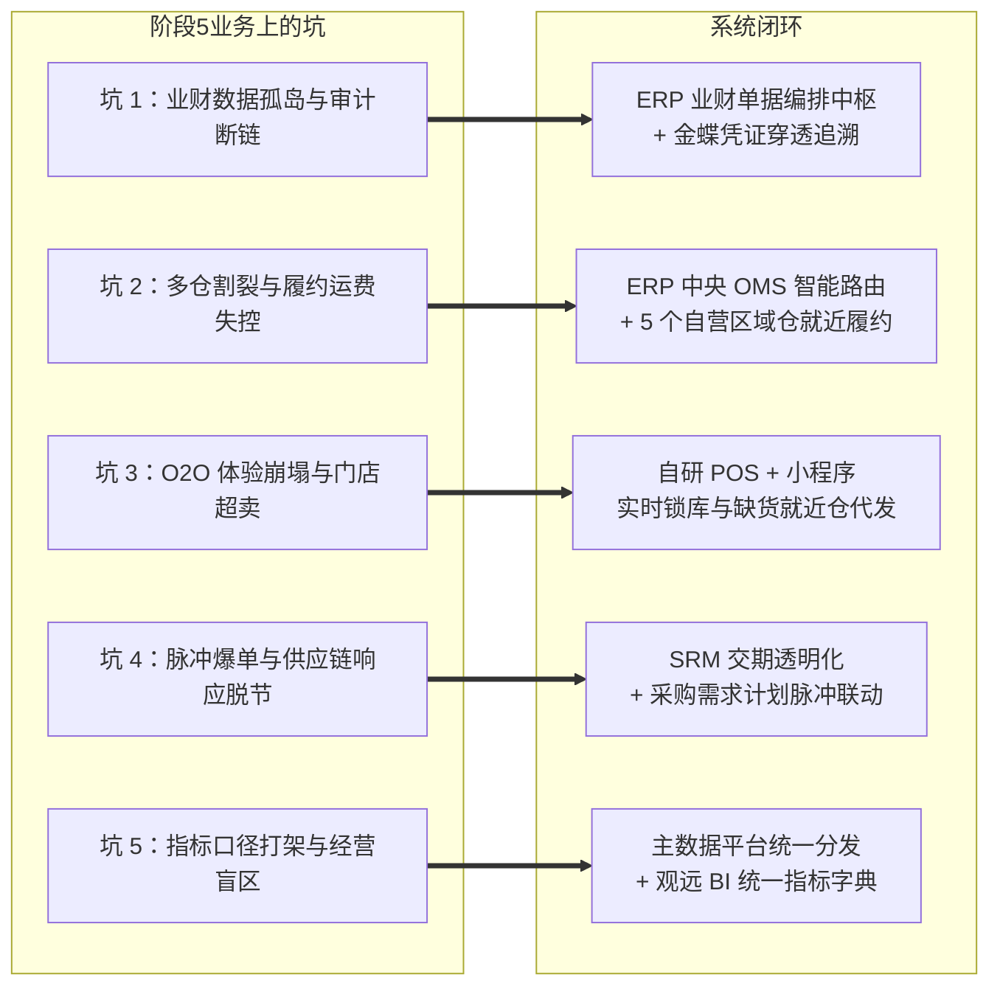

# 阶段5｜业务背景｜IPO冲刺与新零售期｜2023-2026

> 口径说明：本文涉及的时间、规模、财务指标与业务数据均为教学演练设计的模拟数据，仅用于供应链产品经理课程推演与案例教学，不代表任何真实企业的公开经营数据。
>
> 当前阶段：IPO冲刺与新零售期（2023年 - 2026年）  
> 核心特征：年营收从 8 亿迈向 10-15 亿元、进入 IPO 规范化准备阶段、全渠道一盘货调度、20-30 家核心商圈体验店落地、5 个自营区域仓就近履约、自研全渠道零售 ERP 中枢（中央 OMS + 中央库存中心）、主数据与 BI 分析平台统一治理、金蝶财务穿透式合规  
> 业务边界：强盛持续保持品牌商与供应链链主定位（重研发设计、重品牌营销、重全渠道运营、轻制造资产）。生产制造由参股代工厂以自有系统组织车间排产与物料 BOM 展开；强盛自研系统聚焦全渠道订单智能路由、全球库存统一调度、采购需求计划、门店新零售与业财审计中枢。
>
> 阅读方式：本文负责讲清阶段4留下的业务问题，以及阶段5为什么把供应链后台中枢扩展成全渠道商业中枢。系统如何分层见《系统架构》，具体模块和规则见《功能清单》。

---

## 一、时代背景与战略转型：从"线上多渠道"走向"全渠道品牌与IPO冲刺"

进入 2023 年后，消费电子与出海跨境行业迎来了深刻的分水岭，强盛科技的外部经营环境与内部战略诉求发生质的转变：

1. 线上流量红利见顶与渠道碎片化：Amazon、天猫、京东等传统电商公域流量成本大幅攀升；以抖音为代表的短视频与直播兴趣电商全面爆发，单场直播可能瞬间爆发数万单，对供应链快速响应提出极高要求。
2. 品牌 D2C 线下化与新零售体验诉求：单纯依赖线上货架电商难以支撑高溢价品牌形象。强盛在全国核心一二线城市商圈铺设 20-30 家品牌直营与联营体验店，必须打通线上线下一体化（O2O），实现线上引流、线下体验、门店自提与就近配送。
3. 资本市场 Pre-IPO 严监管与穿透式审计：公司启动股份制改造并进入上市辅导期。监管机构、券商与申报会计师开始关注业务真实性、存货账实相符和业财税一体化；单据断链、杂费倒挤或数据口径不一，都可能触发内控整改并影响申报进度。

面对 10 亿营收体量、500 人团队规模与全球九大类履约节点，阶段4"前台各管一摊、后台靠接口拼凑"的烟囱格局无法承载全局调度与上市审计要求。阶段5的选择不是把所有旧系统全部替换，而是把必须保持统一的订单、逻辑库存、主数据和业务凭证收进自研中枢；平台专属运营和法定财务总账继续保留成熟系统。

阶段4已经收回了计划、库存、深圳主仓实物和业务到财务的单据链；阶段5接着补上三件事：统一订单路由、接入线下门店触点、统一主数据和指标口径。第一件事解决"有库存但调不动"，第二件事解决"有门店但接不进全渠道"，第三件事解决"有业务数据但难以形成一致的经营与审计口径"。与此并行，自营仓从 1 个深圳主仓扩展为 5 个区域仓，解决"单仓辐射全国导致跨区发货运费失控"。

---


## 二、公司概况与五大业务线各有各的玩法


### 2.1 基本经营面貌


| 维度   | 说明                                                                           |
| ---- | ---------------------------------------------------------------------------- |
| 公司性质 | 股份有限公司（拟 IPO 上市辅导期）                                                          |
| 经营模式 | 自主研发设计 + 品牌全渠道全域运营（线上电商 + 线下体验店） + 核心代工厂深度协同                                 |
| 销售网络 | Amazon 全球站、Shopify 独立站、天猫、京东、抖音直播、TikTok Shop（试水）、20-30 家核心商圈体验店、国内 B2B 代理网络 |
| 商品策略 | 活跃 SKU 控制在 3,500 左右，走大单品精品路线，涵盖 GaN 快充、户外大容量电源、智能音频与数码配件                     |
| 营收规模 | 2023 年突破 8 亿元，2024-2026 年迈向 10-15 亿元人民币                                      |
| 协同网络 | 200+ 家供应商，其中战略参股 3 家核心代工厂（具备快速响应与协同能力）                                       |
| 组织规模 | 500+ 人，下设营销中心、新零售事业部、产品研发中心、供应链中心、数字化中心与财务中心                                 |


### 2.2 五大业务线各有各的玩法

相比阶段4的四大业务线（跨境B2C、海外独立站、国内B2C电商、国内B2B批发），阶段5做了三处调整：海外独立站不再单列，并入"跨境出海"作为辅助渠道；抖音兴趣电商从国内电商里独立出来成为"兴趣电商直播"业务线；线下体验店落地后新增"线下新零售体验店"业务线。

| 业务线 | 营收占比 | 履约链路 | 结算节奏 |
| :--- | :--- | :--- | :--- |
| 跨境出海 | 约 45% | 国内发运海运头程 → Amazon FBA 官方仓派送；独立站/TikTok Shop/大件走欧美本地 3PL 海外仓 | Amazon 14 天回款，Shopify T+1/T+2 实时结算；多币种（USD/EUR） |
| 国内传统电商 | 约 25% | 就近自营区域仓发货，通达系与顺丰配送；大促高峰由东莞菜鸟仓承接极速打单 | 平台定期结算账期（T+7 到月结不等） |
| 兴趣电商直播 | 约 12% | 就近自营区域仓 / 东莞菜鸟仓直播专线极速发货，48 小时内必须完成揽收 | 消费者确认收货后 T+7 自动结算 |
| 线下新零售体验店 | 约 10% | 门店现货即买即走；小程序下单门店自提核销；门店缺货导购代客下单就近仓直发（O2O） | 线下扫码实时收银；联营加盟店按月对账分成 |
| 国内 B2B 批发与定制 | 约 8% | 就近自营区域仓整车托盘出库、专线物流直达或客户到仓自提 | 赊销月结 30-60 天，严格执行客户授信额度管控 |

五条线履约不同、结算不同、平台规则不同，但都挂在同一个全渠道中枢下，各自的痛点也不一样：跨境线最痛的是 45-60 天海运长周期，在途是黑盒，佣金、仓储费、退款等平台杂费对不清；国内电商线怕大促脉冲，多店铺库存分散、各自预占，跨渠道超卖罚款风险高；直播线是脉冲式流量，单场瞬间爆发 3 万单，48 小时揽收时效卡得死，退货率还高达 20%-30%；门店线微仓只有 10-20㎡ 存货，实物和线上不同步，到店自提最容易缺货；B2B 线货值大、账期长，实物出库、合同和发票要对得上，才能过税务审计。


### 2.3 全球分布式九大履约节点

强盛在阶段5构建了覆盖全球的九大履约节点。5 个自营区域仓由自研 WMS 统一管理现场实物作业，4 个外部节点由各自作业系统管理、向中央库存中心回传库存与履约回执：

```text
                                     ┌── 自营区域仓（自研 WMS 统一管理，合计 14,500㎡）──────────────────┐
                                     │   1. 深圳自营主仓（华南 5,000㎡）— 大宗中转/ToB批发/质检/跨境头程     │
                                     │   2. 华东自营仓（嘉兴 3,000㎡）— 华东电商就近履约/门店补货            │
全渠道零售ERP中枢 ──────────────────┼── 3. 华北自营仓（天津 2,500㎡）— 华北东北就近履约/门店补货           │
（中央库存调度中枢）                │   4. 西南自营仓（成都 2,000㎡）— 西南西北就近履约/门店补货            │
                                     │   5. 华中自营仓（武汉 2,000㎡）— 中部就近履约/门店补货               │
                                     ├── 外部托管节点（非 WMS 管现场作业）──────────────────────────────┤
                                     │   6. 东莞第三方电商仓（菜鸟仓托管）— 大促高并发极速打单枢纽           │
                                     │   7. 欧美本地 3PL 海外仓（美东/美西/欧洲）— TikTok Shop/独立站/大件海外本土派送 │
                                     │   8. Amazon FBA 仓（亚马逊官方托管）— 跨境各站点官方履约            │
                                     └   9. 20-30 家核心商圈门店微仓（自研POS管理）— 现场零售/自提核销/O2O ┘
```

---


## 三、部门级核心诉求与跨部门业务冲突

在 500+ 团队体量下，各业务与职能部门的诉求差异显著，且存在天然的利益冲突。

### 3.1 新增部门与核心诉求

500+ 人的组织里，各部门的日常诉求和阶段4大体一致：渠道希望保障供货，计划希望压低库存，采购希望提前锁定产能，仓储希望准确执行，财务希望账证可追溯，数字化中心继续做系统建设和接口治理。阶段5真正新增的变量是两个新部门——营销中心下属的兴趣电商部（与亚马逊事业部、国内电商事业部同级）和新增一级部门线下新零售事业部，它们的诉求和传统部门天然冲突：

| 新增部门 | 部门职责 | 核心诉求 |
| :--- | :--- | :--- |
| 兴趣电商部 | 抖音直播带货、达人专场对接、短视频引流 | 秒级抓单防超卖、快速补货响应、48 小时极速揽收 |
| 新零售事业部 | 20-30 家线下商圈门店开拓、日常营运与 O2O 履约 | 线上线下库存与会员互通、门店自提核销、缺货秒级云仓代发 |

### 3.2 部门之间在抢什么

部门诉求摆在一起，冲突几乎是必然的。阶段5最典型的有四组：

**库存分配冲突：各渠道 vs 计划部。** 每个渠道运营都想独占安全库存，怕自己爆单断货；计划部想压低整体在库水位加快周转。没有中央配额规则时，库存分配靠"谁吵得凶给谁分"。

**客源与履约冲突：新零售事业部 vs 国内电商部。** 电商大促锁死全部成品库存，门店就没货可卖；顾客到店体验后去线上大促领券下单，门店导购没有分成激励，自然抵触。

**交付时效冲突：兴趣电商部 vs 采购与供应商协同组。** 抖音直播要求 3 天内交付 2 万件快充头，供应商常规交期要 20 天。传统"大批量备货"的采购模式和脉冲式需求节奏根本对不上。

**绩效核算冲突：业务各事业部 vs 财务中心与审计部。** 业务部门按 GMV 和粗口径毛利主张提成，财务要求扣完海运费、FBA 仓储费、退款折损和营销杂费再算真实净利。口径不统一，各部门报表各说各话。

这四组冲突靠行政协调解决不了，它们共同指向同一个系统诉求：统一的配额规则、一盘货调度、灵活的补货机制和统一的指标口径——也就是下面五个坑和怎么应对要讲的事。


---


## 四、体量上来之后，五个绕不过去的坑

在 10 亿体量与 Pre-IPO 阶段，痛点不再是单点操作失误，而是演变为制约企业上市与利润增长的核心问题：

### 坑 1：IPO 尽调一来，单据链断在杂费上

2024 年券商和申报会计师进场做 IPO 尽调，随机抽了 Amazon 欧洲站和天猫双十一的几万行交易流水，要求强盛提供从"平台订单 → 逻辑库存扣减 → 仓库出库单 → 采购 PO → 供应商发票 → 银行流水 → 金蝶凭证"的端到端单据链条。阿兰带着财务团队翻了一周，发现链路断在领星、聚水潭和金蝶之间的平台杂费——海运提单费、FBA 仓储费、广告费、退款手续费一直靠财务月末在 Excel 里人工倒挤分摊，一张凭证往回追，追到杂费这层就断了。会计师当场提出这可能构成内控重大缺陷，要整改，IPO 辅导进度也跟着悬了起来。

业务单据和财务凭证之间没有自动映射，平台杂费全靠 Excel 人工倒挤，凭证往回追追到杂费就断了，业财穿透链路一直没补上。

### 坑 2：库存躺在仓里，订单却发不出去

2025 年嘉兴仓投运后，一个杭州客户在天猫下单了一个 GaN 充电器，系统按默认规则把单推给东莞仓发货，跨区运费 12 元、3 天才到。而杭州附近的嘉兴仓里就有同款现货，系统没有识别就近仓库存，错过了同城发货。欧洲 Amazon FBA 仓断货脱销时，领星也没法自动调用德国本地 3PL 海外仓的库存就近补上。全渠道在库账面库存高达 1.8 亿元，但局部渠道还是频频断货；跨区发货运费比行业最优水平高出 35%，一年近千万元纯利润耗在跨区发货里。

根因是多仓多门店之间没有中央订单中心和分布式库存路由中枢做"全渠道一盘货"的智能分仓与就近履约，库存躺在哪个节点、订单该派给谁，全靠各前台自己猜。

### 坑 3：小程序下了单，到店却说没货

2024 年一位顾客在强盛微信小程序下单了 100W 氮化镓充电套装，选了"深圳万象天地店自提"。到店后导购一查，最后 2 件实物刚被进店顾客刷卡买走——小程序下单时没有实时锁门店微仓的库。导购只好在工作群里人工联系附近仓快递补发，顾客等了 3 天最后退款走人，还留了一条严重投诉。高端商圈体验店刚开业不久就摊上这种事，小程序差评率飙升，门店客流转化率直线下滑。

根因是门店 POS、顾客小程序和中央库存中心的数据割裂，缺少实时的分布式防超卖锁库机制，也没有缺货时自动路由到就近仓代发的能力。

### 坑 4：直播间爆单，供应链接不住

2024 年抖音一个头部达人专场带货，单场爆了 30,000 单快充充电宝，就近仓现货只能撑住三分之一。供应链计划部当晚紧急向供应商追单，可供应商常规交期要 20 天，抖音规定的发货时效只有 48 小时。结果是大面积订单超时，平台按规则扣罚违约金，店铺体验分（DSR）跌破 4.2，直播间被限流，前期投入的数十万元坑位费全打了水漂。

采购需求计划还停在常规销量模型上，爆单当晚计划员只能人工给供应商打电话追单，20 天交期对 48 小时时效，怎么算都来不及；SRM 协同也只做到接单和交期反馈，没有和 ERP 联动的快速补货机制。

### 坑 5：三个部门都说在赚钱，合完账只有 6.5%

2024 年某次月度高管经营会上，跨境部汇报 Amazon 实现了 22% 的净利率，国内电商部汇报天猫是 18%，新零售部门说线下门店单店全部盈利。三个部门都觉得自己在赚钱。可阿兰把全公司账合完，综合净利率只有 6.5%。差距出在哪？跨境部的"净利率"没扣 FBA 长期仓储费和广告费，国内电商部没分摊跨区运费，新零售部门把门店装修折旧排在外。每个部门用自己的口径算自己的账，口径全对不上。管理层看不清哪个渠道其实在隐形亏损、哪个 SKU 是虚假繁荣，战略决策只能盲人摸象，资本市场的估值逻辑也跟着受损。

没有企业级统一主数据中心和统一指标字典，各业务线对收入确认口径、运杂费分摊规则各自定义，阿兰每个月要把三套系统的数据导出来在 Excel 里重新拼一遍才能合出全公司账，口径年年打架。

---


## 五、怎么应对：把订单、库存、主数据收进一个中枢


### 5.1 整体思路：不另起炉灶，把控制点收进中枢

阶段5的核心策略是**不另起炉灶造新烟囱，而是把订单、逻辑库存、主数据和业务凭证这些必须统一的控制点收进自研 ERP 中枢，补齐新零售 POS 与主数据 BI，深化金蝶财务合规**：

```text
                                  ┌── 1. 前台渠道执行层 ──── 领星（Amazon） + 聚水潭（国内电商/抖音） + 自研POS/小程序（门店）
                                  │
                                  ├── 2. 全渠道中枢 ──── 自研全渠道零售ERP（中央OMS + 中央逻辑库存 + 结算中枢）
强盛科技系统架构（阶段5全貌） ──┼
                                  ├── 3. 供应链协同执行 ──── 自研SRM（供应商协同） + 自研WMS（5个自营区域仓） + 外部3PL/FBA仓
                                  │
                                  └── 4. 数据与财务合规 ──── 主数据中心 + 统一指标字典 + 观远BI + 金蝶云·星空（财务总账）
```


### 5.2 八大系统一句话定位与解决的坑

本节只给每个系统一句话定位和它对应的坑编号，系统的具体模块、字段和规则见《功能清单》，分层与数据流见《系统架构》。

| 系统名称 | 建设属性 | 一句话定位 | 解决的核心坑 |
| --- | --- | --- | --- |
| 自研全渠道零售 ERP | 自研核心中枢 | 全公司商业调度中枢，统揽中央订单路由、全球一盘货库存调度、采购需求计划与业财编排 | 坑 1、2 |
| 自研 POS + 小程序 | 自研新零售触点 | 20-30 家体验店前台收银、小程序实时锁库、自提核销、缺货就近仓代发 | 坑 3 |
| 自研 SRM | 自研供应链协同 | 200+ 供应商在线接单、交期节点透明、外箱条码源头赋码与送货预约 | 坑 4 |
| 自研 WMS | 自研仓储执行 | 5 个自营区域仓（合计 14,500㎡）统一实物执行、五仓协同调拨与门店配发 | 坑 2、4 |
| 主数据与指标平台 + 观远 BI | 自研+外采数据中台 | 统一 SKU/客户/组织主数据源头，统一 GMV/毛利/周转口径，提供穿透式经营看板 | 坑 5 |
| 领星 ERP | 垂直外采 SaaS | Amazon Listing/PPC广告/FBA货件申报/ASIN 利润核算 | 跨境专属精细化运营 |
| 聚水潭 | 垂直外采 SaaS | 国内天猫/京东/抖音多店铺秒级抓单与电子面单批量连打 | 国内电商大促极速打单 |
| 金蝶云·星空 | 标准外采软件 | 法定财务总账、存货加权成本核算、多币种结汇与穿透式审计归口 | 坑 1 |


### 5.3 五个坑怎么填



1. **业财数据孤岛与审计断链（坑1）**：ERP 业财单据编排中枢归集全渠道业务单据，自动匹配统一物料编码与移动加权平均成本，标准接口驱动金蝶生成记账凭证；金蝶凭证携带原始业务单据 ID，支持审计人员向下穿透调出原始单据与电子回执。
2. **多仓割裂与履约运费失控（坑2）**：ERP 中央 OMS 按四维策略智能路由分仓，自营仓从 1 个扩展为 5 个区域仓就近履约；中央逻辑库存中心统管 9 类节点全局可售与配额，降低跨区发货成本与跨渠道超卖。
3. **O2O 体验崩塌与门店超卖（坑3）**：自研 POS 与小程序实现门店自提实时锁库、提货码扫码核销；门店缺货时导购代客下单自动路由就近仓代发，业绩跨域归属降低导购抵触。
4. **脉冲爆单与供应链响应脱节（坑4）**：SRM 在 200+ 供应商在线协同的基础上细化交期节点，并提前 7 天预警；采购需求计划模型支持脉冲式补货建议快速下发，缩短缺货到补货响应周期。
5. **指标口径打架与经营盲区（坑5）**：主数据中心统一定义 SKU、客户与组织主数据并单向分发；统一指标字典固化 GMV、毛利、周转率口径，观远 BI 提供穿透式多维经营看板。

各系统的具体模块、字段和规则见《功能清单》，系统分层与数据流见《系统架构》。

---


## 六、阶段演进时间线（2023-2026）


| 时间节点       | 业务与战略大事件                                     | 系统演进与自研中枢推进                                                            |
| ---------- | -------------------------------------------- | ---------------------------------------------------------------------- |
| 2023 年上半年  | 启动股份制改造与 Pre-IPO 辅导；布局抖音兴趣电商，TikTok Shop 试水。 | 新零售事业部升格为一级部门；启动全渠道零售 ERP 中枢建设，搭建中央 OMS 与中央逻辑库存引擎。                       |
| 2023 年下半年  | 首批 10 家核心商圈体验店开业，探索线上线下 O2O 新零售。             | 上线自研 POS 与顾客小程序，打通线上线下会员、门店自提核销与就近仓代发。                                |
| 2024 年     | 营收突破 10 亿元；券商与申报会计师进场开展 IPO 穿透式尽调。           | 搭建主数据与指标平台；引入观远 BI 经营分析驾驶舱；自研 ERP 与金蝶建立业务凭证关联和穿透对账链路。                  |
| 2025 年     | 体验店拓展至 20-30 家；自营仓从 1 个深圳主仓扩展为 5 个区域仓（嘉兴/天津/成都/武汉相继投运）；供应商协同体系深化。 | 自研 WMS 升级为 5 仓统一管理；自研 SRM 扩大供应商在线协同覆盖；全渠道一盘货自动化调度与就近履约全面成型。               |
| 2026 年（当前） | 递交 IPO 招股说明书，继续推进资本市场申报。                     | 形成"全渠道 ERP 中枢 + POS + SRM + WMS + 主数据/BI + 金蝶"的一体化架构，为后续合规申报与审计提供系统基础。 |


放在阶段4与阶段5之间看，变化可以简化为四组（数据均为教学口径；营收和团队规模用于说明业务复杂度，不单独等同于系统建设效果）：


| 对照项     | 阶段4末                                          | 阶段5阶段性结果                                            |
| ------- | --------------------------------------------- | --------------------------------------------------- |
| 经营规模    | 营收接近 7 亿元，团队超 300 人                           | 2024 年营收突破 10 亿元，团队 500+ 人                          |
| 履约触点    | 线上电商、独立站和 B2B 为主，没有门店系统；自营仓仅深圳单仓               | 20-30 家体验店落地；自营仓扩展为 5 个区域仓（合计 14,500㎡）就近履约          |
| 系统中枢    | ERP、WMS、SRM 收拢后台，前台渠道仍分治                      | 中央 OMS、ATP、POS、主数据与 BI 加入同一套全渠道中枢                   |
| 业财追溯与关账 | 主数据统一与单据自动编排后，关账约 2 天，但复杂杂费仍依赖人工倒挤，业务和财务关联不稳定 | 关账约半天；主数据平台与穿透追溯链路补齐，ERP 凭证关联原始业务单据，为申报会计师和审计核查提供基础 |