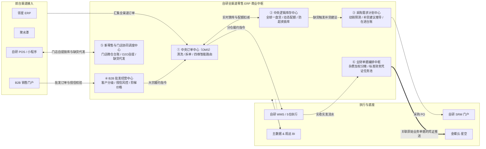
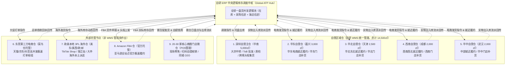
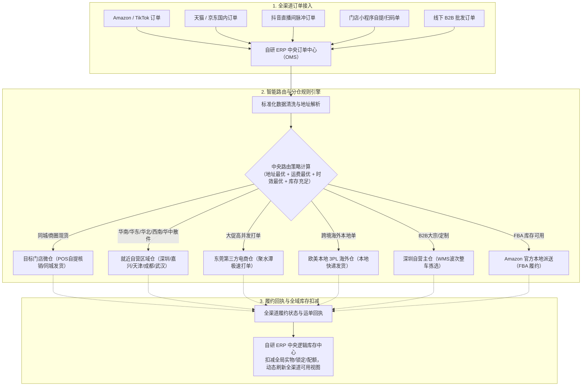
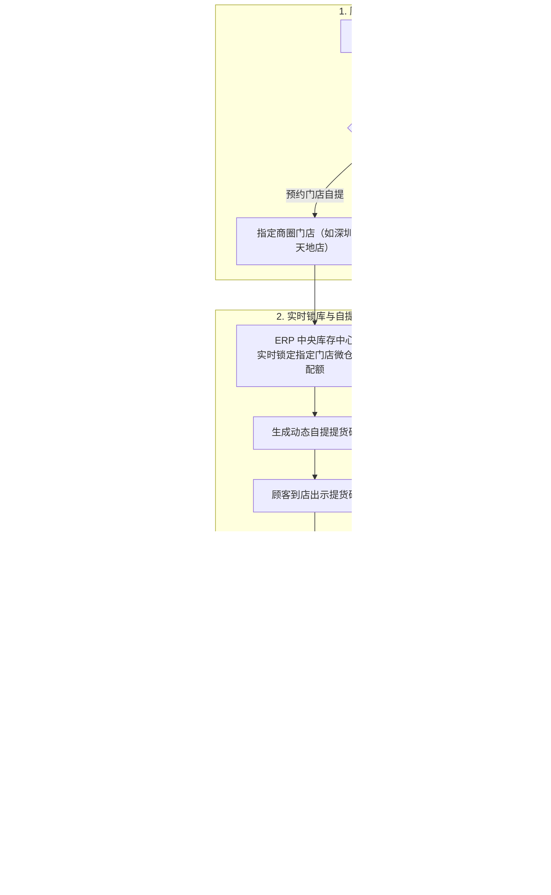
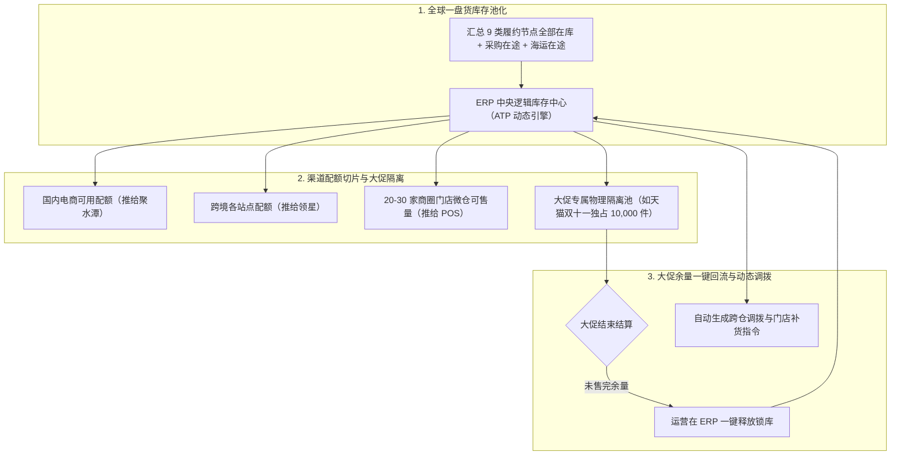
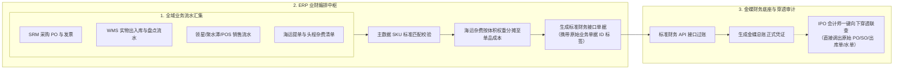
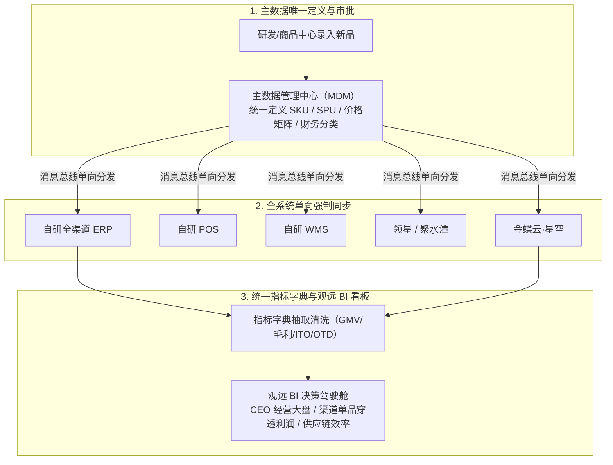

# 阶段5｜系统架构｜IPO冲刺与新零售期｜2023-2026

> 口径说明：本文涉及的时间、规模、财务指标与业务数据均为教学演练设计的模拟数据，仅用于供应链产品经理课程推演与案例教学，不代表任何真实企业的公开经营数据。
>
> 阅读提示：本文承接阶段4的架构边界，重点回答阶段5如何把供应链后台中枢扩展成全渠道商业中枢：订单如何路由、库存如何调度、各履约节点以谁为事实来源、业务凭证如何进入金蝶。业务动因见《业务背景》，具体模块和规则见《功能清单》。
>
> 阶段特征：ERP 升级为全渠道业务中枢、全球一盘货智能调度、线上线下 O2O 新零售打通、主数据与指标体系统一治理、建立业务到财务的穿透式审计链路  
> 核心工具：自研全渠道零售 ERP + 自研 POS/小程序 + 自研 WMS + 自研 SRM + 主数据与指标口径平台 + 观远 BI + 领星 ERP + 聚水潭 + 金蝶云·星空

---

## 一、系统定义与业务价值

### 1.1 系统定义与演进脉络

2023 年进入阶段5后，强盛科技年营收向 10 亿元大关迈进（2024 年正式突破），启动股份制改造冲刺 IPO。面对抖音与 TikTok Shop 脉冲流量冲击、20-30 家核心商圈新零售体验店落地、全球 10+ 仓网节点以及严苛的 Pre-IPO 穿透式审计，阶段4"前台各管一摊、后台靠接口拼凑"的烟囱模式已无法满足全局统筹调度的要求。

强盛管理层确立了"把自研 ERP 升级为全公司商业中枢、自研 POS 打通线下新零售触点、主数据与 BI 统一企业语言、金蝶承接业务到财务的穿透追溯"的集团级架构升级战略。建设重点不是把所有系统都替换掉，而是把订单、逻辑库存、主数据和业务凭证这些必须统一的控制点收回到自研中枢。

| 架构层级 | 核心系统 | 建设属性 | 核心定位与职责边界 |
| :--- | :--- | :--- | :--- |
| 商业中枢 | 自研全渠道零售 ERP | 核心自研 | 集团商业调度中枢：中央订单中心（OMS）、中央逻辑库存中心、采购需求计划、B2B批发、业财单据编排中枢。 |
| 新零售前端触点 | 自研 POS + 小程序 | 核心自研 | 20-30 家商圈体验店前台收银、小程序实时锁库、自提条码核销、门店缺货自动代客下单派发云仓。 |
| 供应链协同执行 | 自研 SRM<br>自研 WMS | 核心自研 | SRM 扩大供应商在线协同覆盖、交期节点透明化；WMS 统一管理 5 个自营区域仓（深圳/嘉兴/天津/成都/武汉，合计 14,500㎡）的实物执行、五仓协同调拨与门店配发货。 |
| 数据与决策中台 | 主数据平台<br>观远 BI | 自研+外采 | 统一定义全公司 SKU、客户与组织主数据源头；统一企业级指标字典；提供穿透式多维经营分析驾驶舱。 |
| 垂直渠道 SaaS | 领星 ERP<br>聚水潭 | 垂直外采 | 领星专注 Amazon PPC 广告与 FBA 货件申报；聚水潭专注天猫/京东/抖音高并发电子面单批量连打与极速发货。 |
| 合规财务底座 | 金蝶云·星空 | 标准外采 | 专职法定财务总账、存货加权成本核算、多币种结汇与审计归口，接收 ERP 推送凭证并关联原始业务单据。 |

业务边界特别声明：强盛定位为品牌商与供应链链主（重研发设计、重品牌营销、重全渠道运营、轻制造资产）。生产制造由参股代工厂以自有系统组织车间排产与物料 BOM 展开，强盛自研系统不做代工厂车间排产；强盛系统聚焦全渠道订单智能路由、全球一盘货库存调度、采购需求计划、门店新零售与业财审计中枢。

### 1.2 三本账各归各管

为了减少多系统并立导致的数据口径打架与审计疑问，阶段5在架构底层确立了"三本账各归各管、数据闭环"的权责边界：

```text
                               ┌── 1. 实物库位账（Physical Stock） ─────── 事实来源：5 个自营区域仓由自研 WMS 管理，外部节点由各自作业系统或盘点结果提供
                               │
集团三本账各归各管 ────────┼── 2. 逻辑可售与调度账（ATP & Logic Stock） 唯一主权：自研全渠道零售 ERP（管理全局可用、预占、锁库与配额）
                               │
                               └── 3. 财务存货资产账（Valuation Ledger） ──── 唯一主权：金蝶云·星空（管理存货核算、移动加权成本与总账凭证）
```

* 实物库位账：5 个自营区域仓以自研 WMS 记录具体库位、包装箱码与批次流水；东莞菜鸟仓、海外 3PL、FBA 和门店微仓分别以各自作业系统或盘点结果作为节点库存来源，ERP 通过接口回传和对账形成全局视图。
* 逻辑可售与调度账：以自研 ERP 中央库存中心为唯一调度中枢，负责向全渠道输出动态可承诺（ATP）配额、大促专属锁库与多仓路由规则。
* 财务存货资产账：以金蝶云·星空为唯一法定核算源，承接 ERP 编排推送的业务凭证，负责存货资产核定、成本结转与 IPO 合规审计。

#### 外部履约节点的异常处理原则

外部仓、FBA 和门店微仓并非都由强盛直接管理，因此本案例采用"节点事实优先、ATP 保守承诺、异常单独核对"的原则：

| 履约节点 | 回传与差异重点 | 系统处理 |
| :--- | :--- | :--- |
| 外部仓（3PL/东莞菜鸟仓） | 关注收货、拣货和出库回执；回传延迟或实收数量不一致时，容易造成可用量滞后 | 履约单先进入"待确认"，超时预警；以仓库作业记录或盘点结果核对，审核后调整 ERP 逻辑库存 |
| FBA | 关注 Shipment 入仓、可售库存及丢件、破损、平台调整；入仓或调整回传滞后时，必须区分在途、已接收和可售 | 只把确认可售库存计入 ATP；差异保留平台对账或索赔凭据，异常未核清不直接完成财务过账 |
| 门店微仓 | 关注 POS 销售、核销、自提、调拨和盘点回传；线上订单与现场销售并发时，最容易出现库存不同步 | POS 核销优先锁定或扣减门店配额；回传失败、重复或缺失时挂起待核对，必要时切换云仓直发，避免重复扣减或承诺 |

---

## 二、系统全景架构与多维业务流转

为避免单张全景图信息过载，阶段5架构拆分为**ERP商业中枢拓扑图**与**全球分布式仓网调度图**两张递进视图。先看中枢内部如何统揽全局，再看仓网如何被调度，最后用业务主线验证这套分工。

### 2.1 递进式架构全景图

#### 视图 1：自研 ERP 商业中枢内部结构

展示自研 ERP 内部五大子中心如何统揽全局，连接外部系统：



#### 视图 2：全球分布式九大履约节点调度拓扑图（仓网专属）

展示中央库存中心如何穿透管理并调度全球九类物理节点（5 个自营区域仓 + 4 个外部节点）：



### 2.2 架构数据流速览

| 阶段步骤 | 作业角色与时机 | 涉及系统与单据 | 数据流转与底层机制 |
| :--- | :--- | :--- | :--- |
| 步骤 1：全渠道订单智能汇聚与清洗 | 线上消费者 / 线下顾客（实时） | 领星/聚水潭/POS/独立站 → 自研 ERP（OMS） | 按约定接口接入订单，OMS 进行标准化字段清洗与防重校验。 |
| 步骤 2：中央智能路由与分仓拆单 | ERP 中央路由引擎（自动计算） | 自研 ERP → 9 类履约节点 | 依据"地址就近、运费最优、时效优先、库存充足"策略自动拆单分仓，国内订单优先路由至华南/华东/华北/西南/华中自营区域仓就近履约。 |
| 步骤 3：中央逻辑库存动态配额与锁库 | ERP 中央库存中心（动态计算） | 自研 ERP ↔ 各前台与门店微仓 | 动态计算 ATP 可用量，大促与门店微仓专属锁库，向各前台分发独立配额视图，降低超卖风险。 |
| 步骤 4：供应商协同与交期透明 | 供应链计划部 / 供应商（每日/实时） | 自研 ERP ↔ 自研 SRM ↔ 供应商 | 运行采购需求计划模型下发 PO，供应商在线接单、反馈交期关键节点，外箱条码出厂张贴，预约送货。 |
| 步骤 5：仓内条码盲收、路径拣货与防呆 | 仓管员 / 拣货员 / 门店导购（日常） | 自研 SRM 箱码 → 自研 WMS / POS | PDA 扫描 SRM 标准条码盲收上架；出库依据 FIFO 锁定批次，最优路径导航，扫码防呆拦截。 |
| 步骤 6：业财一体自动编排与穿透审计 | 财务总监阿兰 / 审计机构（月末/实时） | 自研 ERP → 金蝶云·星空 ↔ 观远 BI | ERP 归集单据并匹配加权成本，推送记账凭证至金蝶，凭证关联原始业务单据，支持向上向下穿透追溯。 |

### 2.3 六条多维业务主线流转图

下面六条主线分别对应订单路由、O2O 闭环、抖音脉冲响应、动态配额、业财穿透和主数据分发，是阶段5架构的核心运行机制。

#### 主线 1：全渠道订单智能路由与拆单分仓主链路



#### 主线 2：线下新零售 O2O 闭环主链路



#### 主线 3：抖音脉冲爆单与供应链快速响应主链路

```mermaid
flowchart LR
    subgraph T1["1. 脉冲聚单与防超卖"]
        Live["抖音直播爆发 30,000 单"] --> JST_In["聚水潭秒级抓单"]
        JST_In --> ERP_OMS["ERP OMS 接入 & 直播专属配额校验"]
    end

    subgraph T2["2. 采购需求计划与 SRM 协同"]
        ERP_OMS --> Plan_Model["采购需求计划模型\n推导追加补货建议"]
        Plan_Model --> SRM_PO["下发追加 PO 至自研 SRM 门户"]
        SRM_PO --> Supplier["供应商在线接单\n确认交期与关键节点反馈"]
        Supplier --> Milestone["交期节点在线跟踪\n（齐套/生产中/组装完成/待检）"]
    end

    subgraph T3["3. 外箱条码赋码与绿色通道"]
        Milestone --> Barcode["SRM 在线打印标准 SSCC 外箱条码"]
        Barcode --> Fast_Lane["东莞电商仓专属月台 PDA 盲扫入库"]
        Fast_Lane --> Auto_Ship["聚水潭批量连打面单，极速揽收发运"]
    end
```



#### 主线 4：全球一盘货动态配额调度与大促物理隔离链路



#### 主线 5：Pre-IPO 穿透式业财一体化结转与审计链路



#### 主线 6：企业级主数据分发与 BI 经营分析决策链路



---

## 三、核心单据体系与跨系统数据结构

阶段5通过自研全渠道零售 ERP 中枢，建立了"单据分四层流转"的体系：

```text
┌────────────────────────────────────────────────────────────────────┐
│ 1. 渠道意图单据（前台）                                              │
│    领星/聚水潭/POS/独立站/B2B 各自的原始渠道订单与销售流水            │
├────────────────────────────────────────────────────────────────────┤
│ 2. 中央路由单据（ERP OMS）                                          │
│    标准中央订单、履约子订单（拆单后指定履约仓）、售后逆向单据（RMA）    │
├────────────────────────────────────────────────────────────────────┤
│ 3. 仓储执行单据（WMS/SRM/POS）                                      │
│    PO 协同单、ASN 送货通知、SSCC 箱码、入库任务单、出库波次单、       │
│    门店收银单、自提核销单、微仓盘点单                                │
├────────────────────────────────────────────────────────────────────┤
│ 4. 财务核算单据（金蝶）                                              │
│    采购应付单、销售应收单、存货核算单、自动记账凭证（绑定原始单据 ID） │
└────────────────────────────────────────────────────────────────────┘
```

各系统的核心单据名称见《功能清单》对应章节，这里只展示四层流转关系：渠道订单进入 ERP OMS 被清洗拆单为履约子订单，下发至 WMS/SRM/POS 执行，执行回传流水进入业财编排中枢生成金蝶凭证，凭证绑定原始业务单据 ID 支持审计穿透。

---

## 四、核心业务场景与跨系统流转

第二节六条主线用流程图展示了数据怎么流，这里补两个主线图没展开操作细节、但讲师容易问到的点：

### 场景 1：跨境海运头程杂费体积权重精准分摊（选讲）

* 业务痛点：跨国海运一船货包含海运费、港杂费、报关费、关税多项杂费，以往财务靠月末人工倒挤分摊，单品真实成本算不准。
* 跨系统流转机制：
  1. 提单与货件录入：跨境运营在 ERP 录入海运提单号及关联 SKU 的货件数量与外箱体积。
  2. 杂费录入：财务录入该船次全部海运杂费（如合计 8,500 美元）。
  3. 体积权重分摊：ERP 杂费分摊引擎按各 SKU 占用的实际立方数（CBM）比例自动计算分摊金额，换算为单品入库加权平均成本。
  4. 平台费用匹配：单品成本再与平台佣金、广告费自动匹配。
  5. BI 利润穿透：观远 BI 精确呈现每个 ASIN 的真实净利润，管理层一键查看单品多维盈利。对应主线 5。

### 场景 2：B2B 大客户批发大单授信风控与托盘整车出库（选讲）

* 业务痛点：大客户非标批发货值大，手工授信容易出坏账；现场提货与系统出库未互锁，仓管凭肉眼放行。
* 跨系统流转机制：
  1. 批发订单录入与信控校验：销售经理在 ERP 录入批发订单，ERP 自动校验客户剩余授信额度与逾期账款，通过后锁定额度。
  2. 出库指令下发：指令下发就近自营区域仓 WMS。
  3. WMS 批次锁定与整托拣选：WMS 按 FIFO 锁定最早入库批次，PDA 导航叉车整托拣选、扫码封箱出库。
  4. 月台交接与过账：货物在月台扫码交接出库，WMS 过账扣减实物库存，回传 ERP 生成销售出库单与应收账款。
  5. 开票与凭证：ERP 自动生成应收对账单，对接金蝶开具增值税专用发票并生成应收凭证。这条链路在阶段4 B2B 批发管理基础上沿用了，阶段5把凭证链路补完整。

---

## 五、阶段5相对阶段4的架构变化

| 架构维度 | 阶段4特征 | 阶段5变化 |
| :--- | :--- | :--- |
| 中枢 | 自研 ERP 聚焦后台主链条（采购/批发/自营仓） | 自研全渠道零售 ERP 升级为全域商业中枢，统揽中央 OMS、中央逻辑库存、采购需求计划与结算中枢 |
| 渠道覆盖 | 仅覆盖线上货架电商与传统 B2B 批发 | 全面打通线上电商、抖音兴趣电商、20-30 家线下体验店与 B2B，实现全渠道一盘货 |
| 仓网协同 | 专管深圳自营单仓，外部仓靠单向接口读取 | 自营仓从 1 个扩展为 5 个区域仓（深圳/嘉兴/天津/成都/武汉，合计 14,500㎡），WMS 统一管理；外部节点扩展为东莞菜鸟仓+欧美3PL+FBA+门店微仓，基于节点回传进行动态库存调度与智能路由 |
| 供应链协同 | 传统大批量下 PO，供应商协同靠微信电话 | SRM 扩大供应商在线协同覆盖，交期节点透明化，提前 7 天预警，支撑快速响应 |
| 数据与分析 | 多系统分散报表，指标口径不一 | 主数据中心全局唯一分发，统一指标字典，观远 BI 提供多维穿透式经营分析大盘 |
| 合规与审计 | 月末依赖 Excel 倒挤杂费，存在单据断链 | ERP 与金蝶建立原始业务单据关联和穿透追溯链路，为 Pre-IPO 审计核查和后续整改提供系统支持 |

---

## 六、阶段总结

阶段5在阶段4的基础上，把原本聚焦供应链后台的 ERP 扩展为全渠道商业中枢，同时补上 POS、主数据与指标平台。关键变化不是系统数量增加，而是订单、逻辑库存、门店触点和经营口径开始由同一个中枢协调。

这套架构重点缓解了多仓多渠道割裂、新零售 O2O 履约与兴趣电商供应链响应脱节等现实问题，也为公司跨过 10 亿营收门槛、推进 IPO 申报和迈向全球化消费电子品牌提供了数字化基础。至于是否完成上市，不能仅由系统建设结果直接推出。