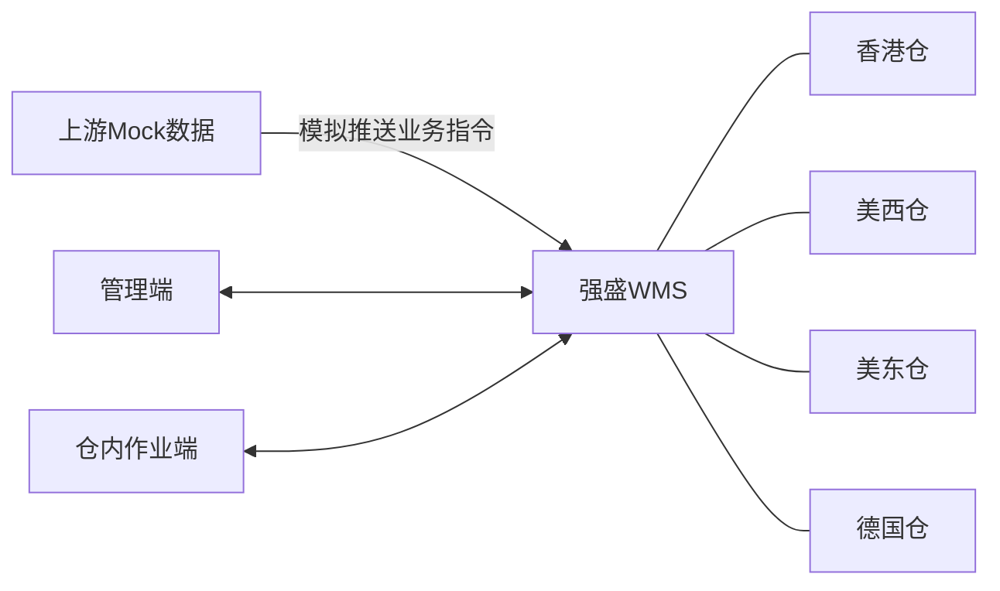
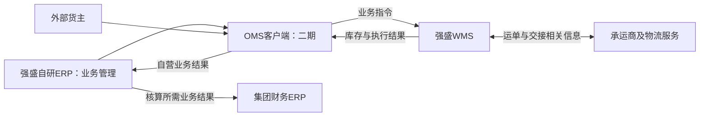

# 03 强盛WMS能力蓝图与系统架构

> 本文只定义能力分区和系统协作，不规定单据、字段、状态、算法、接口协议或页面。范围以[02-项目定位与范围](02-项目定位与范围.md)为准，阶段以[05-阶段规划与交付边界](05-阶段规划与交付边界.md)为准。

## 一期能力蓝图

| 能力分区 | 作用 |
| --- | --- |
| 基础资料与仓内空间 | 为四仓、货主、商品和存放位置提供共同基础。 |
| 入库管理 | 承接入库需求并记录货物进入仓库的执行结果。 |
| 库存与仓内作业 | 管理仓内实物库存，支持仓内作业和库存信息查询。 |
| 出库管理 | 支撑包裹履约、平台仓转运和B2B批发的出仓执行。 |
| 仓间调拨执行 | 衔接调出仓与调入仓的仓库作业，不承担全局调度决策。 |
| 上游协作 | 接收业务指令并提供执行结果；一期由Mock模拟上游。 |

这些能力共同服务四仓和多货主，管理人员通过管理端使用，现场人员通过仓内作业端使用。业务记录贯穿各能力，用于查询与追溯，不在此另行设计具体报表或异常处理流程。

## 一期演示架构

一期不建设OMS客户端，也不以WMS自行导入上游业务指令替代Mock推送。演示需要能够观察WMS接收指令后的业务执行与结果；Mock的具体形式及结果展示方式留给应用设计。

## 后续系统协作蓝图

此图表达目标协作关系，不承诺二期完成所有真实接口。具体数据交换路径及接入深度在对应阶段设计中确认。财务ERP负责核算，全局库存协同由业务ERP考虑，均不列入WMS能力蓝图。

## 多仓共同约束

四仓采用共同业务框架，同时兼容经调研确认的仓库差异。全局设计需要考虑仓库时区、现场语言、多货主数据隔离，以及轻小件、大件、异形货的差异。具体语言范围、安全管控、追溯粒度和设备方案不在本文件中预定规则。
