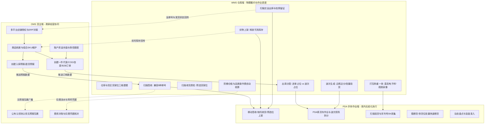
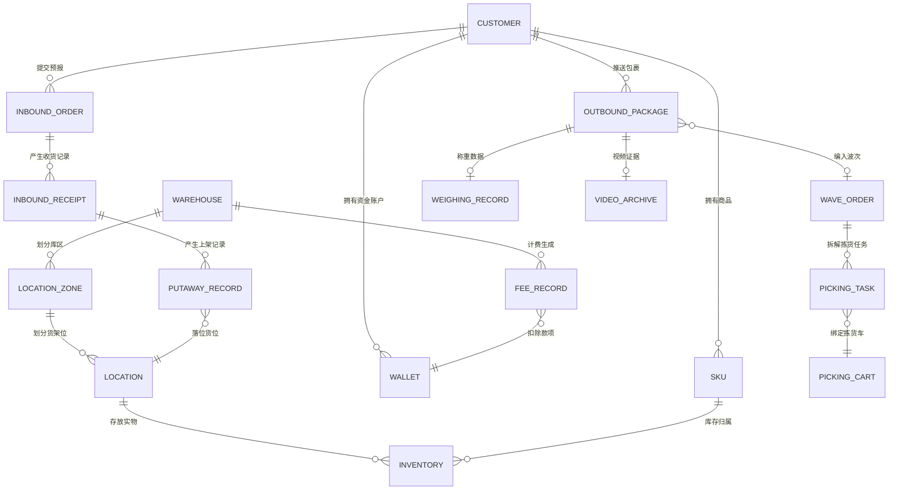

# 极风海外仓系统业务知识库总览与全景架构

## 一、系统全景定位与双端分工

极风海外仓系统采用OMS（货主端）与WMS（仓库端）分离的双端协同架构。货主通过OMS完成商品档案维护、店铺授权拉单、创建入库预报、下发出库订单、监控可用库存、账户充值及核对费用账单；仓库一线作业人员与主管通过WMS及PDA移动端执行物理仓库建模、签收、收货质检、上架、库存移位、波次生成、拣货、扫描复核包装、称重、出库交运及计费管理。

---

## 二、核心业务实体与数据对象模型

系统的底层数据模型围绕“货主客户”、“实物商品”、“空间货位”、“业务单据”、“库存流水”与“费用流水”六大核心集群构建：

---

## 三、模块分册目录索引

为确保产品经理能够深入查阅各模块实际提供的能力、操作路径、单据状态机、参数配置、底层校验规则与异常处理，本知识库按业务领域严格拆分为以下独立专业分册：

| 分册编号 | 知识库文档名称 | 涵盖核心业务范畴 | 对应原始手册与更新来源 |
| :---: | :--- | :--- | :--- |
| 第01分册 | [01-基础设置与仓库建模.md](./01-基础设置与仓库建模.md) | 仓库建模、货区货架位规划、库位类型属性、商品档案、组合SKU解构、包装耗材、极风打印组件与硬件直连 | JF-BAS系列（21篇） JF-PRT系列（1篇） JF-OMS-SKU系列（6篇） |
| 第02分册 | [02-入库业务全流程与异常处理.md](./02-入库业务全流程与异常处理.md) | 标准预报流程、自定义入库流程、9种单号兼容签收、扫描收货质检、预选货架推荐、扫描上架、公有认领池与销毁倒计时、跨仓退货、按托批量收货 | JF-IN系列（16篇） JF-OMS-IN系列（9篇） JF-OMS-RET系列（2篇） |
| 第03分册 | [03-库内运营与库存管控.md](./03-库内运营与库存管控.md) | 仓库/货位/箱库存三层模型、真实库龄与财务库龄双轨制、库内热力图与智能货位诊断、快速移库、任务移库更换出库位、强制移库、盘点盲盘与明盘、标记缺货与防误触 | JF-INV系列（25篇） JF-FAQ-OUT-006 公告第3、8条 |
| 第04分册 | [04-出库作业与波次策略全景.md](./04-出库作业与波次策略全景.md) | 进单占位与波次占位双轨制及硬性切换门槛、波次聚合规则、PDA拣货车边拣边分、爆款波次批量验货、扫描包装称重一体直连电子秤、面单水印双列排版、打包验货视频录像、COD/自提/平台组包/手动标记交运 | JF-OUT系列（37篇） JF-OMS-OUT系列（23篇） 公告第1、5条 |
| 第05分册 | [05-移动作业端(PDA)功能全集.md](./05-移动作业端(PDA)功能全集.md) | Android原生APK架构、移动收货上架预选位、拣货车配置与标签打印、波次现场拆分、扫描验货与序列号SN采集、称重拍照出库、箱移库、盘点查询、按键防误触优化 | JF-PDA系列（27篇） JF-FAQ-DEV系列（2篇） |
| 第06分册 | [06-增值服务与专项场景(B2B_FBA_分销_代理仓).md](./06-增值服务与专项场景(B2B_FBA_分销_代理仓).md) | B2B大货中转/批量导入/自定义箱号复用/换标费、FBA退货开箱质检换标出库、货盘分销专享库存/等级定价/退货货款返还、代理仓多仓协同四重配对与面单推送 | JF-B2B系列（7篇） JF-FBA系列（4篇） JF-DIS系列（5篇） JF-AGT系列（8篇） |
| 第07分册 | [07-物流渠道与运费分区规则.md](./07-物流渠道与运费分区规则.md) | 主流尾程对接（佐川/USPS/FedEx等）、已被引用分区规则动态合并与覆盖、渠道分区匹配引擎、子母件发货限制、渠道超重预警与报错排查 | JF-LOG系列（36篇） JF-FAQ-LOG系列（4篇） 公告第2、4条 |
| 第08分册 | [08-多货主协同与计费结算体系.md](./08-多货主协同与计费结算体系.md) | OMS货主门户体验、阶梯仓租方案、按商品分类差异化出库费、增值杂费、垫付扣费强制附件互信、欠费打单拦截、推单前置资金预扣阻断 | JF-FEE系列（12篇） JF-CUS系列（10篇） JF-FAQ-FEE系列（2篇） 公告第6条 |
| 第09分册 | [09-系统集成与生态连接.md](./09-系统集成与生态连接.md) | 13家主流跨境ERP授权全矩阵（覆盖全球、东南亚、拉美本土）、TEMU官方认证仓线上自测与API规范、平台面单强制规则应对、组合SKU解构 | JF-ERP系列（11篇） JF-OMS-ERP系列（13篇） JF-OFC系列（2篇） JF-FAQ-ERP系列（2篇） |

---

## 四、专项进阶与自研复刻设计附录

针对新手海外仓产品经理的学习、自研与系统复刻诉求，知识库额外配套了3篇极具深度的专项设计附录，从第一性原理、PRD级数据字典与异常闭环三大维度提供落地支撑：

| 附录编号 | 附录文档名称 | 涵盖核心业务范畴 | 价值与解决痛点 |
| :---: | :--- | :--- | :--- |
| 附录A | [附录A-海外仓业务设计底层心智与决策权衡.md](./附录A-海外仓业务设计底层心智与决策权衡.md) | 权责隔离、出库占位双轨制底层动线、库龄双轨制利益博弈、公有认领池死货成本与隐私权衡、存货位阻断打单防碰撞、强凭证互信、商品历史删除红线 | 揭示反直觉功能背后的现场第一性原理，防止新手产品经理因照搬国内电商WMS而掉入设计陷阱 |
| 附录B | [附录B-全流程单据字段级字典与跨端状态映射表.md](./附录B-全流程单据字段级字典与跨端状态映射表.md) | 8大单据表头表体字段字典（字段名/英文键/类型/必填/枚举/校验）、OMS与WMS及ERP三端单据状态同轴映射矩阵、单据血缘与数据防错校验规范 | 提供开箱即用的PRD级数据结构与状态机基线，支撑产品原型绘制与数据库建表 |
| 附录C | [附录C-异常业务分支与逆向回滚闭环矩阵.md](./附录C-异常业务分支与逆向回滚闭环矩阵.md) | 入库超送/短少/破损处置矩阵、出库四大作业节点紧急拦截与承运商面单作废退费、波次拣货中途货位缺货自动剥离与盘点平账、买家退货分级质检与二次上架、逆向对冲记账准则 | 补齐常规系统最脆弱的异常分支与逆向流程，确保实物、单据与资金流水在极端场景下绝对闭环 |
