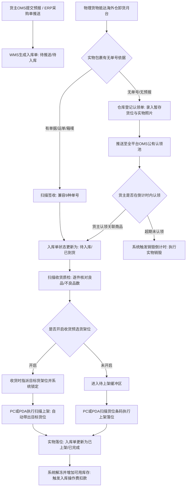

# 极风海外仓系统知识库：第二分册 入库业务全流程与异常处理

## 一、模块定位与使用场景

入库业务是海外仓接收卖家备货商品、FBA退货或电商平台退件，完成实物核对、质量检查、入库落位并释放系统可用库存的全过程。极风系统支持货主OMS预报、ERP对接推送、无预报到仓公有认领、跨仓退货及大宗按托入库等多元场景。

---

## 二、入库作业流水线流程图

---

## 三、单据状态机与核心流转规则

### 3.1 入库单全生命周期状态机

| 状态名称 | 状态代码 | 触发前置动作 | 系统后置业务行为与库存/财务影响 | 来源编号 |
| :--- | :--- | :--- | :--- | :--- |
| 草稿 | DRAFT | OMS货主创建中尚未提交 | 仅货主端可见，不占用任何资源，不推送到WMS | [JF-OMS-IN-001] |
| 待入库 | PENDING | 货主OMS提交预报或WMS扫描签收 | 单据正式进入WMS入库作业池；若货主余额不足，推单时直接拦截阻断 | [JF-IN-016] [JF-FAQ-FEE-001] |
| 收货中 | RECEIVING | WMS点击收货或PDA扫描开始收货 | 允许部分收货；锁定收货工位；实收数量进入[待检/在途暂存状态] | [JF-IN-016] |
| 部分上架 | PARTIAL_PUTAWAY | 批次中部分商品已落位货架 | 已上架的SKU立即释放为[可用物理库存]，未上架部分继续等待 | [JF-PDA-018] |
| 已完成 | COMPLETED | 全部预报商品完成上架确认 | 单据归档关闭；系统自动触发入库卸货费、贴标费等入库操作费结算 | [JF-IN-016] [JF-FEE-008] |
| 已取消 | CANCELLED | 货主在货物到仓前撤销预报 | 释放预报数据；已产生费用若有退回按策略冲正 | [JF-OMS-IN-001] |

### 3.2 9种单号兼容扫描签收机制
【手册事实】为解决海外仓一线人员面对错综复杂的头程物流单据、常常因找不对单号而卡壳的痛点，极风WMS提供了9种单据条码兼容识别能力。仓库人员在签收界面或使用PDA签收时，扫描以下任意一种条码均可自动匹配目标入库单：
1. 入库单号（WMS/OMS系统生成的标准单号）；
2. 逆向退货单号；
3. 尾程运单号/物流跟踪号；
4. 外部跨境ERP单号（店小秘、通途等）；
5. 电商平台订单号（Amazon、Temu、TikTok等）；
6. 包装箱唛条码；
7. 跨境直邮单号；
8. 头程提单号；
9. 卖家自定义箱号。
扫描签收成功后，单据状态由已推送自动推进为【待入库】。来源：[JF-IN-016]《标准入库流程》（https://help.jfwms.com/zh_CN/doc-article/7106660525-）。

---

## 四、扫描收货、质检与预选货架机制

### 4.1 扫描收货预选货架机制
1. **业务背景**：传统海外仓上架时由搬运员随意寻找空位堆放，导致库位规划失控。极风WMS上线了“扫描收货预选货架”功能。
2. **操作路径**：WMS仓库端 > 设置 > 业务设置 > 入库流程设置 > 开启【扫描收货预选货架】。
3. **系统联动行为**：
   - 收货人在PC端或PDA执行收货登记时，界面强制要求为当前到货商品（SKU、箱或托盘）预选指定的目标货架位；
   - 预选完成后，系统在后台对该货位进行预锁定；
   - 后续一线搬运员使用PDA扫描上架时，系统自动带出该预选货位，无需人工再选货位或现场判断，直接确认数量即可完成落位。若现场临时出现库位被占满，支持在PDA上手动扫新货位覆盖预选位。来源：[JF-IN-003]《扫描收货预选货架位》（https://help.jfwms.com/zh_CN/doc-article/7114270731-）。

### 4.2 PDA按托盘与按箱批量收货
针对大宗海运集装箱柜货到仓，极风支持按托盘（Pallet）批量签收收货：
- 系统支持在OMS预报时关联托盘编号与箱数；
- 货物到仓后，PDA直接扫描托盘条码，一键批量签收整托包含的数十箱货物，极大削减单件扫描耗时。来源：[JF-IN-009]《海外仓按托入库批量签收收货》（https://help.jfwms.com/zh_CN/doc-article/7108920603-）。

### 4.3 自定义入库流程设置
极风WMS支持高度可配置的入库流水线节点，在【入库流程设置】中，管理员可根据业务场景自由开启或跳过节点：
- 是否启用强制签收节点；
- 是否启用质检拍照环节；
- 是否开启扫描收货预选货架；
- 是否开启整箱直接上架免拆检。来源：[JF-IN-015]《自定义入库流程设置》（https://help.jfwms.com/zh_CN/doc-article/7106650525-）。

---

## 五、无预报到仓公有认领与销毁机制

### 5.1 认领池运作机制
在海外仓实际运营中，常有大量买家退货件或卖家国内发货忘记推单的货件抵仓，无法关联任何系统单据。极风系统建立了双端协同的公共认领池体系：
1. **WMS端登记发布**：仓库在【入库 > 认领管理】中点击创建，扫描录入包裹运单号、指派暂存货架位、记录到仓时间，设置认领时效天数，并使用高拍仪或手机拍摄包裹实物及面单照片提交确认。
2. **全平台OMS广播**：系统自动将该认领单推送到所有卖家的OMS端【认领中心】。货主发现属于自己的丢失包裹后，点击认领并在线关联自己的SKU和创建补充入库单。
3. **仓库审核履约**：货主认领后，单据流转至WMS待处理；仓库核对实物无误后，将包裹由暂存位移库上架至该货主专属货位，入库单正式转入标准收货上架流。来源：[JF-IN-013]《仓库入库认领流程》（https://help.jfwms.com/zh_CN/doc-article/7106630525-）、[JF-OMS-RET-001]《退货入库认领流程》。

### 5.2 销毁倒计时控制
【手册事实】为防止无主包裹长期滞留仓库月台挤占宝贵地坪，极风系统提供了销毁时效控制：
- 认领单创建时设有时效天数；
- 认领列表中以红色标签动态显示【销毁倒计时X天】；
- 倒计时清零后，系统解锁销毁权限，仓库主管可在线点击“确认销毁”，单据转入已销毁，现场实物直接报废处置，闭环清除无主库存。来源：[JF-IN-006]《销毁倒计时》（https://help.jfwms.com/zh_CN/doc-article/7114170730-）。

---

## 六、逆向退货与跨仓退回

1. **海外仓退货入库流程**：货主在OMS提交退货单，输入退货运单号与原出库单号；买家退件抵仓后，WMS执行退货验货。验货支持开启摄像头全程录像，记录商品外观开箱细节；经质检分类为良品入库、待换标重新包装或废品报废。来源：[JF-IN-014]《极风WMS仓库端退货入库流程》、[JF-OUT-010]《极风WMS退货视频录制功能》。
2. **物流商跨仓就近退回（A仓出B仓入）**：针对同一服务商拥有多仓网络的场景，支持尾程物流商因派送失败退件时，直接将货物就近退回到服务商的邻近仓库（如从洛杉矶A仓出库发运，派送失败就近退回新泽西B仓）。系统支持在B仓扫描退货运单直接建立退货入库单，完成落位入库，解决了跨大区甚至跨国长途退运成本高昂的难题。来源：[JF-IN-005]《物流商退货支持A仓出B仓入》（https://help.jfwms.com/zh_CN/doc-article/7114200731-）。
