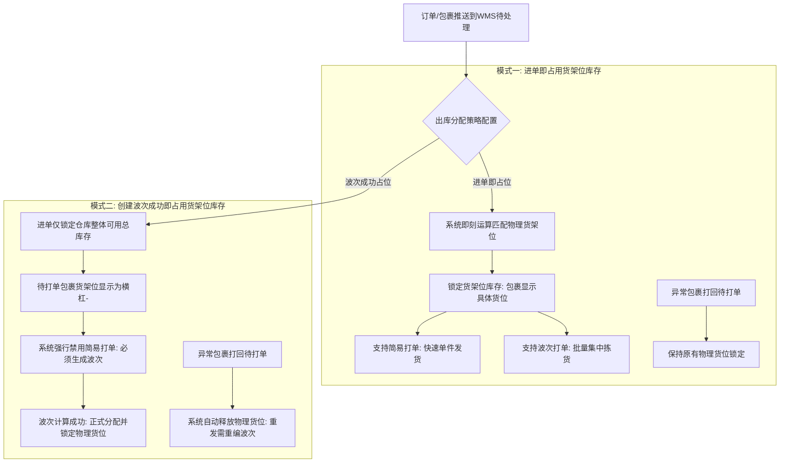

# 极风海外仓系统知识库：第四分册 出库作业与波次策略全景

## 一、模块定位与使用场景

出库作业是海外仓运作吞吐量最大、时效要求最高的核心业务链，涵盖订单接收、库存分配锁定、波次聚合、拣货、二次分拣、复核包装、自动称重、面单打印、发货交运及异常处理全生命周期。极风系统在出库策略上具备行业独特的进单占位与波次占位双轨制，并深度融合了移动无纸化与视频全证据链。

---

## 二、出库分配策略双轨制与硬性切换门槛

出库库存分配模式决定了系统在哪个时间节点计算并锁定物理货架位库存，是极风WMS架构设计的关键特色：

### 2.1 两种策略技术参数深度比对

| 评估维度 | 模式一：WMS进单即占用货架位库存 | 模式二：WMS包裹创建波次成功即占用货架位库存 |
| :--- | :--- | :--- |
| 适用业务模式 | SKU高度集中、以单品单件为主、要求极速出单的小包代发仓 | 管理复杂的中大件仓库、多品多件占比高、单量巨大且要求货位动态优化的海外仓 |
| 货位占用时机 | 订单进入WMS待打单环节即刻锁定具体货位 | 仅在生成波次成功运算出最优动线时锁定具体货位 |
| 待打单货位展示 | 明确展示具体的排架层位编号（如A-01-02-01） | 统一显示为横杠【-】，波次生成后才回填货位 |
| 打单作业支持 | 同时支持[简易打单]与[波次打单] | **【强硬约束】系统强制关闭简易打单，统一必须走波次打单** |
| 开启切换前置门槛 | 待打单出库单数量必须在2500单以下方可切换回此模式 | **【强硬约束】只有待打单包裹数量为0时方可开启此功能，必要时需停止仓库接单** |
| 异常打回释放表现 | 异常包裹打回待打单时，原有货架位锁定保持不释放 | 异常包裹打回待打单时，系统自动释放物理货位库存，重新发货需重新编入波次 |

*证据来源：[JF-OUT-007]《出库分配策略》（https://help.jfwms.com/zh_CN/doc-article/7109130605-）手册事实原文："只有待打单包裹数量为0的时候可开启【WMS包裹创建波次成功即占用货架位库存】...不支持简易打单，统一由波次打单处理...需要保证待打单的出库单数量在2500单以下可切换【WMS进单即占用货架位库存】"。*

---

## 三、特殊订单类型支持

极风系统针对全球不同区域电商特色，原生支持多元化特殊订单类型：
1. **COD（货到付款）订单**：OMS端创建出库单时可选择COD模式，录入代收币种与代收金额（如墨西哥比索、阿联酋迪拉姆、沙特里亚尔）。WMS打单时匹配尾程物流商的COD渠道，面单自动打印COD金额标识，妥投后回传代收账单。来源：[JF-OMS-OUT-001]《OMS如何创建提交COD类型订单》。
2. **自提订单（Pick-up）**：针对线下大件或本地采购自提业务，OMS可选择自提。仓库完成备货打包后免去申请运单号与打印尾程面单，直接标记待自提，交接给客户并确认出库。来源：[JF-OMS-OUT-004]《OMS如何创建提交自提类型订单》。
3. **Wildberries平台FBS供货单组包**：WB平台出库具有供货单（Supply）组包逻辑。OMS先在待处理中完成组包，推送WMS作业。WMS发货后，系统自动在WB平台将组包单标发至配送中，标发成功后获取供货二维码供仓库打印张贴。来源：[JF-OUT-002]《WMS处理wildberries组包订单流程》。

---

## 四、波次管理、拣货车与爆款批量验货

### 4.1 波次生成规则与聚合算法
系统支持多维度自由组合生成波次：
- 按单品单件（爆款波次）：订单内仅包含1个SKU且件数为1，适合快速通道；
- 按单品多件：订单内仅包含1个SKU但件数大于1；
- 按多品多件：订单包含多个不同SKU，适合拣货车边拣边分；
- 按尾程物流渠道与发货时效：将相同渠道或相同截单时间的订单聚为一组；
- 2026年最新升级：生成波次时，支持在列表界面直接勾选【SKU*数量】快捷筛选，大幅简化大促配单耗时。来源：[JF-PDA-025]、公告[2026-09-18]。

### 4.2 PDA拣货车无纸化边拣边分
1. **拣货车定义**：在WMS【设置 > 业务设置 > 拣货车管理】中创建拣货车，为每个拣货车配置槽位框号（如A1至A24框），并打印张贴拣货车条码。来源：[JF-PDA-022]《创建拣货车并打印标签》。
2. **波次绑定与动线拣货**：
   - 拣货员使用PDA扫描拣货车条码绑定波次；
   - 系统将波次内不同包裹自动分配至各个框号；
   - PDA按照S型最佳拣货动线指引货位与SKU；
   - 拣货员到达货位，扫描货位条码与SKU条码后，PDA语音并高亮提示“放入05号框”，实现边拣选边分播，彻底免除二次播种工位。来源：[JF-PDA-007]《PDA拣货车配置：使用PDA拣货车拣货》。
3. **PDA波次现场拆分**：针对大型波次或拣货车容量超出时，支持拣货员在PDA现场点击波次拆分，将剩余未拣任务拆成新波次由同伴协作完成。来源：[JF-PDA-006]《PDA拣货——波次拆分》。

### 4.3 2026最新特性：爆款波次批量验货
针对大促期间由成百上千单完全相同的单品单件构成的爆款波次：
- 传统流程要求每件商品必须逐一扫描条码复核；
- 极风系统在2026年9月上线了【爆款波次批量验货】能力：波次识别为同品后，支持一键批量通过验货，直接进入批量面单打印与批量扣库发运，极大释放出库工位通行能力。来源：公告[2026-09-16]《【NEW】爆款波次支持批量验货，提升出库作业效率》。

---

## 五、扫描包装称重一体与面单水印升级

### 5.1 包装称重一体直连与超重预警
1. 打包与称重合并操作：在扫描包装工位打开称重功能，连接串口电子秤。打包人员扫描分拣框号或商品条码打印面单，将封箱后的包裹置于电子秤台，系统自动捕获实重数据录入包裹信息。
2. 异常干预与渠道超重拦截：
   - 若包裹重量超出物流渠道最大重量上限，系统直接报错拦截禁止打单，防止物流商高额罚款；
   - 支持设置理论重量预警区间，超差时弹出警示窗，支持授权人员手动修正称重。来源：[JF-OUT-005]《波次扫描包装称重》、[JF-FAQ-LOG-003]。

### 5.2 2026最新特性：面单水印按仓独立配置与双列排版
海外仓经常面临尾程面单下方空白处需要打印配货明细的问题：
1. **按仓库独立模板**：同一物流渠道在不同海外仓支持设置不同的水印排版样式。
2. **双列排版高密度容纳**：表格水印支持双列排版，商品明细与总件数独立控制；面单纵向缩放最低支持降至60%，一张面单可打印更多SKU，彻底消灭额外配货纸张消耗。
3. **订单备注水印**：支持将货主在OMS录入的特殊买家订单备注提取并打印在面单水印上。来源：公告[2026-09-22]《【NEW】面单水印升级｜可按仓库单独设置模板，一张面单可打印更多SKU！》。

### 5.3 扫描包装与退货验收全程视频录像
针对跨境电商常见的买家客诉少发、漏发、破损诈骗及物流索赔纠纷：
- 扫描包装台配备工业摄像头，点击开启后随扫描操作自动录制高清视频片段；
- 系统自动抓取封箱、贴标及称重动作，视频生成后自动关联运单号上传云端；
- 客诉发生时，货主或仓库可在系统内一键调取该包裹打包全程视频，作为向平台申诉的权威证据。来源：[JF-OUT-001]、[JF-OUT-009]、[JF-OUT-010]。

---

## 六、发货交运与交运状态强制校验

### 6.1 PDA扫描出库与拍照存证
打包贴标完毕后，交接给尾程司机装车环节：
- 搬运员使用PDA扫描包裹运单号执行出库确认，系统正式从货架位扣除物理库存；
- PDA支持调用后置摄像头现场对整板货物或交接单据拍照留证，存入系统归档。来源：[JF-PDA-003]《PDA发货》、[JF-PDA-024]《如何使用PDA扫描包裹确定发货出库并拍照记录》。

### 6.2 手动标记已交运与前置校验拦截
针对海外本地卡车司机提货后未及时在手持机回传交运扫描信号的现实场景：
- WMS一件代发出库板块的【待发货】和【已发货】状态均支持手动点击“标记已交运”；
- **【核心拦截约束】**：系统执行严格的前置校验——若订单无运单号、交运状态当前已为“已交运”、或为“未交运（平台取消）”，系统禁止操作并硬性禁用已交运按钮。来源：[JF-OUT-003]《WMS一件代发出库板块支持手动标记已交运》（https://help.jfwms.com/zh_CN/doc-article/7113940727-）。
