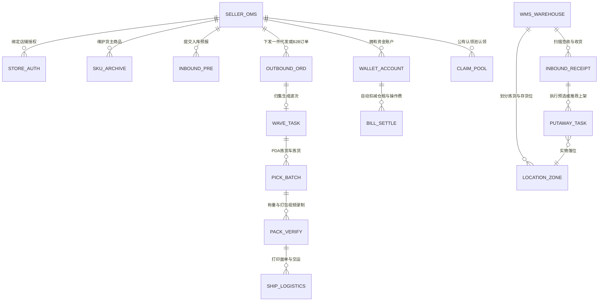
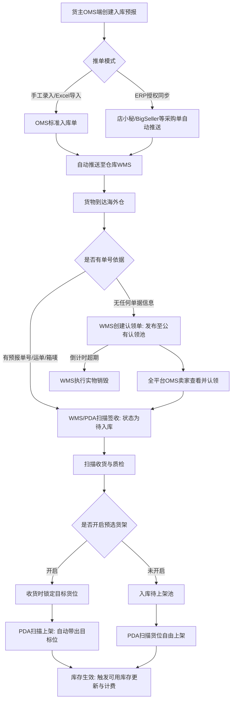

# 极风海外仓系统（WMS+OMS）全业务能力与规则知识库

## 一、系统全景与双端协同架构

### 1.1 系统定位与核心实体关系
极风系统是面向跨境电商海外仓场景的端到端管理平台，由OMS（货主端）与WMS（仓库作业端）双端构成。货主在OMS端管理商品档案、店铺授权、创建入库预报、下发代发出库单、监控库存预警、充值账户及核对扣费明细；仓库人员在WMS端与PDA端执行货位规划、签收、收货质检、上架、库存移位、波次生成、拣货、扫描复核包装、称重、出库交运及计费管理。

### 1.2 证据与判断说明
1. 【手册事实】系统采用双端协同，货主通过OMS下单，仓库通过WMS履约。来源：[JF-OMS-BEG-002]《新卖家必知》（https://help.jfwms.com/zh_CN/doc-article/7106450523-）、[JF-FAQ-OMS-002]《OMS是什么？有哪些功能呢？》（https://help.jfwms.com/zh_CN/doc-article/7106360523-）。
2. 【归纳】OMS与WMS在数据交互上采取强状态校验与资金预扣机制：订单推送时若货主余额不足，系统直接拦截阻断；推单进入WMS后，根据库存分布分别流转至待打单或待移货状态。
3. 【分析建议】双端架构权责清晰，货主无法直接干预仓库库位分配，保障了海外仓实操作业的专业性和安全性。

---

## 二、基础数据与仓库建模

### 2.1 仓库与库位模型
1. 【手册事实】库位分为拣货位与存货位。如果商品库存仅存放在存货位，订单推送进入WMS后会停留在“待移货”状态，必须先通过移库任务将商品移入拣货位，订单才会自动流转至待生成波次或待打单。来源：[JF-FAQ-OUT-006]《为什么订单推送过来在待移货而不是在待生成待打单》（https://help.jfwms.com/zh_CN/doc-article/7113930727-）。
2. 【手册事实】货架位支持混放规则配置，支持拣货位、存货位、暂存位、异常位、箱货位等多种库位类型。来源：[JF-BAS-005]《货架位管理》、[JF-INV-001]《PDA箱移货》。

### 2.2 商品档案与组合SKU
1. 【手册事实】商品档案支持在OMS端创建或通过ERP直接推送，涵盖品名、SKU、条形码、申报价值、长宽高、净重毛重及序列号管理标记。来源：[JF-OMS-SKU-004]《手动创建产品》（https://help.jfwms.com/zh_CN/doc-article/7106510523-）。
2. 【手册事实】组合SKU（Bundle）机制：货主在店小秘或OMS端创建组合SKU并设置子SKU配对比例（如1个礼品套组包含2个A商品与1个B商品）。当店铺产生组合订单推送到极风时，WMS自动按配对关系解构并分别扣减子商品的库存。来源：[JF-FAQ-OUT-001]《Bigseller的组合SKU订单如何推送到极风》（https://help.jfwms.com/zh_CN/doc-article/7113730714-）、[JF-FAQ-ERP-002]《如何在店小秘创建组合SKU并且配对订单推送到三方仓》（https://help.jfwms.com/zh_CN/doc-article/7113720714-）。
3. 【手册事实】商品删除约束：已被单据引用或存在历史库存流水的商品SKU，系统禁止直接删除，仅支持修改或标记停用。来源：[JF-FAQ-SKU-003]《已经推送到极风的商品sku可以删除吗》（https://help.jfwms.com/zh_CN/doc-article/7113820717-）。
4. 【手册事实】OMS库存预警：货主可在OMS端为指定SKU配置安全库存下限，当仓库可用库存低于预警值时，系统高亮提示并发送补货提醒。来源：[JF-OMS-SKU-001]《OMS库存预警提醒功能》（https://help.jfwms.com/zh_CN/doc-article/7114670817-）。

---

## 三、入库业务与双端流转机制

### 3.1 入库业务流转图

### 3.2 双端核心入库单据与规则
1. 【手册事实】入库单预报方式：货主在OMS端支持按SKU预报、自定义箱号预报，以及通过店小秘、4Seller、BigSeller等ERP直接一键推送入库单。来源：[JF-OMS-IN-001]《OMS如何创建入库单推送到海外仓WMS》（https://help.jfwms.com/zh_CN/doc-article/7106570525-）、[JF-OMS-IN-008]《通过店小秘ERP推送入库单》（https://help.jfwms.com/zh_CN/doc-article/7106600525-）。
2. 【手册事实】兼容性极强的签收：WMS支持使用9种单据条码进行签收（入库单号、退货单号、运单号、ERP单号、平台订单号、箱唛、直邮单号、头程单号、自定义箱号）。来源：[JF-IN-016]《标准入库流程》（https://help.jfwms.com/zh_CN/doc-article/7106660525-）。
3. 【手册事实】扫描收货预选货架：管理员开启预选功能后，收货人员在收货录入数量的同时必须预选货架位，上架作业时PDA自动加载该预选位，强制规范库内堆放。来源：[JF-IN-003]《扫描收货预选货架位》（https://help.jfwms.com/zh_CN/doc-article/7114270731-）。
4. 【手册事实】无预报包裹公有认领：对于到仓无预报货件，WMS登记暂存位与照片发布至公共认领池，所有OMS货主均可查看认领；认领超时支持一键销毁。来源：[JF-IN-013]《仓库入库认领流程》（https://help.jfwms.com/zh_CN/doc-article/7106630525-）、[JF-OMS-RET-001]《退货入库认领流程》（https://help.jfwms.com/zh_CN/doc-article/7106610525-）。

---

## 四、出库作业与波次策略体系

### 4.1 出库分配策略双轨制
极风WMS提供两种截然不同的出库库存锁定模式：

| 分配模式 | 适用业务场景 | 库位库存占用时点 | 打单模式支持 | 切换前置条件与系统约束 | 异常回退表现 |
| :--- | :--- | :--- | :--- | :--- | :--- |
| WMS进单即占用货架位库存 | 单件小包仓、SKU集中、作业链路短的常规海外仓 | 订单进入WMS并推进至待打单时，即刻计算并锁定具体物理货架位库存 | 支持简易打单与波次打单 | 需要保证待打单的出库单数量在2500单以下方可切换至此模式 | 异常打回待打单时，仍保持货架位占用 |
| WMS包裹创建波次成功即占用货架位库存 | 管理复杂的中大件仓库、多品多件仓及高单量仓库 | 进单时仅锁定仓库整体库存，待打单状态包裹货架位展示为“-”；只有创建波次成功后才分配并锁定具体货位 | 仅支持波次打单，不支持简易打单 | 必须待打单包裹数量为0时方可开启此功能，必要时需停止仓库接单后再开启 | 异常包裹打回待打单时，系统自动释放货架位库存，重新发货需重新生成波次 |

*证据来源：[JF-OUT-007]《出库分配策略》（https://help.jfwms.com/zh_CN/doc-article/7109130605-）。*

### 4.2 特殊订单类型处理
1. 【手册事实】COD（货到付款）订单：OMS端支持创建COD出库单，指定代收金额与币种，系统打单时匹配尾程物流商的COD渠道，面单自动打印COD金额标识。来源：[JF-OMS-OUT-001]《OMS如何创建提交COD类型订单》（https://help.jfwms.com/zh_CN/doc-article/7115400921-）。
2. 【手册事实】自提订单（Pick-up）：OMS端支持勾选自提，仓库备货打包完成后不生成尾程面单，直接标记待自提，交接给客户并确认出库。来源：[JF-OMS-OUT-004]《OMS如何创建提交自提类型订单》（https://help.jfwms.com/zh_CN/doc-article/7115380918-）。
3. 【手册事实】Wildberries组包订单：WB平台FBS出库具有供货单组包逻辑。OMS完成组包后推WMS，WMS流转至“已发货”后，系统回传平台标发并获取供货二维码供仓库打印。来源：[JF-OUT-002]《WMS处理wildberries组包订单流程》（https://help.jfwms.com/zh_CN/doc-article/7115070907-）。

### 4.3 波次、包装称重与视频录制
1. 【手册事实】PDA拣货车边拣边分：支持定义拣货车编号与分拣框槽位，波次指引路径拣货，直接分入指定框位，大波次支持现场拆分。来源：[JF-PDA-006]、[JF-PDA-007]、[JF-OUT-004]。
2. 【手册事实】包装称重一体直连：扫描包装与称重合并处理，直连电子秤自动获取重量并校验超重预警；超出物流渠道限重时系统报错拦截。来源：[JF-OUT-005]、[JF-FAQ-LOG-003]。
3. 【手册事实】全程视频录像证据链：扫描包装与退货验收页面内嵌摄像头录像功能，视频关联单号自动存证上传，提供少件丢件抗辩铁证。来源：[JF-OUT-001]、[JF-OUT-009]、[JF-OUT-010]。

4. 【手册事实】爆款波次批量验货：针对单品单件等大促爆款波次，系统支持开启[批量验货]，支持整批商品一键快速复核出库，无需逐件扫描商品条形码，极大缓解出库工位拥堵。来源：系统公告[2026-09-16]《【NEW】爆款波次支持批量验货，提升出库作业效率》。
5. 【手册事实】面单水印多仓独立配置与双列排版：面单水印支持按仓库单独配置模板；表格水印支持双列排版，面单纵向缩放最低可降至60%，单张面单可打印更多SKU明细，免去额外打印配货单。来源：系统公告[2026-09-22]《【NEW】面单水印升级｜可按仓库单独设置模板，一张面单可打印更多SKU！》。

6. 【手册事实】手动标记已交运：针对司机提货不及时扫码场景，待发货和已发货页面均支持手动标记已交运。来源：[JF-OUT-003]。

---

## 五、库内运营与库存管理

### 5.1 箱库存与高效移库
1. 【手册事实】整箱管理（Box Inventory）：系统支持将整箱货物作为独立库存对象管控，记录箱号、箱规与SKU，移库时扫描箱号即可完成整箱搬移，免除拆箱扫描。来源：[JF-INV-001]、[JF-PDA-020]。
2. 【手册事实】多货位快速移库与容错：PDA快速移货支持选择多个货架作为来源批量合并移入新货位；在数量不一致时若移出与移入数匹配支持强制完成移库。来源：[JF-PDA-002]、[JF-PDA-009]。

### 5.2 盘点与缺货标记
1. 【手册事实】动态与静态盘点：支持按货位、按SKU盘点，支持盲盘模式，盘点结果生成盘盈盘亏单审核调账。来源：[JF-PDA-008]、[JF-PDA-010]。
2. 【手册事实】订单精准标记缺货：出库单列表与波次中支持精准标记缺货SKU与数量，并将订单踢入异常池，PDA端标记缺货按钮进行防误触缩小设计。来源：[JF-OUT-008]、[JF-PDA-026]。

---

### 5.3 库龄双轨制与库内热力图（2026最新特性）
1. 【手册事实】真实库龄与财务库龄双轨制：系统彻底区分两套库龄模型。[真实库龄]跟随仓库实际物理出库与移库作业，记录货位实物的物理停留时间；[财务库龄]按严格的FIFO（先进先出）逻辑推算，专门用于阶梯仓租及相关增值费用的核算对账，彻底消除物理出库非绝对FIFO与货主财务结算要求FIFO之间的对账矛盾。来源：系统公告[2026-09-18]《【NEW】PDA收货签单可拍照留证，便于核验与问题追溯》。
2. 【手册事实】库内热力图与货位智能诊断：系统根据出库波次频次与库位三维坐标，自动生成[库内热力图]，直观呈现各货区动销冷热分布，智能推荐将高频动销商品从远端存货位迁移至近端黄金拣货位，缩短拣货员步行距离，提升仓内整体作业效率。来源：系统公告[2026-09-11]《【NEW】新增库内热力图！智能诊断优化货位，提升拣货效率》。

## 六、增值业务与专项场景

### 6.1 B2B备货中转大宗业务
1. 【手册事实】B2B全链路能力：涵盖大宗到货、按箱出库、装箱清单批量Excel导入、托盘标签打印、自定义箱号跨单据复用及扫码换标计费。来源：[JF-B2B-001]~[JF-B2B-007]、[JF-OMS-B2B-001]~[JF-OMS-B2B-004]。

### 6.2 FBA退货换标业务
1. 【手册事实】FBA退货处理闭环：支持FBA移除单认领、现场开箱质检拍照、换贴FNSKU条码、重新装箱装托并推回亚马逊FBA仓库。来源：[JF-FBA-001]~[JF-FBA-004]、[JF-OMS-FBA-001]~[JF-OMS-FBA-006]。

### 6.3 代理仓与产品分销
1. 【手册事实】代理仓多仓协同：支持建立虚拟代理仓，实现主仓与代理仓之间的商品配对、箱库存配对、物流渠道配对及自有面单推送。来源：[JF-AGT-001]~[JF-AGT-008]。
2. 【手册事实】货盘分销机制：货主可开放货盘，划定专享库存，配置分销商等级定价，分销退货支持自动退还采购成本货款。来源：[JF-DIS-001]~[JF-DIS-005]、[JF-OMS-DIS-001]~[JF-OMS-DIS-003]。

---

## 七、费用计费与资金安全

### 7.1 计费模式与费项构成
1. 【手册事实】阶梯仓租方案：支持按立方米/天或托盘/天计费，支持配置免租期与分段阶梯累加费率。来源：[JF-FEE-007]。
2. 【手册事实】操作费与杂费：支持出库费（首件加续件阶梯）、入库卸货费、贴标费、销毁费及纸箱耗材成本结算。来源：[JF-FEE-008]、[JF-FEE-009]。

### 7.2 资金拦截与凭证互信
1. 【手册事实】推单余额拦截：货主OMS账户余额不足时，推送入库单或出库订单直接提示“余额不足”并阻断推单。来源：[JF-FAQ-FEE-001]《推送入库单、订单的时候显示余额不足是什么原因》（https://help.jfwms.com/zh_CN/doc-article/7113870724-）。
2. 【手册事实】垫付扣费凭据强制上传：WMS端发起扣费申请必须上传发票或支付截图附件，自动同步OMS货主端审核，打回支持补传。来源：[JF-FEE-001]。

---

## 八、系统集成与生态连接

### 8.1 跨境ERP授权全矩阵
极风系统具备极强的ERP集成生态，原生支持主流跨境ERP：
- 欧美与全球：店小秘、赛狐、4Seller、吉客云、聚水潭、易仓、通途；
- 东南亚与拉美本土：BigSeller（东南亚）、UpSeller（拉美）、Hiseller；
- 跨境卖家：妙手ERP、领星ERP。
支持双向订单拉取、发货状态回传、面单抓取及库存推送。来源：[JF-OMS-ERP-001]~[JF-OMS-ERP-013]、[JF-ERP-001]~[JF-ERP-011]。

### 8.2 平台官方仓认证与物流商对接
1. 【手册事实】TEMU官方仓：提供TEMU官方认证仓资料申请、线上自测流程与时效API联调验证规范。来源：[JF-OFC-001]、[JF-OFC-002]。
2. 【手册事实】尾程物流渠道：原生对接佐川急便、USPS、FedEx、UPS、顺丰等尾程服务商，支持分区引擎自动匹配，支持线下渠道子母件发货。来源：[JF-LOG-001]~[JF-LOG-036]。

---

## 九、系统边界与硬性约束清单

1. 【手册事实】出库占用切换硬性约束：切换为“波次成功占位”必须待打单包裹数为0且关闭简易打单；切换为“进单占位”必须待打单出库单在2500单以下。来源：[JF-OUT-007]。
2. 【手册事实】库位类型阻断波次：若商品仅存放在存货位，订单推送后自动停留在待移货状态，禁止直接打单，必须先移库至拣货位。来源：[JF-FAQ-OUT-006]。
3. 【手册事实】商品删除硬性拦截：已发生单据业务或历史库存流水的SKU，系统禁止物理删除。来源：[JF-FAQ-SKU-003]。
4. 【手册事实】子母件发货渠道限制：子母件发货仅支持线下物流渠道，线上API渠道在已检查手册中未找到子母件支持说明。来源：[JF-LOG-001]。
5. 【手册事实】交运标记约束：无单号、交运状态已为“已交运”或“未交运（平台取消）”的订单，系统禁用手动标记已交运功能。来源：[JF-OUT-003]。
