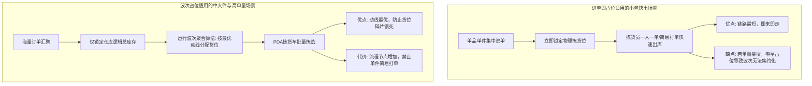

# 极风海外仓系统知识库：附录A 海外仓业务设计底层心智与决策权衡

> [!NOTE] 导读
> 本文档面向新手海外仓产品经理，从第一性原理揭示极风系统各项看似复杂甚至反直觉的功能设计背后，海外仓真实物理现场、商业博弈与成本控制的底层逻辑，帮助产品经理知其然并知其所以然，在系统自研与复刻时避免掉入典型陷阱。

---

## 一、双端权责隔离：为什么OMS严禁向货主暴露物理货架位

### 1.1 表面设计现象
货主在OMS端查看库存、提交预报或查询订单详情时，系统仅展示【可用库存】、【锁定库存】、【在途库存】等宏观数据；在包裹详情中，货位信息要么不展示，要么在未生成波次时显示为横杠【-】。来源：[JF-OUT-007]。

### 1.2 底层业务博弈与权衡
1. **防止货主越权干预仓储作业**：物理货架位是海外仓的核心私域资源。一旦货主能看到具体货位，货主就会产生“为什么把我的货放在高层存货位而不放在底层快速拣货位”、“为什么A货主和我的货混放”等无休止的干预与客诉。
2. **保障仓库调度弹性**：海外仓内部为了动线优化，每天会发生大量的动态理货、合流与移库。如果货主端单据绑定了具体货位，仓库每次库内移位都必须向货主端同步，系统数据耦合度将呈指数级爆炸，且极易引发双端数据不一致。
3. **商业机密保护**：海外仓属于多货主共享仓，隐藏具体货位能够避免不同竞品卖家通过货位编号推算仓内其他商家的存货规模与周转速度。

---

## 二、出库分配双轨制：为什么进单占位与波次占位不可兼得

### 2.1 表面设计现象
系统提供【进单即占位】与【波次成功即占位】两种模式，且模式切换设置了严苛限制：开启波次占位必须待打单数量为0并关闭简易打单；切回进单占位必须待打单小于2500单。来源：[JF-OUT-007]。

### 2.2 底层物理动线与吞吐量权衡

### 2.3 为什么切换时必须待打单为0
如果系统中存在成千上万单已经按“进单占位”锁定了具体货架位的包裹，管理员强行开启“波次占位”，后台库存引擎将同时面对两套锁定算法：一套已经在数据库行锁层面锁定了具体货位，另一套试图把全仓库存作为公海重新按波次计算。这会导致同一货位库存被二次重叠锁定，引发大面积超卖。因此系统强制要求清空待打单（或暂停接单），将物理货位全部释放后才允许切换架构。

---

## 三、库龄双轨制：兼顾一线搬运人效与财务对账公平

### 3.1 表面设计现象
极风系统在2026年9月新增了[财务库龄]与[真实库龄]双轨数据模型。来源：公告第3条。

### 3.2 底层利益冲突与解法
1. **一线搬运工的诉求**：海外仓由于面积大、货架高，搬运工人推着叉车作业时，出于人效最大化本能，永远倾向于先搬运货架外层或靠近过道的新入库货物。如果强推物理实物绝对FIFO，工人必须把外层新货全部搬下来，掏出最里面的老批次，再把新货搬回去，作业人效将暴跌70%以上。
2. **货主商家的诉求**：货主与海外仓签署的协议中，仓租普遍享有免租期（如前30天免租），超过免租期后按阶梯收取高额超期费。如果按照实物出库计算库龄，因为工人都拿新货，导致货主的老批次在账面上一直未出库，最终被收取天价滞纳仓租，货主必定拒绝支付并提起诉讼。
3. **双轨制架构的破局**：
   - 实物层面走[真实库龄]：工人随便搬哪个货位，系统只记录实物客观存在时间；
   - 财务层面走[财务库龄]：系统不管工人实际搬了哪件，在账面上自动按严格的虚拟FIFO冲销最早入库批次的库龄，货主享受合法的免租期，双方利益彻底脱钩解绑。

---

## 四、公有认领池：无主死货成本与货主隐私的现实妥协

### 4.1 表面设计现象
WMS登记无预报或无单号包裹后，直接推送到全平台所有OMS货主端公开认领，并配置超时销毁倒计时。来源：[JF-IN-013]、[JF-IN-006]。

### 4.2 为什么必须做成全网公海池
海外仓每天收到大量退货包裹，许多包裹由于面单磨损、退货条码缺失，仓库根本无法判断是哪位卖家的货物。
1. **传统一对一核对的死穴**：仓库如果挨个向几十上百个货主客服发邮件询问，沟通成本极高，平均需要数周时间。
2. **死货占地成本**：海外仓租金极其昂贵，无主货物在月台地坪堆积超过一个月，其产生的仓储机会成本往往超过商品实物价值本身。
3. **全网广播与倒计时的威慑**：公开认领池让真正丢货的卖家能够主动按单号和照片认领；同时销毁倒计时从系统层面赋予了海外仓合法处置过期无主货物的权力，倒逼货主及时处理异常。

---

## 五、存货位阻断打单：强制平库周转与安全防碰撞

### 5.1 表面设计现象
商品如果仅存放在存货位，订单进入WMS会自动停留在【待移货】状态，系统禁止直接生成波次或打单出库。来源：[JF-FAQ-OUT-006]。

### 5.2 为什么有货却不让直接拣货
1. **防止动线与设备交叉冲突**：存货位通常设立在9米以上的高位立体货架，需要专用高位前移式叉车作业；拣货位设立在1至2层的地面平库，由拣货员推手推车步行作业。如果允许订单直接从存货位分配出库，拣货员将频繁穿梭在高位叉车作业通道中，极易发生重大叉车砸伤或货箱倾覆事故。
2. **批量平库周转优先**：通过系统强行阻断，促使仓库管理人员执行“大批量叉车下架至拣货区（补货），地面人员快速零星分拣”的标准仓储分工，避免高位叉车为了单个包裹频繁升降，保证作业效率。

---

## 六、垫付扣费强凭证互信：跨境跨币种结算纠纷终结者

### 6.1 表面设计现象
仓库发起扣费申请时，系统强行要求上传发票或银行水单附件，并实时同步OMS审核，打回可补传。来源：[JF-FEE-001]。

### 6.2 为什么不能直接扣除货主余额
海外仓存在大量突发的线下垫付费用（如目的国海关关税、提柜超期堆存费Demurrage、偏远地区派送附加费）。国内货主对海外实际发生情况存在天然的信息不对称。如果仓库端可以直接扣除货主钱包资金，货主往往会质疑仓库乱收费而发起拒付或直接停用系统。引入附件凭据在线互信机制，将举证责任前置，是多货主SaaS平台建立客户信任的立足之本。

---

## 七、商品发生业务后绝对禁止删除：审计与税务红线

### 7.1 表面设计现象
已被单据引用或产生过历史库存流水的商品SKU，系统禁止物理删除，仅允许修改非主键信息或停用。来源：[JF-FAQ-SKU-003]。

### 7.2 为什么不能提供物理删除
在电商仓储系统中，出入库记录、盘点记录、运费账单均强依赖SKU作为外键关联。一旦允许物理删除，历史报表在SQL联表查询时将出现大量的NULL空指针异常；更为致命的是，在欧美等海关和税务审计严格的地区，单据缺失对应商品档案将直接构成涉嫌走私或逃税的法律风险。因此数据只能做逻辑冻结，严禁物理抹除。
