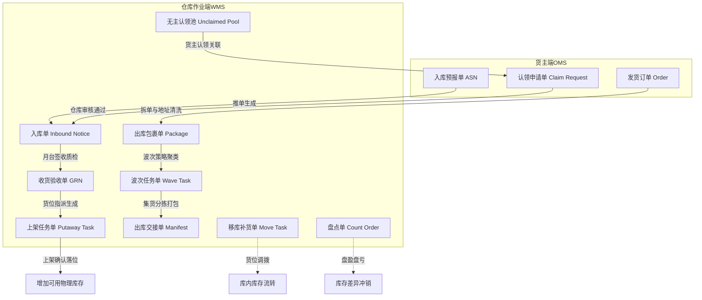
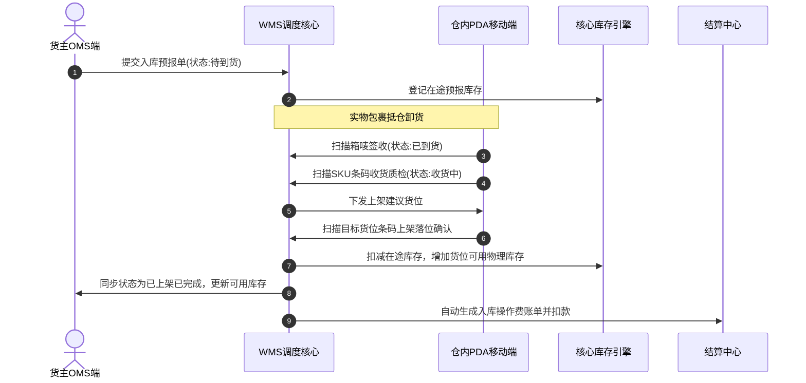
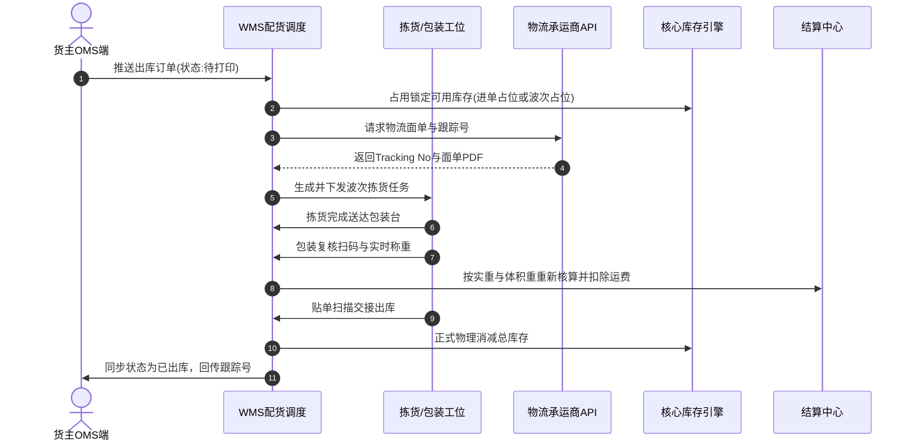

# 极风海外仓系统知识库：附录B 全流程单据字段级字典与跨端状态映射表

> [!NOTE] 导读
> 本文档面向海外仓产品经理与研发团队，提供符合极风业务实践的PRD级数据字典与跨端状态映射规范。内容包含海外仓8大核心单据的表头与表体字段级定义、数据类型、枚举值取值以及OMS、WMS与外部ERP的三端状态同轴流转矩阵，可直接作为产品原型设计与数据库建表的基线依据。

---

## 一、海外仓核心单据模型与血缘关系全景

海外仓业务涉及货主端OMS与仓储作业端WMS之间高频的数据交互与单据生命周期分裂。入库侧以预报单驱动生成收货单与上架单；出库侧以货主订单聚合生成WMS包裹单，再进一步按库内作业策略拆解聚合成波次任务单。

---

## 二、核心单据字段级数据字典

### 2.1 入库预报单

入库预报单记录货主发往海外仓的备货批次信息、集装箱柜号、装载形式以及明细SKU和数量。

#### 表头字段：入库预报单主表 inbound_notice_header

| 字段名称 | 英文键名 | 数据类型 | 必填 | 枚举值/格式示例 | 业务含义与校验规则 |
| :--- | :--- | :--- | :--- | :--- | :--- |
| 入库单ID | inbound_id | bigint | Y | 自增主键 | 数据库主键 |
| 入库单号 | inbound_no | varchar(32) | Y | IN202609240001 | 系统全局唯一业务单号，规则IN+年月日+流水 |
| 客户ID | customer_id | bigint | Y | 10028 | 对应OMS货主账号体系，建立多租户数据隔离 |
| 仓库代码 | warehouse_code | varchar(32) | Y | US-LA-01 | 目的实体物理海外仓代码 |
| 业务类型 | biz_type | varchar(16) | Y | STANDARD/FBA_RETURN/TRANSFER | STANDARD常规备货，FBA_RETURN退货入库，TRANSFER调拨入库 |
| 装载形式 | load_type | varchar(16) | Y | CONTAINER/PALLET/BOX | CONTAINER大柜海运，PALLET整托盘，BOX散箱快递 |
| 箱唛/柜号 | tracking_container_no | varchar(64) | N | MSCU1234567 / FBA18XYZ | 头程海运集装箱柜号或头程物流追踪单号 |
| 预计到仓时间 | eta_time | datetime | N | 2026-09-30 18:00:00 | 货主填报的预计抵港或抵仓时间 |
| 报关形式 | customs_type | varchar(16) | N | DDP/DDU/NONE | 涉及垫付税费时关联计费依据 |
| 单据状态 | status | varchar(16) | Y | 详见跨端映射表 | 入库全流程状态机编码 |
| 预报箱数 | planned_carton_qty | int | Y | 500 | 货主填报的外箱总件数，收货点箱时对照依据 |
| 预报总SKU数 | planned_sku_count | int | Y | 12 | 预报单内涵盖的不同SKU种类数 |
| 预报总数量 | planned_total_qty | int | Y | 5000 | 预报商品实物总件数，必须等于表体数量总和 |
| 实际收货总数 | actual_total_qty | int | N | 4980 | 仓库实物收货质检良品与不良品累计总数 |
| 上架完成总数 | putaway_total_qty | int | N | 4980 | 实际落位到具体货架位的商品总数 |
| 备注 | remark | varchar(255) | N | 特殊大促备货 | 货主端备注说明 |
| 创建时间 | created_at | datetime | Y | 2026-09-24 10:00:00 | 记录生成时间 |
| 更新时间 | updated_at | datetime | Y | 2026-09-24 10:00:00 | 状态与数量最新更新时间 |

#### 表体字段：入库预报单明细表 inbound_notice_item

| 字段名称 | 英文键名 | 数据类型 | 必填 | 枚举值/格式示例 | 业务含义与校验规则 |
| :--- | :--- | :--- | :--- | :--- | :--- |
| 明细ID | item_id | bigint | Y | 自增主键 | 数据库主键 |
| 入库单号 | inbound_no | varchar(32) | Y | IN202609240001 | 关联主表业务单号 |
| 箱号/唛头 | carton_no | varchar(64) | N | C-001 | 外箱唯一编号，按箱收货时校验 |
| 商品SKU | sku_code | varchar(64) | Y | PROD-A001 | 商品全局唯一编码，必须存在于客户商品库 |
| 商品条码 | barcode | varchar(64) | Y | 690123456789 | 实物外包装条形码，PDA扫码核验依据 |
| 申报单价 | unit_declared_value | decimal(10,2) | N | 25.50 | 报关与货损货差理赔基准单价 |
| 币种 | currency | varchar(8) | Y | USD/EUR/CNY | 申报单价币种，默认与仓库所在国法定币种一致 |
| 预报数量 | planned_qty | int | Y | 100 | 该SKU预报件数，必须大于0 |
| 收货良品数 | actual_good_qty | int | N | 98 | 质检合格可售品数量 |
| 收货不良品数 | actual_defect_qty | int | N | 2 | 质检破损/变形/污损不可售数量 |
| 上架良品数 | putaway_good_qty | int | N | 98 | 实际完成良品货架落位的数量 |
| 生产批次号 | batch_no | varchar(32) | N | B20260901 | 批次追溯码，开启批次管理时必填 |
| 有效期截止日 | expiration_date | date | N | 2027-09-01 | 食品/化妆品效期，超期根据策略阻断收货 |

---

### 2.2 仓库收货验收单

仓库在卸货月台扫描箱唛或单据完成物理实物到仓，质检人员拆箱核对SKU、清点良品与残次品后生成的实物凭证。

#### 表头字段：收货单主表 goods_receipt_header

| 字段名称 | 英文键名 | 数据类型 | 必填 | 枚举值/格式示例 | 业务含义与校验规则 |
| :--- | :--- | :--- | :--- | :--- | :--- |
| 收货单ID | receipt_id | bigint | Y | 自增主键 | 数据库主键 |
| 收货单号 | receipt_no | varchar(32) | Y | GRN202609240001 | 规则GRN+年月日+流水 |
| 入库单号 | inbound_no | varchar(32) | Y | IN202609240001 | 关联的预报单号 |
| 客户ID | customer_id | bigint | Y | 10028 | 货主ID |
| 仓库代码 | warehouse_code | varchar(32) | Y | US-LA-01 | 仓库代码 |
| 收货月台 | dock_code | varchar(32) | N | DOCK-03 | 物理卸货月台编号 |
| 收货工位 | workstation_code | varchar(32) | N | WS-RC-01 | 检验台工位编号 |
| 收货方式 | receipt_mode | varchar(16) | Y | PIECE/CARTON/PALLET | PIECE按件点货，CARTON按箱盲扫，PALLET整托收货 |
| 收货人ID | receiver_user_id | bigint | Y | 2001 | 现场操作员用户ID |
| 是否异常单 | is_abnormal | tinyint(1) | Y | 0/1 | 0正常，1存在超送/短少/破损，触发通知货主 |
| 异常处理方式 | abnormal_action | varchar(16) | N | PENDING/ACCEPT/DESTROY | PENDING待货主审核，ACCEPT强制入库，DESTROY销毁 |
| 收货开始时间 | start_time | datetime | Y | 2026-09-24 14:00:00 | PDA首件扫码时间 |
| 收货结束时间 | end_time | datetime | N | 2026-09-24 15:30:00 | 收货确认时间，用于人效工时统计 |

#### 表体字段：收货单明细表 goods_receipt_item

| 字段名称 | 英文键名 | 数据类型 | 必填 | 枚举值/格式示例 | 业务含义与校验规则 |
| :--- | :--- | :--- | :--- | :--- | :--- |
| 收货明细ID | receipt_item_id | bigint | Y | 自增主键 | 数据库主键 |
| 收货单号 | receipt_no | varchar(32) | Y | GRN202609240001 | 关联收货单主表 |
| 商品SKU | sku_code | varchar(64) | Y | PROD-A001 | 实物商品编码 |
| 实收良品数 | good_qty | int | Y | 98 | 本次验收合格数量 |
| 实收不良品数 | defect_qty | int | Y | 2 | 本次验收残次数量 |
| 不良品原因 | defect_reason | varchar(32) | N | BROKEN/WET/BARCODE_MISS | BROKEN破损，WET水浸受潮，BARCODE_MISS无条码 |
| 不良品照片 | defect_image_urls | text | N | ["https://cdn.../1.jpg"] | 现场拍照取证图片URL数组，同步推送OMS货主端 |
| 暂存货位代码 | staging_location_code | varchar(32) | Y | STAGE-IN-01 | 收货暂存区货位，收货完成货物物理停放处 |
| 预指派货位代码 | target_location_code | varchar(32) | N | A-01-01-02 | 若开启收货预选货位配置，系统生成的建议上架货位 |

---

### 2.3 库内上架任务单

指示上架作业人员将收货暂存区或入库月台的实物搬运并扫描落位至指定物理存储货位的任务凭据。

#### 表头与表体组合字段：上架任务明细表 putaway_task

| 字段名称 | 英文键名 | 数据类型 | 必填 | 枚举值/格式示例 | 业务含义与校验规则 |
| :--- | :--- | :--- | :--- | :--- | :--- |
| 上架任务ID | task_id | bigint | Y | 自增主键 | 数据库主键 |
| 上架单号 | putaway_no | varchar(32) | Y | PUT202609240001 | 规则PUT+年月日+流水 |
| 入库单号 | inbound_no | varchar(32) | Y | IN202609240001 | 来源入库单 |
| 收货单号 | receipt_no | varchar(32) | Y | GRN202609240001 | 来源收货单 |
| 客户ID | customer_id | bigint | Y | 10028 | 货主ID |
| 商品SKU | sku_code | varchar(64) | Y | PROD-A001 | 待上架SKU |
| 品质类型 | quality_type | varchar(16) | Y | GOOD/DEFECTIVE | GOOD良品，DEFECTIVE残次品 |
| 待上架数量 | plan_qty | int | Y | 98 | 任务生成时的计划上架数量 |
| 实际上架数量 | actual_qty | int | N | 98 | 实际落位数量，必须等于待上架数量方可完工 |
| 来源暂存货位 | source_location_code | varchar(32) | Y | STAGE-IN-01 | 取货物理位置 |
| 建议目标货位 | suggested_location_code | varchar(32) | Y | A-01-01-02 | 算法分配的货位：优先已有库存拣货位，其次空闲存货位 |
| 实际上架货位 | actual_location_code | varchar(32) | N | A-01-01-02 | PDA最终落位扫描货位，允许作业员在规则内改位 |
| 任务状态 | status | varchar(16) | Y | PENDING/DOING/COMPLETED | PENDING待分配，DOING进行中，COMPLETED已完成 |
| 作业员ID | operator_id | bigint | N | 3005 | 领取并执行上架任务的人员ID |
| 完成时间 | completed_at | datetime | N | 2026-09-24 16:00:00 | 上架落位确认时间，此时触发库存引擎解冻增量 |

---

### 2.4 出库发货单与包裹单

记录买家购买需求、收货人地址、指定物流承运商及分拣包装详情的单据。极风系统以包裹为出库实体推进。

#### 表头字段：出库包裹主表 outbound_package_header

| 字段名称 | 英文键名 | 数据类型 | 必填 | 枚举值/格式示例 | 业务含义与校验规则 |
| :--- | :--- | :--- | :--- | :--- | :--- |
| 包裹ID | package_id | bigint | Y | 自增主键 | 数据库主键 |
| 包裹单号 | package_no | varchar(32) | Y | PKG202609240001 | 规则PKG+年月日+流水 |
| 客户订单号 | customer_order_no | varchar(64) | Y | ORD-20260924-99 | 货主OMS原始订单号 |
| 平台交易单号 | platform_order_no | varchar(64) | N | 114-1234567-8901234 | 电商平台原始单号，如Amazon/Shopify |
| 客户ID | customer_id | bigint | Y | 10028 | 货主ID |
| 仓库代码 | warehouse_code | varchar(32) | Y | US-LA-01 | 发货物理仓库 |
| 包裹类型 | package_type | varchar(16) | Y | SINGLE_ITEM/MULTI_ITEM | SINGLE_ITEM一单一件，MULTI_ITEM一单一多件 |
| 物流渠道代码 | channel_code | varchar(32) | Y | USPS-GROUND-ADV | 指定物流渠道编码，必须在仓库生效渠道内 |
| 物流跟踪号 | tracking_no | varchar(64) | N | 9400100000000000000000 | 尾程承运商快递运单号，打单时API获取 |
| 运单面单URL | label_url | varchar(255) | N | https://cdn.../label.pdf | 快递面单PDF或PNG文件访问路径 |
| 收件人姓名 | recipient_name | varchar(64) | Y | John Doe | 姓名脱敏展示，打单解密 |
| 收件人电话 | recipient_phone | varchar(32) | N | +1-202-555-0199 | 电话号码 |
| 收件人地址1 | address_line1 | varchar(128) | Y | 123 Main Street | 街道地址第一行 |
| 收件人地址2 | address_line2 | varchar(128) | N | Apt 4B | 门牌/公寓号 |
| 目的城市 | city | varchar(64) | Y | Los Angeles | 城市 |
| 目的省/州 | state_or_province | varchar(32) | Y | CA | 两位或三位标准州代码 |
| 邮政编码 | postal_code | varchar(16) | Y | 90001 | 必须符合目的国邮编正则表达式规范 |
| 目的国家 | country_code | varchar(8) | Y | US | ISO-3166二字码 |
| 理论预估重量 | theoretical_weight_g | int | Y | 450 | 单位克，根据商品资料净重与包材重量相加得出 |
| 实际称重重量 | actual_weight_g | int | N | 465 | 单位克，复核包装台电子秤实时称重数据 |
| 长宽高 | dimensions_cm | varchar(32) | N | 20*15*10 | 单位厘米，自动计算体积重：长*宽*高/分体积比 |
| 单据状态 | status | varchar(16) | Y | 详见跨端映射表 | 包裹生命周期状态 |
| 波次单号 | wave_no | varchar(32) | N | WV202609240001 | 归属的拣货波次单号 |
| 拦截标识 | is_hold | tinyint(1) | Y | 0/1 | 0正常，1被货主或风控拦截暂停作业 |
| 拦截原因 | hold_reason | varchar(64) | N | ADDRESS_INVALID/MANUAL | 拦截触发类型说明 |
| 创建时间 | created_at | datetime | Y | 2026-09-24 10:30:00 | 包裹创建落库时间 |

#### 表体字段：出库包裹明细表 outbound_package_item

| 字段名称 | 英文键名 | 数据类型 | 必填 | 枚举值/格式示例 | 业务含义与校验规则 |
| :--- | :--- | :--- | :--- | :--- | :--- |
| 包裹明细ID | item_id | bigint | Y | 自增主键 | 数据库主键 |
| 包裹单号 | package_no | varchar(32) | Y | PKG202609240001 | 关联包裹主表 |
| 商品SKU | sku_code | varchar(64) | Y | PROD-A001 | 销售商品SKU |
| 商品条码 | barcode | varchar(64) | Y | 690123456789 | 包装条码，复核扫码核验依据 |
| 订购数量 | order_qty | int | Y | 2 | 货主订单要求发货件数 |
| 分配物理货位 | assigned_location_code | varchar(32) | N | A-01-01-01 | 波次算路引擎分配的扣减货位 |
| 拣货拣出数量 | picked_qty | int | N | 2 | PDA实际拣货扫描下架件数 |
| 复核装箱数量 | packed_qty | int | N | 2 | 包装台复核扫码装箱件数 |
| 扣减库存批次号 | lot_no | varchar(32) | N | LOT20260901 | 满足先进先出扣减的批次编码 |

---

### 2.5 出库波次作业单

系统将同属性、相近动线的包裹聚合生成的大批量集中拣货任务单。

#### 表头与明细字段：波次主表与任务明细 wave_task

| 字段名称 | 英文键名 | 数据类型 | 必填 | 枚举值/格式示例 | 业务含义与校验规则 |
| :--- | :--- | :--- | :--- | :--- | :--- |
| 波次ID | wave_id | bigint | Y | 自增主键 | 数据库主键 |
| 波次单号 | wave_no | varchar(32) | Y | WV202609240001 | 规则WV+年月日+流水 |
| 仓库代码 | warehouse_code | varchar(32) | Y | US-LA-01 | 仓库代码 |
| 波次类型 | wave_type | varchar(16) | Y | SINGLE/MULTI/BULK | SINGLE单件一品单，MULTI一大多件单，BULKB2B大单 |
| 包含包裹总数 | package_count | int | Y | 50 | 本波次聚合的包裹单数量 |
| 包含总SKU数 | sku_count | int | Y | 8 | 本波次需拣选的SKU类别数 |
| 包含总件数 | total_item_qty | int | Y | 120 | 本波次需拣选的商品实物总件数 |
| 拣货模式 | picking_mode | varchar(16) | Y | SEED/ORDER | SEED播种墙二次分拨，ORDER边拣边分车 |
| 绑定周转箱号 | tote_code | varchar(32) | N | TOTE-008 | PDA绑定的物理拣货框或拣货车编号 |
| 拣货员ID | picker_user_id | bigint | N | 3008 | 领取该波次任务的库内操作人员 |
| 波次状态 | status | varchar(16) | Y | CREATED/PICKING/PICKED/PACKED/CANCELLED | CREATED待拣货，PICKING拣货中，PICKED已拣完，PACKED已打包复核，CANCELLED已取消 |
| 缺货标识 | is_shortage | tinyint(1) | Y | 0/1 | 0正常，1波次中途发现物理货位少货 |
| 生成时间 | created_at | datetime | Y | 2026-09-24 11:00:00 | 波次生成时间 |

---

### 2.6 库内移库与补货单

记录将库存从一个物理货位移动到另一个物理货位的作业指令，用于日常理货、高位存货位向地面拣货位补货以及残次品隔离转移。

#### 表头与明细字段：移库任务表 inventory_move_task

| 字段名称 | 英文键名 | 数据类型 | 必填 | 枚举值/格式示例 | 业务含义与校验规则 |
| :--- | :--- | :--- | :--- | :--- | :--- |
| 任务ID | move_id | bigint | Y | 自增主键 | 数据库主键 |
| 移库单号 | move_no | varchar(32) | Y | MV202609240001 | 规则MV+年月日+流水 |
| 仓库代码 | warehouse_code | varchar(32) | Y | US-LA-01 | 仓库代码 |
| 触发类型 | trigger_type | varchar(16) | Y | REPLENISH/TIDY/DEFECT | REPLENISH拣货位缺货触发，TIDY理货合并，DEFECT良残转移 |
| 客户ID | customer_id | bigint | Y | 10028 | 货主ID |
| 商品SKU | sku_code | varchar(64) | Y | PROD-A001 | 移动商品SKU |
| 移动品质 | quality_type | varchar(16) | Y | GOOD/DEFECTIVE | 移动库存的良残属性 |
| 计划移动数量 | plan_qty | int | Y | 50 | 计划搬运数量 |
| 实际移动数量 | actual_qty | int | N | 50 | 实际完成搬运并落位数量 |
| 起始货位代码 | source_location_code | varchar(32) | Y | B-04-02-01 | 原物理存储货位 |
| 目标货位代码 | target_location_code | varchar(32) | Y | A-01-01-01 | 目的物理存储货位 |
| 移库人ID | operator_id | bigint | N | 3002 | 执行人ID |
| 任务状态 | status | varchar(16) | Y | PENDING/DOING/COMPLETED/CANCELLED | PENDING待执行，DOING执行中，COMPLETED已完成，CANCELLED已作废 |

---

### 2.7 库内盘点任务单

海外仓定期或动态核对账面库存与实际货架物理库存差异并出具调整凭据的单据。

#### 表头与明细字段：盘点单明细表 cycle_count_task

| 字段名称 | 英文键名 | 数据类型 | 必填 | 枚举值/格式示例 | 业务含义与校验规则 |
| :--- | :--- | :--- | :--- | :--- | :--- |
| 盘点明细ID | count_item_id | bigint | Y | 自增主键 | 数据库主键 |
| 盘点单号 | count_no | varchar(32) | Y | CC202609240001 | 规则CC+年月日+流水 |
| 仓库代码 | warehouse_code | varchar(32) | Y | US-LA-01 | 仓库代码 |
| 盘点类型 | count_type | varchar(16) | Y | LOCATION/SKU/DYNAMIC | LOCATION按货位静态盘点，SKU按商品，DYNAMIC动碰盘点 |
| 盘点模式 | count_mode | varchar(16) | Y | BLIND/VISIBLE | BLIND盲盘（不显示账面数），VISIBLE明盘 |
| 盘点货位代码 | location_code | varchar(32) | Y | A-01-01-01 | 被盘点货位 |
| 客户ID | customer_id | bigint | Y | 10028 | 归属货主 |
| 商品SKU | sku_code | varchar(64) | Y | PROD-A001 | 盘点SKU |
| 系统账面数量 | system_qty | int | Y | 100 | 盘点单生成瞬时系统锁定的静态库存数 |
| 实盘初盘数量 | first_count_qty | int | N | 98 | 第一次扫码录入实物数量 |
| 实盘复盘数量 | recount_qty | int | N | 98 | 存在初盘差异时复盘人员二次核对数量 |
| 差异数量 | diff_qty | int | N | -2 | 最终实盘数减去系统账面数，负数为盘亏，正数为盘盈 |
| 差异审批状态 | audit_status | varchar(16) | Y | PENDING/APPROVED/REJECTED | PENDING待审批，APPROVED主管审批通过平账，REJECTED驳回重盘 |
| 盘点状态 | status | varchar(16) | Y | PENDING/DOING/COMPLETED | 任务流转状态 |

---

### 2.8 异常认领与死货处置单

针对海外仓卸货月台收到的无面单、无预报包裹，在公有池登记并倒计时销毁处理的单据。

#### 表头与明细字段：异常认领单 unclaimed_package_item

| 字段名称 | 英文键名 | 数据类型 | 必填 | 枚举值/格式示例 | 业务含义与校验规则 |
| :--- | :--- | :--- | :--- | :--- | :--- |
| 认领记录ID | claim_id | bigint | Y | 自增主键 | 数据库主键 |
| 认领编号 | claim_no | varchar(32) | Y | CLM202609240001 | 规则CLM+年月日+流水 |
| 仓库代码 | warehouse_code | varchar(32) | Y | US-LA-01 | 异常件所在物理仓库 |
| 来源运单号 | express_tracking_no | varchar(64) | N | 1Z9999999999999999 | 外箱残缺快递单号，若无则填UNKNOWN |
| 暂存货位代码 | temp_location_code | varchar(32) | Y | TEMP-CLAIM-01 | 物理滞留暂存货架编号 |
| 现场实物照片 | item_photos | text | Y | ["https://cdn.../pkg.jpg"] | 现场拍摄的外观、条码或内物照片 |
| 认领状态 | status | varchar(16) | Y | UNCLAIMED/AUDITING/CLAIMED/EXPIRED/DESTROYED | UNCLAIMED待认领，AUDITING认领待审，CLAIMED已认领转入库，EXPIRED已过期，DESTROYED已销毁 |
| 登记时间 | created_at | datetime | Y | 2026-09-24 12:00:00 | 仓库登记落库时间 |
| 销毁倒计时截止时间 | expire_at | datetime | Y | 2026-10-24 12:00:00 | 系统根据仓库配置规则计算截止时间，默认30天 |
| 认领客户ID | claim_customer_id | bigint | N | 10028 | 发起认领申请的货主ID |
| 认领关联SKU | claim_sku_code | varchar(64) | N | PROD-A001 | 货主认领时申报的真实商品SKU |
| 认领通过时间 | claim_approved_at | datetime | N | 2026-09-25 09:30:00 | 仓库管理员审核确认时间 |

---

## 三、跨端状态机同轴映射与转换矩阵

海外仓系统涉及OMS货主端、WMS仓储作业端与外部ERP三方协作。三端面向的业务角色不同，因此状态表达的颗粒度与业务重心存在差异。以下矩阵明确三端单据状态同轴映射关系。

### 3.1 入库全生命周期跨端状态同轴映射矩阵

| OMS货主端状态 | WMS仓库端状态 | 外部ERP状态 | 触发业务行为 | 仓库现场作业动作 | 库存与财务引擎后置变化 |
| :--- | :--- | :--- | :--- | :--- | :--- |
| 草稿 DRAFT | 无数据 | 草稿 / 未同步 | 货主录入预报信息尚未保存提交 | 仓库无感 | 无影响 |
| 待到货 PENDING | 待入库 PENDING | 已推单 / 在途中 | 货主点击提交，且货主资金账户满足垫付拦截阈值 | 卸货月台排队等待排班 | 生成入库在途虚拟预报数；冻结预报操作费预算（若开启） |
| 已到货 ARRIVED | 已签收 ARRIVED | 已到港 / 到仓中 | 仓库一线人员扫描外箱唛头或快递单号完成签收 | 卸货月台卸车并搬运至理货区 | 在途状态转入到仓暂存状态，仍不可售 |
| 收货质检中 RECEIVING | 收货中 RECEIVING | 质检中 / 验货中 | 仓库点击开始收货或PDA扫描首件商品条码 | 拆箱、逐件扫码、核验商品条码、良残分拣 | 记录现场良品与不良品数，生成不良品拍照存证 |
| 部分上架 PARTIAL_PUT | 部分上架 PARTIAL_PUT | 部分上架 / 部分可售 | 部分批次商品由叉车或步行人员落位物理存储架 | PDA扫描货架条码执行落位确认 | 落位的良品SKU立即释放为物理可用库存，OMS立即同步可售 |
| 已完成 COMPLETED | 已上架 COMPLETED | 入库完成 / 全部上架 | 全部预报商品完成上架落位并点击完成验收 | 清理收货暂存位，归档纸质收货凭单 | 扣减在途预报数，全面增加实际可用物理库存；系统自动扣缴入库卸货费与贴标费 |
| 异常处理中 ABNORMAL | 待确认 ABNORMAL | 入库异常 / 差异待审 | 收货出现短少、严重超送或大面积外包装受损 | 货物转移至异常阻隔货位，拍照上传系统 | 差异数量进入锁定隔离状态，系统向货主OMS推送差异待认领通知 |
| 已取消 CANCELLED | 已取消 CANCELLED | 已取消 | 货主在货物到仓前撤销预报，或长期未到货自动作废 | 仓库终止预报单追踪 | 释放对应的在途虚拟预报数 |

---

### 3.2 出库包裹全生命周期跨端状态同轴映射矩阵

| OMS货主端状态 | WMS仓库端状态 | 外部ERP状态 | 触发业务行为 | 仓库现场作业动作 | 库存与运费财务后置变化 |
| :--- | :--- | :--- | :--- | :--- | :--- |
| 待审核 PENDING | 无数据 / 待同步 | 待审核 | 货主平台出单推送至OMS | 仓库无感 | 系统进行地址清洗与黑名单库核验 |
| 待打单 READY_PRINT | 待打印 READY_PRINT | 待配货 / 待拣选 | OMS订单审核通过推入WMS，且库存充足 | 订单进入WMS配货调度池 | 锁定物理货位库存或全仓逻辑库存，扣减可用库存 |
| 拣货中 PICKING | 波次处理中 PICKING | 配货中 / 拣货中 | 系统运算生成波次单，作业员PDA领单 | 拣货员推车按推荐动线逐一扫码下架商品 | 锁定库存转移为波次移动在途锁定 |
| 已拣货 PICKED | 已拣货 PICKED | 已配货 / 待复核 | 波次单全部商品扫码下架完成 | 拣货框推送到包装作业台或播种墙 | 确认物理出库货位扣减完毕 |
| 打包称重中 PACKING | 打包中 PACKING | 包装中 | 包装员扫描包裹明细，调用电子秤与体积仪 | 扫码复核商品、装箱气泡填充、封箱并称重 | 获取实际物理重量与体积，重新比对运费阶梯 |
| 已出库 SHIPPED | 已发货 SHIPPED | 已发货 / 运送中 | 打印并贴覆尾程面单，扫描交接运单出库 | 贴单、按渠道分拣入各承运商集运笼车，扫描交接单交接装车 | 扣除在库物理总账库存；正式结算扣除尾程运费；回传跟踪号至平台 |
| 拦截待处理 HOLD | 拦截中 HOLD | 拦截中 / 异常暂停 | 货主撤单、改地址或买家退款发起紧急拦截 | PDA或包装台亮红灯强行阻断作业并鸣笛报警 | 冻结单据流转，禁止打印面单与发车交接 |
| 已作废 CANCELLED | 已取消 CANCELLED | 已作废 / 已关闭 | 仓库成功截停包裹并确认撤销发货 | 质检拆包，走逆向还库上架流程归还原货位 | 释放预扣库存并冲正可用库存；作废物流面单向承运商申请退费 |

---

### 3.3 异常认领全生命周期跨端状态同轴映射矩阵

| 认领状态阶段 | 仓库现场物理状态 | WMS异常池状态 | OMS公海认领池状态 | 权限与倒计时逻辑 |
| :--- | :--- | :--- | :--- | :--- |
| 到仓无主阶段 | 货物堆放月台，无面单或无预报 | 新建异常记录，状态为UNCLAIMED | 全平台所有货主OMS可查，展示模糊单号与实物照片 | 触发30天销毁倒计时，任何货主均可点击认领 |
| 货主认领申请阶段 | 实物移至暂存异常货位锁定 | 状态更新为AUDITING待审核 | 该记录在其他货主端置灰，申请货主填报真实SKU | 仓库收到弹窗待审任务，倒计时暂停 |
| 仓库审核通过阶段 | 仓管现场开箱二次核对SKU一致 | 状态变为CLAIMED已认领，自动转入库单 | OMS提示认领成功，生成正式关联入库单 | 倒计时归零消除，转入标准收货上架流水线 |
| 仓库审核驳回阶段 | 实物判定与货主声明物料不一致 | 驳回申请，状态重置为UNCLAIMED | 记录重新向全平台OMS公开，附带驳回原因说明 | 销毁倒计时恢复继续跑秒 |
| 倒计时超时阶段 | 货物滞留超过30天未被任何货主认领 | 状态变为EXPIRED已过期 | OMS公海池下架不可见 | 系统自动将包裹移入待销毁清单 |
| 物理销毁阶段 | 仓管执行废品丢弃或变卖，拍照留档 | 状态更新为DESTROYED已销毁，归档闭环 | 记录移入历史已销毁档案 | 单据生命周期终结，货权归海外仓合法所有 |

---

## 四、单据数据校验与业务防错规则

为确保海外仓系统数据一致性与作业安全，单据层必须严格遵循以下校验规范：

1. **业务单号幂等性约束**：
   - 外部业务单号在同一个客户ID下必须全局唯一，防止ERP断网重发导致重复创建出入库包裹。
   - 物流跟踪号在同一个仓库体系下6个月内严禁重复绑定，防止旧面单串单误发。
2. **重量与体积强非零校验**：
   - 商品资料中的净重与外箱三边尺寸必须大于0；若货主未录入，出库打单前必须阻断并强制弹出补全界面。
   - 包装复核称重重量若与理论重量偏差超过配置阈值（如±15%），包装台自动锁死贴标机，强制要求班长二次开箱验视。
3. **地址字段合规性强校验**：
   - 美国地址邮编必须符合5位数字或5位加4位扩展码规范（如90001或90001-1234）。
   - 州代码必须校验ISO标准两位字母（如CA、NY、TX），防止买家手工输入全称引发承运商API解析失败。
   - 严禁包含特殊表情符号与不可识别的全角Unicode字符。
4. **单据状态回滚单向性原则**：
   - 凡是已经产生实物位移的单据（如已上架落位、已打单装箱），严禁通过直接修改数据库单据状态实现回退。必须通过生成逆向红冲单据（如退仓单、还库单、盘亏单）进行对冲流转，确保操作日志与财务审计链条完整闭环。
