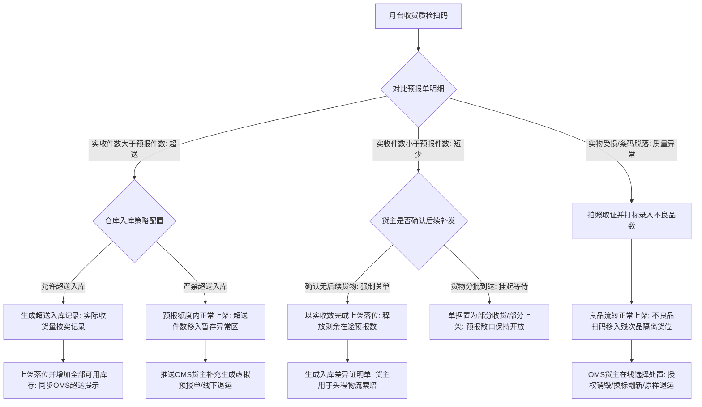
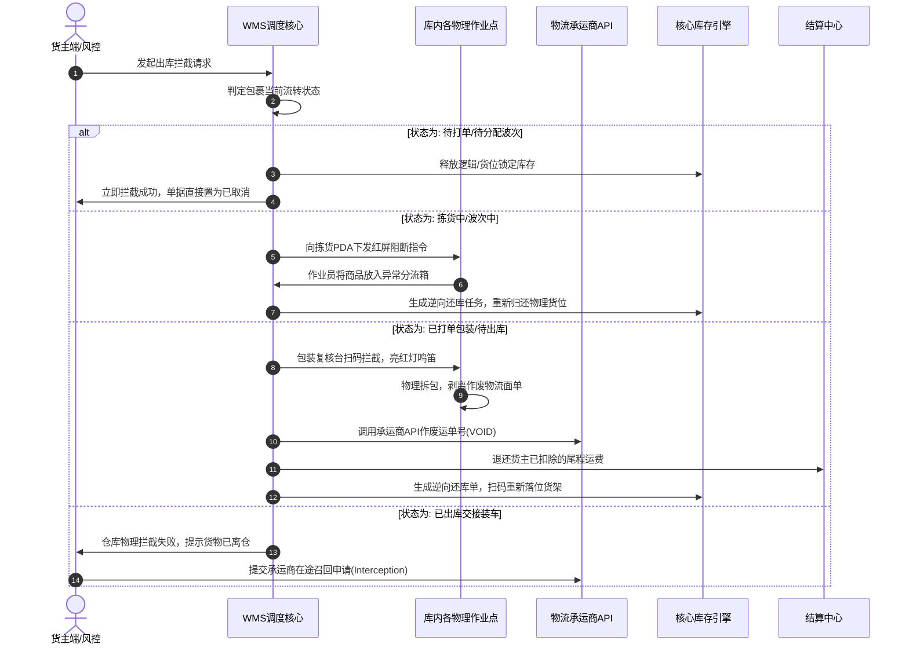
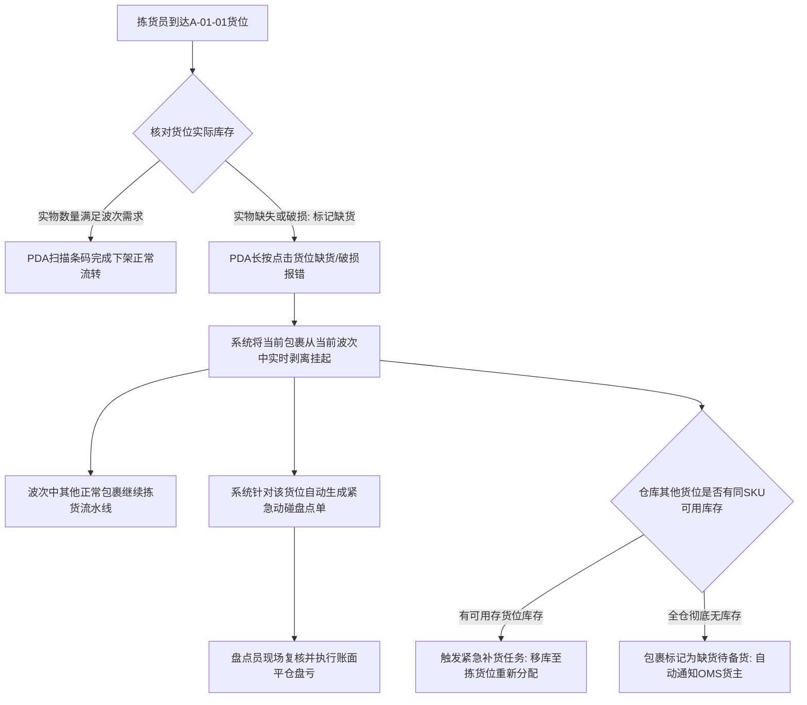

# 极风海外仓系统知识库：附录C 异常业务分支与逆向回滚闭环矩阵

> [!NOTE] 导读
> 海外仓正向标准流程往往仅占系统逻辑的60%，其余40%的复杂度全部集中在异常分支与逆向回滚链路上。若系统缺乏完整的异常防错与逆向闭环机制，一线作业将陷入人工反复对账、实物与账面脱节、库存大面积虚增超卖的混乱泥潭。本文档针对新手产品经理，梳理极风系统中入库、出库、库内与退货质检四大核心领域的异常流转分支与逆向回滚标准方案。

---

## 一、异常处置与逆向设计三大铁律

1. **实物先行与账实对齐铁律**：严禁在系统上执行与实物空间不符的虚拟回滚。只要实物发生了物理位移，系统必须记录实物当前所在位置，任何回退必须伴随物理搬运任务与扫码确认。
2. **状态单向不可逆与红冲补录铁律**：已生成流水记录的单据（如已扣减的库存批次、已申请的承运商运单）不得直接物理删除或篡改状态，必须通过反向生成冲正单据（还库单、作废单、退费单）完成借贷平衡。
3. **阻断前置与责任锁定铁律**：一旦在任何节点发生拦截或异常，系统必须在下游第一物理作业界面（如包装台扫码枪、PDA蜂鸣器）立即触发硬性阻断，同时对异常原因进行归责拍照留痕。

---

## 二、入库端高频异常分支与处置闭环

入库作业阶段的异常主要源于头程海运装运差错、商家漏发多发、以及长途颠簸导致的货物受损。

### 2.1 入库超送处置矩阵

| 场景分类 | 现场物理表现 | 系统校验机制 | WMS与OMS处理闭环 | 库存与财务处理 |
| :--- | :--- | :--- | :--- | :--- |
| SKU数量超送 | 预报100件，拆箱实点得出120件 | 收货扫码累计件数达到100时，系统弹出超送警示框 | 若系统开启允许超送，实收数直接记录120件；若系统禁止超送，超出20件必须输入异常处理人密码强行挂起，放入超送托盘 | 超出部分在落位后正常计入物理库存并核增货主可用库存；按120件全量扣收卸货与上架操作费 |
| 未预报陌生SKU夹带 | 外箱中出现未在预报单表体登记的商品 | 扫描条码提示系统中无此预报记录，阻断扫码 | 仓管拍照并移入收货异常区；系统向货主OMS推送未预报包裹认领通知，货主必须补录商品档案后重新发起关联 | 未完成认领与资料补齐前，禁止上架，不增加任何库存，按天加收异常仓储占用费 |

### 2.2 入库短少与差异关单矩阵

| 场景分类 | 现场物理表现 | 系统处理流转 | 关单决策与凭证 | 库存与在途对冲 |
| :--- | :--- | :--- | :--- | :--- |
| 头程丢件永久短少 | 预报100件，外箱拆完仅核对出80件，货主确认无后续到货 | 仓库收货确认为80件，入库单进入待货主确认差异状态 | 货主在OMS端点击确认差异强制结单，或仓库管理员线下沟通后代为强制关单；系统自动生成短少差异报表附带开箱照片 | 系统扣减80件在途库存并转化为可用库存，剩余20件虚拟在途预报库存彻底销毁清零，防止长期虚占资金或报表敞口 |
| 集装箱分批分拨抵仓 | 海运分柜运输，首批到货50件，剩余50件隔周到仓 | 仓库点击部分收货并执行首批50件上架确认 | 单据状态流转为部分上架，系统保持预报单开启状态，不触发关单结算；等待后续批次扫码继续追加累计收货数 | 首批50件上架立即释放为可用库存供出库分拣；剩余50件继续保留在途库存状态 |

---

## 三、出库端紧急拦截与逆向回滚闭环（核心痛点）

出库拦截是海外仓最频发、最易引发客诉与错发赔付的场景。拦截可能由买家退款、货主地址错误、海关申报异常或货主欠费风控发起。

### 3.1 四大节点拦截处置与系统应对矩阵

| 包裹拦截时所处节点 | 仓库现场物理状态 | 界面交互与设备控制表现 | 逆向实物与单据流转操作 | 运费与库存后置处理 |
| :--- | :--- | :--- | :--- | :--- |
| 节点一：待打单配货前 | 货物依然整齐存放在货架上，未被任何作业员领取 | WMS订单池实时打上拦截标签，界面显示红色警示标 | 系统直接将包裹状态流转为已取消，不生成任何后续作业任务 | 立即解冻被占用的可用库存；不产生任何仓储操作与物流费用 |
| 节点二：拣货波次进行中 | 拣货员正在巷道推车分拣，或商品已被放入周转箱 | 拣货员PDA在扫描该包裹明细时突然鸣笛震动并弹出弹窗：该包裹已被货主拦截，请勿放入合流框 | 拣货员点击确认，将该件商品放入推车底层的拦截异常专用筐；波次结束后将异常筐推至还库暂存区 | 波次单自动剔除该包裹明细；已拣出的商品通过PDA扫描还库任务扫码放回原货位或指定拣货位，库存重新释放可用 |
| 节点三：已复核打单但未出库 | 面单已贴附在包装箱上，包裹堆放在待出库集货区笼车内 | 出库交接员扫描运单号时，扫码枪亮红灯并报错：拦截件禁止交接；流水线自动分拣机直接剔入异常道 | 仓管现场将包裹从发运托盘挑出，交由异常台操作员拆箱；使用刀片划毁旧物流面单并撕下条码 | 调用承运商API注销运单，全额退还货主运费；拆包后商品检验无损，生成良品还库单上架，库存加回 |
| 节点四：已装车离仓交接 | 承运商卡车已驶离月台，货物已处于末端干线运输途中 | 系统提示交接已完成，无法执行仓内物理拦截 | WMS向OMS返回拦截失败原因；OMS货主可选择通过API直接调用承运商中途截件退回服务 | 运费与操作费已实质发生不可退回；若后续物流退回海外仓，按买家退货流程重新走入库认领 |

---

## 四、波次拣货中途货位缺货处置闭环

拣货员手持PDA到达系统指定的物理货架位，发现货位上空无一物，或者商品外包装已压烂破损无法出库。此场景若处置不当，将导致整个波次卡死在拣货中状态。

### 4.1 缺货波次剥离与调度规则

1. **零等待波次剥离机制**：波次任务中一旦某个包裹因货位少货被标记缺货，系统立即将该包裹从波次聚合包中拆除，波次单总件数自动核减。拣货员直接跳向下一个货位作业，严禁停工等待。
2. **多件混包拆包规则**：若缺货包裹为一单一多件包裹，系统禁止发出部分商品，必须整单暂扣。其余已拣出的合格品放入异常暂存架等待补齐，或者退还货架。
3. **闭环自动触发盘点**：只要一线标记缺货，底层库存引擎立即将该货位在系统中的账面数锁死，状态置为盘点冻结中，防止后续其他波次再次被算路引擎分配到该错误货位。

---

## 五、退货质检与二次上架增值闭环

海外仓逆向业务中，电商平台买家退货或FBA移除订单占总出入库单量的15%至30%。极风系统提供标准化的退件质检与阶梯式处置方案。

| 质检评级 | 判定标准与实物表现 | 增值服务动作 | 逆向流转去向 | 库存属性与可售性变化 |
| :--- | :--- | :--- | :--- | :--- |
| A级良品 | 包装完好未拆封，条码清晰，商品无任何使用痕迹 | 清理表面浮灰，核对SKU外箱条码 | 扫码直接上架入常规拣货位 | 增加可用良品物理库存，OMS端商品库存自动增加，可立即参与新订单配发 |
| B级换标品 | 商品内物崭新，但原外包装盒挤压破损或原面单撕裂无法扫码 | 仓库收取翻新贴标增值费，更换全新中性纸箱并重新打印贴附商品条码 | 质检台二次包装封箱后，扫码上架入拣货位 | 上架后转为可用良品库存，同时系统自动扣除货主贴标翻新操作费 |
| C级残次品 | 商品存在划痕、配件缺失、通电不工作或进水受潮 | 拍照存证上传系统，分类记录故障原因 | 转移至残次品隔离库区，扫码落位不可售货位 | 增加货主不良品锁定库存，不可售；OMS货主可选择积攒大批量销毁或集中海运退运回国 |
| D级错寄物 | 买家退回了非本货主的完全无关商品，或空包裹投递 | 现场称重并多角度拍照，录入异常认领公海 | 放入暂存区等待货主提交申诉证据 | 不产生任何商品库存；生成异常证据包供货主向电商平台发起恶意退货索赔 |

---

## 六、逆向对冲记账与审计跟踪规范

系统在处理任何退款、取消或差异冲正时，必须严格保证库存流水与资金流水的审计对称性，严禁出现幽灵库存或单向坏账。

1. **库存流水的借贷记账对称**：
   - 任何出库拦截引起的库存恢复，库存流水表必须生成两条记录：第一条记录操作类型为取消出库还库入，第二条记录关联原扣减流水单号，备注对应操作人与时间戳。
   - 盘亏调整必须关联盘点单号，盘亏原因必须录入至审计底表，杜绝无凭证调减库存。
2. **运费资金撤销的即时性**：
   - 凡成功截停并作废面单的包裹，运费返还必须实时计入货主OMS可用余额，并生成类型为运费作废退回的财务流水。
   - 针对拦截产生的额外人工拆箱费与退库上架费，系统依据仓库服务价目表自动追加扣除出库拦截操作费，明细清晰可查。
