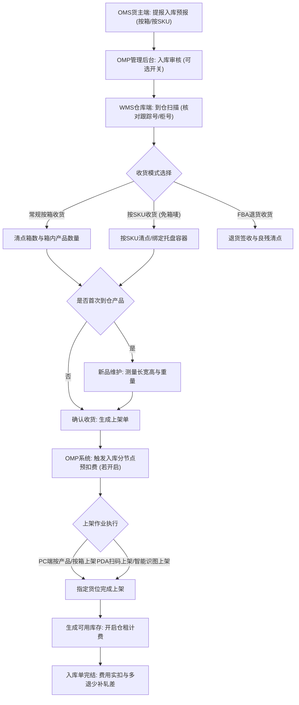
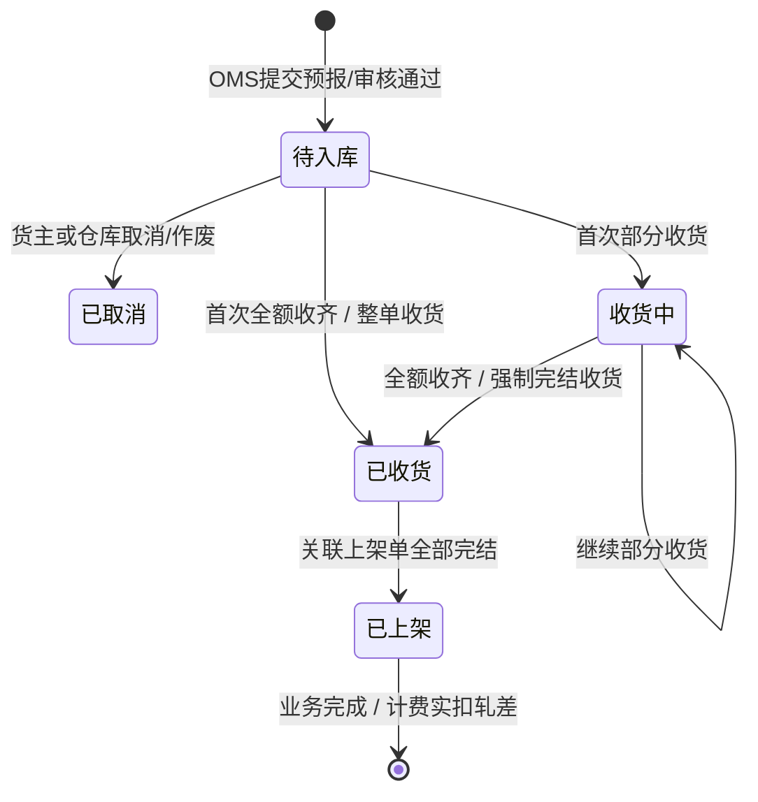
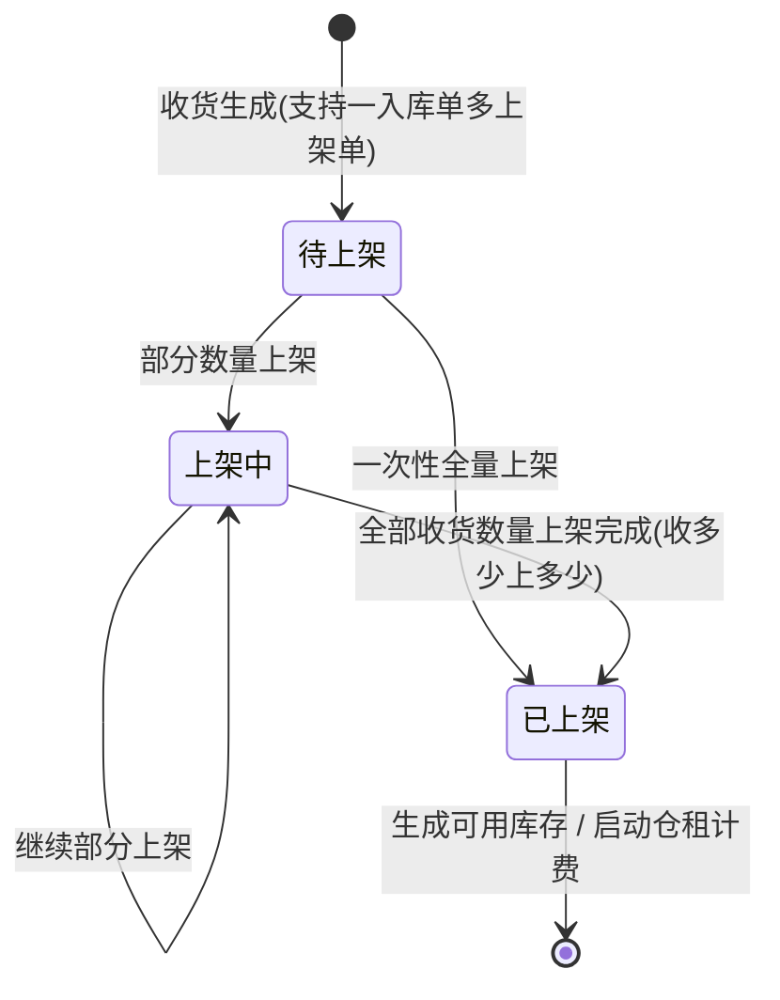

# 领星WMS知识库：入库业务全链路

## 1.业务架构与核心流程

【手册事实】领星海外仓入库业务贯穿OMS货主端、WMS仓库端与OMP管理后台，核心涵盖按箱/按SKU入库预报、到仓扫描、按单/组托收货、新品测量维护、入库认领、上架分配以及入库前置计费轧差。

---

## 2.核心功能项详细解析

### 能力项1：按箱预报与按SKU预报入库

- 能力名称：多模式入库预报
- 所属模块：OMS端/WMS端入库管理
- 使用场景：传统标准装箱货物贴箱唛入库；大件仓、卖家自建仓或免箱唛散货按SKU预报入库。
- 操作角色：OMS货主、OMP运营人员、WMS仓库操作员
- 前置条件、配置或依赖：【手册事实】管理后台全局设置的入库配置支持按仓开启“按SKU下入库单”，默认关闭。开启后，OMS创建常规入库单时方可选择预报方式“按SKU”[LX-WMS-033]。
- 操作流程及系统响应：
  1. 货主在OMS端选择入库仓库，选择预报方式为“按箱”或“按SKU”；
  2. 若选择按箱，需录入箱号、箱唛、每箱SKU及数量；若选择按SKU，仅需维护产品SKU与预报数量，不维护箱唛信息[LX-WMS-033]；
  3. 系统列表、筛选、导出与详情统一展示预报方式；按SKU预报的单据去除箱数相关字段[LX-WMS-033]。
- 涉及的业务对象、单据及对象关系：入库单（Inbound Order）、箱唛明细、产品SKU明细。按箱模式下一张入库单对应多个箱唛，按SKU模式下入库单直接关联SKU及数量。
- 关键字段、字段含义和可选值：
  - 预报方式：可选“按箱”、“按SKU”[LX-WMS-033]；
  - 仓库：仅支持选择自营仓或已授权代理仓[LX-WMS-031]；
  - 预计到达日期、到仓方式、货柜号/跟踪号、参考单号、备注[LX-WMS-031]。
- 状态及状态变化：草稿 -> 待入库。
- 对订单、库存、费用或外部系统的影响：【手册事实】预报环节不生成任何仓内库存；费用单据尚未生成。
- 校验规则、异常情况和处理方式：【手册事实】待入库状态下支持修改仓库，但仅支持将自营仓修改为其他自营仓[LX-WMS-031]。
- 权限或适用范围：受OMP仓库配置与货主OMS权限控制。
- 对应来源编号和证据位置：[LX-WMS-033]使用WMS实现按SKU下单和入库（第2.1节、第2.2节）；[LX-WMS-031]使用WMS操作入库管理（第4节Q4、Q5）。
- 尚未确认的问题：【待确认】按SKU预报模式下，若实物到仓带有混箱包装，系统是否提供自动拆箱推荐策略，原文未说明。

---

### 能力项2：到仓扫描与入库认领

- 能力名称：到仓扫描与无主货物入库认领
- 所属模块：WMS仓库端入库作业
- 使用场景：货运卡车或快递到仓时，快速核对跟踪号/箱唛；对于无预报单据或信息不符的货物暂存认领区等待认领。
- 操作角色：WMS收货员、OMS货主
- 前置条件、配置或依赖：货物外箱具备快递面单跟踪号、货柜号或系统箱唛。
- 操作流程及系统响应：
  1. 仓库人员扫描外箱跟踪号或柜号；
  2. 系统自动检索并匹配待入库单据；若匹配成功，单据状态变为已到仓/收货准备状态；
  3. 若扫描未匹配到任何预报单据，仓库人员可直接创建“入库认领单”，拍照上传实物外观与箱标，货物分配至认领暂存区[LX-WMS-030]；
  4. OMS货主端在“入库认领”列表中查看认领单，核对实物照片后提交认领，关联或生成正式入库单[LX-OMS-055]。
- 涉及的业务对象、单据及对象关系：入库单、到仓记录、入库认领单。认领单被确认后反向生成或绑定入库单。
- 关键字段、字段含义和可选值：跟踪号、货柜号、认领单号、暂存库位、实物照片、认领状态（待认领、已认领、已失效）。
- 状态及状态变化：未到仓 -> 已到仓；认领单流转：待认领 -> 已认领。
- 对订单、库存、费用或外部系统的影响：【手册事实】认领中货物仅记录于暂存库位，属于不可销售/不可分配库存；认领成功并入库后方可上架转为可用库存。
- 校验规则、异常情况和处理方式：【手册事实】若超时无人认领，依据仓库策略进入弃件或销毁流程[LX-OMP-080]。
- 权限或适用范围：WMS收货权限，OMS货主认领权限。
- 对应来源编号和证据位置：[LX-WMS-030]使用WMS进行入库认领；[LX-WMS-034]使用WMS进行到仓扫描；[LX-OMS-055]使用OMS实现入库认领。
- 尚未确认的问题：【待确认】认领单逾期销毁的具体计费触发点与账单科目，原文未详细说明。

---

### 能力项3：仓内收货、分批收货与强制完结

- 能力名称：多模式收货与收货控制
- 所属模块：WMS仓库端/PDA移动端
- 使用场景：仓库卸货后按单核对、按箱核对或按SKU组托收货。
- 操作角色：WMS收货组操作员
- 前置条件、配置或依赖：入库单处于“待入库”或“收货中”状态。
- 操作流程及系统响应：
  1. 整单收货：对货物完好且数量完全一致的订单，支持一键“整单收货”，直接按预报数量全部收货[LX-WMS-031]；
  2. 常规按箱收货：清点每箱产品数量，录入实际到仓良品数，勾选确认收货。每个箱子仅支持收货一次[LX-WMS-031]；
  3. 按SKU收货与组托：收货页以SKU为操作维度，同一SKU未达预报数量前支持分多次收货；启用托盘容器的仓库可按SKU组托，系统记录托盘与SKU绑定关系[LX-WMS-033]；
  4. 分批收货流转：第一次部分收货后，单据流转为“收货中”；每收货一次，系统默认生成一张对应的上架单[LX-WMS-032]；
  5. 强制完结收货：若到仓短少、卖家不再补发，仓库与卖家沟通后可点击“强制完结收货”，单据强制流转至“已收货”，后续不可再收货[LX-WMS-031]。
- 涉及的业务对象、单据及对象关系：入库单、收货记录、托盘容器、上架单。入库单与上架单默认形成一对多关系[LX-WMS-032]。
- 关键字段、字段含义和可选值：
  - 收货数量、预报数量、箱号、托盘编码、效期（保质期到期日）、批次号；
  - 入库单状态：全部、待入库、收货中、已收货、已上架、已取消[LX-WMS-031]。
- 状态及状态变化：
  - 待入库 -> 一次性收齐 -> 已收货；
  - 待入库 -> 部分收货 -> 收货中 -> 继续收齐/强制完结 -> 已收货[LX-WMS-031]。
- 对订单、库存、费用或外部系统的影响：
  - 【手册事实】收货完成（已收货）状态下，系统不会生成可用库存，必须执行上架后才会生成库存[LX-WMS-031]；
  - 【手册事实】若开启入库前置计费，收货后上架完成即触发费用预扣，否则单据全部上架完结时才计算入库操作费[LX-WMS-032, LX-OMP-055]。
- 校验规则、异常情况和处理方式：
  - 【手册事实】常规入库一个箱子仅支持收货一次，严禁重复提交[LX-WMS-031]；
  - 【手册事实】超收控制：PDA收货兼容系统配置的“入库单是否支持超收”开关[LX-WMS-033]。
- 权限或适用范围：WMS收货权限。
- 对应来源编号和证据位置：[LX-WMS-031]使用WMS操作入库管理（第2节、第3节、第4节）；[LX-WMS-033]使用WMS实现按SKU下单和入库（第2.3节、第2.4节）。
- 尚未确认的问题：【待确认】超收比例（百分比或绝对数量上限）的具体配置界面与公式，手册正文未展开说明。

---

### 能力项4：新品维护（量方称重）

- 能力名称：首次到仓新品维护
- 所属模块：WMS仓库端/PDA移动端
- 使用场景：货主首次发货到仓的SKU或外箱，仓库实际测量长、宽、高和重量，作为后续计费与包装基准。
- 操作角色：WMS收货质检员
- 前置条件、配置或依赖：收货时系统检测到该SKU或箱型为“首次到仓”或未通过实测审核。
- 操作流程及系统响应：
  1. 收货或上架页面弹出“新品维护”提示[LX-WMS-031]；
  2. 仓库测量实物长、宽、高（cm或inch）以及单件毛重（kg或lb）；
  3. 录入系统并保存；系统自动更新商品中心的基础尺寸与重量数据，并同步至OMP管理后台与OMS货主端。
- 涉及的业务对象、单据及对象关系：商品SKU主数据、入库单、计量数据版本记录。
- 关键字段、字段含义和可选值：长度、宽度、高度、单品净重、单品毛重、包装材质、计量单位。
- 状态及状态变化：产品测量状态：未测量 -> 已测量；产品审核状态：待审核 -> 已审核。
- 对订单、库存、费用或外部系统的影响：【手册事实】新品数据直接决定仓租费（计费体积）、出库操作费（分段计重）以及物流运费试算，若未准确维护将直接导致计费偏差或报错[LX-WMS-031, LX-OMP-004]。
- 校验规则、异常情况和处理方式：【手册事实】若产品未维护新品尺寸或未通过审核，后续提交单据时系统将报错提示“仓库返回：传入产品sku有误或产品未通过审核”[LX-OMP-004]。
- 权限或适用范围：WMS新品维护权限、OMP产品审核权限。
- 对应来源编号和证据位置：[LX-WMS-031]使用WMS操作入库管理（第2.3节）；[LX-OMP-004]提交入库单时报错排查。
- 尚未确认的问题：【待确认】当仓库实测尺寸与货主OMS预报尺寸差异超过阈值时，系统是否支持自动触发复核工单，原文未明确记载。

---

### 能力项5：上架管理、分批上架与上架严格一致性校验

- 能力名称：多模式上架与差异硬校验
- 所属模块：WMS仓库端/PDA移动端
- 使用场景：将已收货暂存区的货物或托盘转移至正式存储库位或拣货库位。
- 操作角色：WMS上架操作员
- 前置条件、配置或依赖：上架单处于“待上架”或“上架中”状态。
- 操作流程及系统响应：
  1. 进入上架管理，筛选待上架单据；
  2. 选择上架维度：常规入库支持“按产品上架”或“按箱上架”；备货中转仅支持按箱上架；已组托收货仅支持按托盘上架[LX-WMS-032, LX-WMS-033]；
  3. 录入或PDA扫描目标库位编码、本次上架数量；
  4. 确认上架后，上架单若数量全部完成则流转为“已上架”，若部分完成则流转为“上架中”[LX-WMS-032]；
  5. 系统还支持通过智能识图导入上架（解析纸质理货单照片自动填充上架数据）以及Excel批量导入上架[LX-WMS-066, LX-WMS-068]。
- 涉及的业务对象、单据及对象关系：上架单、入库单、库位（Location）、库存批次记录。
- 关键字段、字段含义和可选值：
  - 上架方式：按产品、按箱、按托盘；
  - 上架单状态：全部、待上架、上架中、已上架[LX-WMS-032]；
  - 目标库位编码、上架数量、托盘号。
- 状态及状态变化：待上架 -> 上架中 -> 已上架。全单所有上架单均已上架后，关联入库单变更为“已上架”。
- 对订单、库存、费用或外部系统的影响：
  - 【手册事实】上架成功后立即生成系统可用库存，上架部分即刻纳入每日仓租计费[LX-WMS-032]；
  - 【手册事实】若开启入库前置计费，完成上架时触发预扣；未开启时，入库单整体流转至已上架时生成入库费用单据[LX-WMS-032, LX-OMP-055]。
- 校验规则、异常情况和处理方式：
  - 【手册事实】严格不允许上架差异：上架不支持强制完结，收货多少就必须上架多少[LX-WMS-032]；
  - 【手册事实】同一上架单上架方式互斥：分批上架时，首批选择了按产品上架，后续只能按产品上架，不能与按箱上架混用[LX-WMS-032]；
  - 【手册事实】实物破损处理：清点发现货物损毁不需要上架的，系统要求必须先全部上架生成库存，再在WMS端发起“库存调整”扣减库存，并手动调整对应费用[LX-WMS-032]。
- 权限或适用范围：WMS上架操作权限。
- 对应来源编号和证据位置：[LX-WMS-032]使用WMS操作上架管理（第2节、第3节、第4节Q1-Q8）。
- 尚未确认的问题：【待确认】系统是否支持动态推荐上架库位算法（如按SKU热度、体积适配推荐），原文手册仅展示手动录入和选择库位，未提及智能推荐上架算法。

---

## 3.核心业务对象与状态机流转

### 入库单状态流转状态机

### 上架单状态流转状态机

---

## 4.分析建议与系统边界启示

【分析建议】针对自研QS-WMS产品设计，领星入库业务的启示与优化空间如下：
1. **收货与上架关系配置化**：领星允许在设置中切换“每个入库单对应多个上架单”或“只生成一个上架单”，兼顾了多人并行上架与单人简单作业两种场景，值得QS-WMS采纳；
2. **强制完结与上架死锁反思**：领星收货环节支持“强制完结”，但上架环节“严格不允许差异，收多少上多少，损毁也必须先上架再调整”。这一设计在业务现场容易导致上架卡单。建议QS-WMS在上架环节引入“上架差异登记与异常完结”机制，允许现场将破损品直接分流至不良品库位并自动生成损益单，避免走先上后调的冗余链路；
3. **入库分节点预扣费机制**：领星的入库前置计费设计非常严密（每次上架增量预扣，整单完结轧差，余额不足不阻断入库但阻断出库），既保障了海外仓资金安全，又避免了阻塞现场收货上架节奏，是高价值的财务风控参考模型。
