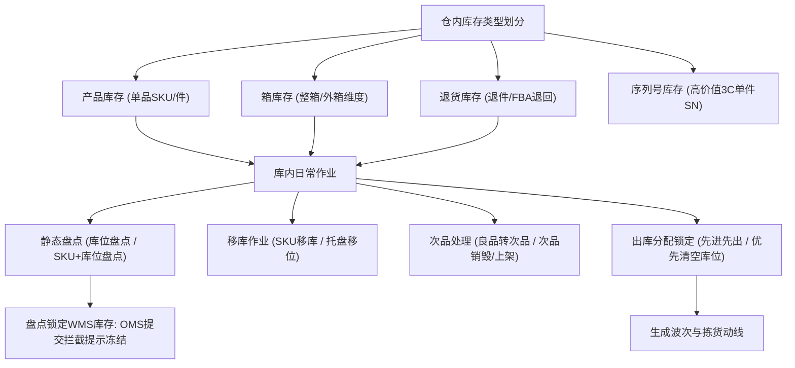
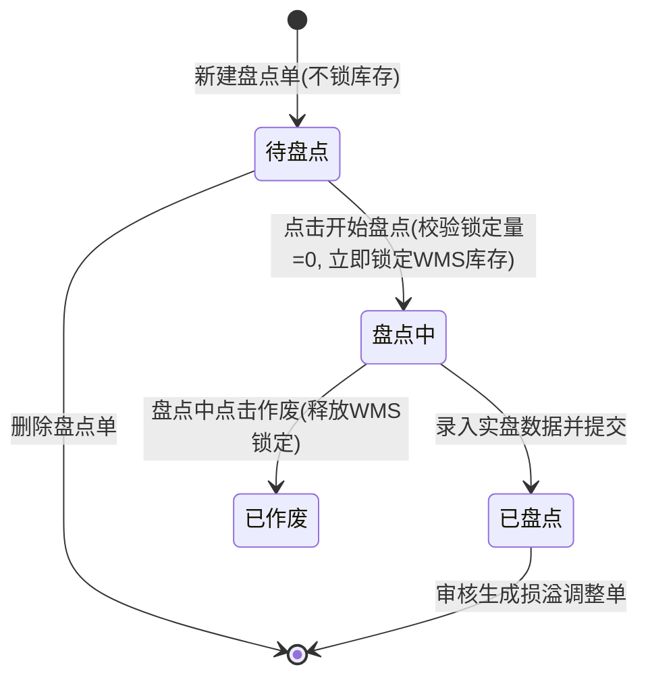

# 领星WMS知识库：库内与库存管理

## 1.业务架构与核心流程

【手册事实】领星海外仓库内管理涵盖多层级库存模型（产品库存、箱库存、退货库存、批次库存、序列号库存）、库存锁定与分配策略、静态盘点流程、次品管理、托盘管理以及库位流转。

---

## 2.核心功能项详细解析

### 能力项1：多层级库存结构模型

- 能力名称：多层级与多业务形态库存模型
- 所属模块：WMS库内中心/OMP管理后台/OMS货主端
- 使用场景：海外仓既承接B2C一件代发（单件产品出库），也承接B2B备货中转（整箱出库），同时处理FBA退货与高货值商品跟踪。
- 操作角色：WMS库内管理员、OMP运营人员、OMS货主
- 前置条件、配置或依赖：入库上架完成或退货清点上架完成。
- 操作流程及系统响应：
  1. 系统在底层划分为独立但关联的库存账本：产品库存、箱库存、退货库存[LX-OMP-072]；
  2. 产品库存：以上架后的单个SKU为最小颗粒度，用于一件代发、库存盘点和常规移库[LX-WMS-036]；
  3. 箱库存：按整箱维度记录箱号、箱内SKU组合与箱数，主要用于整箱备货中转出库；【手册事实】箱库存不适用于一件代发，一件代发出库单仅扣减产品库存[LX-OMP-043]；
  4. 退货库存：FBA退货入库上架后独立生成退货库存，与正品库存隔离，专用于换标出库或退货返运[LX-WMS-007, LX-WMS-040]；
  5. 批次与效期库存：记录入库批次号、生产日期与失效日期，实现按批次跟踪与效期预警[LX-WMS-043]。
- 涉及的业务对象、单据及对象关系：库位、产品SKU、箱条码、批次号、退货FNSKU、序列号SN。
- 关键字段、字段含义和可选值：
  - 库存状态：在架库存、可用库存、待下架库存（锁定中）、次品库存、盘点冻结库存；
  - 库龄（天数）：自上架之日起计算的累计在库天数[LX-OMS-041]。
- 状态及状态变化：收货暂存 -> 上架转为在架可用 -> 出库分配转为锁定 -> 拣货出库扣减。
- 对订单、库存、费用或外部系统的影响：
  - 【手册事实】不同库存类型的仓租费单价和计算规则可能存在差异；
  - 【手册事实】库龄与阶梯仓租直接绑定，系统按天统计并阶梯累进扣费[LX-OMP-049]。
- 校验规则、异常情况和处理方式：【手册事实】一件代发下单时若库存类型不匹配（如误勾选箱库存），系统校验可用量为零无法提交[LX-OMP-043]。
- 权限或适用范围：全系统通用数据模型。
- 对应来源编号和证据位置：[LX-OMP-072]使用OMP查阅库存；[LX-OMP-043]箱库存适用于一件代发吗；[LX-WMS-036]使用WMS查询或处理产品库存；[LX-WMS-040]使用WMS查询或处理退货库存。
- 尚未确认的问题：【待确认】箱库存是否支持现场开箱散拆直接转为产品库存，原文手册未提供一键拆箱转换工具。

---

### 能力项2：库存分配策略与动态重锁机制

- 能力名称：双模板出库库存分配策略与重锁机制
- 所属模块：WMS系统设置/出库分配引擎
- 使用场景：出库单提审或波次生成时，系统自动挑库位并锁定库存，保障拣货动线最优或库位利用率最高。
- 操作角色：WMS管理员
- 前置条件、配置或依赖：在WMS右上角“设置-出库-库存锁定策略”中进行全局配置[LX-WMS-044]。
- 操作流程及系统响应：
  1. 系统提供两种预置分配策略模板供仓库二选一[LX-WMS-044]：
     - 模板一：先进先出模板（系统默认）：排序规则为：库位拣货优先级（高→低） -> 失效日期（越早越优先） -> 批次号（越早越优先） -> SKU可用数量（少→多） -> 库位名称（1→9）；
     - 模板二：优先清空库位模板：排序规则为：库位拣货优先级（高→低） -> 失效日期（越早越优先） -> SKU可用数量（少→多） -> 批次号（越早越优先） -> 库位名称（1→9）；
  2. 出库单审核通过后，分配引擎根据选定模板自动计算并冻结库位可用量；
  3. 若拣货员在现场实际未按推荐库位拣货，扫描并更换了新库位，系统触发“动态重锁”：原库位锁定自动释放，新库位重新锁定并完成扣减[LX-WMS-044]。
- 涉及的业务对象、单据及对象关系：出库单、波次单、拣货任务单、库位优先级属性、批次库存记录。
- 关键字段、字段含义和可选值：
  - 策略模板：先进先出模板、优先清空库位模板[LX-WMS-044]；
  - 库位拣货优先级：数值越高越优先；
  - SKU可用数量：升序排序优先匹配散件少件库位以达到清空目的。
- 状态及状态变化：可用库存 -> 锁定库存 -> 出库扣减；拣货换位时发生释放原锁与新锁替换。
- 对订单、库存、费用或外部系统的影响：
  - 【手册事实】策略变更仅对后续新单生效，在途作业与已锁定单据保持原状[LX-WMS-044]；
  - 【手册事实】系统仅锁定订单所需数量，库位多余库存保留原位，不会强制锁定整个库位[LX-WMS-044]。
- 校验规则、异常情况和处理方式：【手册事实】代理仓不可使用本地库存分配配置，代理仓的库存锁定由第三方仓储系统自行控制[LX-WMS-044]。
- 权限或适用范围：WMS出库设置权限。
- 对应来源编号和证据位置：[LX-WMS-044]使用WMS设置库存锁定和分配逻辑（第1节、第2节、第3节FAQ）。
- 尚未确认的问题：【待确认】除预置的两种模板外，是否支持仓库自定义字段权重和混合排序公式，原文未说明。

---

### 能力项3：仓库静态盘点与跨端冻结风控

- 能力名称：静态盘点管理与下单拦截
- 所属模块：WMS库内中心/PDA移动端/OMS下单端
- 使用场景：定期核对实际库存与系统账面数据，修正账实差异。
- 操作角色：WMS盘点员、主管审核员
- 前置条件、配置或依赖：关联库位/SKU在WMS中的锁定库存必须为0[LX-WMS-045]。
- 操作流程及系统响应：
  1. 新建盘点单：支持“库位盘点”（核对指定库位所有货品）与“SKU+库位盘点”（精准核对特定SKU在指定库位的存量）[LX-WMS-045]；
  2. 保存后单据为“待盘点”状态，此时尚未锁定库存；
  3. 开始盘点：点击“开始盘点”，系统硬校验：所选库位/SKU必须“锁定库存=0且有可用库存”；校验通过后，WMS库存立即被冻结锁定，单据流转为“盘点中”[LX-WMS-045]；
  4. 现场作业：操作员使用PC端或PDA扫描录入实盘数量；
  5. 审核与生效：盘点完成后提交审核，系统自动比对差异，生成盘盈盘亏记录，并调整系统库存流水。
- 涉及的业务对象、单据及对象关系：盘点单、盘点差异单、库存流水记录。盘点单仅支持盘点产品库存[LX-WMS-045]。
- 关键字段、字段含义和可选值：
  - 盘点单状态：全部、待盘点、盘点中、已盘点、已作废[LX-WMS-045]；
  - 盘点类型：库位盘点、SKU+库位盘点；
  - 账面数量、实盘数量、差异数量（盈/亏）。
- 状态及状态变化：待盘点（可删除） -> 盘点中（可作废） -> 已盘点。
- 对订单、库存、费用或外部系统的影响：
  - 【手册事实】跨端下单协同阻断：盘点开始后WMS端锁定库存；OMS端货主仍可保存草稿出库单，但在点击提交审核时，系统硬校验报错拦截，明确提示“WMS存在冻结库存”，阻断下单，彻底杜绝超卖[LX-WMS-045]；
  - 【手册事实】盘点差异通过审核后直接调整系统账面库存，并生成库存调整日志。
- 校验规则、异常情况和处理方式：
  - 【手册事实】若SKU存在锁定库存（如正处于出库分配或波次拣货中），系统报错禁止开启盘点，必须等待出库完成或释放锁定[LX-WMS-045]；
  - 【手册事实】库位盘点添加库位时，该库位必须曾产生过库存流水，无流水库位不支持添加[LX-WMS-045]。
- 权限或适用范围：WMS盘点与审核权限。
- 对应来源编号和证据位置：[LX-WMS-045]使用WMS进行盘点（第2节、第3节、第4节Q1-Q7）；[LX-WMS-027]通过PDA实现盘点。
- 尚未确认的问题：【待确认】盘点差异是否支持盲盘（作业员界面隐藏账面数量），原文截图均显示账面数与实盘数对照输入，未提及盲盘开关。

---

### 能力项4：高价值商品序列号SN管理

- 能力名称：全链路一机一码序列号跟踪
- 所属模块：OMP管理后台/WMS仓端/OMS货主端
- 使用场景：3C数码、精密仪器等高单价商品的单件全生命周期溯源。
- 操作角色：WMS收货/复核人员、OMP运营人员
- 前置条件、配置或依赖：在OMP或WMS基础数据中对特定SKU开启“启用序列号管理”[LX-WMS-039]。
- 操作流程及系统响应：
  1. 入库环节：收货或上架时，扫描录入每个实物的SN号，支持Excel批量导入SN清单；
  2. 库内环节：在“序列号管理”模块建立SN一维台账，展示SN状态（在库、已出库、已作废）、所在库位与批次[LX-WMS-039]；
  3. 出库环节：二次分拣或包裹复核时，系统强制要求扫描SKU条码后再扫描SN序列号；扫描完成后，SN自动与具体出库单和物流包裹绑定[LX-WMS-053]；
  4. 售后追溯：出库单详情展示出库SN；后续退货退件时，可直接反查校验该SN是否属于本仓正品发货[LX-WMS-039]。
- 涉及的业务对象、单据及对象关系：商品SKU、序列号SN明细、入库单、出库单、包裹。
- 关键字段、字段含义和可选值：序列号编码、关联SKU、库位、状态（在库、出库中、已出库、已退货）、关联入库单号、关联出库单号[LX-WMS-039]。
- 状态及状态变化：已录入 -> 在库 -> 锁定 -> 已出库。
- 对订单、库存、费用或外部系统的影响：【手册事实】未扫描完整SN序列号的出库单，系统禁止完成二次分拣或包装出库[LX-WMS-053]。
- 校验规则、异常情况和处理方式：【手册事实】重复扫描已存在的SN或格式不合法的SN，系统报警拦截。
- 权限或适用范围：开启SN管理的特定SKU与特定仓。
- 对应来源编号和证据位置：[LX-WMS-039]使用OMP、WMS、OMS实现序列号管理；[LX-WMS-053]使用WMS进行二次分拣（第3.1节）。
- 尚未确认的问题：【待确认】出库环节是否支持系统自动指定特定SN（精准拣选某台机器），目前手册事实为拣货员现场任取一台并扫码绑定。

---

## 3.核心业务对象与状态机流转

### 盘点单业务流转状态机

---

## 4.分析建议与系统边界启示

【分析建议】针对自研QS-WMS产品设计，领星库内管理的启示与优化空间如下：
1. **盘点期间跨端防超卖机制**：领星在WMS静盘锁库后，OMS端允许货主填单但提审时拦截提示“WMS存在冻结库存”。这种处理方式优于在OMS直接隐藏商品（避免货主误以为商品下架），QS-WMS应借鉴这一状态联动设计；
2. **多形态库存隔离机制**：领星将产品库存（件）、箱库存（箱）、退货库存严格隔离，避免了一件代发误扣整箱大件或残次品退件。但在业务实操中，客户经常需要“整箱拆散为零件销售”或“退货良品转正常库存”。领星目前在原厂手册中未见一键拆箱与批量形态互转流程，建议QS-WMS设计标准化的形态转换工单（拆箱工单、退货转正品工单）；
3. **现场换库位动态重锁**：领星在拣货员更换实物拣货库位时，能够自动释放原库位锁定并在新库位重锁，容错性强，避免了作业员因为走错货位导致系统死锁的常见实施痛点。
