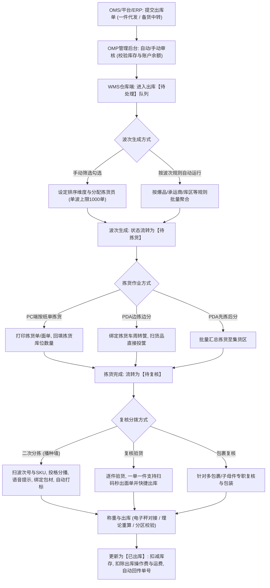
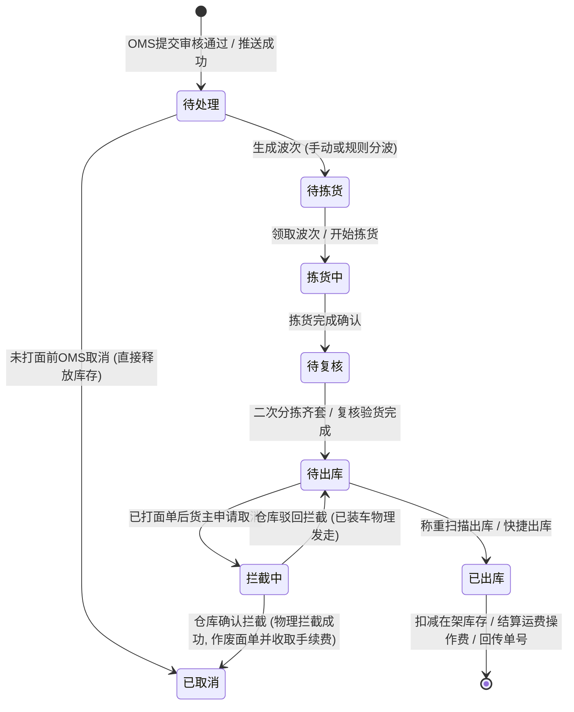

# 领星WMS知识库：出库履约业务

## 1.业务架构与核心流程

【手册事实】领星海外仓出库业务覆盖B2C一件代发与B2B备货中转两大核心业务形态，串联订单接入、库存锁定分配、智能波次生成、多元化拣货（纸单/PDA边拣边分/先拣后分）、二次分拣（播种墙分播）、包裹复核验货、自动/手动称重贴标、发货集包以及异常订单拦截全流程。

---

## 2.核心功能项详细解析

### 能力项1：一件代发出库订单处理与多级流转

- 能力名称：B2C一件代发全流程履约
- 所属模块：WMS出库中心/OMS货主端
- 使用场景：跨境电商平台（Amazon、Shopify、TikTok、TEMU、SHEIN等）产生销售订单后，海外仓执行快速配货发运。
- 操作角色：WMS调度员、拣货员、打包复核员
- 前置条件、配置或依赖：OMS出库单审核通过并成功推送至WMS，对应SKU具备足额可用库存，货主账户余额满足扣费条件（若开启前置计费）[LX-OMP-015, LX-WMS-055]。
- 操作流程及系统响应：
  1. 单据接入WMS后初始停留在“待处理”列表；
  2. 调度人员通过筛选（按渠道、时间、SKU等）或通过波次规则生成波次单；
  3. 执行拣货作业，拣货完成后状态流转为“待复核”；
  4. 经过二次分拣、复核验货或包裹复核完成包装；
  5. 称重并完成出库，单据更新为“已出库”，系统自动扣减在架库存，并将物流跟踪号实时回传至OMS与销售电商平台[LX-WMS-055]。
- 涉及的业务对象、单据及对象关系：OMS销售订单、WMS出库单、波次单（Wave）、拣货任务单、包裹（Parcel）、物流面单。一个波次聚合多个出库单，一个出库单对应一个或多个包裹。
- 关键字段、字段含义和可选值：
  - 出库单状态：全部、待处理、待拣货、拣货中、待复核、待出库、已出库、已取消、异常单[LX-OMP-079, LX-WMS-055]；
  - 物流承运商、物流渠道编码、物流跟踪号（Tracking Number）、参考单号、买家收件地址、申报价值、货币币种[LX-OMP-017]；
  - 包装类型、包材编码、实重、体积重、计费重。
- 状态及状态变化：待处理 -> 待拣货 -> 拣货中 -> 待复核 -> 待出库 -> 已出库。
- 对订单、库存、费用或外部系统的影响：
  - 【手册事实】单据提审即锁定对应库位库存；出库完成时正式核扣库存流水；
  - 【手册事实】出库完成触发扣减出库操作费（按件/按单）与物流运费；
  - 【手册事实】物流跟踪号自动回传外部电商平台触发平台标记发货[LX-OMP-041]。
- 校验规则、异常情况和处理方式：
  - 【手册事实】承运商与渠道校验：若客户批量导入的出库单绑定的物流渠道不可用或承运商不合法，系统拦截并报错“承运商不合法”或“物流渠道不可用”[LX-OMP-003, LX-OMP-008]；
  - 【手册事实】缺货挂起：若库存不足，出库单进入异常挂起列表，等待补货或手动调整。
- 权限或适用范围：WMS出库操作权限。
- 对应来源编号和证据位置：[LX-WMS-055]使用WMS处理一件代发出库单；[LX-OMP-079]使用OMP查阅出库单状态；[LX-OMP-003]承运商不合法排查；[LX-OMP-008]物流渠道不可用排查。
- 尚未确认的问题：【待确认】出库单超时未发货时，系统是否支持自动触发预警邮件或飞书/企微机器人通知，原文未说明。

---

### 能力项2：波次管理与智能波次规则引擎

- 能力名称：多维规则波次引擎与一键自动分波
- 所属模块：WMS出库波次中心
- 使用场景：将成百上千张离散零碎的出库单高效分组聚合成波次任务，实现批量集中拣选，减少仓库走动往返动线。
- 操作角色：WMS出库调度主管
- 前置条件、配置或依赖：在OMP分配【出库-波次规则】权限[LX-WMS-054]。
- 操作流程及系统响应：
  1. 手动分波：在“一件代发-待处理”列表勾选订单，点击生成波次，支持按创建时间、SKU、承运商、库位等规则对波次内单据排序，指定拣货人员，单个波次上限1000单[LX-WMS-055]；
  2. 规则自动分波：在“波次规则”配置库中预置业务策略；在待处理列表点击“按规则生成波次”，勾选启用的规则，系统自动批量运算并生成多个波次[LX-WMS-054]；
  3. 规则配置项详解：
     - 基础设置：每波数量（单波订单上限，如100单）；不足量订单单独生成波次（余单分波开关）；波次内排序规则[LX-WMS-054]；
     - 爆品规则（单品单件）：勾选“SKU*数量完全一致”，设置爆品阈值数量；当相同SKU及数量的订单达到阈值时，自动剥离生成独立的爆品波次[LX-WMS-054]；
     - 承运商/跟踪号特征分波：支持按特定物流渠道分波，或基于跟踪号前缀规则分波（如UPS通常以“1Z”开头）[LX-WMS-054]；
     - 范围限定：指定适用仓库、货主、库区、库位、产品分类；一单多件订单只要有一个SKU命中即整单命中[LX-WMS-054]；
  4. 规则优先级：规则列表自上而下按优先级依次匹配，可通过拖拽icon调整运行先后顺序[LX-WMS-054]。
- 涉及的业务对象、单据及对象关系：波次规则配置实体、出库单、波次单。
- 关键字段、字段含义和可选值：
  - 规则名称、启用/禁用状态、优先级排序序号、每波规定数量、不足量分波开关、爆品判定阈值、跟踪号匹配正则表达式；
  - 波次单状态：待拣货、拣货中、已拣货、已取消[LX-WMS-052]。
- 状态及状态变化：待处理单据 -> 命中规则生成波次 -> 进入波次待拣货队列。
- 对订单、库存、费用或外部系统的影响：【手册事实】生成波次后，出库单被锁定在具体波次中，不可被其他波次重复选取；取消波次时单据自动退回待处理队列。
- 校验规则、异常情况和处理方式：【手册事实】若余单不满足每波数量且未勾选“不足量订单单独生成波次”，该部分余单将保留在待处理列表，不强制成波[LX-WMS-054]。
- 权限或适用范围：WMS出库调度权限。
- 对应来源编号和证据位置：[LX-WMS-054]使用WMS实现按波次规则，一键自动生成波次（第1节至第4节）；[LX-WMS-052]使用WMS实现订单波次管理。
- 尚未确认的问题：【待确认】波次规则是否支持设置定时任务自动触发（如每日10点、14点自动运行分波），目前手册事实为人工进入页面点击“按规则生成波次”。

---

### 能力项3：二次分拣（播种墙分播）

- 能力名称：播种墙二次分拣与智能硬件协同
- 所属模块：WMS出库分拣区
- 使用场景：一单多件或多品多件波次完成集中拣货后，将汇总货物逐件分播到各个独立订单格口中。
- 操作角色：WMS分拣员
- 前置条件、配置或依赖：波次处于“已拣货”或“拣货中”状态；提前连接扫码枪与条码打印控件[LX-WMS-053]。
- 操作流程及系统响应：
  1. 参数预设：在二次分拣界面进行参数配置[LX-WMS-053]：
     - 播种墙类型：选择“系统播种墙”（引用基础数据中维护的实体播种墙，最大15*15=225格，扫墙码直接激活）或“自定义播种墙”（行列一致的虚拟格子，无数量上限）[LX-WMS-053]；
     - 打印节点控制：设置在何时打印发货清单与物流面单（如整单分拣齐套时自动打印）；
     - 自动分拣：针对一单一件订单，开启后扫描SKU自动分拣同SKU订单，并支持设置批量阈值弹窗确认[LX-WMS-053]；
     - 包材与重量：开启扫描包材码，系统自动计算包裹重量（SKU重量+包材重量）[LX-WMS-053]；
     - 快捷出库开关：开启后整单或整波次分拣完成单据自动更新为已出库[LX-WMS-053]；
     - 语音播报：勾选后扫描SKU直接语音播报投放格号（中文或英文播报），作业员免看屏幕[LX-WMS-053]；
  2. 作业执行：扫描波次单号 -> 扫描货品SKU条码（若开启序列号管理需同时扫描SN码） -> 屏幕格口高亮变色并语音播报格号 -> 放入格口 -> 格口齐套后自动打印面单与清单[LX-WMS-053]。
- 涉及的业务对象、单据及对象关系：波次单、播种墙格口、出库单、包裹、包材物料、序列号SN。
- 关键字段、字段含义和可选值：波次号、SKU条码、SN序列号、播种墙编码、格口编号、包材条码、包裹理论重量。
- 状态及状态变化：波次已拣货 -> 分拣中 -> 分拣完成；出库单：待复核 -> 已复核/已出库。
- 对订单、库存、费用或外部系统的影响：
  - 【手册事实】绑定包材条码后，系统自动记录包材领用并计入包材使用费；
  - 【手册事实】开启快捷出库的，分拣完成即刻触发扣费与出库。
- 校验规则、异常情况和处理方式：
  - 【手册事实】多包裹/子母件限制：若波次中存在包含多个包裹的出库单，系统报错拦截提示“波次中存在出库单有多个包裹,暂不支持当前操作”，必须移步使用【包裹复核】功能处理[LX-WMS-053]；
  - 【手册事实】序列号校验：开启SN管理的商品，分拣时漏扫SN禁止完成格口关闭[LX-WMS-053]。
- 权限或适用范围：WMS二次分拣作业权限。
- 对应来源编号和证据位置：[LX-WMS-053]使用WMS进行二次分拣（第1节至第4节）；[LX-WMS-055]第2.3节。
- 尚未确认的问题：【待确认】是否支持电子标签辅助拣选PTL（Pick to Light）硬件接口直连，原文手册未见PTL硬件接口说明。

---

### 能力项4：复核验货与包裹复核（子母件）

- 能力名称：精细化复核验货与多包裹子母件处理
- 所属模块：WMS打包复核工位
- 使用场景：出库装箱前的最后一道验视核对防线，防止错发漏发；或针对超大件、子母件进行多箱分包复核。
- 操作角色：WMS打包复核员
- 前置条件、配置或依赖：单据处于“待复核”或“待出库”状态[LX-WMS-055]。
- 操作流程及系统响应：
  1. 复核验货模式（单包裹订单）：配货员扫描波次单号或出库单号，依次扫描货品条码；对于一单一件订单，扫码匹配后系统直接自动打印面单并完成打包出库；对于一单多件订单，支持扫描输入数量批量复核[LX-WMS-055, LX-WMS-056]；
  2. 包裹复核模式（多包裹/子母件）：专用于一个出库单拆分为多个包裹发货的场景；配货员依次扫描分配各包裹对应的SKU及数量，分别输入各包裹的重量与尺寸，系统为每个包裹独立获取并打印子面单/主面单[LX-WMS-047, LX-WMS-053]；
  3. 包装材料录入：支持扫描包材码，或者勾选“保持”功能自动沿用上一单包材[LX-WMS-053]。
- 涉及的业务对象、单据及对象关系：出库单、包裹记录（1对多）、面单标签、包材数据。
- 关键字段、字段含义和可选值：包裹编号、子面单号、包裹实重、长宽高体积、包材编码、验货匹配标记。
- 状态及状态变化：待复核 -> 待出库 / 已出库。
- 对订单、库存、费用或外部系统的影响：【手册事实】子母件模式下各包裹独立计重并累加物流运费；包裹信息实时同步至外部打单系统。
- 校验规则、异常情况和处理方式：【手册事实】扫描条码与单据明细不一致时，系统界面红色告警并发出拦截警报音，阻断打包[LX-WMS-056]。
- 权限或适用范围：WMS包装复核权限。
- 对应来源编号和证据位置：[LX-WMS-055]第2.4节；[LX-WMS-056]使用WMS进行复核验货；[LX-WMS-047]使用WMS进行包裹复核。
- 尚未确认的问题：【待确认】子母件包裹中若某个子包裹丢失，系统是否支持单包裹退件与重发，原文未见局部包裹退件说明。

---

### 能力项5：称重出库、分区称重校验与面单拦截

- 能力名称：全自动/手动称重与出库强风控校验
- 所属模块：WMS称重出库台/OMP打单中心
- 使用场景：包裹打包封箱后，获取准确物理重量并与物流商计费重量及分区规则进行比对校验。
- 操作角色：WMS出库操作员
- 前置条件、配置或依赖：称重台连接电子秤（通过称重控件读取串口数据）或配置理论重量自动计算[LX-WMS-051, LX-WMS-055]。
- 操作流程及系统响应：
  1. 称重模式：支持手动输入重量、电子秤串口直连自动读取、或系统自动计算重量（包裹重量=内含SKU实测重+包材重）[LX-WMS-051, LX-WMS-055]；
  2. 分区称重校验：系统自动核对包裹重量是否超出所选物流渠道允许的重量区间，或是否满足该邮编分区设定的重量阈值[LX-OMP-006]；
  3. 出库确认：称重通过后，扫描面单上的跟踪号或条码完成出库扣账；
  4. 订单拦截处理：
     - 未出面单前拦截：货主在OMS申请取消，系统直接自动拦截并释放锁定库存[LX-OMP-047]；
     - 已出面单后拦截：货主在OMS申请取消后，单据进入WMS“拦截中”队列；打单系统不会自动取消物流商面单，必须由仓库人员在WMS端物理拦截货物，手动确认拦截成功并作废面单[LX-OMP-047]；
     - 手续费扣除：根据OMP配置的“面单取消手续费”规则自动计提货主违约金或服务费[LX-OTH-001]。
- 涉及的业务对象、单据及对象关系：包裹重量记录、分区校验规则、出库拦截单、面单作废日志。
- 关键字段、字段含义和可选值：
  - 称重重量、物流商允许最大重量/最小重量、邮编分区；
  - 拦截状态：正常、申请取消中、拦截成功、拦截失败已发运[LX-OMP-047]。
- 状态及状态变化：待出库 -> 已出库；或 待出库 -> 拦截中 -> 已作废。
- 对订单、库存、费用或外部系统的影响：
  - 【手册事实】称重结果直接决定最终扣除货主的实际物流运费[LX-OMP-054]；
  - 【手册事实】拦截成功后系统自动恢复商品库存，但已产生的面单费若物流商不予退回，系统按配置收取手续费[LX-OTH-001, LX-OMP-047]。
- 校验规则、异常情况和处理方式：【手册事实】若实测重量超出物流分区规定，系统报错拦截提示“分区称重校验未通过”，阻止发货并提示调整物流渠道[LX-OMP-006]。
- 权限或适用范围：WMS出库称重权限。
- 对应来源编号和证据位置：[LX-WMS-051]使用WMS称重；[LX-OMP-006]OMS提交单据报错分区称重校验；[LX-OMP-047]取消的一件代发出库单打单系统会同步取消吗；[LX-OTH-001]如何配置面单取消手续费。
- 尚未确认的问题：【待确认】电子秤串口协议是否支持主流市面所有品牌（如托利多、顶尖等），原文仅说明安装控件后读取。

---

## 3.核心业务对象与状态机流转

### 一件代发出库单状态流转状态机

---

## 4.分析建议与系统边界启示

【分析建议】针对自研QS-WMS产品设计，领星出库履约业务的启示与优化空间如下：
1. **波次规则中的爆品与跟踪号分波**：领星将单品单件聚合（爆品规则）以及针对承运商跟踪号特征（如UPS 1Z识别）内嵌在波次规则中，极大减轻了一线调度员的筛选负担。QS-WMS在设计波次引擎时应将单品单件作为一级标准规则固化；
2. **二次分拣的多包裹硬限制**：领星在二次分拣播种墙中明确规定“不支持包含多个包裹的子母件订单”，必须切换至独立模块“包裹复核”。这种职责切分降低了播种墙格口管理的复杂度，但牺牲了一定的一体化体验。QS-WMS可评估是否在播种墙支持虚拟多格关联或保留此种分流机制；
3. **已出面单拦截的防呆机制**：很多海外仓WMS在客户取消时往往只改本地状态，导致现场货物照样被发走造成货损。领星明确区分“未出面单直接取消”与“已出面单进入拦截中，必须仓库人工核验实物后作废面单”，这一状态闭环高度契合跨境海外仓实际运作痛点。
