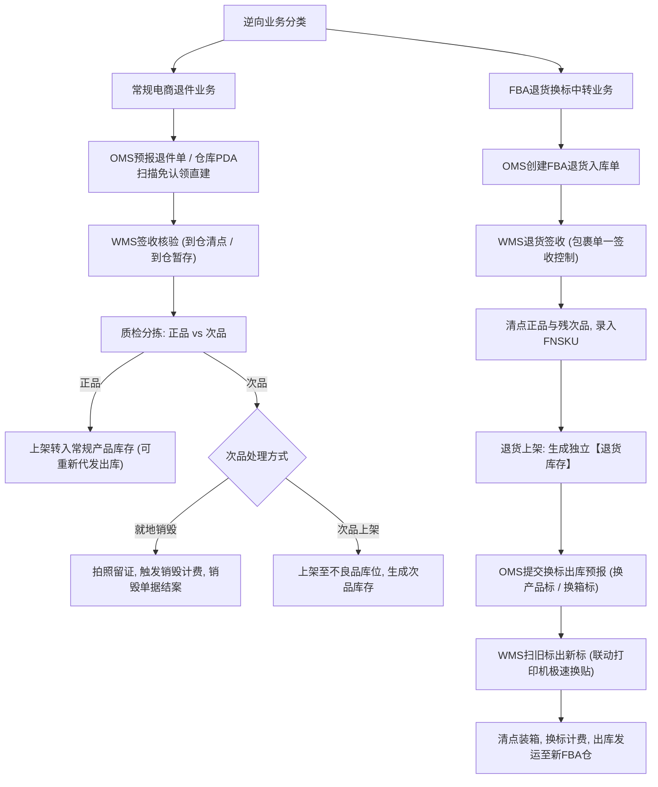
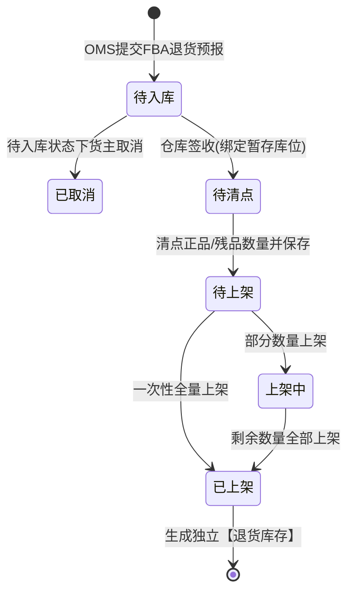

# 领星WMS知识库：逆向退件与FBA换标

## 1.业务架构与核心流程

【手册事实】领星海外仓逆向与换标业务区分为两大类：常规客户电商退件（退回后转正常销售或销毁）与FBA退货换标中转业务（从亚马逊FBA退仓，在海外仓完成验货、剥除旧标、贴附新标并装箱出库转运至新平台仓）。

---

## 2.核心功能项详细解析

### 能力项1：常规电商退件到仓处理与正次品分流

- 能力名称：常规退件质检与正次品分流处理
- 所属模块：WMS退件中心/PDA移动端/OMS货主端
- 使用场景：买家拒收、地址错误退回、或买家使用后退货至海外仓。
- 操作角色：WMS退件质检员、OMS货主
- 前置条件、配置或依赖：货主在OMS提报退件预报，或仓库通过PDA扫描直接反查客户。
- 操作流程及系统响应：
  1. 退件单下达：OMS客户在前端提报退件单，录入原出库跟踪号、退回物流号与预计退回SKU；
  2. 仓库接收与签收类型选择[LX-WMS-006]：
     - 到仓暂存：仅勾选到仓状态并放入暂存库位，暂不拆包清点；
     - 到仓清点：开箱质检，核对实际收到的SKU、数量与货物质量；
  3. 质检判定分流：
     - 正品：货物完好可二次销售，录入正品数量，操作上架转入常规在架产品库存，可直接用于后续一件代发出库[LX-WMS-006]；
     - 次品：外包装破损或实物损坏，录入次品数量，并拍照上传留证；选择“就地销毁”或“次品上架”转入次品库存[LX-WMS-006]；
  4. PDA免认领直建退件单：若在OMP全局设置中开启“允许直接在仓库创建退件单”，仓库作业员用PDA扫描退货包裹面单，直接拆包扫描SKU自动定位归属货主，一键生成退件单并完成清点，省去货主线上认领步骤[LX-WMS-006]。
- 涉及的业务对象、单据及对象关系：退件预报单、实物退件包裹、质检照片、次品销毁单、产品库存记录。
- 关键字段、字段含义和可选值：
  - 退件单状态：全部、待入库、已到仓、处理中、已完结[LX-WMS-006]；
  - 操作类型：到仓清点、到仓暂存；
  - 质检结果：正品数量、次品数量、收货备注、质检凭证图片；
  - 次品处理方式：就地销毁、次品上架。
- 状态及状态变化：待入库 -> 已到仓 -> 清点中 -> 已上架/已销毁。
- 对订单、库存、费用或外部系统的影响：
  - 【手册事实】必须勾选“到仓状态”后系统才会触发退件到仓处理费与包裹计费[LX-WMS-006]；
  - 【手册事实】正品上架生成常规产品库存；次品上架生成次品库存（不可销售）；销毁不产生库存[LX-WMS-006]；
  - 【手册事实】销毁操作与拍照服务自动生成对应增值服务计费单据[LX-WMS-006]。
- 校验规则、异常情况和处理方式：
  - 【手册事实】退件类型由OMS客户下单时指定，WMS端禁止篡改退件类型[LX-WMS-006]；
  - 【手册事实】实物超预报处理：实收种类或数量与预报不符时，允许仓库现场新增SKU并如实填写数量，最终计费以仓库实收数据为准[LX-WMS-006]。
- 权限或适用范围：WMS退件管理权限、PDA退件作业权限。
- 对应来源编号和证据位置：[LX-WMS-006]使用WMS处理退件（第1节至第4节）。
- 尚未确认的问题：【待确认】次品就地销毁时，系统是否支持生成法定报废凭证PDF供货主退税抵扣，原文未提及。

---

### 能力项2：FBA退货入库与退货专属库存管理

- 能力名称：亚马逊FBA退仓入库与独立退货库存体系
- 所属模块：WMS仓库端FBA退货板块/OMS货主端
- 使用场景：卖家亚马逊FBA店铺被封或滞销，将库存批量退运至海外仓暂存与换标重发。
- 操作角色：WMS收货员、OMS货主
- 前置条件、配置或依赖：货主在OMS创建FBA退货入库单[LX-OMS-062]。
- 操作流程及系统响应：
  1. 退货签收：进入WMS“FBA退货-入库”模块，待入库状态下点击签收，可指定暂存库位[LX-WMS-007]；
  2. 退货清点：单据流转至“待清点”状态；仓库拆箱清点FNSKU、正品数与次品数；实物超出预报部分支持手动添加[LX-WMS-007]；
  3. 退货上架：单据流转至“待上架”状态；选择目标库位与本次上架数量；支持一个FNSKU分派至多个货位[LX-WMS-007]；
  4. 库存生成：上架完成后生成系统专有【退货库存】[LX-WMS-007]。
- 涉及的业务对象、单据及对象关系：FBA退货入库单、亚马逊退货LPN/FNSKU条码、退货库存实体。
- 关键字段、字段含义和可选值：FBA退货单号、FNSKU、原亚马逊装箱单号、正品数、残次品数、退货库位。
- 状态及状态变化：待入库 -> 待清点 -> 待上架 -> 上架中 -> 已上架[LX-WMS-007]。
- 对订单、库存、费用或外部系统的影响：
  - 【手册事实】FBA退货入库上架后生成的是专属【退货库存】，绝不混入常规产品库存，杜绝一件代发误发退货商品[LX-WMS-007]；
  - 【手册事实】只有OMS端处于草稿、待入库状态的单据支持取消，进入清点与上架后禁止取消[LX-WMS-007]。
- 校验规则、异常情况和处理方式：
  - 【手册事实】包裹单一签收：一个退货包裹严禁多次签收[LX-WMS-007]；
  - 【手册事实】不支持部分收货，但支持部分上架；部分上架后单据为“上架中”，全部上架完成后流转为“已上架”[LX-WMS-007]；
  - 【手册事实】代理仓限制：代理仓的FBA退货入库单暂不支持推送到主仓[LX-WMS-007]。
- 权限或适用范围：WMS FBA退货业务权限。
- 对应来源编号和证据位置：[LX-WMS-007]使用WMS实现FBA退货入库（第1节至第4节）；[LX-OMS-062]使用OMS创建FBA退货入库单。
- 尚未确认的问题：【待确认】退货清点中如果出现无法识别的无条码散货，系统是否有专用的无名氏编码规则，原文未详细展开。

---

### 能力项3：扫旧标出新标与换标出库作业

- 能力名称：软硬件联动扫旧标出新标换标作业
- 所属模块：WMS出库中心/OMS备货中转模块
- 使用场景：旧商品退仓后更换新亚马逊FNSKU标、或平台箱标过期（如美客多Mercado Libre箱标过期）后重新打印替换新箱标。
- 操作角色：WMS换标作业员
- 前置条件、配置或依赖：OMS货主在创建备货中转出库单时预报换标信息并上传新标签文件[LX-WMS-050]。
- 操作流程及系统响应：
  1. 换标类型与预报维度：
     - 按产品出库：支持换产品标；换标产品必须在出库产品列表中选取[LX-WMS-050]；
     - 按箱出库：支持换产品标与换箱标；同一个换标组可包含多个箱子，对应一个多页PDF换标文件[LX-WMS-050]；
  2. 拣货标记：拣货任务单与PDA界面自动增加【是否需要换标】明显标识，拣货完成后引流至换标工位[LX-WMS-050]；
  3. 扫码联动自动出标：
     - 换产品标：先扫出库单号定位货品 -> 扫描产品旧标（支持SKU码、产品条码、FNSKU或自定义条码） -> 打印机自动打印对应新标（支持默认批量打印或逐个扫描单打）[LX-WMS-050]；
     - 换箱标：扫描出库单号 -> 扫描旧箱条码 -> 打印机按页数规则或整包打印新箱标[LX-WMS-050]；
  4. 实际换标数量回填与计费：换标完成后作业员录入实际换标件数与箱数，系统据此自动结算换标操作费；若未录入，系统降级按预报换标数量计费[LX-WMS-050]。
- 涉及的业务对象、单据及对象关系：备货中转出库单、换标任务、换标组（Mapping Group）、旧标与新标映射关系表。
- 关键字段、字段含义和可选值：旧SKU/FNSKU、新SKU/FNSKU、新标PDF文件、实际换标产品数、实际换标箱数、换标操作单价。
- 状态及状态变化：待换标 -> 换标中 -> 换标完成 -> 待装箱出库。
- 对订单、库存、费用或外部系统的影响：
  - 【手册事实】出库结案时扣除换标操作费（管理后台计费变量：换标箱数、换标产品数）[LX-WMS-050]；
  - 【手册事实】旧商品库存出库销账，若以新商品形式转存则重新生成新SKU库存。
- 校验规则、异常情况和处理方式：
  - 【手册事实】清空或刷新换标页面时，系统记录的已打印数量不会归零，防止重复多打标造成标签浪费与贴错[LX-WMS-050]；
  - 【手册事实】跨业务限制：目前扫旧标出新标功能专属于备货中转出库单，暂不支持直接扫描FBA退货换标单（官方正在规划后续支持）[LX-WMS-050]。
- 权限或适用范围：WMS换标操作权限。
- 对应来源编号和证据位置：[LX-WMS-050]使用WMS实现备货中转出库换标、扫旧标出新标（第1节至第3节）；[LX-OMS-058]使用OMS实现备货中转出库换标。
- 尚未确认的问题：【待确认】当旧标严重破损导致扫码枪无法识别时，系统是否支持在屏幕上手动勾选触发打印，原文未明确说明。

---

## 3.核心业务对象与状态机流转

### FBA退货入库状态机

---

## 4.分析建议与系统边界启示

【分析建议】针对自研QS-WMS产品设计，领星逆向退件与换标业务的启示与优化空间如下：
1. **换标组机制解决多页PDF切分痛点**：跨境卖家在平台（如Mercado Libre、Amazon）导出的箱标往往是一个包含几十页的合并PDF文件。领星设计了“换标组”与“自定义分页打印逻辑（如一次打印3页）”，极大降低了仓库端手工拆分PDF的工作量，这一设计具有极高的实用价值，QS-WMS应完全采纳；
2. **退件PDA免认领直建通道**：传统退件必须先走拍照认领链路，耗时长。领星支持针对白名单客户在PDA拆包扫SKU直接匹配客户并建单清点，跳过线上认领，显著缩短了退件再上架周期；
3. **退货库存与常规库存的物理与逻辑隔离**：领星将FBA退货明确定义为“退货库存”，杜绝了一件代发系统自动分配退货瑕疵品给买家导致的售后纠纷，这一库存分类逻辑在底层数据架构中必须刚性贯彻。
