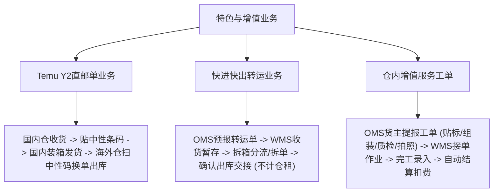
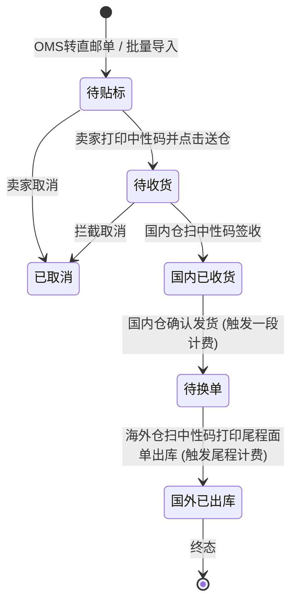

# 领星WMS知识库：特色增值业务与工单

## 1.业务架构与核心流程

【手册事实】领星海外仓除常规B2C代发与入库外，重点构建了三大特色与增值履约体系：平台直邮单履约（Temu Y2小包国内集运至海外换单）、快进快出转运业务（Cross-docking越库转运）、以及仓内增值加工工单体系（贴标、组装、质检、拍照与自动计费）。

---

## 2.核心功能项详细解析

### 能力项1：Temu Y2平台直邮单全链路履约

- 能力名称：双仓协同跨境直邮单履约
- 所属模块：WMS直邮单中心/OMS货主端
- 使用场景：对接跨境电商平台（如Temu）标记为Y2类型的直邮订单，货物国内集货、国际干线运输、海外仓落地换单派送。
- 操作角色：OMS卖家、国内集运仓操作员、海外仓操作员
- 前置条件、配置或依赖：租户在管理后台-全局设置中开启“直邮单设置”[LX-WMS-004]。
- 操作流程及系统响应：
  1. 生成直邮单：卖家在OMS平台订单列表选中Temu Y2订单，点击“转直邮单”，选择国内发货仓，系统自动生成直邮单[LX-WMS-004]；
  2. 打印中性条码：单据进入“待贴标”状态，卖家下载并打印系统生成的“中性条码”贴于包裹外表面[LX-WMS-004]；
  3. 国内仓收货：卖家点击送仓后单据变为“待收货”；国内仓使用PDA或PC扫描中性条码完成签收，单据变更为“国内已收货”[LX-WMS-004]；
  4. 国内装箱发货：国内仓可使用“装箱单”功能将多个小包合装入大箱并称重打标，点击“确认发货”，单据进入“待换单”状态，系统此时自动触发第一阶段费用扣减（国内操作费/干线运费）[LX-WMS-004]；
  5. 海外仓落地换单出库：货物到达海外仓后，作业员扫描包裹上的中性条码，系统自动检索直邮单并打印对应尾程快递面单（如USPS、UPS等）；贴附新面单后完成换单出库，单据流转为终态“国外已出库”，触发第二阶段尾程费用结算[LX-WMS-004]。
- 涉及的业务对象、单据及对象关系：平台Y2订单、直邮单、中性条码、装箱单、海外尾程面单。一个装箱单包含多个直邮包裹。
- 关键字段、字段含义和可选值：
  - 直邮单状态：待贴标、待收货、国内已收货、待换单、国外已出库、已取消[LX-WMS-004]；
  - 中性条码：串联国内段与海外段的唯一中性编码；
  - 国内发货仓、海外目的仓、尾程物流渠道、实重、材积重。
- 状态及状态变化：待贴标 -> 待收货 -> 国内已收货 -> 待换单 -> 国外已出库。
- 对订单、库存、费用或外部系统的影响：
  - 【手册事实】直邮单属于流转单据，在海外仓不占用在架货位，不计算仓租；
  - 【手册事实】两阶段扣费：国内仓确认发货触发前置运费预扣，海外仓换单完成结算尾程派送费[LX-WMS-004]。
- 校验规则、异常情况和处理方式：
  - 【手册事实】单据截单：国内仓发货前支持OMS取消或WMS截单；一旦海外仓完成换单出库，单据进入不可逆终态[LX-WMS-004]；
  - 【手册事实】海外仓换单时若扫描的中性条码未找到国内发货记录，系统报警拦截。
- 权限或适用范围：开启直邮单配置的租户与海外仓。
- 对应来源编号和证据位置：[LX-WMS-004]使用WMS处理直邮单（第1节至第4节）；[LX-WMS-003]使用WMS处理装箱单。
- 尚未确认的问题：【待确认】海外仓换单若因尾程面单API超时未能出单，系统是否具备离线缓存出单机制，原文未说明。

---

### 能力项2：快进快出转运业务（越库Cross-docking）

- 能力名称：越库转运与动态拆单出库
- 所属模块：WMS转运中心/OMS货主端
- 使用场景：货主货物仅在海外仓进行短暂集散、中转交接或拆箱分拨，不需要入库上架存储。
- 操作角色：WMS转运操作员、OMS货主
- 前置条件、配置或依赖：货主在OMS提报转运单预报[LX-OMS-044]。
- 操作流程及系统响应：
  1. 预报接入：货主在OMS提交转运单，录入箱数、目的地址或关联托盘号，单据流转为“待收货”[LX-WMS-046]；
  2. 仓库收货：货物到仓，仓库在转运模块点击收货，核对箱数、录入实际到仓箱数与托盘数，可分配至暂存库位，单据变为“已收货”[LX-WMS-046]；
  3. 拆单与出库[LX-WMS-046]：
     - 整单转运：核对无误直接点击“确认出库”，单据变更为“已转运”；
     - 拆单分拨：若同一批货物需转运往不同目的地，仓库可选择“拆单”，录入各个子单的箱数与收件地址，分批出库；
     - 部分出库：部分箱子先行出库后，单据流转为“部分转运”，直至全部交接完毕更新为“已转运”。
- 涉及的业务对象、单据及对象关系：转运单、转运子单、暂存库位。
- 关键字段、字段含义和可选值：
  - 转运单状态：草稿、待收货、已收货、部分转运、已转运、已取消[LX-WMS-046]；
  - 实收箱数、托盘数、暂存库位、转运目的地址、承运物流商。
- 状态及状态变化：待收货 -> 已收货 -> 部分转运 -> 已转运。
- 对订单、库存、费用或外部系统的影响：
  - 【手册事实】转运属于快进快出业务，系统不生成常规产品库存，绝不收取仓租费[LX-WMS-046]；
  - 【手册事实】费用结算机制：系统默认不自动生成转运费用单据；若仓库需要向货主收取装卸费或转运操作费，需在OMP业务费用中手动补录业务流水[LX-WMS-046]。
- 校验规则、异常情况和处理方式：【手册事实】草稿与待收货状态下支持修改和取消；一旦仓库操作收货后，单据不可直接取消[LX-WMS-046]。
- 权限或适用范围：WMS转运业务权限。
- 对应来源编号和证据位置：[LX-WMS-046]使用WMS处理转运（第1节至第4节FAQ）；[LX-OMS-044]使用OMS预报转运单。
- 尚未确认的问题：【待确认】转运单是否支持配置标准操作费报价模板实现自动计费，手册正文明确回答“建议在OMP手工补录流水”。

---

### 能力项3：仓内增值服务工单与自动计费闭环

- 能力名称：增值服务工单流转与计费自动化
- 所属模块：WMS工单中心/OMS货主端/OMP财务模块
- 使用场景：货主向海外仓发起非标准定制服务请求，如商品重新贴标、换包装盒、组合加工组装、通电抽检、实物拍照等。
- 操作角色：OMS货主、WMS工单作业员、OMP财务审核员
- 前置条件、配置或依赖：在OMP完成增值服务类型与计费规则配置[LX-WMS-070]。
- 操作流程及系统响应：
  1. 工单提报：货主在OMS选择工单类型（贴换标、加工、拍照、质检等），录入涉及SKU、操作要求、附件说明，提交至仓库[LX-OMS-054]；
  2. 工单接单与作业：WMS仓库人员在“工单管理”查看待处理工单，打印工单作业单，指派人员执行仓内作业[LX-WMS-005]；
  3. 完工确认与实数录入：作业完成后，在WMS端录入实际作业数量、上传完成照片或说明；
  4. 自动计费结算：在工单服务配置中若开启了自动计费，工单完工审核通过时，系统自动套用报价模板中的单价乘以实测/完工数量，自动生成应收费用账单流水，扣减货主账户余额[LX-WMS-070]。
- 涉及的业务对象、单据及对象关系：增值服务工单、作业项目明细、费用单据、物料消耗记录。
- 关键字段、字段含义和可选值：
  - 工单类型：贴标、换标、组装、拆卸、拍照、质检、定制包装；
  - 工单状态：待接单、处理中、已完成、已驳回、已取消[LX-OMP-081]；
  - 申请数量、实际完成数量、增值服务单价、总费用。
- 状态及状态变化：待接单 -> 处理中 -> 已完成。
- 对订单、库存、费用或外部系统的影响：
  - 【手册事实】组装/拆装工单完工时可触发子母件库存联动转换；
  - 【手册事实】工单审核通过自动生成业务费用，实时体现在OMP与OMS资金流水中[LX-WMS-070]。
- 校验规则、异常情况和处理方式：【手册事实】若货主账户余额不足且未开启透支额度，系统根据全局财务规则阻断工单终审或提示充值[LX-WMS-070]。
- 权限或适用范围：WMS工单权限、OMS工单提报权限。
- 对应来源编号和证据位置：[LX-WMS-005]使用WMS处理工单；[LX-WMS-069]如何使用工单完成增值服务；[LX-WMS-070]如何实现工单自动计费；[LX-OMP-081]使用OMP查阅工单状态。
- 尚未确认的问题：【待确认】工单物料消耗（如消耗的纸箱、气泡袋、胶带）是否能直接在工单中扣减物料库存，原文未详细说明。

---

## 3.核心业务对象与状态机流转

### 直邮单全生命周期状态机

---

## 4.分析建议与系统边界启示

【分析建议】针对自研QS-WMS产品设计，领星特色业务的启示与优化空间如下：
1. **中性条码体系解耦平台与实体物流**：领星在Temu Y2直邮单中采用“中性条码”贯穿国内仓集包与海外仓换单，国内仓免见海外最终尾程面单，海外仓免知国内揽收细节，数据隔离清晰且高效，非常适合跨境专线和全托管/半托管物流服务商；
2. **转运业务的手工计费短板**：领星官方手册明确承认“转运单是快进快出业务，系统不生成费用单据，需要去OMP手工补录流水”。这在转运单量较大的仓库中存在严重的人工漏计费风险。QS-WMS应当在转运模块设计自动化的按托/按箱装卸费和按天暂存费计算规则，填补此项空白；
3. **工单驱动标准化增值服务**：海外仓利润很大一部分来源于贴标、换包装、拍照等增值作业。领星通过工单将线下零散作业线上化并自动生成计费，有效避免了海外仓“干了活却没收上钱”的管理死角。
