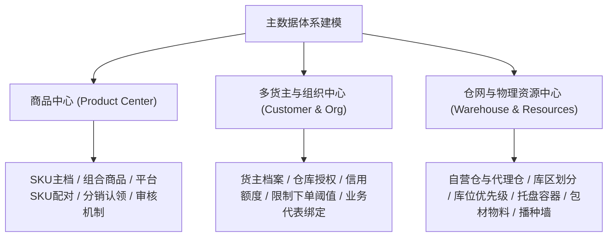
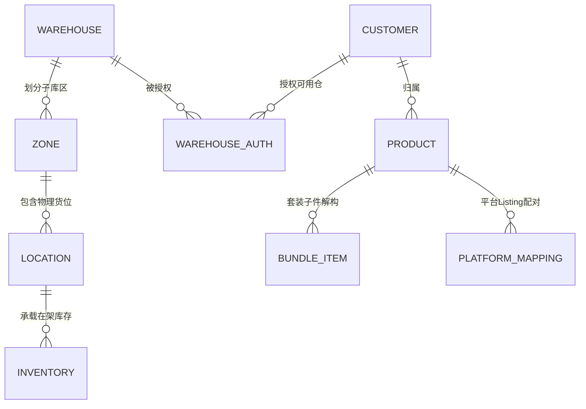

# 领星WMS知识库：基础数据与主数据建模

## 1.业务架构与核心流程

【手册事实】领星海外仓基础数据架构划分为三大核心域：商品主数据中心（产品SKU、组合商品、条码、分销与平台配对）、多货主组织架构与风控中心（客户建档、可用仓授权、信用授信与账期管理）、以及仓网与物理资源建模中心（仓库属性、库区、库位、托盘容器、包材物料与播种墙）。

---

## 2.核心功能项详细解析

### 能力项1：商品主数据、生命周期审核与平台配对

- 能力名称：全生命周期商品中心与多平台SKU配对
- 所属模块：OMP管理后台/OMS货主端/WMS仓端
- 使用场景：货主发布新商品、组合套装捆绑销售、多店铺平台商品条码映射与仓库端实物防错。
- 操作角色：OMS货主、OMP运营审核员
- 前置条件、配置或依赖：在OMP开启“产品审核”流开关[LX-OMP-077]。
- 操作流程及系统响应：
  1. 商品建档：货主在OMS手动录入、Excel批量导入，或通过领星ERP/店铺API自动同步商品主数据[LX-OMS-032, LX-OMS-074]；
  2. 属性录入：维护产品中文名称、英文名称、申报名称、报关价值、海关HS编码、产品分类、是否带电/带磁/纯电、预估长宽高与毛重[LX-OMP-076]；
  3. 组合商品（Bundle）：支持将多个单品SKU按特定比例绑定为组合商品（套装）；组合商品不独立存储实物，销售时根据子件库存动态计算可用量，出库时自动解构为各子件下发拣货任务[LX-OMS-049]；
  4. 平台SKU配对：多平台（Amazon、Shopify、SHEIN、TEMU等）的商品Listing与海外仓标准SKU建立1对1或多对1映射关系；当平台订单流入时，系统通过配对表自动转换为海外仓标准SKU[LX-OMS-066]；
  5. 审核机制：货主创建的商品需经OMP管理后台审核通过后，方可正式生效并同步至WMS执行入库或出库操作[LX-OMP-077]。
- 涉及的业务对象、单据及对象关系：系统商品SKU、平台商品SKU、组合商品映射明细、海关申报明细。
- 关键字段、字段含义和可选值：
  - 产品状态：草稿、待审核、已审核、已禁用[LX-OMP-077]；
  - 属性标签：普货、含电（内置电池）、纯电、特货、液体、粉末；
  - 条码类型：系统条码、厂商条码、FNSKU、自定义UPC/EAN。
- 状态及状态变化：草稿 -> 待审核 -> 已审核。
- 对订单、库存、费用或外部系统的影响：
  - 【手册事实】只有审核通过的产品才允许在OMS创建入库单或出库单[LX-OMP-004]；
  - 【手册事实】若产品审核后修改了名称，后续已生成出库单仍沿用历史单据名称，新订单出库时方展示更新后的名称[LX-OMP-048]。
- 校验规则、异常情况和处理方式：
  - 【手册事实】若出库单中包含未通过审核的SKU，推送WMS时报错“仓库返回:SKU未审核”或“仓库返回:SKU不存在”[LX-OMP-005, LX-OMP-035]；
  - 【手册事实】SHEIN平台订单流转中若缺少配对映射，系统报错拦截提示“平台SKU不能为空”[LX-OMS-036]。
- 权限或适用范围：OMP审核权限、OMS建档权限。
- 对应来源编号和证据位置：[LX-OMP-076]使用OMP实现创建产品；[LX-OMP-077]使用OMP实现产品审核；[LX-OMS-066]使用OMS实现产品配对；[LX-OMP-004]传入产品sku有误或产品未通过审核排查。
- 尚未确认的问题：【待确认】商品属性修改后（如变更为带电品），系统是否支持自动重算在途订单运费并拦截不合规物流渠道，原文未说明。

---

### 能力项2：客户/货主主数据与资金风控建模

- 能力名称：多货主组织建模与信用授信风控
- 所属模块：OMP管理后台
- 使用场景：海外仓为多个第三方跨境电商卖家提供独立隔离的仓储物流服务，并对货主账户进行授信与风险控制。
- 操作角色：OMP财务经理、运营总监
- 前置条件、配置或依赖：管理后台拥有客户管理权限。
- 操作流程及系统响应：
  1. 客户建档：录入客户名称、编码、联系人、登录账号，并生成OMS货主端专属访问环境[LX-OMP-067]；
  2. 仓库授权：在客户档案中选择该货主被允许使用的海外仓列表（支持批量多选配置可用仓），未授权的仓库在货主端隐蔽不可选[LX-OMP-068]；
  3. 业务团队绑定：为客户绑定专属的销售代表与客服代表角色，便于业绩提成与协同跟进[LX-OMP-030]；
  4. 资金风控配置[LX-OMP-016]：
     - 信用额度（透支额度）：允许货主先发货后结算的最大欠款额度；
     - 限制下单金额（强停机阈值）：当货主欠费超过信用额度并达到此限制金额时，系统强制阻断OMS提交出库单与打单；
     - 预警余额：当货主余额低于此阈值时，系统触发短信/邮件充值预警通知；
     - 信用额度到期日：设定授信有效期限，到期后信用额度自动失效归零[LX-OMP-018]。
- 涉及的业务对象、单据及对象关系：客户主档、用户账号、仓库授权映射表、风控授信记录、充值流水。
- 关键字段、字段含义和可选值：
  - 客户状态：正常、冻结、停用[LX-OMP-067]；
  - 信用额度、限制下单金额、预警余额、信用额度到期日、可用仓库列表。
- 状态及状态变化：正常可用 -> 欠费预警 -> 欠费超限停机。
- 对订单、库存、费用或外部系统的影响：
  - 【手册事实】货主欠费超限时，出库单提交直接被系统拦截为异常单[LX-OMP-015]；
  - 【手册事实】充值后系统不会自动重推异常订单，需手动转草稿重新提交提审[LX-OMP-015]。
- 校验规则、异常情况和处理方式：【手册事实】当客户试图下单至未获授权的仓库时，接口直接报错提示无权访问[LX-OMP-068]。
- 权限或适用范围：OMP最高管理与财务权限。
- 对应来源编号和证据位置：[LX-OMP-067]使用OMP客户列表进行客户管理；[LX-OMP-068]如何批量配置客户可用仓；[LX-OMP-016]批量调整信用额度与限制下单金额；[LX-OMP-018]配置信用额度到期日。
- 尚未确认的问题：【待确认】信用额度到期日前是否支持系统向客户自动推送催缴账单邮件，原文未提及。

---

### 能力项3：仓网、库区与库位拓扑建模

- 能力名称：物理仓网拓扑建模与货位动线规划
- 所属模块：WMS基础数据/OMP系统设置
- 使用场景：仓库数字化建模，将物理空间映射为系统的多级仓储网络结构，支撑最优拣货动线与精细化空间管理。
- 操作角色：WMS仓库主管
- 前置条件、配置或依赖：在OMP完成仓库建档后，在WMS端开展库区与库位规划。
- 操作流程及系统响应：
  1. 仓库建模：区分自营仓（自主管理）与代理仓（三方合作仓），设置仓库地理位置、时区与度量衡体系（公制/英制）[LX-OMS-069, LX-OMP-038]；
  2. 库区规划：根据作业职能划分子库区，如存储区、拣选区、不良品区、暂存区、退货区；设置库区优先级与功能属性[LX-WMS-014]；
  3. 库位生成：采用“通道-货架-层-列-格”层级编码规则（例如：A-01-02-03）；支持按规则批量生成库位编码；
  4. 库位属性配置：维护库位拣货优先级（数值越大或越小依据规则排序）、库位长宽高尺寸、最大容积、最大承重重量[LX-WMS-012]；
  5. 物理设施维护：
     - 包材物料：维护纸箱、快递袋、气泡膜，设置包材编码、内尺寸、外尺寸、自重、采购成本，用于出库扫描绑定与计算运费[LX-WMS-015]；
     - 实体播种墙：维护实体播种墙设备（编码、行数、列数，最大15*15），用于出库二次分拣分播[LX-WMS-011]。
- 涉及的业务对象、单据及对象关系：仓库（Warehouse）、库区（Zone）、库位（Location）、包材物料（Packaging Material）、播种墙（Sorting Wall）。
- 关键字段、字段含义和可选值：
  - 库位类型：拣选位、存货位、暂存位、不良品位[LX-WMS-012]；
  - 库位状态：空闲、占用、禁用；
  - 库位拣货优先级：数值决定出库波次锁定与拣货行走顺序[LX-WMS-044]。
- 状态及状态变化：启用 -> 禁用。
- 对订单、库存、费用或外部系统的影响：
  - 【手册事实】库位优先级直接决定库存分配引擎挑选库存的先后次序[LX-WMS-044]；
  - 【手册事实】包材维护的实测自重直接参与出库包裹理论重量重算（包裹重量=内含SKU重量+包材自重）[LX-WMS-053]。
- 校验规则、异常情况和处理方式：【手册事实】若库位已被库存占用，系统禁止直接删除该库位，必须先执行移库将库存清零[LX-WMS-012]。
- 权限或适用范围：WMS基础配置权限。
- 对应来源编号和证据位置：[LX-WMS-012]使用wms创建库位；[LX-WMS-014]使用WMS创建库区；[LX-WMS-015]使用WMS创建包材；[LX-WMS-011]使用WMS创建播种墙。
- 尚未确认的问题：【待确认】库位是否支持容积率与重量超限强预警（当上架物品体积或重量超过库位物理上限时是否报警阻断），原文未提及阻断逻辑。

---

## 3.核心业务对象与关系模型

---

## 4.分析建议与系统边界启示

【分析建议】针对自研QS-WMS产品设计，领星主数据建模的启示与优化空间如下：
1. **多级资金风控网构建**：领星在客户主档中设置了“信用额度（透支）- 预警余额（催款）- 限制下单金额（断崖停机）- 额度到期日（账期闭环）”四道防线，有效解决了海外仓行业极度普遍的客户欠款跑路风险，这一模型应当作为QS-WMS财务风控的标准设计；
2. **组合商品动态解构而非实体组装**：领星将组合商品设计为虚拟映射关系，出库时动态解构扣减子SKU，无需仓库频繁走线下加工打包流程，极大提升了电商套装促销的履约灵活性；
3. **包材作为一级实物资源管理**：将包材不仅作为耗材扣费，更深度介入出库包裹称重模型（理论自动算重免二次人工称重），在保证物流运费试算精度的同时大幅提高了打包出库效率。
