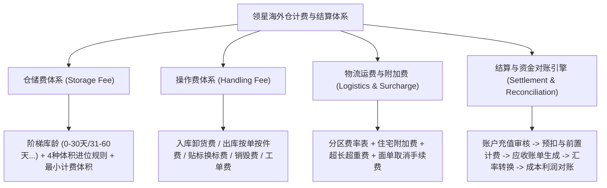

# 领星WMS知识库：计费结算与财务规则

## 1.业务架构与核心流程

【手册事实】领星海外仓财务与计费体系涵盖四大费用大类：仓储费（按阶梯库龄与体积进位）、库内操作费（入库、出库、贴换标、增值作业）、物流运费与附加费（首续重、分区试算、承运商附加费）、以及多货主财务结算引擎（账户预充值、分节点预扣与轧差、应收账单模板、汇率换算与成本对账）。

---

## 2.核心功能项详细解析

### 能力项1：阶梯库龄仓租费与四级体积进位引擎

- 能力名称：高精度阶梯仓租与批次体积进位计算
- 所属模块：OMP报价设置/财务计费引擎
- 使用场景：海外仓按日自动计算货主商品的仓储占用费用，鼓励快进快出，防范死库存积压。
- 操作角色：OMP财务经理
- 前置条件、配置或依赖：在OMP“报价设置-仓租费”中创建仓租费模板并绑定客户总报价方案[LX-OMP-056]。
- 操作流程及系统响应：
  1. 阶梯库龄段划分：按在库天数灵活定义阶梯区间，如0-30天、31-60天、61-90天、91-180天、181天以上；各区间配置不同的立方米/立方英尺单价（通常库龄越长单价越高）[LX-OMP-049]；
  2. 最小计费体积设定：可指定单个SKU的最小计费体积（如0.001立方米），若实物小于该值强制按此值兜底计算[LX-OMP-049]；
  3. 四大体积进位规则（二选一或组合）[LX-OMP-052]：
     - 不进位：直接按实打实原始体积累加（单个体积*数量总和）[LX-OMP-052]；
     - 不满1进位（单个库存）：按“单个SKU+批次”维度进位，该批次库存总体积不足1方直接按1方计费[LX-OMP-052]；
     - 不满1进位（按相同批次的总体积）：同一天上架的全部库存总体积累加，不足1方进位为1方[LX-OMP-052]；
     - 不满1进位（按批次范围总体积）：处于同一库龄段（如1-30天）的全部批次库存体积累加，不足1方进位为1方[LX-OMP-052]；
  4. 日结自动跑批：每日凌晨系统跑批抓取在架库存，计算每个SKU的计费体积与当日仓租，自动生成仓租流水单据[LX-OMP-049]。
- 涉及的业务对象、单据及对象关系：仓租报价方案、在架批次库存、每日仓租流水账单。
- 关键字段、字段含义和可选值：
  - 库龄（天）、库龄阶梯区间、仓租单价（元/方/天 或 $/ft³/day）；
  - 原始体积、最小计费体积、计费体积、进位类型[LX-OMP-049, LX-OMP-052]。
- 状态及状态变化：每日计算 -> 记入未出账流水 -> 月结汇总至应收账单。
- 对订单、库存、费用或外部系统的影响：
  - 【手册事实】仓租按日从货主账户余额中划扣；
  - 【手册事实】若配置了不满1进位，少量存货客户的账面计费体积会显著大于实物物理体积[LX-OMP-049]。
- 校验规则、异常情况和处理方式：【手册事实】报价方案更新后，新费率仅对后续生成的费用单据生效，客户历史已扣费单据不自动回溯重算[LX-OMP-050]。
- 权限或适用范围：OMP报价与财务权限。
- 对应来源编号和证据位置：[LX-OMP-049]仓租费方案的计费逻辑；[LX-OMP-052]如何选择仓租费方案的体积进位；[LX-OMP-050]报价方案更新后之前的单会自动同步吗；[LX-OMP-056]使用OMP设置仓租费。
- 尚未确认的问题：【待确认】仓租跑批扣费若因客户余额不足导致扣款失败，系统是否按日累计滞纳金，原文未提及滞纳金配置项。

---

### 能力项2：库内多维度操作费与增值费计价模型

- 能力名称：全业务场景操作费灵活计价模型
- 所属模块：OMP报价中心
- 使用场景：对入库卸货、上架、代发出库拣选、整箱中转出库、贴标、换标、打托盘等仓内人工动作进行标准化计费。
- 操作角色：OMP运营与财务人员
- 前置条件、配置或依赖：在OMP“报价设置-操作费”中按业务类型创建方案[LX-OMP-053]。
- 操作流程及系统响应：
  1. 费用类型分类维护：支持一件代发出库操作费、备货中转出库操作费、常规入库操作费、退件处理费、工单增值服务费[LX-OMP-053]；
  2. 灵活计费变量与条件引擎[LX-OMP-053]：
     - 代发操作费：支持按单收费（首件费）、按件累加（续件费）、以及按重量阶梯加收；
     - 备货中转操作费：支持按出库箱数计费、按出库托盘数计费，并支持在条件与计费变量中引入【换标箱数】与【换标产品数】[LX-WMS-050, LX-OMP-053]；
     - 入库操作费：支持按卸货箱数、按托盘数或按SKU件数计收；
  3. 触发时机：
     - 入库费：默认入库单完结（已上架）时计费；若开启“入库前置计费”，则按每次上架增量预扣[LX-OMP-055]；
     - 出库费：单据完成出库时与物流运费一并实扣[LX-WMS-055]。
- 涉及的业务对象、单据及对象关系：操作费报价模板、出入库单据、业务费用单。
- 关键字段、字段含义和可选值：基础单费、首件费、续件费、重量区间单价、换标箱数、换标产品数。
- 状态及状态变化：单据完工 -> 触发算费 -> 生成已扣费业务账单。
- 对订单、库存、费用或外部系统的影响：【手册事实】出库操作费直接从账户可用余额扣除，若余额不足触发拦截。
- 校验规则、异常情况和处理方式：【手册事实】换标计费优先采用仓库回填的实际换标数量；若仓库未录入实数，自动降级引用客户预报换标数量计费[LX-WMS-050]。
- 权限或适用范围：OMP报价配置权限。
- 对应来源编号和证据位置：[LX-OMP-053]如何在omp创建操作费；[LX-WMS-050]第3节单据完成后自动计算换标费用；[LX-OMP-055]使用OMP开启入库前置计费。
- 尚未确认的问题：【待确认】大件商品超重人工搬运费（如超过50lb需双人搬运加收费），是否支持在操作费中配置自动触发公式，原文未详细展开。

---

### 能力项3：物流运费、分区规则与承运商附加费

- 能力名称：动态物流运费试算与多维附加费引擎
- 所属模块：OMP报价设置/物流中心
- 使用场景：对接UPS、FedEx、USPS、DHL及各类专线物流商，按邮编分区精确核算尾程派送运费与各类承运商附加费。
- 操作角色：OMP物流经理、OMS下单卖家
- 前置条件、配置或依赖：在OMP维护物流费模板与分区规则，或直接开启“引用物流商报价”[LX-OMP-022, LX-OMP-054]。
- 操作流程及系统响应：
  1. 物流费模板创建：录入各Zone（Zone 2至Zone 8等）的重量费率表（首重与续重单价），支持配置计费重折算比率（如材积系数1:5000或除以139/166）[LX-OMP-054, LX-OMP-116]；
  2. 邮编分区映射：配置发货仓邮编与目的地址Zip Code的前缀匹配规则，自动确定所属Zone[LX-OMP-051, LX-OMP-112]；
  3. 承运商多维附加费规则引擎[LX-OMP-014, LX-OMP-119]：
     - 住宅地址附加费（Residential Surcharge）：勾选后在试算与实际打单时自动加收[LX-OMP-046]；
     - 超长/超重附加费（AHC / Oversize）：定义单边长度、长+周长、或单件实重阈值，超限自动加收定额或比例费用；
     - 偏远/超偏远派送费（DAS / EDAS）；
     - 旺季附加费（Peak Season Surcharge）：按生效时间段自动附加；
  4. 运费试算工具：OMS货主端与OMP后台均提供“运费试算”功能，输入目的邮编与实重/尺寸，一键比价并展示总运费明细[LX-OMP-110]；
  5. 面单取消手续费：配置货主在已出面单后申请取消的违约惩罚手续费，分为固定按单扣费或按运费百分比扣除[LX-OTH-001]。
- 涉及的业务对象、单据及对象关系：物流费模板、分区规则表、附加费规则集、运费试算记录、面单账单。
- 关键字段、字段含义和可选值：
  - 分区代码（Zone）、首重、续重、计费重（取实重与材积重较大值）；
  - 附加费类型：住宅附加费、超大件费、旺季费、签名确认费、面单取消手续费[LX-OMP-014, LX-OTH-001]。
- 状态及状态变化：预报算费 -> 出库称重核定实扣。
- 对订单、库存、费用或外部系统的影响：
  - 【手册事实】运费试算时若勾选了对应选项，系统会自动计入住宅等附加费[LX-OMP-046]；
  - 【手册事实】直接引用物流商API报价的渠道，运费按承运商实际返回账单结算[LX-OMP-022]。
- 校验规则、异常情况和处理方式：【手册事实】若实测包裹超出物流商最高限制（如UPS单件超150磅），系统出库校验拦截，禁止打印面单。
- 权限或适用范围：OMP物流报价权限。
- 对应来源编号和证据位置：[LX-OMP-054]使用OMP设置物流费；[LX-OMP-014]如何理解UPS、USPS和FedEx运输附加费；[LX-OMP-046]试算运费加上住宅附加费；[LX-OMP-110]使用OMP实现运费试算；[LX-OTH-001]如何配置面单取消手续费。
- 尚未确认的问题：【待确认】燃油附加费（Fuel Surcharge）是否支持按周或按月自动联网承运商官网实时更新浮动比例，原文未提及自动抓取机制。

---

### 能力项4：资金结算、多币种汇率管理与成本对账

- 能力名称：多货主资金结算闭环与成本利润核算
- 所属模块：OMP财务中心/OMS货主中心
- 使用场景：货主预充值、审核到账、出入库自动扣费、账期生成应收账单、以及海外仓核算自身物流与仓租真实采购成本与毛利。
- 操作角色：OMP财务总监、出纳员、OMS货主财务
- 前置条件、配置或依赖：在OMP维护收款账户、汇率表与账单模板[LX-OMP-062, LX-OMP-108]。
- 操作流程及系统响应：
  1. 充值管理与审核：货主在OMS提交充值申请（支持线下银行转账凭证上传或线上支付），OMP财务在“充值审核”核实资金到账后点击审核通过，货主账户可用余额即刻增加[LX-OMP-069]；
  2. 多币种与汇率换算：支持美元（USD）、人民币（CNY）、欧元（EUR）、英镑（GBP）等主流货币；支持设置基准汇率与充值换算汇率，客户充值非结算币种时按预设汇率自动换算入账[LX-OMP-070]；
  3. 应收账单生成：基于预置的“账单模板”，按账期（如半月结、月结）自动汇总货主的所有业务费用（仓租、出入库、运费、增值费），一键生成应收账单并导出PDF/Excel供货主对账确认[LX-OMP-062, LX-OMP-063]；
  4. 成本对账（利润分析）：在OMP导入物流商及供应商的实际成本对账单（如FedEx官方账单），系统自动以运单跟踪号为键（Key）进行双向匹配，自动比对“向客户应收金额”与“向物流商应付成本”，输出各订单与渠道的毛利润报表[LX-OMP-064]。
- 涉及的业务对象、单据及对象关系：客户充值单、资金流水账目、汇率配置表、应收账单、成本对账单、利润分析表。
- 关键字段、字段含义和可选值：
  - 账户余额、可用余额、冻结金额、授信额度；
  - 账单状态：待确认、已确认、已结清、已逾期[LX-OMP-063]；
  - 应收金额、应付成本金额、对账毛利、毛利率[LX-OMP-064]。
- 状态及状态变化：业务扣费流水 -> 周期账单生成 -> 货主对账确认 -> 财务核销。
- 对订单、库存、费用或外部系统的影响：【手册事实】充值与扣费实时反映在OMS资金流水明细中，支持一单一笔全可追溯[LX-OMP-055, LX-OMP-061]。
- 校验规则、异常情况和处理方式：【手册事实】成本对账导入若存在跟踪号不匹配的单据，系统单独放入“未匹配异常列表”供人工排查[LX-OMP-064]。
- 权限或适用范围：OMP核心财务权限。
- 对应来源编号和证据位置：[LX-OMP-069]使用OMP充值审核；[LX-OMP-070]汇率管理与多币种转换；[LX-OMP-062]使用OMP创建账单模板；[LX-OMP-063]使用OMP创建应收账单；[LX-OMP-064]使用OMP实现成本对账。
- 尚未确认的问题：【待确认】应收账单是否支持直接对接主流ERP财务软件（如金蝶、用友、QuickBooks），原文未见直接对接API。

---

## 3.核心业务对象与状态机流转

### 账单结算全链路流转

---

## 4.分析建议与系统边界启示

【分析建议】针对自研QS-WMS产品设计，领星计费结算体系的启示与优化空间如下：
1. **体积进位规则的商业智慧**：领星提供的四种进位模式（尤其是不满1方按批次或按库龄段进位），是海外仓在面对小卖家碎散货品时保障基本货位收益的核心商业工具。QS-WMS在设计仓租引擎时必须将这四种进位算法作为标准选项内嵌；
2. **两阶段前置计费的资金防护**：在入库环节实行分节点增值预扣，在直邮环节实行国内发货与国外出库两阶段扣款，真正做到了“干多少活扣多少钱，钱不足不发后续货”，极大压缩了坏账空间；
3. **闭环的成本对账与毛利分析**：海外仓不能只做应收系统，必须同时具备承运商成本对账能力。领星通过跟踪号比对应收与应付，自动计算毛利，解决了海外仓老板“不知道每条渠道、每个客户到底赚不赚钱”的核心痛点，QS-WMS应重点打造此能力。
