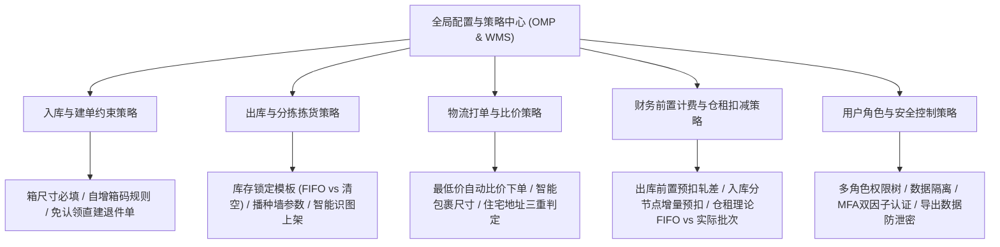
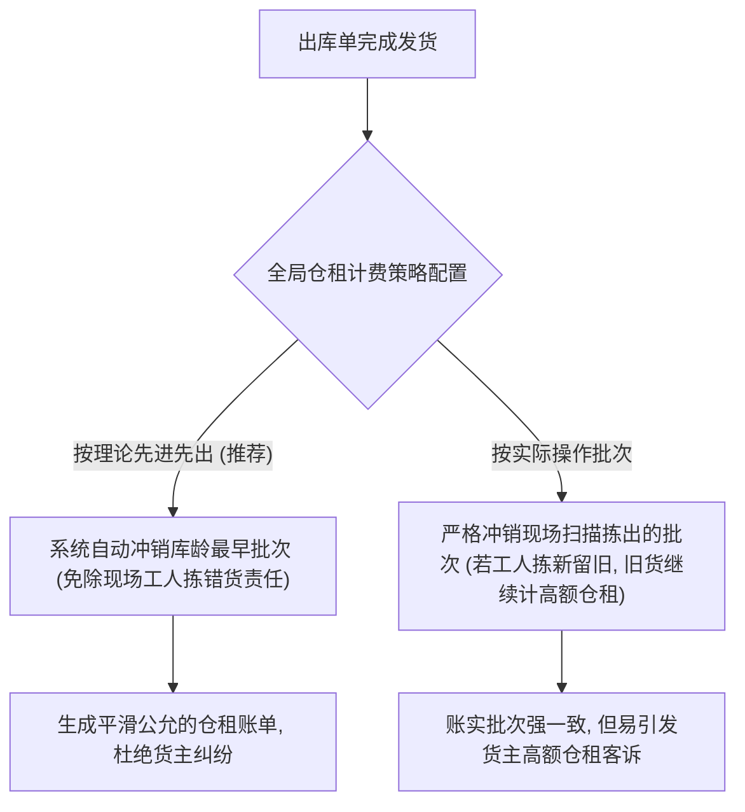

# 领星WMS知识库：系统配置与作业策略

## 1.业务架构与核心流程

【手册事实】领星海外仓的策略与配置体系集中于OMP管理后台的“全局设置”与WMS仓端的作业策略引擎，控制着全系统的单据校验规则、作业流转分支、自动化风控阈值、权限边界以及底层计费逻辑。

---

## 2.核心功能项详细解析

### 能力项1：全系统全局业务规则配置集

- 能力名称：全链路业务参数与单据控制开关
- 所属模块：OMP管理后台系统设置
- 使用场景：海外仓企业根据自身经营模式（自营仓、大件仓、第三方平台合作仓），定制个性化的系统流转与强校验规则。
- 操作角色：OMP超级管理员
- 前置条件、配置或依赖：具备管理后台系统设置最高权限。
- 操作流程及系统响应：
  1. 进入【OMP】→【系统设置】→【全局设置】，按模块配置参数[LX-OMP-104]；
  2. 度量衡体系：全局切换公制单位（kg/cm）或英制单位（lb/in）[LX-OMP-104]；
  3. 入库控制配置：
     - 常规入库强制录入箱尺寸重量（开启后OMS建单为必填项）[LX-OMP-104]；
     - 备货中转强制填写自定义箱条码（用于仓库自有箱唛管理）[LX-OMP-104]；
     - 自定义箱条码自增规则：可选不自增、自增箱号、FBA箱唛号、美客多箱唛号，支持指定客户开启[LX-OMP-104]；
  4. 出库校验约束：
     - 一件代发出库强制填写收件电话、强制填写省州（适配第三方物流商API接口强校验）[LX-OMP-104]；
     - 备货中转强制填写货件追踪码、强制填写期望到仓时间[LX-OMP-104]；
  5. 逆向退件开关：配置特定客户在PDA扫描包裹找不到预报退件单时，支持直接给该客户创建退件单并清点，无需走认领流程[LX-OMP-104]；
  6. 业务模块启闭：分销业务开关（开启后不可关闭）、直邮单业务开关（开启后不可禁用）、认领单过期隐藏开关[LX-OMP-104]。
- 涉及的业务对象、单据及对象关系：全局系统参数、客户配置表、单据校验引擎。
- 关键字段、字段含义和可选值：
  - 计量单位：公制、英制；
  - 箱条码规则：不自增、系统自增、FBA箱唛号、美客多箱唛号[LX-OMP-104]；
  - 必填开关：收件电话、省州、货件追踪码、期望到仓时间。
- 状态及状态变化：即时保存并全局生效。
- 对订单、库存、费用或外部系统的影响：【手册事实】配置为必填项后，OMS货主端若未录入对应字段，单据提审直接被前置拦截。
- 校验规则、异常情况和处理方式：【手册事实】分销开关与直邮单开关在手册中明确标注“开启后不支持取消或禁用”，属于不可逆全局变更[LX-OMP-104]。
- 权限或适用范围：租户级全局生效，部分开关支持按客户白名单启用。
- 对应来源编号和证据位置：[LX-OMP-104]使用OMP实现全局设置（第1节、第2节）。
- 尚未确认的问题：【待确认】度量衡单位切换后，历史已生成单据的重量与尺寸数据是否自动按汇率公式换算，原文未提及历史数据兼容逻辑。

---

### 能力项2：打单最低价自动比价与智能包裹尺寸

- 能力名称：物流智能调度与自动比价下单
- 所属模块：OMP管理后台/OMS货主端
- 使用场景：货主拥有多个物流承运商渠道时，系统根据订单重量、目的邮编和体积，自动比对各渠道运费并择优出面单。
- 操作角色：OMP运营配置员、OMS货主
- 前置条件、配置或依赖：在OMP全局设置开启“自动选取价格最低的渠道”与“智能计算包裹尺寸”[LX-OMP-104]。
- 操作流程及系统响应：
  1. 渠道自动比价：开启后，OMS客户创建一件代发出库单时，物流渠道可直接选择【自动选取价格最低的渠道】；打单引擎根据包裹收件地址、实重与材积，自动测算货主绑定的所有可用渠道报价，直接调用最低价渠道API获取面单[LX-OMP-104]；
  2. 智能计算包裹尺寸：开启后，系统根据订单内含SKU的实测长宽高数据与数量，通过三维装箱算法自动计算出最适配的包裹长宽高尺寸，替代人工手动估算，保证物流运费试算精度[LX-OMP-104]；
  3. 住宅地址三重判定规则：提供三种识别模式[LX-OMP-104]：
     - 以外部推送为准（接收ERP或电商平台传入的住宅标记）；
     - 以承运商地址校验API为准（调用UPS/FedEx Address Validation返回结果）；
     - 全部视为住宅（严格风控模式，全量收取住宅附加费）。
- 涉及的业务对象、单据及对象关系：物流费模板、渠道比价引擎、三维尺寸计算器、地址校验日志。
- 关键字段、字段含义和可选值：
  - 渠道选择：指定渠道、自动选取价格最低渠道；
  - 住宅判定：外部推送、承运商校验、全部视为住宅[LX-OMP-104]。
- 状态及状态变化：下单比价 -> 匹配最低价渠道 -> 锁定并获取面单。
- 对订单、库存、费用或外部系统的影响：【手册事实】比价结果直接决定最终面单扣费金额；智能算重降低运费超重罚款风险。
- 校验规则、异常情况和处理方式：【手册事实】若所有可用渠道均未返回有效价格或因超限报错，单据进入异常单列表并提示“无可用物流渠道”[LX-OMP-008]。
- 权限或适用范围：可按指定客户开启[LX-OMP-104]。
- 对应来源编号和证据位置：[LX-OMP-104]全局设置第10项物流、第11项住宅地址判断方式；[LX-OMP-044]系统有打单比价功能吗。
- 尚未确认的问题：【待确认】比价算法是否支持将时效（如2日达与5日达）作为权重参数纳入比价模型，目前手册事实仅展示纯价格排序。

---

### 能力项3：仓租扣减批次双模式策略

- 能力名称：仓租扣减批次理论与实操双轨策略
- 所属模块：OMP系统设置财务模块
- 使用场景：平衡仓库物理作业灵活性与货主仓租结算公正性，解决拣货工人未按先进先出拣货引发的货主仓租投诉。
- 操作角色：OMP财务总监
- 前置条件、配置或依赖：在OMP全局设置“仓租计费逻辑”中二选一[LX-OMP-104]。
- 操作流程及系统响应：
  1. 模式一：按理论先进先出扣减（推荐模式）：
     - 业务逻辑：出库计费时，系统在账面层优先扣减入库时间最早的批次库存，完全不依赖现场拣货员实际扫描拣出的是哪一个批次[LX-OMP-104]；
     - 商业价值：彻底避免由于仓库工人图省事拿了货架外层的新货，导致货架内层的旧货一直在账面产生高阶梯库龄高额仓租，避免客诉与纠纷[LX-OMP-104]；
  2. 模式二：按实际操作批次扣减：
     - 业务逻辑：严格按照拣货与出库时实际扫描的批次号扣减库存并核算库龄；若现场未发旧货，旧库存将持续产生高额滞留仓租[LX-OMP-104]。
- 涉及的业务对象、单据及对象关系：在架批次台账、出库流水单、仓租计算引擎。
- 关键字段、字段含义和可选值：仓租计费逻辑：按理论先进先出、按实际操作批次[LX-OMP-104]。
- 状态及状态变化：日结跑批时依据策略决定批次库龄扣减次序。
- 对订单、库存、费用或外部系统的影响：
  - 【手册事实】选择理论先进先出模式，货主库龄账单将呈现最优平滑曲线；
  - 【手册事实】现场拣货与财务账面批次实现解耦[LX-OMP-104]。
- 校验规则、异常情况和处理方式：【手册事实】策略变更对次日跑批计费生效。
- 权限或适用范围：OMP核心财务权限。
- 对应来源编号和证据位置：[LX-OMP-104]使用OMP实现全局设置第14项仓租计费逻辑。
- 尚未确认的问题：【待确认】食品、化妆品等有严格过期日期的商品，若开启理论先进先出是否会导致实物过期被发运，原文未见特殊效期强阻断配置。

---

### 能力项4：用户角色权限树与数据隔离安全策略

- 能力名称：多级角色权限控制与双因子安全认证
- 所属模块：OMP安全与权限中心
- 使用场景：保障多货主数据隔离、仓内操作人员职责切分、以及敏感财务数据与客户信息的安全防泄密。
- 操作角色：安全审计管理员
- 前置条件、配置或依赖：在OMP“权限管理”中创建角色并分配权限菜单[LX-OMP-065]。
- 操作流程及系统响应：
  1. 角色与权限树配置：采用功能权限（菜单与按钮级）与数据权限（按仓库、按货主范围）双重维度配置；支持创建仓库作业员、出库调度员、财务对账员、客服专员等多类角色[LX-OMP-065]；
  2. 财务与对账敏感数据安全：针对仓库现场作业员需登录系统对账的场景，支持隐藏敏感毛利、隐藏货主成本价、只展示作业量与流水单号[LX-OMP-032]；
  3. MFA二步验证登录（Multi-Factor Authentication）：支持基于手机验证器（Google Authenticator等）的MFA二步验证，登录输入账号密码后强制校验6位动态口令，保障管理员与财务账号免受盗号风险[LX-OMP-127]；
  4. 面单水印防伪：WMS端支持配置面单打印自定义水印，防止面单流失与违规复印发货[LX-WMS-025]。
- 涉及的业务对象、单据及对象关系：系统用户、角色权限树、MFA绑定凭证、操作审计日志。
- 关键字段、字段含义和可选值：角色编码、数据权限范围、MFA启用状态（已开启、未开启）、导出脱敏开关。
- 状态及状态变化：账号启用 -> MFA绑定激活。
- 对订单、库存、费用或外部系统的影响：【手册事实】未授权用户无法访问未分配仓库的任何出入库单据与库存数据。
- 校验规则、异常情况和处理方式：【手册事实】连续密码错误触发账号锁定；动态MFA口令失效需管理员重置密钥[LX-OMP-127]。
- 权限或适用范围：OMP安全管理权限。
- 对应来源编号和证据位置：[LX-OMP-065]使用OMP管理角色；[LX-OMP-127]如何设置MFA设备；[LX-OMP-032]仓库登录OMP对账数据安全；[LX-WMS-025]使用WMS设置面单水印。
- 尚未确认的问题：【待确认】导出Excel表格时是否支持针对客户手机号与收件地址自动打码脱敏，原文未见脱敏字段配置明细。

---

## 3.核心业务对象与状态机流转

### 仓租计费逻辑双轨流转对比

---

## 4.分析建议与系统边界启示

【分析建议】针对自研QS-WMS产品设计，领星策略配置的启示与优化空间如下：
1. **仓租“理论先进先出”是海外仓顶级防客诉利器**：海外仓现场作业极其繁重，拣货员往往随手拿货架最外层货物，导致内层货物库龄越积越长产生天价仓租，卖家对此极其不满。领星的“理论先进先出”直接在财务层面解耦，保护了货主利益与客情关系，QS-WMS必须内嵌该机制；
2. **打单比价与智能三维尺寸**：海外仓物流费占整体履约成本的70%以上，领星在系统层支持“按最低价渠道自动下单”并自带三维装箱尺寸预估，显著降低了货主的运费支出和海外仓人工审单改单成本；
3. **不可逆开关的谨慎设计**：领星在手册中明确标注分销开关和直邮单开关“开启后不支持关闭”。在自研QS-WMS中，建议对高风险模块设计更加弹性的软停用机制或多环境租户隔离，避免客户误触造成数据污染。
