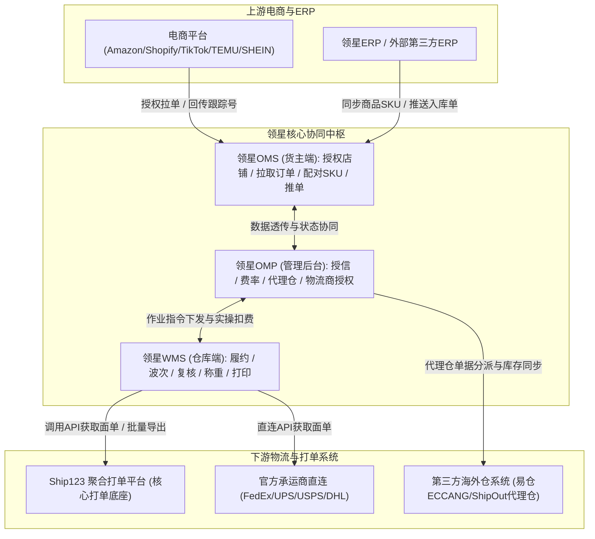
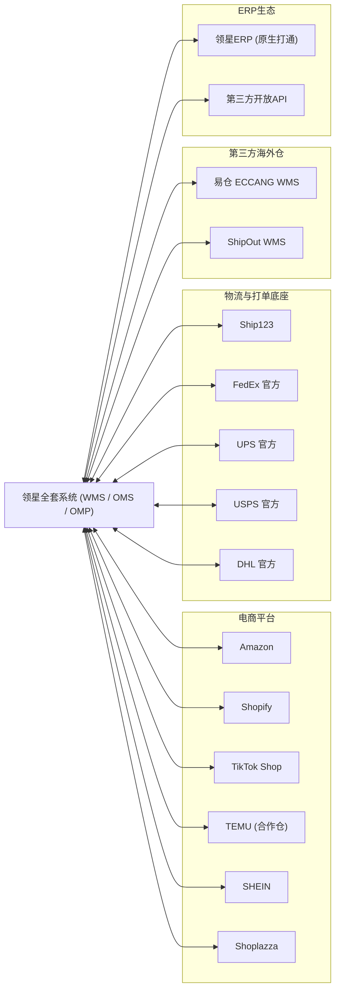

# 领星WMS知识库：生态集成与外部对接

## 1.业务架构与核心流程

【手册事实】领星海外仓系统具备强大的跨系统协同与生态集成网络，横向打通跨境电商平台（Amazon、Shopify、TikTok、TEMU、SHEIN等）、垂直聚合打单平台（Ship123、ShipOut、ECCANG等）、主流国际承运商（FedEx、UPS、USPS、DHL），纵向深度协同领星ERP与第三方代理仓，实现订单自动拉取、运单即时获取、物流轨迹跟踪与库存同步全自动化。

---

## 2.核心功能项详细解析

### 能力项1：Ship123聚合打单底座深度集成

- 能力名称：Ship123物流聚合打单集成
- 所属模块：OMP物流管理/WMS出库中心/Ship123平台
- 使用场景：为海外仓提供高并发、低延迟的面单获取、批量导出与多渠道运单打印能力，屏蔽各物流商底层接口差异。
- 操作角色：OMP物流主管、WMS打包出库员
- 前置条件、配置或依赖：在OMP完成Ship123账号绑定与授权[LX-WMS-060]。
- 操作流程及系统响应：
  1. 账号授权：登录OMP后台，进入“物流管理-物流商账号”，选择“Ship123”，录入AppKey与Secret完成授权握手[LX-WMS-060]；
  2. 渠道与服务映射：在OMP拉取Ship123承载的所有物流渠道，完成本地物流渠道与Ship123物流渠道的精准匹配[LX-WMS-060]；
  3. 面单获取与打单：出库单在WMS复核或二次分拣齐套时，系统自动通过API向Ship123请求面单，返回物流跟踪号与高保真PDF面单流[LX-WMS-059]；
  4. 批量导出与重打：WMS提供“批量导出Ship123面单”专属功能，支持按波次或出库单批量打包下载面单文件，支持断网离线打印与面单复打提示[LX-WMS-061]。
- 涉及的业务对象、单据及对象关系：物流商账号授权实体、渠道映射规则、出库单、Ship123面单记录。
- 关键字段、字段含义和可选值：
  - Ship123 AppKey、Secret、渠道编码、跟踪号、打单状态（获取成功、打单失败）；
  - 报错信息记录（如地址校验失败、分区不可用、超重等）[LX-OMP-114]。
- 状态及状态变化：待打单 -> 打单中 -> 打单成功（返回跟踪号）/ 打单失败（进入异常队列）。
- 对订单、库存、费用或外部系统的影响：
  - 【手册事实】成功获取跟踪号后，系统自动回填出库单并实时回传至OMS与销售电商平台；
  - 【手册事实】打单系统生成的面单费用直接关联OMP运费流水[LX-WMS-059]。
- 校验规则、异常情况和处理方式：【手册事实】若打单失败，OMP提供“打单报错记录”模块，作业员可一键查看第三方返回的底层错误码（如邮编与城市不匹配、承运商服务离线）并针对性修复[LX-OMP-114]。
- 权限或适用范围：OMP物流管理与WMS出库作业。
- 对应来源编号和证据位置：[LX-WMS-059]如何使用Ship123；[LX-WMS-060]使用领星OMP授权ship123；[LX-WMS-061]使用WMS一键批量导出Ship123面单；[LX-OMP-114]使用omp查阅打单报错记录。
- 尚未确认的问题：【待确认】Ship123接口在每分钟超过1000单高并发时的限流策略与队列缓冲深度，原文未详细说明。

---

### 能力项2：主流跨境电商平台与TEMU半托管/合作仓打通

- 能力名称：多平台店铺API授权与合作仓履约协同
- 所属模块：OMS货主端平台管理中心
- 使用场景：货主在OMS直接授权各大跨境电商平台店铺，实现订单自动秒级拉取、自动匹配平台面单、以及发货状态自动回传。
- 操作角色：OMS货主运营人员
- 前置条件、配置或依赖：拥有对应电商平台的开发者或店铺主账号权限。
- 操作流程及系统响应：
  1. 多平台标准授权：OMS支持一键OAuth授权主流平台，包括Amazon、Shopify、TikTok Shop、Shoplazza等，自动定时同步未发货订单与买家留言[LX-OMS-006, LX-OMS-007, LX-OMS-008, LX-OMS-009]；
  2. 平台面单与自备面单双轨支持：针对平台提供面单的模式（如TikTok Shipping），系统自动获取平台PDF标签；针对卖家自发货模式，调用海外仓绑定的物流渠道获取面单[LX-OMP-045]；
  3. TEMU合作仓/半托管模式专属协同[LX-OMS-025, LX-OMS-026]：
     - 认证成为TEMU合作仓后，OMS支持一键切换为“合作仓模式发货”；
     - TEMU本土店与半托管店铺产生的订单，系统通过合作仓专属API拉取，直接锁定海外仓本地库存；
     - 履约发货后，系统通过合规通道秒级向TEMU推送真实物流轨迹，保证货主考核指标（如时效达标率与虚拟发货免罚）[LX-OMS-025, LX-OMS-026]。
- 涉及的业务对象、单据及对象关系：平台授权Token、店铺实体、平台原始订单、OMS销售订单、平台面单文件。
- 关键字段、字段含义和可选值：
  - 授权状态：已授权、授权过期、待更新；
  - 订单类型：普通订单、平台面单订单、合作仓专属订单（TEMU/TikTok等）。
- 状态及状态变化：平台下单 -> OMS同步未发货 -> 生成出库单 -> 发货完成回传平台。
- 对订单、库存、费用或外部系统的影响：
  - 【手册事实】出库发运后系统自动调用平台API将跟踪号标记发货，更新平台订单为Shipped[LX-OMP-041]；
  - 【手册事实】合作仓模式保障了TEMU等平台的严格履约考核时效[LX-OMS-025]。
- 校验规则、异常情况和处理方式：
  - 【手册事实】平台SKU与系统SKU未配对时，订单拦截在异常列表并报警“平台SKU不能为空”或“SKU不存在”[LX-OMS-036]；
  - 【手册事实】授权过期排查：若订单长达数小时未同步，系统在店铺列表显式红字提示“授权已过期，请更新授权”[LX-OMS-035, LX-OMS-037]。
- 权限或适用范围：OMS货主端店铺管理权限。
- 对应来源编号和证据位置：[LX-OMS-006]授权Shopify；[LX-OMS-007]授权Amazon；[LX-OMS-008]授权TikTok Shop；[LX-OMS-025]认证成为TEMU合作仓发货推单；[LX-OMS-026]TEMU本土店使用合作仓发货。
- 尚未确认的问题：【待确认】平台买家发起取消订单时，系统是否支持逆向向WMS下发自动截单指令，原文仅见手动排查。

---

### 能力项3：第三方海外仓（易仓ECCANG、ShipOut等）代理仓协同

- 能力名称：多三方海外仓代理对接与跨系统库存同步
- 所属模块：OMP管理后台代理设置模块
- 使用场景：海外仓企业自身部分网点采用外包合作仓（代理仓），需将领星单据推送到易仓（ECCANG）或ShipOut等第三方WMS执行，并拉回实物状态与库存。
- 操作角色：OMP运营与IT管理员
- 前置条件、配置或依赖：在OMP“代理设置”中添加并配置代理服务商[LX-OMP-096, LX-OMP-097, LX-OMP-105]。
- 操作流程及系统响应：
  1. 代理服务商授权：支持对接易仓海外仓（ECCANG WMS）、易仓分销系统、ShipOut海外仓等主流第三方海外仓系统，录入三方AppId、Token及仓库代号[LX-OMP-036, LX-OMP-096, LX-OMP-097]；
  2. 单据下发中继：OMS货主创建出库单并指定代理仓后，领星OMP自动将单据转换格式并推送至三方WMS；
  3. 报错与状态透传：支持配置“把第三方仓库返回的错误信息直接展示在OMS端”，让货主第一时间了解如“三方SKU未备案”、“三方渠道不可用”等底层报错[LX-OMP-011]；
  4. 库存自动同步：定时拉取代理仓的在架可用库存，实时更新领星系统内的账面数据，保证货主端可用量真实可靠[LX-OMP-073]。
- 涉及的业务对象、单据及对象关系：代理服务商实体、三方仓库映射、中继出库单、代理仓库存账本。
- 关键字段、字段含义和可选值：
  - 代理仓类型：易仓WMS、ShipOut、自定义三方仓[LX-OMP-036, LX-OMP-096]；
  - 接口推送状态：待推送、推送成功、推送失败、三方处理中。
- 状态及状态变化：领星提审 -> 推送三方成功 -> 三方出库完成 -> 回调领星终态。
- 对订单、库存、费用或外部系统的影响：
  - 【手册事实】代理仓的库存锁定与拣货策略完全由第三方系统控制，领星本地出库分配策略对代理仓不生效[LX-WMS-044]；
  - 【手册事实】代理仓的FBA退货单据目前暂不支持推送到主仓[LX-WMS-007]。
- 校验规则、异常情况和处理方式：【手册事实】授权易仓代理服务商时若报错提示“授权失败,请检查信息”，需检查三方提供的系统URL、域名后缀以及公网白名单IP[LX-OMP-007]。
- 权限或适用范围：OMP代理仓运营权限。
- 对应来源编号和证据位置：[LX-OMP-096]如何对接易仓海外仓；[LX-OMP-097]如何在领星WMS对接ECCANG物流系统；[LX-OMP-036]授权ShipOut海外仓；[LX-OMP-073]使用OMP实现代理仓库存同步；[LX-OMP-011]代理仓单据报错展示在OMS。
- 尚未确认的问题：【待确认】三方代理仓产生的实际杂费账单，系统是否支持通过API自动拉取并冲抵货主账单，原文未见自动回传计费明细。

---

## 3.外部系统生态拓扑图

---

## 4.分析建议与系统边界启示

【分析建议】针对自研QS-WMS产品设计，领星生态集成的启示与优化空间如下：
1. **聚合打单平台（Ship123）架构模式的借鉴**：国际物流承运商成百上千，直接在WMS端开发每家API成本极高且维护繁重。领星通过将打单能力抽象为独立的Ship123聚合平台，WMS只与Ship123标准协议对接，极大提升了打单稳定性和新渠道扩展速度，QS-WMS应采用此种松耦合架构；
2. **TEMU半托管与合作仓时效考核的刚性支撑**：当前跨境电商平台（TEMU、TikTok等）对海外仓发货时效考核极其严苛，推迟数小时即面临罚款。领星专门定制了合作仓模式与秒级推送通道，QS-WMS必须将平台合作仓认证与高速API作为核心卖点打造；
3. **代理仓错单透传机制避免信息孤岛**：领星支持将第三方易仓或ShipOut返回的深层技术报错直接透传展示在货主OMS界面，消除了传统海外仓客服“人工做传话筒”的巨大消耗，极大提升了客诉排查效率。
