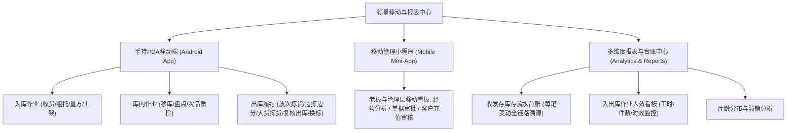
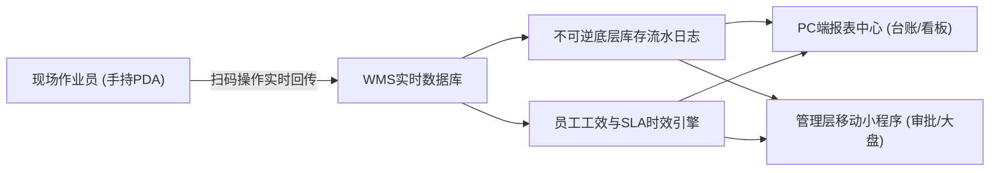

# 领星WMS知识库：移动端PDA作业与报表

## 1.业务架构与核心流程

【手册事实】领星海外仓移动作业与数据分析体系以手持终端PDA（Android App）为作业执行核心，以微信移动小程序为移动管理延伸，以OMP/WMS报表中心为决策分析中枢，实现了全流程无纸化扫码作业、实时人效统计与多维度经营财务分析。

---

## 2.核心功能项详细解析

### 能力项1：手持PDA全场景无纸化作业引擎

- 能力名称：手持PDA作业闭环与硬件配置
- 所属模块：WMS移动端APP（Android）
- 使用场景：仓库一线作业人员在货架通道、卸货月台移动作业，通过激光扫描头实时防错校验，摆脱纸质单据与PC台式机束缚。
- 操作角色：WMS一线理货员、拣货员、叉车工
- 前置条件、配置或依赖：在OMP或WMS为员工配置PDA登录账号，分配仓库权限与作业模块[LX-OMP-089]。
- 操作流程及系统响应：
  1. 入库环节[LX-WMS-020, LX-WMS-022]：
     - 收货扫码：扫描跟踪号或入库单条码，逐件或按托盘扫描SKU条码与效期，支持现场新品量方；
     - 上架推荐：扫描上架单，扫描目标库位码与商品条码，数量校验一致即时扣减暂存库存并增加在架库存；
  2. 库内环节[LX-WMS-019, LX-WMS-027]：
     - 移库作业：扫描原库位 -> 扫描货品SKU -> 录入移动数量 -> 扫描目标新库位确认，支持整托一键移库；
     - 盘点执行：扫描库位码与SKU条码，盲录实盘数量，实时回传WMS冻结校验；
  3. 出库与拣货环节[LX-WMS-016, LX-WMS-017, LX-WMS-021]：
     - 波次拣货：扫描波次条码，系统展示最优路径推荐库位，依次扫描库位码、SKU码与数量；
     - 边拣边分：关联移动拣货车周转筐，扫描商品条码后系统提示投递至对应筐号，拣选即完成初分；
     - 大货整箱拣货：切换箱视图，扫描箱条码或FBA箱唛完成出库清点；
     - 换标拣货：专职匹配换标服务单，提示旧标识别；
     - 扫描出库与装车：扫描面单跟踪号复核，支持集包袋扫描与装车打板。
- 涉及的业务对象、单据及对象关系：PDA设备ID、操作员、入库单、上架单、波次单、拣货任务、移库单、盘点单。
- 关键字段、字段含义和可选值：
  - 扫描条码类型：SKU编码、商品国标条码、FNSKU、自定义箱条码、库位码、托盘码、运单号[LX-WMS-017]；
  - 作业策略开关：【PDA拣货不扫库位】开关（开启后仅扫描货品条码即可完成拣货，适配密集平面仓快速作业）[LX-WMS-017]。
- 状态及状态变化：指令下发 -> 扫码作业中 -> 确认即时提交生效。
- 对订单、库存、费用或外部系统的影响：【手册事实】PDA扫描确认瞬间完成系统库存位置与状态的强一致扣减，无延迟。
- 校验规则、异常情况和处理方式：
  - 【手册事实】扫码防错拦截：扫描非当前波次SKU或错误库位时，PDA震动并发出尖锐告警音，禁止提交[LX-WMS-017]；
  - 【手册事实】网络离线断点续传：网络中断时缓存部分扫描记录，重连后上传。
- 权限或适用范围：受员工绑定的PDA功能权限树管控。
- 对应来源编号和证据位置：[LX-WMS-017]通过PDA实现拣货；[LX-WMS-020]通过PDA实现上架；[LX-WMS-022]使用PDA实现收货；[LX-WMS-027]通过PDA实现盘点；[LX-WMS-016]通过PDA实现复核出库。
- 尚未确认的问题：【待确认】PDA是否支持RFID批量群读（如超高频RFID通道门），原文手册仅见一维/二维光学扫描枪说明。

---

### 能力项2：库存流水台账与作业效能多维分析

- 能力名称：全生命周期流水追踪与人效效能分析
- 所属模块：WMS报表中心/OMP管理后台
- 使用场景：仓储运营复盘、账实差异精准稽核、员工计件绩效核算、以及海外仓客户库龄结构优化。
- 操作角色：WMS仓储主管、OMP财务总监、经营分析师
- 前置条件、配置或依赖：日常业务单据正常流转并记账。
- 操作流程及系统响应：
  1. 库存流水台账（每笔必录）[LX-WMS-057]：
     - 记录每一个SKU在每一秒钟的变动细节，包含业务类型（采购入库、代发出库、退件上架、库内移库、损溢调整、冻结释放）；
     - 溯源信息：精确关联到来源业务单号、操作员姓名、操作前库存、变动数量、操作后库存、库位及批次号，实现“前查来源，后追去向”[LX-WMS-057]；
  2. 作业效率与人效看板[LX-WMS-058]：
     - 入库效率：统计各员工/各班组的到仓签收时长、清点收货件数、上架耗时，输出入库时效达成率；
     - 出库效率：统计波次生成到拣货完成耗时、复核打包件数/小时、出库装车准时率，支撑仓库员工计件工资与绩效考核[LX-WMS-058]；
  3. 库龄分布与滞销分析：直观展示0-30天、31-60天、90天以上的库存体量分布，支持向货主一键导出滞销报告[LX-OMP-120]。
- 涉及的业务对象、单据及对象关系：库存流水账本、员工工时记录、计件作业明细、库龄分析报表。
- 关键字段、字段含义和可选值：
  - 流水类型：入库上架、出库拣选、盘点盈亏、状态转移、人工微调；
  - 效率指标：UPH（每小时处理件数）、出库订单履约及时率（SLA达成率）、人均拣货行数。
- 状态及状态变化：动态事实生成，支持按时间范围切片查询。
- 对订单、库存、费用或外部系统的影响：【手册事实】库存流水是财务审计与货主对账的核心法定依据，任何账面变动必须有对应流水支撑。
- 校验规则、异常情况和处理方式：【手册事实】库存流水为只读不可逆事实日志，系统严禁任何角色进行删改[LX-WMS-057]。
- 权限或适用范围：WMS主管及OMP管理层权限。
- 对应来源编号和证据位置：[LX-WMS-057]使用WMS查阅库存流水板块；[LX-WMS-058]使用WMS查阅入库和出库效率板块；[LX-OMP-120]使用OMP进行库存分析。
- 尚未确认的问题：【待确认】人效看板是否支持直接导出各员工提成薪酬计算报表，原文手册仅展示工序处理数量与时长统计。

---

### 能力项3：移动管理小程序与掌上移动审批

- 能力名称：管理层移动小程序与异地轻量审批
- 所属模块：OMP移动端微信小程序
- 使用场景：仓储企业管理人员出差在外，通过手机实时查看经营大盘数据，随时随地审批异常单据、客户充值与SKU主数据。
- 操作角色：海外仓企业主、财务总监、客服经理
- 前置条件、配置或依赖：在管理后台绑定微信账号与用户角色[LX-OMP-115]。
- 操作流程及系统响应：
  1. 经营概览看板：手机端即时查看今日入库单量、出库包裹量、待处理异常单、今日充值到账金额与当月仓租收入[LX-OMP-115]；
  2. 掌上移动审批：
     - SKU审核：查看货主新提报的产品照片、品名与申报价，手机端一键“通过”或“驳回并填写原因”[LX-OMP-115]；
     - 充值审核：查看货主上传的银行转账水单图片，核对金额后一键通过，资金秒级到账[LX-OMP-115]；
     - 异常订单批量处置：对因欠费、缺货阻断的异常单，手机端查看明细并支持批量重推或放行[LX-OMP-115]。
- 涉及的业务对象、单据及对象关系：审批流实体、移动看板指标、审核日志。
- 关键字段、字段含义和可选值：审核状态：待审、通过、驳回；驳回原因模板。
- 状态及状态变化：移动端操作与PC端OMP双向秒级同步。
- 对订单、库存、费用或外部系统的影响：【手册事实】移动端审批通过即刻驱动业务单据向下游仓端流转，大幅降低非工作时间业务卡顿。
- 校验规则、异常情况和处理方式：【手册事实】小程序端支持生物识别（指纹/人脸识别登录），保证移动审批安全性[LX-OMP-115]。
- 权限或适用范围：OMP管理审批权限。
- 对应来源编号和证据位置：[LX-OMP-115]使用小程序实现经营分析、SKU/单据审核、订单处理。
- 尚未确认的问题：【待确认】小程序端是否支持下发即时推送消息（如微信服务号模板消息通知），原文未见消息模板配置指引。

---

## 3.核心业务对象与数据流转

---

## 4.分析建议与系统边界启示

【分析建议】针对自研QS-WMS产品设计，领星移动作业与报表体系的启示与优化空间如下：
1. **PDA柔性作业开关配置化**：领星支持配置“PDA拣货不扫库位”，体现了对不同形态仓库作业现场的极高理解。在大件平面仓或单品整托集中堆放区，强制扫库位码会显著拖慢效率；配置开关让仓库能够根据货物特性自主选择“严格防错”或“极速提效”，QS-WMS应保留此项配置；
2. **轻量移动审批提升协同效率**：海外仓存在大量跨时区运作（中国运营管理团队与欧美本地仓储团队存在12-15小时时差）。通过移动小程序将SKU审核与充值解封放在手机端，管理人员下班后也能秒级审批，避免欧美仓库因为等国内白天上班审批而停工卡单；
3. **流水账本与报表不可逆设计**：领星严格将库存流水设计为全生命周期不可篡改的流水日志，任何损溢盘点均通过生成相反流水冲抵，保证了跨境电商财务合规与审计严肃性。
