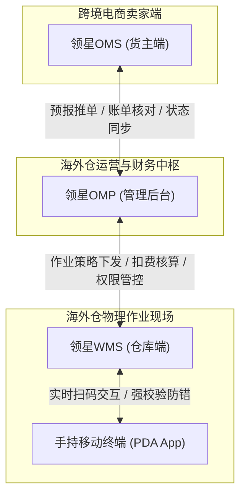
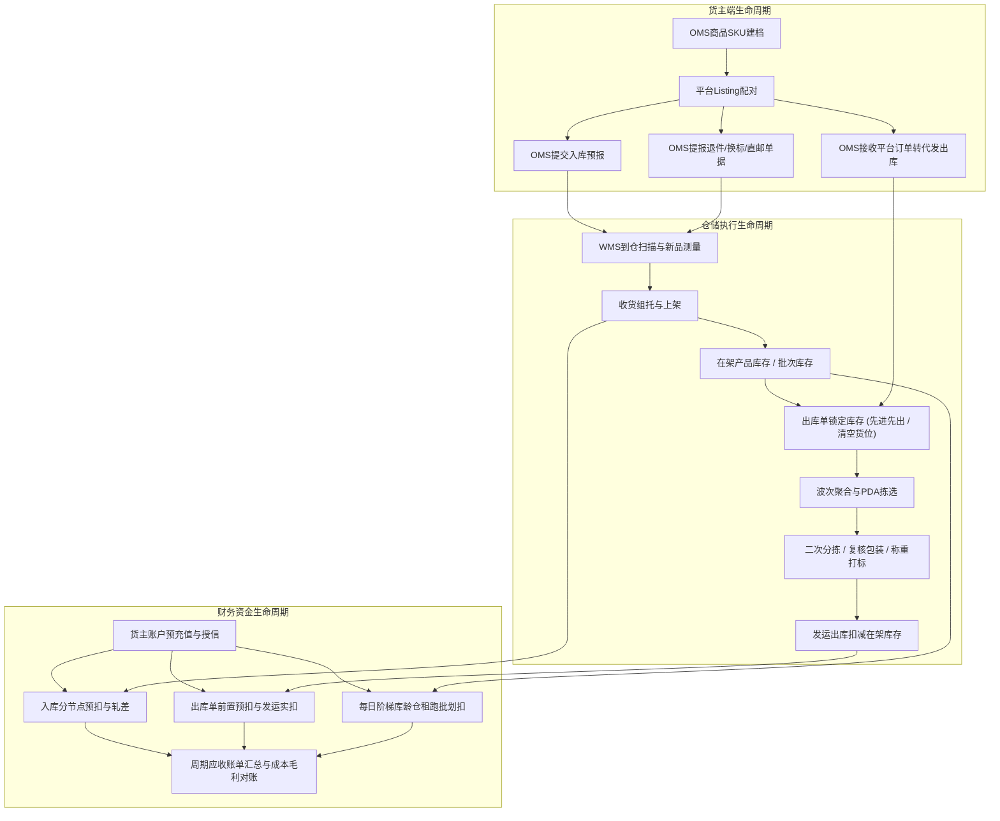

# 领星WMS全套产品体系深度知识库

## 1.总体结论与产品架构全景

【手册事实】领星海外仓产品体系由三大协同子系统构成：
1. **WMS仓库端**：服务于海外物理仓储内部作业人员，核心承载实物到仓扫描、按箱/按SKU收货、托盘容器绑定、质检量方、上架分配、移库移托、静态盘点、波次拣货、二次分拣播种、验货称重打单、贴换标与退件处理；
2. **OMS货主端（客户端）**：服务于跨境电商卖家与货主，核心承载商品主数据录入、多平台店铺授权（Amazon/Shopify/TikTok/TEMU/SHEIN等）、入库预报、一件代发/备货中转提报、直邮单流转、转运预报、退件管理、增值工单申请、以及账户预充值与资金对账；
3. **OMP管理后台（运营端）**：服务于海外仓经营管理者与财务人员，核心承载多货主组织架构、仓库授权、信用额度与停机风控、多维度报价设置（阶梯仓租、操作费、分区物流费、承运商附加费）、前置计费风控、第三方代理仓中继（易仓ECCANG/ShipOut）、聚合打单（Ship123）、以及员工角色与系统安全控制。

---

## 2.知识库核心模块导航与证据索引

本知识库已全量拆分为10个专项业务领域深度技术文档，完整覆盖领星官方帮助中心全部273篇一手文档内容：

| 序号 | 业务领域模块 | 关联主要单据与核心能力 | 专项知识库文件入口 |
| :--- | :--- | :--- | :--- |
| 01 | **入库业务全链路** | 入库单、收货记录、上架单、按SKU/按箱入库、新品量方、入库认领、强制完结、前置计费 | [01-入库业务全链路.md](./01-入库业务全链路.md) |
| 02 | **库内与库存管理** | 库位、产品库存、箱库存、退货库存、双模板分配策略、动态重锁、静态盘点、序列号SN | [02-库内与库存管理.md](./02-库内与库存管理.md) |
| 03 | **出库履约业务** | 一件代发、备货中转、智能波次规则、播种墙二次分拣、包裹复核、称重出库、已打单拦截 | [03-出库履约业务.md](./03-出库履约业务.md) |
| 04 | **逆向退件与FBA换标** | 退件单、正次品分流、FBA退货专属库存、扫旧标出新标、换标组分页打印、免认领直建 | [04-逆向退件与FBA换标.md](./04-逆向退件与FBA换标.md) |
| 05 | **特色增值业务与工单** | Temu Y2直邮单、中性条码、装箱单、两阶段计费、越库转运、增值工单自动计费 | [05-特色增值业务与工单.md](./05-特色增值业务与工单.md) |
| 06 | **基础数据与主数据建模** | SKU主档、组合商品解构、平台配对、客户建档、信用额度到期日、仓区货位、包材物料 | [06-基础数据与主数据建模.md](./06-基础数据与主数据建模.md) |
| 07 | **计费结算与财务规则** | 阶梯库龄仓租、4级体积进位、多维操作费、分区物流费、承运商附加费、汇率转换、成本对账 | [07-计费结算与财务规则.md](./07-计费结算与财务规则.md) |
| 08 | **系统配置与作业策略** | 全局开关、打单比价、智能包裹尺寸、住宅地址判定、仓租理论FIFO vs 实操批次、MFA认证 | [08-系统配置与作业策略.md](./08-系统配置与作业策略.md) |
| 09 | **生态集成与外部对接** | Ship123打单、主流承运商直连、电商平台API、TEMU合作仓模式、易仓/ShipOut代理仓中继 | [09-生态集成与外部对接.md](./09-生态集成与外部对接.md) |
| 10 | **移动端PDA作业与报表** | Android手持PDA端、边拣边分、拣货不扫库位、微信移动小程序、收发存不可逆流水、人效看板 | [10-移动端PDA作业与报表.md](./10-移动端PDA作业与报表.md) |

---

## 3.核心业务对象流转总图

---

## 4.关键证据链溯源与规范

本知识库所载事实均来自领星官方帮助中心公开手册，严格遵循证据标识规范：
- `【手册事实】`：所有功能操作、系统提示、错误码、状态枚举、配置开关均附带唯一来源编号（LX-WMS-xxx、LX-OMS-xxx、LX-OMP-xxx）以及原始页面链接，可通过点击跳转核验原文；
- `【归纳】`：基于全站273篇文档提取总结的横向业务流转与跨系统数据协同机制；
- `【分析建议】`：面向自研QS-WMS产品架构的启示、边界漏洞反思与系统设计建议；
- `【待确认】`：凡官方手册未提供配置说明或存在逻辑断点的事项，均忠实标注为“待确认”，严禁基于常识进行无证据脑补。
