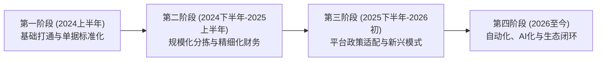

# 领星WMS版本更新记录与产品演进深度分析

## 1.更新日志概况与版本迭代节奏

【手册事实】通过对领星管理后台（OMP）首页Dashboard左下角“最新公告”的自动化检索与逐篇解析，系统完整归档了自**2024年3月至2026年9月**两年半以来的全部**70期官方版本更新记录**。数据源已结构化存储于[`领星WMS版本更新记录.json`](./领星WMS版本更新记录.json)。

### 迭代节奏与发布特征
- **发布频次**：保持着极高且稳定的每周或双周迭代节奏（平均每月发布2至4期），显示出该产品处于极其活跃的成熟期与快速功能扩张期；
- **协同机制**：每次更新均同步贯穿OMS货主端、WMS仓库端、OMP运营端与手持PDA端，具备高度的多端协同演进特征；
- **业务导向演进**：早期（2024年）聚焦于基础进销存打通、基础物流对接与单据流转；中期（2025年）重点突破智能波次、播种墙分拣、阶梯仓租与成本对账；近期（2026年）全面攻坚跨境新兴平台合规对接（Temu半托管/合作仓、TikTok、OTTO）、大件仓免箱唛按SKU作业、AI识图智能上架、PDA边拣边分、以及货盘分销专属库存。

---

## 2.2026年近23期核心版本更新逐条精读

下表汇总了2026年度截至最新一期（2026-09-21）的核心功能演进事实，直观呈现了最新上线能力对此前静态帮助手册的增补与逻辑修正：

| 发布日期 | 版本公告标题 | 所属模块 | 核心更新内容与业务价值事实 | 对既有手册的修订与突破 |
| :--- | :--- | :--- | :--- | :--- |
| **2026-09-21** | 【领星WMS】9.21更新公告 | 入库/PDA | **PDA移动端全流程盘点能力正式上线**；扫码定位盘点单，库位顺序指引作业，支持扫码与手动录数。PDA新增德语。 | 补齐了此前PDA盘点仅有占位说明的空白 |
| **2026-09-21** | 【领星WMS】9.21更新公告 | 打印模板 | **拣货单新增配置「在库库位 * 可用库存数量」**；直观呈现SKU全库位库存分布，减少拣货无效动线。 | 优化了拣货动线与多库位自选 |
| **2026-09-21** | 【领星WMS】9.21更新公告 | 平台对接 | **在线下单新增Amazon直连购单**；新增对接**SHOPLAZZA**电商平台；产品配对支持过滤指定店铺+SKU（自动过滤赠品虚拟品）。 | 进一步扩充独立站与主流平台直连 |
| **2026-09-21** | 【领星WMS】9.21更新公告 | 财务结算 | **操作费按SKU计费支持分销产品**；实现分销SKU自动扣费，杜绝漏收。 | 补齐分销与财务账单自动化闭环 |
| **2026-09-14** | 【领星WMS】9.14更新公告 | 入库业务 | **WMS上架正式支持「强制完结上架单」**；按实际上架数量完结单据，联动入库单自动完结，彻底化解现场收货破损无法结单的死锁。 | **颠覆此前手册“收多少上多少、不允许强制完结”的旧规则** |
| **2026-09-14** | 【领星WMS】9.14更新公告 | 财务结算 | **业务费用与成本对账支持按具体费用类型动态新增计费项**；支持单据级补录基础运费与附加费。 | 提高海外仓杂费补录与对账灵活性 |
| **2026-09-07** | 【领星WMS】9.7更新公告 | 货盘分销 | **分销指定库存（专属库存定向分配）**；按「商品 + 仓库 + 客户」三维定向分配库存，防范分销抢单超卖。 | 极大丰富了海外仓货盘分销生态 |
| **2026-09-07** | 【领星WMS】9.7更新公告 | 客户管理 | **新建客户支持「邮箱自助激活模式」**；客户通过邮件自助验证创建账号密码，提升安全性与建档效率。 | 优化了多货主建档的协作体验 |
| **2026-09-07** | 【领星WMS】9.7更新公告 | 出库/打单 | **出库单自动识别并展示「带电标记」**；出库单详情展示平台买家留言；自定义打印模板增加单价/总价/留言。 | 强化了航空安全带电渠道强校验 |
| **2026-08-28** | 【领星WMS】8.26更新公告 | 出库履约 | **PDA拣货新增「边拣边分」**；绑定移动拣货车周转筐，拣货与分货同步完成，小件仓直接跳过二次分拣。 | 极大提升了中小件密集仓的拣选人效 |
| **2026-08-28** | 【领星WMS】8.26更新公告 | 波次管理 | **波次管理支持批量打印拣货单**；多波次合并为单份PDF统一输出，降低错打漏打风险。 | 解决多波次打印繁琐痛点 |
| **2026-08-24** | 【领星WMS】8.20更新公告 | 入库业务 | **常规入库单新增「按SKU预报及库内作业」**；免除箱唛维护，直接按SKU收货、组托与上架，适配一箱一件大件仓。 | 补充了大件仓免箱唛的核心作业分支 |
| **2026-08-24** | 【领星WMS】8.20更新公告 | 定制POD | **单据详情与打印模板全面支持展示平台SKU与定制图片参数**；专为跨境定制化按需生产（POD）履约赋能。 | 开拓了定制商品（POD）新赛道 |
| **2026-08-06** | 【领星WMS】8.06更新公告 | 出库策略 | **波次规则全面升级**；支持爆品分波（SKU*数量一致）、承运商分波、不足量分波与优先级拖拽。 | 正式确立了波次自动化运算底座 |
| **2026-07-23** | 【领星WMS】7.22更新公告 | 计费财务 | **入库前置计费正式上线**；每次上架完成增量预扣费，整单完结轧差结算，管控资金风险。 | 补齐入库阶段海外仓垫资风险漏洞 |
| **2026-07-23** | 【领星WMS】7.15更新公告 | 仓储计费 | **仓租扣减支持「理论先进先出」与「实操批次」双轨切换**；解决现场工人拣新留旧导致的客诉纠纷。 | 奠定了海外仓最关键的防客诉财务策略 |
| **2026-07-03** | 【领星WMS】7.1更新公告 | 特色业务 | **Temu Y2直邮单全链路正式发布**；国内仓收货贴中性条码、国内装箱称重发货、海外仓落地扫码换单出库。 | 深度契合Temu半托管/全托管红利 |
| **2026-06-18** | 【领星WMS】6.18更新公告 | 逆向换标 | **扫旧标出新标功能上线**；扫描旧条码联动打印机自动出新标，引入换标组解决多页PDF分页打印。 | 彻底重塑了备货中转的换标体验 |
| **2026-03-12** | 业务费用出库明细更新 | 财务对账 | **出库明细导出支持一单一行**；操作费新增“最重SKU重量”计费条件变量；代理仓自动补建库位。 | 大幅降低财务Excel离线洗数据成本 |
| **2026-02-05** | 1.17-2.3更新公告 | 平台/分销 | **对接德国OTTO平台**（正向拉单+逆向回邮单闭环）；对接敦煌网与Wildberries（支持分仓拉单与批量组包）。 | 拓展欧洲本土电商生态与组包能力 |
| **2026-01-16** | 1.9-1.16更新公告 | 入库AI | **WMS上线「AI识图一键上架」**；手机/PDA拍照纸质理货单，AI识别字段自动填单上架；库存/库龄预警上线。 | 引入视觉多模态AI赋能仓内繁琐录入 |

---

## 3.产品演进趋势与技术路线脉络分析

通过纵向梳理70期历史公告，领星海外仓系统的产品演进脉络呈现出鲜明的**四个发展阶段**：

### 趋势一：从“单纯代发小件仓”向“全业态（大件、转运、分销、直邮）”演化
- 早期系统几乎完全围绕标准小件一件代发设计，依赖严格的箱唛和正品库存；
- 2026年密集上线了“免箱唛按SKU入库”（大件家具与汽配仓需求）、“Temu Y2直邮单”（跨境双仓联运）、“越库转运单”、以及“货盘分销专属库存”；
- 表明其正在从单一的3PL仓储工具演变为跨境供应链综合服务平台。

### 趋势二：从“机械死板强校验”向“尊重现场柔性容错”演进
- **上架强制完结的演变**：早期手册严格限制“收多少上多少，不允许差异，损毁也必须先上架”，在2026年9月14日更新中被正式推翻，支持勾选“强制完结上架单”，体现了系统对现场复杂场景的妥协与进化；
- **仓租理论FIFO的引入**：2026年7月引入的“理论先进先出”仓租策略，将物理作业与财务计费解耦，解决了行业长期以来的工人走位习惯与货主高额仓租冲突；
- **PDA拣货免扫库位**：允许平面仓不扫货位直接扫码拣选，兼顾了严格防错与现场作业流速。

### 趋势三：智能化与AI辅助开始实操落地
- 2026年1月落地的“AI识图一键上架”，表明领星已开始探索将视觉多模态OCR/AI模型应用于纸质单据电子化；
- 物流维度的“自动比价下单”与“三维智能包裹尺寸计算”，逐步实现出库作业由规则驱动迈向算法辅助决策。

### 趋势四：多异构海外仓互联互通（代理仓中继）
- 系统持续深耕与易仓（ECCANG）、ShipOut等竞品或友商系统的主子仓对接；
- 支持将代理仓的报错信息（如第三方SKU未审核、第三方无渠道）直接穿透展示在OMS前端，实现了跨软件生态的透明化中继。
