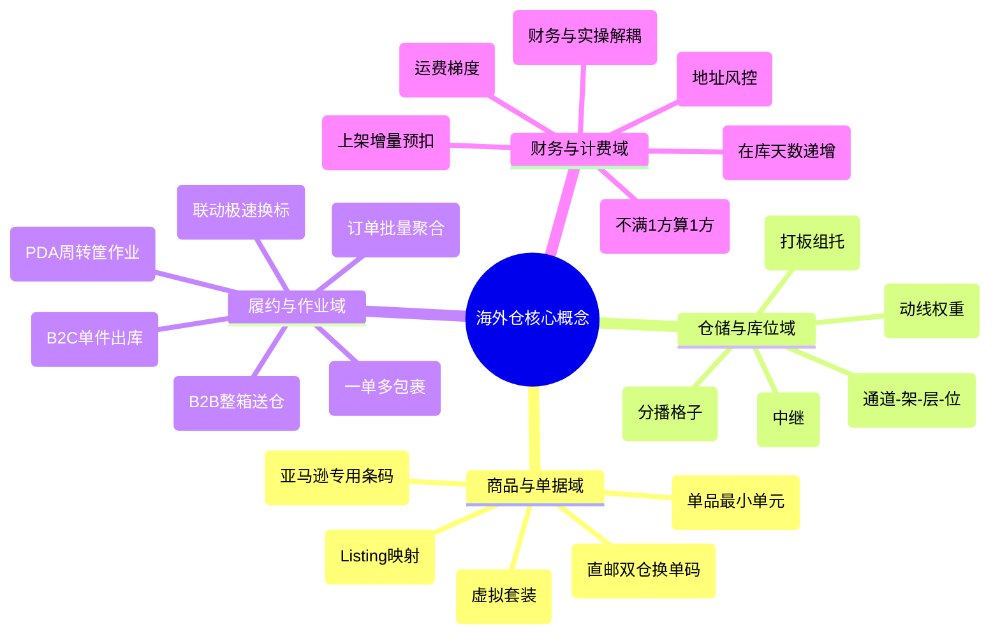
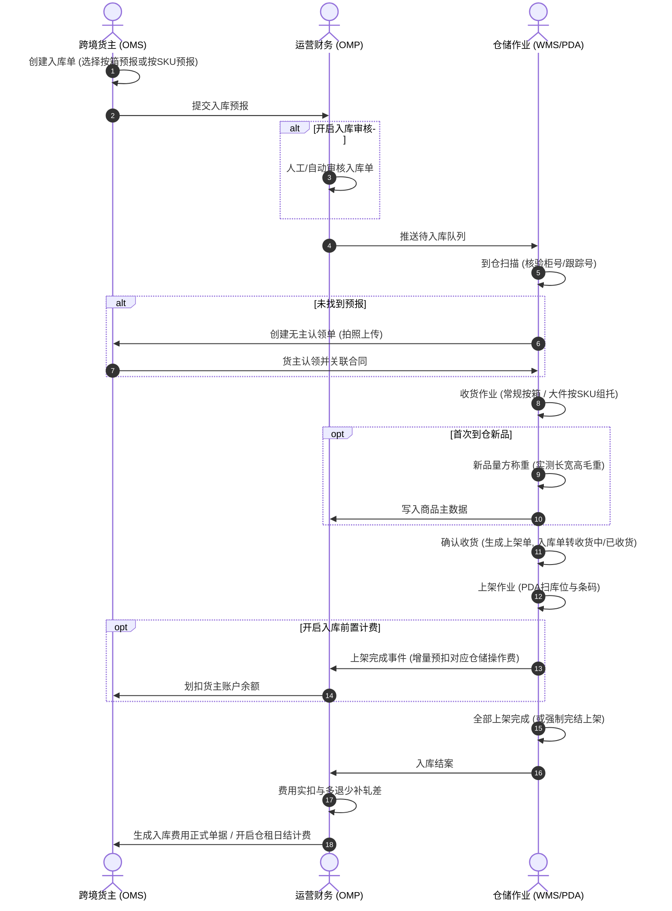
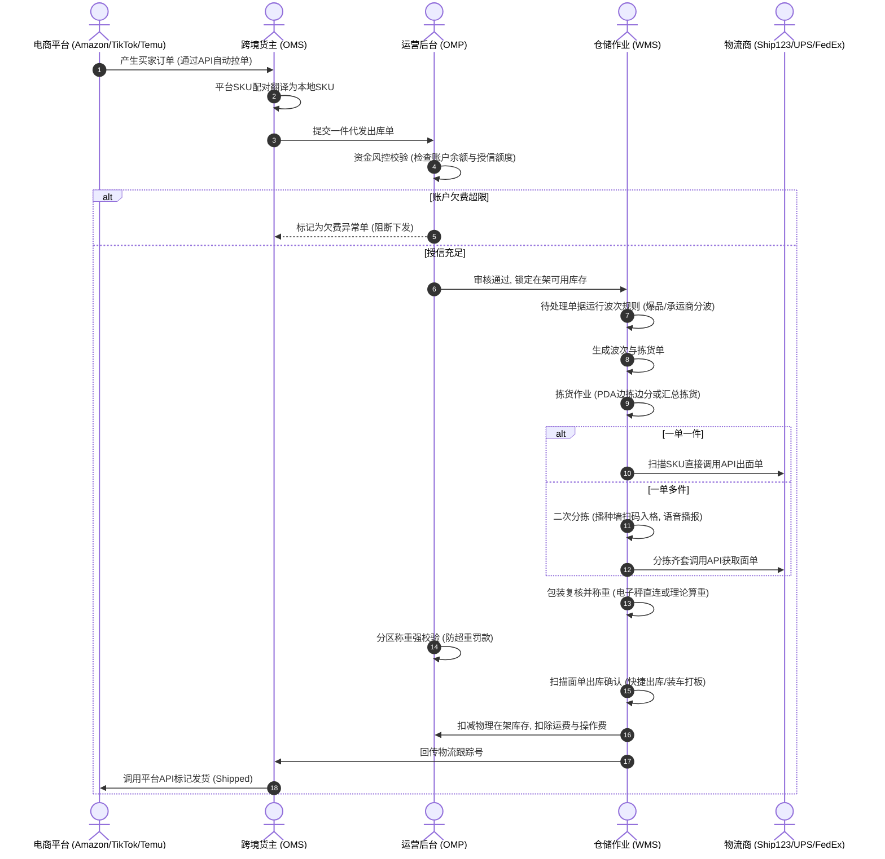
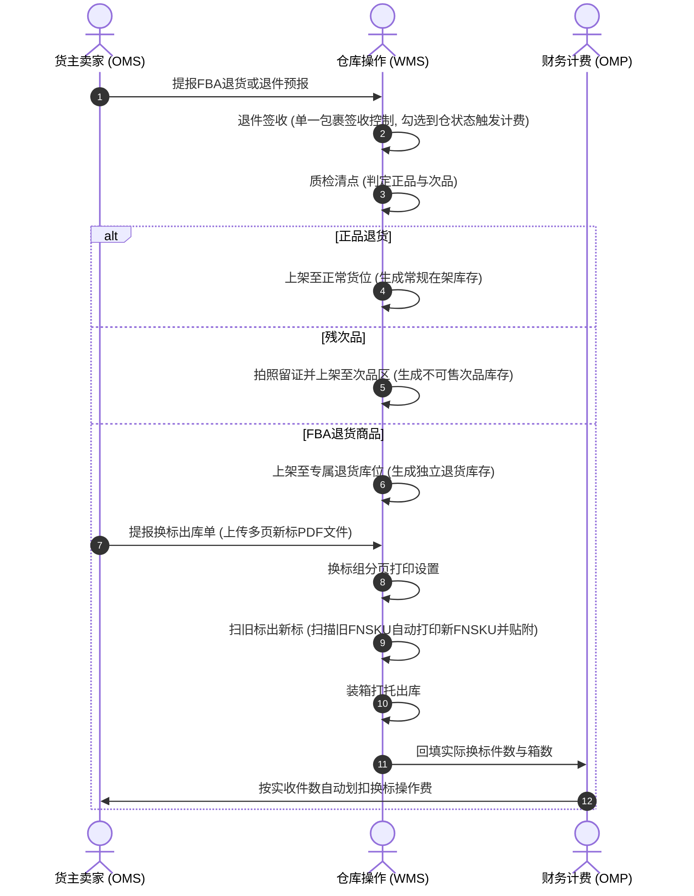
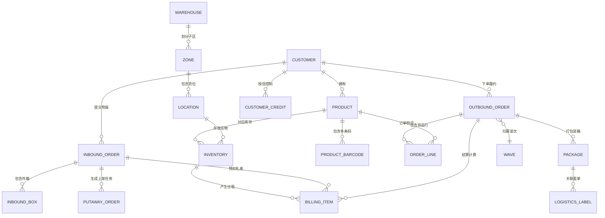

# 海外仓WMS系统全景白皮书与自研复刻设计指南

## 一、海外仓的来龙去脉与第一性原理

### 1.海外仓因何而生（业务背景与商业模式）
跨境电商早期主要采用国内小包直邮模式（如邮政小包、专线快递），从中国直发欧美买家手中通常耗时7至20天，物流破损率高、无跟踪轨迹、无法支持退换货，极大限制了跨境电商的品类拓展（如大件家具、汽配、高货值3C）。

海外仓（Overseas Warehouse）的本质是**将跨国跨境物流转化为本土同城物流**：
- **前置备货**：跨境卖家通过海运拼箱或整柜将批量商品提前运送至目标国（如美国洛杉矶、德国汉堡）的海外仓库中；
- **本地极速履约**：当海外买家在Amazon、Shopify、TikTok、Temu等平台下单后，系统指令直接下发至当地海外仓，仓库完成拣货、打包，通过当地本土快递（如UPS、FedEx、USPS、DHL）在1至3天内送达买家手中；
- **海外仓企业的商业盈利模型**：
  1. 仓储费收益：通过对库位与托盘面积出租收取每日阶梯仓租（靠体积进位规则盈利）；
  2. 操作费收益：收取卸货费、收货清点费、出库拣货打包费、装箱打托费；
  3. 运费差价收益：海外仓企业通过自身巨大的发货量向UPS/FedEx拿到极低折扣账号，再以合理折扣卖给卖家，赚取物流差价；
  4. 增值服务收益：贴标换标、次品质检、拍照留证、定制组装等高毛利人工服务。

---

### 2.为什么是三端分立架构（WMS + OMS + OMP）
很多初入跨境行业的产品经理常有疑问：为什么国内电商仓储做一套系统就够了，海外仓必须拆分成三个独立子系统？其根本原因在于**使用者角色、物理时区与数据安全的三重割裂**：

| 子系统名称 | 核心使用者与物理地点 | 为什么必须独立拆分 | 系统定位与边界 |
| :--- | :--- | :--- | :--- |
| **OMS (Order Management System)** 货主端/客户端 | 遍布中国深圳、杭州、义乌的跨境电商卖家运营人员（使用中文界面，北京时间白天作业） | 卖家不能看到仓库底层库位、员工绩效、更不能看到其他同行的库存和费用；必须提供纯净的商品建档、订单导入、店铺授权与对账界面。 | 面向货主的客户门户，负责订单接入、入库预报、库存可视与账单确认。 |
| **OMP (Operation Management Platform)** 运营与财务管理后台 | 海外仓公司总部管理者、财务团队、客服主管（统筹仓网调度，风控核心） | 统筹管理多货主、多仓库网络，掌控核心商业机密（如向物流商采购的底价底单、各货主的阶梯报价与授信额度、多币种资金池）。 | 海外仓运营中枢与计费引擎，负责权限、多货主授信、报价设置与成本对账。 |
| **WMS (Warehouse Management System)** 仓储作业执行端 | 驻扎在美东、美西、欧洲仓库一线的外国工人或华人仓管（使用英文/西语/德语，存在12至15小时时差） | 仓内工人不需要关心货主是谁、商品卖多少钱，必须极致追求扫码效率、拣货动线与防呆防错；系统必须适配手持PDA与热敏打印机。 | 面向仓内执行人员，负责实物出入库、货位动线、波次分拣、复核称重。 |

---

## 二、海外仓全景术语与白话概念地图

初任产品经理必须掌握的40个海外仓核心黑话与技术概念：

### 1.商品与单据领域
- **SKU (Stock Keeping Unit)**：单品最小库存单位，无论颜色、尺寸，只要属性不同就必须是独立SKU；
- **FNSKU (Fulfillment Network SKU)**：亚马逊仓储专属条码，每个卖家在亚马逊后台生成的商品条码，退仓换标的核心标的；
- **平台配对**：跨平台商品映射。例如货主在Amazon卖的SKU叫`Cup-Red-US`，在TikTok卖的叫`TK-Red-01`，但在海外仓实物都是`C001`，配对表负责自动翻译；
- **中性条码**：在Temu Y2直邮业务中，包裹在国内外中转时贴附的中性识别码，海关和仓库扫此码换取尾程面单，避免泄露平台敏感数据；
- **组合商品 (Bundle)**：虚拟套装。例如“1个牙刷+2个刷头”打包售卖，系统不设立独立物理库存，出库时动态解构扣减子件。

### 2.仓内与货位领域
- **库位拣货优先级**：库位设定的数值（如1至99）。库存分配引擎挑库位时优先挑选优先级高的货位，引导拣货员在最近、最矮的黄金货架拿货；
- **播种墙 (Sorting Wall)**：类似蜂巢的多格货架（如10行10列）。汇总拣货后，分拣员逐件扫描商品条码，系统亮灯或语音提示放入指定格号，格满即成单；
- **系统播种墙 vs 自定义播种墙**：系统播种墙是预先在基础数据建好的物理货架（最大15*15=225格）；自定义播种墙是应对爆仓时在系统临时虚拟划分的无限网格；
- **序列号 (SN)**：一机一码。3C手机数码每台机器唯一的硬件编码，出入库与退货强制校验，防止调包欺诈。

### 3.出库与作业领域
- **一件代发 (Dropshipping)**：直接给最终网购买家发货，单件小包为主，对发货时效与面单打印速度要求极高；
- **备货中转 (Cross-dock FBA Inbound)**：大批整箱送往亚马逊或沃尔玛仓，以箱和托盘为单位，重在整箱清点、打托盘和更换外箱唛；
- **波次 (Wave)**：把几百个零散订单按照共同特征（如发UPS的、单品单件爆款、在A库区的）聚合成一批，拣货员一次性推车推回几百件，效率比单单拣选高十倍；
- **边拣边分**：PDA结合多格推车，拣货的同时直接分拨到对应格子里，拣完直接去贴面单，跳过播种墙二次分拣；
- **子母件 (Multi-piece Shipment)**：一个订单由于商品太大分成了2个以上箱子发货，必须包含1个主面单（母单）和若干子面单，各包裹分别称重。

### 4.计费与风控领域
- **计费重 (Billable Weight)**：取实重（毛重）与材积重（长*宽*高/系数）的较大者计算运费，防范轻泡货亏本；
- **体积进位**：小卖家存了0.05立方米货品，如果按实收仓租海外仓连货位成本都收不回。系统配置“不满1方算1方”，强制按最小单位进位保底；
- **理论先进先出 (Theoretical FIFO)**：算仓租时按账面最早入库的批次扣减，不管现场工人随手拿了哪件货，彻底避免旧货积压产生天价仓租客诉；
- **入库分节点预扣与轧差**：上架一部分就冻结扣除一部分货主余额，整单完结时多退少补，防止入库干完活货主欠费跑路；
- **信用额度四防线**：信用额度（可透支发货） -> 预警余额（短信催款） -> 限制下单金额（强停机拦截） -> 授信到期日（过期清零）。

---

## 三、海外仓全链路核心端到端泳道流程图

### 1.入库与上架端到端泳道图

---

### 2.一件代发（出库履约）端到端泳道图

---

### 3.退件与FBA换标端到端泳道图

---

## 四、三端全功能模块清单与页面设计矩阵（复刻PRD指南）

新手产品经理在设计自研海外仓系统原型时，可直接对照以下结构展开页面与菜单设计：

### 1.OMS 货主端功能清单与页面矩阵（35个核心页面）

| 一级功能域 | 二级功能模块 | 页面名称 | 页面核心交互与控件 |
| :--- | :--- | :--- | :--- |
| **工作台** | 首页概览 | 经营仪表盘看板 | 待审核单量卡片、待处理异常单、库存分布图表、资金余额及预警提示。 |
| **商品管理** | 商品中心 | 产品列表 | 支持单品建档、Excel导入、图片上传、长宽高毛重维护、带电属性勾选。 |
| **商品管理** | 平台映射 | 平台SKU配对 | 平台店铺选择、平台Listing SKU与本地SKU映射关系表、批量配对导入。 |
| **商品管理** | 套装管理 | 组合商品设置 | 主SKU定义、子SKU绑定列表、配比系数录入、动态库存试算。 |
| **入库管理** | 预报提报 | 新建常规入库单 | 选择自营/代理仓、预报方式切换（按箱/按SKU）、箱唛维护、预计到仓日。 |
| **入库管理** | 单据追踪 | 入库单列表 | 状态Tab（草稿/待入库/收货中/已收货/已上架/已取消）、查看收货实测尺寸。 |
| **入库管理** | 异常处置 | 入库认领列表 | 待认领无主件列表、实物外观及标签大图预览、一键认领建单。 |
| **入库管理** | FBA退仓 | FBA退货入库预报 | 亚马逊LPN单号录入、预报FNSKU明细、箱数及跟踪号导入。 |
| **出库履约** | 代发出库 | 平台订单列表 | 各电商平台拉单结果、一键转一件代发出库单、批量在线打单。 |
| **出库履约** | 代发出库 | 一件代发出库单列表 | 状态Tab（待处理/配货中/已出库/异常挂起）、收件地址强校验、单据取消申请。 |
| **出库履约** | 大货中转 | 备货中转出库单 | 按箱/按产品出库切换、箱明细核对、换标信息预报、新标PDF上传附件。 |
| **特色业务** | 直邮专线 | 直邮单管理 | 平台Y2订单转直邮单、打印中性条码、国内送仓标记、海外换单追踪。 |
| **特色业务** | 越库分拨 | 转运单预报 | 转运收货地址维护、预计箱数及托盘数录入、转运子单跟踪。 |
| **逆向增值** | 退件管理 | 客户退件单列表 | 客户退件提报、退件实物照片查看、质检结果确认、正品转卖/销毁申请。 |
| **逆向增值** | 增值服务 | 工单申请与追踪 | 贴标/组装/拍照工单选择、操作要求录入、工单费用明细核对。 |
| **库存中心** | 库存查询 | 产品库存看板 | 在架可用数、出库锁定数、次品数、在途数切片筛选与导出。 |
| **库存中心** | 库龄分析 | 库龄结构报表 | 0-30天、31-60天、90天+库龄透视表、超期预警提示。 |
| **财务中心** | 资金账户 | 账户总览与充值 | 账户余额、透支额度、充值入口、银行转账凭证上传、充值流水。 |
| **财务中心** | 账单中心 | 应收对账单确认 | 月结对账单列表、费用明细（仓租/操作费/运费/增值费）逐笔核对与异议提起。 |
| **财务中心** | 运费试算 | 运费比价计算器 | 目的国/邮编输入、长宽高重量输入、多渠道价格与时效横向对比。 |
| **店铺与集成** | 授权管理 | 电商平台店铺授权 | Amazon、Shopify、TikTok、Temu、SHEIN的OAuth授权向导与到期预警。 |

---

### 2.OMP 运营与管理后台功能清单与页面矩阵（48个核心页面）

| 一级功能域 | 二级功能模块 | 页面名称 | 页面核心交互与控件 |
| :--- | :--- | :--- | :--- |
| **概览大盘** | 经营驾驶舱 | 全局数据大屏 | 实时出入库单量统计、财务今日入账、各仓负荷率、异常订单大盘。 |
| **客户与组织** | 客户主档 | 客户列表与建档 | 货主基本信息、邮箱激活模式开户、可用仓多选授权、销售/客服代表绑定。 |
| **客户与组织** | 资金风控 | 客户授信与风控配置 | 信用额度、限制下单金额（强停机阈值）、预警余额、信用额度到期日。 |
| **仓网建模** | 仓库中心 | 仓库列表与配置 | 自营仓与代理仓类型标记、时区、度量衡、面单水印、业务开关。 |
| **仓网建模** | 代理中继 | 代理服务商授权 | 易仓ECCANG、ShipOut等API授权、Token维护、代理仓错误码透传配置。 |
| **报价体系** | 仓租方案 | 仓租费模板设置 | 阶梯库龄区间定义、阶梯单价、4种体积进位规则勾选、最小计费体积。 |
| **报价体系** | 操作费 | 操作费模板设置 | 入库按箱/托计费、出库首续件计费、换标箱数/产品数变量规则。 |
| **报价体系** | 物流运费 | 物流费模板与分区 | 邮编Zone匹配表导入、首续重费率矩阵、材积除数设定、承运商报价直引。 |
| **报价体系** | 附加费 | 运输附加费规则 | 住宅附加费、超长超重超大费、偏远地区附加费、面单取消手续费配置。 |
| **报价体系** | 总报价 | 客户总报价方案绑定 | 将仓租、操作、物流费模板打包组合并定向绑定给特定货主。 |
| **财务结算** | 充值管理 | 充值审核列表 | 线下水单审核、到账银行核对、多币种与汇率换算、一键上账。 |
| **财务结算** | 费用流水 | 业务费用明细表 | 每日仓租流水、出入库操作费扣款日志、一单一笔导出支持一单一行。 |
| **财务结算** | 周期对账 | 应收账单生成与核销 | 应用账单模板按月/半月汇总、生成PDF账单、客户确认后划款结清。 |
| **财务结算** | 成本对账 | 承运商成本对账 | 导入UPS/FedEx官方账单、基于Tracking No双向对碰、输出单票毛利。 |
| **系统策略** | 全局配置 | 全局业务开关 | 入库箱尺寸必填、代发出库电话必填、打单最低价比价、前置计费开关。 |
| **系统策略** | 仓租策略 | 仓租扣减批次设置 | 「理论先进先出」与「实操扫描批次」二选一。 |
| **安全与权限** | 账号权限 | 角色权限树与员工 | 菜单与按钮权限点勾选、仓库数据隔离、财务脱敏、MFA双因子认证绑定。 |

---

### 3.WMS 仓库作业端功能清单与页面矩阵（28个核心页面）

| 一级功能域 | 二级功能模块 | 页面名称 | 页面核心交互与控件 |
| :--- | :--- | :--- | :--- |
| **入库执行** | 到仓与收货 | 入库管理列表 | 到仓扫描、整单收货、常规按箱收货清点、按SKU收货与组托绑定、强制完结收货。 |
| **入库执行** | 货位上架 | 上架管理列表 | 待上架/上架中列表、按产品/按箱上架维度选择、库位选择、强制完结上架。 |
| **入库执行** | 智能录入 | AI识图一键上架 | 纸质理货单照片上传、AI OCR多模态解析字段对照表、批量导入上架。 |
| **入库执行** | 异常暂存 | 入库认领登记 | 拍摄无主实物图片、暂存库位指定、认领状态联动。 |
| **库内作业** | 货位管理 | 库区与库位视图 | 库位优先级维护、长宽高承重设定、库位启用/停用、条码批量打印。 |
| **库内作业** | 库存调整 | 移库与调整管理 | SKU移库、整托移位、盘盈盘亏库存调整、次品上架与就地销毁。 |
| **库内作业** | 账面盘点 | 盘点单管理 | 库位盘点与SKU盘点切换、开始盘点（静盘强校验锁库）、实盘数据录入与审核。 |
| **出库履约** | 调度波次 | 一件代发出库待处理 | 筛选订单、手动勾选生成波次（上限1000单）、按规则自动批量分波。 |
| **出库履约** | 调度波次 | 波次管理中心 | 待拣货/拣货中队列、批量打印拣货单（合并单份PDF）、分配拣货员。 |
| **出库履约** | 分播分拣 | 播种墙二次分拣工位 | 扫描波次与商品条码、格口高亮变色、语音播报格口、自动出面单、扫描包材算重。 |
| **出库履约** | 验货打包 | 复核验货工位 | 逐件条码扫描验货、一单一件扫码即打单出库、一单多件扫码清点。 |
| **出库履约** | 多包复核 | 包裹复核 (子母件) | 拆分为多个独立包裹、子面单分别打印、各箱长宽高与实重录入。 |
| **出库履约** | 称重发货 | 称重出库台 | 串口电子秤自动读取、分区称重超限拦截、快捷出库、装车交接单打印。 |
| **逆向换标** | 大货中转 | 备货中转出库 | 拣货打标、换箱标、大货装箱打单、出库交接。 |
| **逆向换标** | 极速换标 | 扫旧标出新标工位 | 扫描出库单号、扫描旧FNSKU条码联动打印新标、换标组分页设置、实际完成数回填。 |
| **报表中心** | 数据看板 | 库存流水台账 | 每一笔出入盘移的不可逆日志明细查询与导出、业务单号全链路反查。 |
| **报表中心** | 数据看板 | 作业效率看板 | 员工人效统计、UPH时效分析、波次拣货耗时监控。 |

---

### 4.手持移动PDA（Android App）作业清单

| 作业环节 | PDA应用功能模块 | 核心扫码动作与防呆提示 |
| :--- | :--- | :--- |
| **入库环节** | PDA到仓扫描 | 扫描运单跟踪号或柜号，快速核对到仓件数。 |
| **入库环节** | PDA收货组托 | 扫描入库单条码 -> 扫描托盘编码 -> 扫描商品条码录入数量，支持效期输入与新品量方。 |
| **入库环节** | PDA货位上架 | 扫描上架单 -> 扫描推荐目标库位码 -> 扫描商品条码提交确认，位置强一致扣减。 |
| **库内环节** | PDA移库移托 | 扫描原库位 -> 扫描SKU -> 录入数量 -> 扫描新目标库位；支持扫描托盘码整托位移。 |
| **库内环节** | PDA移动盘点 | 扫描盘点单 -> 按照PDA路径指引走到指定货位 -> 扫描货位码 -> 盲扫商品条码录入实数。 |
| **出库环节** | PDA波次拣货 | 扫描波次单 -> 动线引导推荐货位 -> 扫描货位码 -> 扫描商品条码（支持【免扫库位】开关）。 |
| **出库环节** | PDA边拣边分 | 绑定拣货推车各格周转筐 -> 扫描货品条码 -> PDA屏幕与蜂鸣提示投递至对应筐号。 |
| **出库环节** | PDA复核与出库 | 扫描面单跟踪号核对 -> 扫描商品条码复核 -> 装车扫描打板交接。 |

---

## 五、底层领域驱动模型与核心实体关系图（ER Model）

为了让自研系统研发工程师能够直接建表与设计领域对象，以下提炼了海外仓最核心的实体数据关系：

---

## 六、自研复刻海外仓WMS的避坑与架构建议

### 1.必须深度借鉴并复刻的五大黄金机制
1. **入库分节点预扣与多退少补轧差**：解决了海外仓垫资和客户欠款跑路的生死问题，自研系统第一期必须内嵌；
2. **仓租理论先进先出策略**：在账面解耦现场拣货批次与财务计费批次，彻底解决一线工人走位习惯与货主高额仓租客诉的行业顽疾；
3. **换标组与扫旧出新联动机制**：多页PDF箱标分页打印与扫旧标秒出新标，直击海外仓大货换标最耗工时的痛点，大幅降低贴错标损失；
4. **客户四级阶梯风控防线**：信用额度、预警余额、强停机阈值、授信到期日，构建了坚固的财务护城河；
5. **轻量移动小程序审批流**：利用小程序实现SKU审核与充值上账，完美抹平国内管理团队与欧美现场15小时时差。

### 2.坚决不能照搬的四大设计缺陷（自研系统优化方案）
1. **摒弃“上架严格不允许差异”的旧死锁设计**：
   - 缺陷：原版旧逻辑强制“收多少上多少”，现场货损必须先上架再调减，极易造成账面虚高被出库锁定引发缺货；
   - 优化方案：自研系统必须支持上架环节登记破损差异，支持直接分流至不良品区并强制结单；
2. **打通全业务场景的“通用换标引擎”**：
   - 缺陷：原版仅在备货中转单支持扫旧出新，FBA退货单却不支持；
   - 优化方案：将换标能力下沉为底层公共微服务，任何单据均可直接调用扫旧出新组件；
3. **建立欠费充值后的“异步自动重推队列”**：
   - 缺陷：原版客户充值后异常订单不会自动重推，必须人工逐张转草稿重新提审，极易漏单违约；
   - 优化方案：充值审核通过后发布领域事件，系统自动轮询并按时效优先级唤醒挂起订单，自动锁库下发；
4. **完善越库转运的自动化计费模板**：
   - 缺陷：原版转运单不自动计费，全靠财务人工补录流水，存在漏计费风险；
   - 优化方案：建立专门的转运操作费与打托装卸费规则，转运出库时自动出账，消灭财务盲区。
