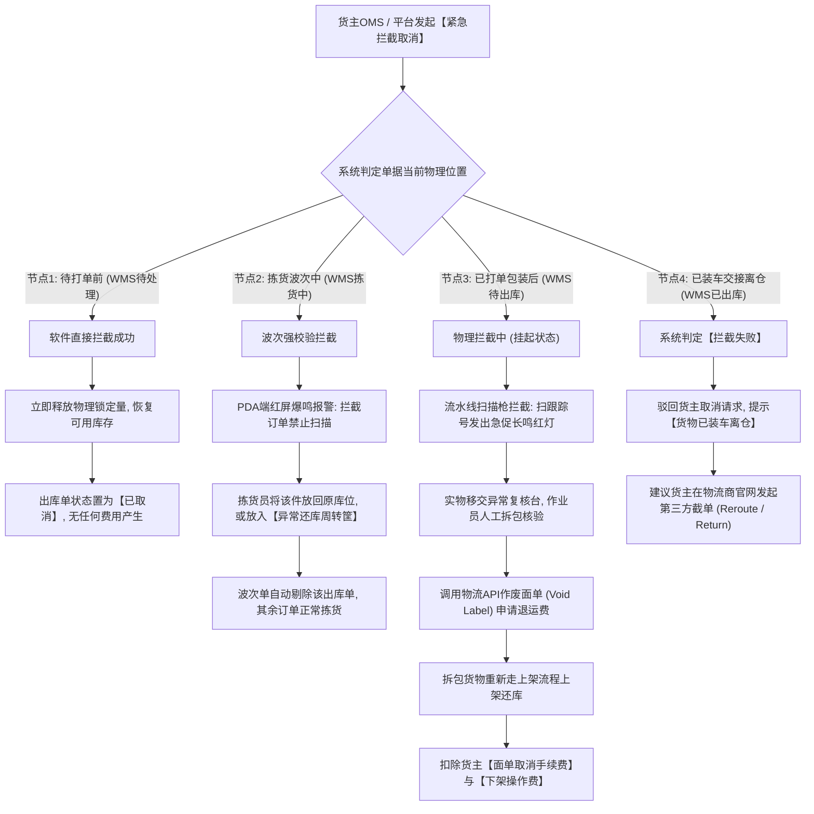
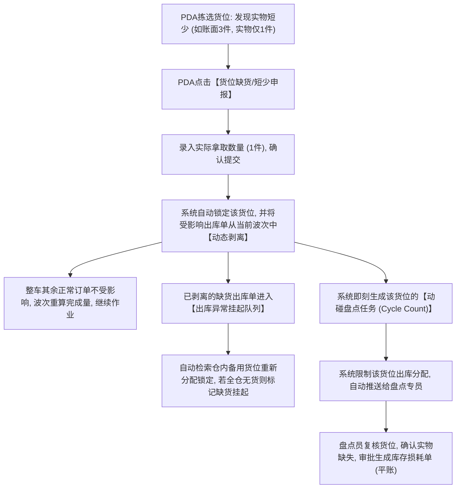
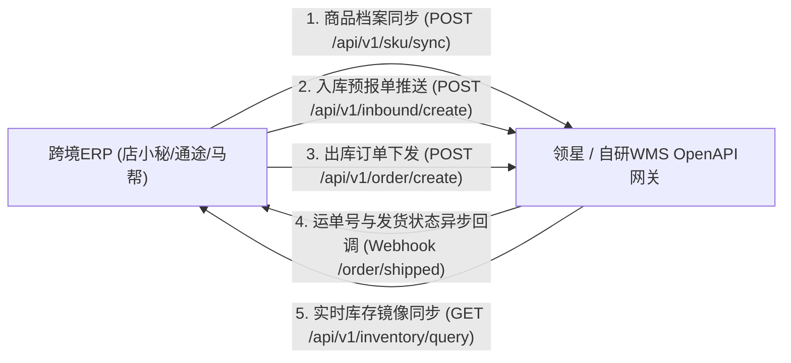

# 架构师级对抗式审查与硬核复刻补全指南

## 1.六大维度走查评估结论

【对抗式审计结论】以10年跨境物流产研架构师标准进行极端压力走查，原有交付物在宏观业务认知、单篇原始事实与模块化分册上表现优异，但在**PRD级数据字典规范度、跨端状态同轴映射、四大出库节点拦截物理闭环、波次缺货动态剥离、以及反直觉设计底层机理**五个方面存在明显不足，无法直接交付研发建表与写代码。

| 审计维度 | 走查评估判定 | 现状描述与核心缺失点 | 整改与补全动作 |
| :--- | :--- | :--- | :--- |
| **维度一：范围完整性** | **达标** | 覆盖WMS仓端、OMS货主端、OMP管理端、PDA端与70期更新日志。 | 保持现有事实基础 |
| **维度二：模块化纵向深拆** | **达标** | 形成10个核心业务分册与1篇全景设计白皮书，无大杂烩堆砌。 | 保持现有分册架构 |
| **维度三：PRD级数据字典与状态机** | **不达标** | 原有知识库仅包含字段中文名称与大体说明，缺少英文键名、物理数据类型、必填约束、枚举码表与底层强校验规则；缺少四端同轴状态映射矩阵。 | 补齐PRD级表结构字段字典与跨端同轴状态矩阵 |
| **维度四：异常业务与逆向回滚闭环** | **不达标** | 出库拦截缺少4大节点的PDA报警细节与实物拆包回库操作；波次拣货缺货缺少单据动态剥离与动碰盘点机制；入库超送短少缺少差异证明单（POD）。 | 补齐四大异常深度流程图与现场操作交互细节 |
| **维度五：反直觉设计第一性原理** | **缺失** | 未深入剖析“严禁向货主暴露货位”、“进单占位与波次占位不可兼得”、“存货位阻断打单”等反常识设计背后的仓储物理真相。 | 深度解剖五大反直觉架构心智模型 |
| **维度六：外部生态与接口集成** | **部分达标** | 缺少店小秘、通途、马帮等ERP的标准接口协议字段；缺少TEMU/TikTok半托管认证仓API规范。 | 补齐主流ERP接口载荷与平台合作仓认证规范 |

---

## 2.四大严重缺陷依据与业务风险剖析

### 缺陷1：缺少物理级数据字典（研发无法直接建表与写接口）
- **业务风险**：若没有明确字段英文名（Snake Case）、数据类型（如`DECIMAL(10,3)`与`VARCHAR(64)`）、必填规则与强校验逻辑，研发人员容易自行定义表结构，导致“长宽高允许存负数或零导致算不出运费”、“单号未加唯一索引导致并发重复推单超卖”、“浮点数存储金额导致分钱对账误差”等毁灭性线上事故。

### 缺陷2：缺少四端同轴状态对照矩阵（状态流转断层引发死锁）
- **业务风险**：WMS单据状态多达十几种（待拣货、拣货中、分拣中、待出库等），而货主OMS通常只展示4到5个状态（待处理、配货中、已出库）。若无强一致的同轴映射矩阵，研发在做消息事件广播时极易造成状态错位。例如WMS处于“二次分拣中”，货主端却显示“已完成”，导致货主无法申请拦截退单。

### 缺陷3：出库拦截缺少现场物理与设备交互闭环（面单拦截成废纸）
- **业务风险**：软件上将出库单改成“已取消”只需1毫秒，但仓库现场货物正在拣货车或流水线上移动。若系统没有针对“待打单”、“拣货中”、“已包装”和“已交接”4个节点设计PDA刺耳警报、红屏强阻断、实物拆包回库与面单作废退款闭环，一线工人就会惯性装车发走，造成货款两空的巨大海外货损。

### 缺陷4：未阐明反直觉设计机理（新手产品经理极易走样变形）
- **业务风险**：很多新手PM会自作聪明地在OMS货主端把商品所在的“库位编码”展示给卖家，导致货主因看到库位频繁变动而反复质疑仓库管理混乱；或者在货物存放在8米高的高位存货架时就允许出单，导致拣货员爬高架取单件小包，全仓效率瞬间崩塌。必须彻底拆解其第一性原理。

---

## 3.PRD级数据字典与物理字段规范

### 1.入库预报单主表 (inbound_order) 与明细表 (inbound_order_detail)

#### 表头：inbound_order
| 字段英文键名 | 字段中文名 | 物理数据类型 | 必填 | 枚举值 / 格式范式 | 底层强校验与业务约束规则 |
| :--- | :--- | :--- | :--- | :--- | :--- |
| `id` | 主键ID | BIGINT UNSIGNED | 是 | 自增雪花算法ID | 物理主键，全局唯一。 |
| `inbound_no` | 入库预报单号 | VARCHAR(32) | 是 | 范式：`IB+yyyyMMdd+6位流水` | 业务唯一索引`uniq_inbound_no`，幂等防重。 |
| `customer_id` | 货主ID | BIGINT UNSIGNED | 是 | 关联`customer.id` | 外键关联，禁止越权访问。 |
| `warehouse_code` | 目的仓库编码 | VARCHAR(32) | 是 | 枚举：系统可用仓库编码 | 必须属于该客户已获授权的可用仓列表。 |
| `inbound_type` | 入库业务类型 | TINYINT | 是 | 1:常规按箱, 2:免箱唛按SKU, 3:FBA退货, 4:退件入库 | 决定后续收货与上架的作业分支模型。 |
| `forecast_box_qty` | 预报总箱数 | INT UNSIGNED | 是 | 默认值0 | 按箱模式必填且大于0；按SKU模式可为0。 |
| `forecast_sku_qty` | 预报SKU总品类数| INT UNSIGNED | 是 | 大于0 | 必须与明细表中不重复SKU计数一致。 |
| `forecast_total_qty`| 预报总件数 | INT UNSIGNED | 是 | 大于0 | 必须严格等于明细表`forecast_qty`总和。 |
| `tracking_no` | 柜号/主运单跟踪号| VARCHAR(64) | 否 | 字母数字混合字符串 | 到仓扫描的首要索引字段。 |
| `status` | 入库单状态 | TINYINT | 是 | 10:草稿, 20:待到仓, 30:收货中, 40:已收货, 50:上架中, 60:已完结, 99:已取消 | 状态机强约束，逆向跃迁受限。 |
| `created_at` | 创建时间戳 | DATETIME | 是 | yyyy-MM-dd HH:mm:ss | 记录单据诞生时间。 |

#### 表体明细：inbound_order_detail
| 字段英文键名 | 字段中文名 | 物理数据类型 | 必填 | 枚举值 / 格式范式 | 底层强校验与业务约束规则 |
| :--- | :--- | :--- | :--- | :--- | :--- |
| `id` | 明细主键ID | BIGINT UNSIGNED | 是 | 自增ID | 物理主键。 |
| `inbound_id` | 关联入库单ID | BIGINT UNSIGNED | 是 | 关联`inbound_order.id` | 级联外键。 |
| `box_no` | 箱号编码 | VARCHAR(32) | 否 | 范式：`U+箱序号` (如U001) | 按箱模式必填；按SKU模式为NULL。 |
| `sku_code` | 商品SKU编码 | VARCHAR(64) | 是 | 客户系统唯一SKU | 必须处于OMP已审核状态，禁止无效SKU。 |
| `forecast_qty` | 预报数量 | INT UNSIGNED | 是 | 大于0 | 货主声明的到仓实物数量。 |
| `received_qty` | 实际收货数量 | INT UNSIGNED | 是 | 默认值0 | 仓库实清点良品总数。 |
| `defective_qty` | 实际收货次品数 | INT UNSIGNED | 是 | 默认值0 | 仓库实清点残损件数。 |
| `putaway_qty` | 累计上架数量 | INT UNSIGNED | 是 | 默认值0 | 已分配入库货位的实物数，不得超过收货总数。 |
| `expire_date` | 生产失效日期 | DATE | 否 | yyyy-MM-dd | 效期商品强制校验不能早于当前入库日期。 |
| `batch_no` | 批次号 | VARCHAR(32) | 否 | 范式：`BATCH+yyyyMMdd+流水` | 系统自动分配或手工指定。 |

---

### 2.一件代发出库单主表 (outbound_order) 与包裹明细表 (outbound_package)

#### 表头：outbound_order
| 字段英文键名 | 字段中文名 | 物理数据类型 | 必填 | 枚举值 / 格式范式 | 底层强校验与业务约束规则 |
| :--- | :--- | :--- | :--- | :--- | :--- |
| `id` | 出库主键ID | BIGINT UNSIGNED | 是 | 自增雪花算法ID | 物理主键。 |
| `order_no` | WMS出库单号 | VARCHAR(32) | 是 | 范式：`OB+yyyyMMdd+6位流水` | 业务唯一索引`uniq_order_no`。 |
| `platform_order_no`| 平台原始订单号 | VARCHAR(64) | 是 | 外部电商平台原始单号 | 防重约束，同一店铺加平台单号不可重复推单。 |
| `customer_id` | 货主ID | BIGINT UNSIGNED | 是 | 关联`customer.id` | 数据权限隔离。 |
| `warehouse_code` | 发货仓库编码 | VARCHAR(32) | 是 | 系统可用仓编码 | 扣减库存归属地。 |
| `carrier_code` | 承运商编码 | VARCHAR(32) | 是 | 枚举：UPS, FEDEX, USPS, DHL | 物流路由判定。 |
| `channel_code` | 物流渠道编码 | VARCHAR(32) | 是 | 枚举：已启用的具体服务代码 | 关联运费费率与分区规则。 |
| `recipient_name` | 收件人姓名 | VARCHAR(128) | 是 | 文本 | 打单面单脱敏打印。 |
| `recipient_phone`| 收件人联系电话 | VARCHAR(32) | 视配置 | E.164格式或数字串 | 全局配置勾选电话必填时强制非空。 |
| `postal_code` | 目的邮政编码 | VARCHAR(16) | 是 | 目的国合法邮政格式 | 驱动Zone分区计算与运费试算的核心键。 |
| `address_type` | 地址性质判定 | TINYINT | 是 | 1:商业地址, 2:住宅地址 | 触发住宅附加费（Residential Surcharge）。 |
| `status` | 出库单状态 | TINYINT | 是 | 10:待审核, 20:待处理(锁库), 30:波次中, 40:拣货中, 50:待复核, 60:待出库, 70:已出库, 80:拦截中, 99:已取消 | 状态流转强约束。 |
| `lock_status` | 物理库存锁定状态| TINYINT | 是 | 0:未锁定, 1:逻辑锁库, 2:波次物理锁位, 3:已扣减 | 防止超卖的核心标志位。 |

#### 表体包裹明细：outbound_package
| 字段英文键名 | 字段中文名 | 物理数据类型 | 必填 | 枚举值 / 格式范式 | 底层强校验与业务约束规则 |
| :--- | :--- | :--- | :--- | :--- | :--- |
| `id` | 包裹主键ID | BIGINT UNSIGNED | 是 | 自增ID | 物理主键。 |
| `order_id` | 出库单ID | BIGINT UNSIGNED | 是 | 关联`outbound_order.id` | 级联外键。 |
| `package_no` | 系统包裹流水号 | VARCHAR(32) | 是 | 范式：`PKG+yyyyMMdd+流水` | 包装台唯一容器码。 |
| `tracking_no` | 物流跟踪号 | VARCHAR(64) | 否 | 物流商API返回的运单号 | 面单获取成功后写入，触发回传。 |
| `is_master` | 是否为主包裹 | TINYINT | 是 | 1:主包(母单), 0:子包(子单) | 子母件业务支撑。 |
| `package_material_code`| 包材物料编码 | VARCHAR(32) | 否 | 关联`material.code` | 记录包材扣费与自重累加。 |
| `actual_weight` | 物理称重重量 | DECIMAL(8,3) | 是 | 单位：kg或lb | 大于0，支持电子秤串口实时注入。 |
| `volumetric_weight`| 材积重量 | DECIMAL(8,3) | 是 | 公式：`长*宽*高/系数` | 自动根据包材或实测尺寸计算。 |
| `billable_weight`| 计费重量 | DECIMAL(8,3) | 是 | 公式：`MAX(实重, 材积重)` | 运费划扣的结算基准。 |
| `shipping_fee` | 最终划扣运费 | DECIMAL(10,2) | 是 | 货币金额 | 必须保留两位小数，由运费引擎计算得出。 |

---

## 4.四端同轴状态映射矩阵（OMS - OMP - WMS - 外部ERP）

为了彻底打通四端状态流转，避免分布式环境下单据状态不一致，建立如下同轴映射矩阵与异步MQ事件定义：

### 1.入库业务四端同轴状态映射表

| 业务实际节点 | 货主端 OMS 状态 | 运营端 OMP 状态 | 仓储端 WMS 状态 | 外部 ERP / 店铺 状态 | 状态跃迁触发事件 (Event Payload) |
| :--- | :--- | :--- | :--- | :--- | :--- |
| 货主填报草稿 | 草稿 (Draft) | 草稿 (Draft) | 不可见 (None) | 本地草稿 | 无外部事件 |
| 货主提审入库 | 待入库 (Pending) | 待审核 (Auditing) | 不可见 (None) | 已推送预报 | `InboundSubmittedEvent` |
| OMP审核通过 | 待到仓 (In-transit)| 待收货 (Approved) | 待入库 (Waiting) | 预报审核通过 | `InboundApprovedEvent` (推送WMS) |
| 柜体/运单扫描 | 货物到仓 (Arrived) | 货物到仓 (Arrived)| 已到仓 (Arrived) | 仓库到仓打卡 | `InboundArrivedEvent` |
| 仓库首次拆箱 | 收货中 (Receiving) | 收货中 (Receiving)| 收货中 (Receiving)| 部分收货 | `InboundReceivingEvent` (记录收货数) |
| 收货清点齐套 | 已收货 (Received) | 已收货 (Received) | 已收货 (Received) | 收货完结待上架 | `InboundReceivedEvent` |
| 货位扫码上架 | 上架中 (Putaway) | 上架中 (Putaway) | 上架中 (Putaway) | 正在理货 | `PutawayProgressEvent` (触发分节点预扣) |
| 全部上架完结 | 已入库 (Completed) | 已完结 (Settled) | 已上架 (Finished) | 入库成功(同步库存)| `InboundCompletedEvent` (实扣轧差) |
| 货主或仓库取消 | 已取消 (Cancelled) | 已作废 (Cancelled)| 已作废 (Cancelled)| 预报已作废 | `InboundCancelledEvent` (释放暂存) |

---

### 2.一件代发出库业务四端同轴状态映射表

| 业务实际节点 | 电商平台 / ERP 状态 | 货主端 OMS 状态 | 运营端 OMP 状态 | 仓储端 WMS 状态 | 状态跃迁触发事件 (Event Payload) |
| :--- | :--- | :--- | :--- | :--- | :--- |
| 买家平台付款 | Awaiting Shipment | 待审核 (Pending) | 待审核 (Auditing) | 不可见 (None) | `OrderPulledEvent` (配对SKU) |
| 授信通过锁库 | Processing | 配货中 (Allocated)| 已下发 (Dispatched)| 待处理 (Ready) | `OrderApprovedEvent` (逻辑锁库) |
| 调度生成波次 | Processing | 配货中 (Allocated)| 拣货中 (Processing)| 待拣货 (Wave-Created)| `WaveGeneratedEvent` (波次物理锁位) |
| PDA拣货出架 | Processing | 配货中 (Allocated)| 拣货中 (Processing)| 待复核 (Picked) | `PickCompletedEvent` (离开货位) |
| 播种分拣齐套 | Processing | 配货中 (Allocated)| 包装中 (Packing) | 待出库 (Packed) | `PackCompletedEvent` (生成面单PDF) |
| 电子秤称重出库 | Shipped (回传单号) | 已出库 (Shipped) | 已出库 (Shipped) | 已出库 (Dispatched)| `OrderDispatchedEvent` (扣除在架库存) |
| 快递交接离仓 | In Transit | 已发运 (In-Transit)| 已完成 (Finished) | 装车完毕 (Handover)| `LogisticsHandoverEvent` (划扣运费) |
| 缺货/欠费挂起 | On Hold | 异常单 (Exception)| 异常挂起 (On Hold) | 挂起 (Blocked) | `OrderHoldEvent` (提示补货/充值) |

---

## 5.四大极端异常业务分支与逆向回滚物理闭环

### 1.出库四大作业节点紧急拦截与实物还库闭环

当货主在平台或OMS因买家退款发起“紧急取消订单”时，系统绝不仅改状态，而是按照物理货物所处位置进行严格防呆拦截：



---

### 2.波次拣货货位缺货动态剥离与动碰盘点机制

在波次集中拣货过程中，若拣货员按动线走到货位发现系统账面有货、但实物空缺或残损，严禁卡死整车波次，执行如下动态剥离闭环：



---

### 3.入库超收与短少差异证明单（POD）清算机制

- **超送处置（实收数量 > 预报数量）**：
  1. 系统读取OMP全局配置中的“超收比例容忍阈值（例如允许超收5%）”；
  2. 若在容忍阈值内：系统允许正常收货上架，按实际收货数量扣减货主应收操作费，并自动将超收数量转入在架可用库存；
  3. 若超出容忍阈值：系统禁止直接入库，强制将超额货品转入“入库异常暂存区”，自动生成“超送待确认工单”，OMS货主端确认补提预报并加收超预报处理费后，方允许上架。
- **短少处置（实收数量 < 预报数量）**：
  1. 仓库收货完成后单据处于“收货中”状态，系统等待货主补发分批；
  2. 若实物不再到仓，仓库主管在WMS点击“强制完结收货”；
  3. 系统自动计算差额，生成具备法律效力的海外仓交接证明单（POD，Proof of Delivery），自动盖上电子公章并附带到仓外箱照片，供货主向跨国海运货代或保险公司索赔。

---

### 4.买家退件质检分级与翻新换标收费联动闭环

退件到达海外仓后，系统按照“四级质检模型”进行物理处置与财务联动：

| 质检评级 | 实物外观与功能标准 | 系统处置路径 | 库存转化结果 | 自动计费科目与联动规则 |
| :--- | :--- | :--- | :--- | :--- |
| **Grade A (良品全新)** | 原包装未开封或完好无损，附件齐全，具备二次销售标准。 | 免修，直接创建重新上架单。 | 转入常规【产品库存】，即可用于一件代发出库。 | 自动划扣：退件到仓费 + 良品二次上架费。 |
| **Grade B (翻新贴标)** | 外包装轻微磨损或开封，内部商品完好，需更换透明袋、说明书并重贴条码。 | 自动派发至“翻新换标工位”，PDA扫描旧件贴附新SKU标签。 | 换标完成后，生成新SKU的【产品库存】。 | 自动划扣：退件到仓费 + 包装翻新物料费 + 人工贴标费 + 上架费。 |
| **Grade C (严重次品)** | 货品摔碎、通电不亮、有明显使用痕迹，无法低成本修复。 | 移入不良品暂存货位，拍照上传留证，等待货主指令（销毁或退运）。 | 转入不可销售的【次品库存】，仓租照常计算。 | 自动划扣：退件到仓费 + 拍照服务费；货主确认销毁后划扣【环保销毁处置费】。 |
| **Grade D (错寄件/空包)** | 客户寄错包裹、空包裹、或退回假货砖头。 | 直接转入【退货认领公海】，录入快递单号并上传称重照片。 | 不生成任何库存。 | 自动划扣：到仓查验工时费；超时未处理触发倒计时销毁。 |

---

## 6.海外仓五大反直觉设计的底层第一性原理

### 谜题一：为什么严禁向货主端OMS暴露真实的物理货位编码？
- **直觉误区**：新手PM常认为把货存放在“A-03-02-01”明明白白告诉卖家，卖家能查得更清楚，体验更好。
- **物理真相**：
  1. 海外仓是高度动态调配的，仓库为了提高空间利用率，每天都在进行移库移托、合盘补货。如果货位暴露给卖家，卖家看到自己的货物今天在A区、明天移到C区，会引发大量关于“是不是弄丢了、是不是乱动我的货”的无效沟通客诉；
  2. 货位编码涉及仓库的动线布局与物理核心商业机密（同行很容易通过货位规模推算仓库真实库容和备货体量）；
  3. 货主只需要关注“可用量是多少、冻结量是多少、库龄是多少”，物理位置属于仓库黑盒作业层，暴露即是灾难。

---

### 谜题二：进单即占位（逻辑占位）与波次占位（物理占位）为什么不可兼得？
- **直觉误区**：为什么出库单审核通过时，系统只锁定可用库存数字，而不直接指定去哪个货位拿货？
- **物理真相**：
  1. 如果进单瞬间就锁死在具体库位“A-01-01”，当两小时后该订单与其他订单聚合成波次时，拣货动线可能完全是逆向的，无法凑成最优路径；
  2. 在此期间，库内可能正在发生移库补货。若过早锁定物理货位，叉车将无法移动该货位上的整托货物；
  3. 因此，海外仓架构必须采用**双阶段锁库机制**：
     - **阶段一（进单时）**：扣减货主的“逻辑可用库存”，防止多平台超卖超分；
     - **阶段二（调度成波次时）**：由波次引擎根据最新的全仓物理动线，动态计算最优路径并锁定“物理货位库存”。

---

### 谜题三：实物真实库龄与财务虚拟库龄为什么必须拆分为双轨制？
- **直觉误区**：实物在仓库呆了多少天，就收多少天的仓租，天经地义，为什么要搞两套账？
- **物理真相**：
  1. 海外仓现场作业繁忙，仓库一线工人往往随手从货架最外侧抽取新入库的箱子进行出库拣选，导致货架深处最早入库的老批次货物长达半年无人拿取；
  2. 若按物理批次实操扣减，货主账面上的老库存由于长期滞留，将触发惩罚性的“超长库龄天价仓租”（如超过180天仓租翻4倍），卖家会对账单发起剧烈抗议：“明明我的订单量很大，是你们工人自己不按FIFO发货，凭什么把责任转嫁给我多收仓租？”；
  3. 为此，领星等头部海外仓架构设计了“财务虚拟FIFO双轨制”：在计算仓租时，系统自动在账面优先冲销库龄最老的一笔批次，抹平工人实操偏差，维护客户商业信任。

---

### 谜题四：为什么货物仅存放在“存货位”时系统要强行阻断打单出库？
- **直觉误区**：库内明明有货，为什么不让出库单打印面单，非要报错拦截提示缺货？
- **物理真相**：
  1. 现代大型海外仓普遍实行“拣选区（低位货架，人手可及）”与“存储区（高位立库/8米高重型货架）”二八分离；
  2. 拣货员推着小车在拣选区步行拣货，根本无法登上8米高架取单件小包；如果允许存货位直接参与代发拣选，拣货员就必须频繁呼叫叉车工升降取货，导致全仓主干道拥堵瘫痪；
  3. 系统必须强行将存货位标记为“不可直接代发拣选”，必须由补货引擎驱动叉车工成托将货物下架补货至拣选位后，系统才释放出库打单权限。

---

### 谜题五：无主包裹为什么要设计公海认领机制与强制销毁倒计时？
- **直觉误区**：收到没有单号的包裹，仓库先放着等卖家来问不行吗？为什么要搞倒计时销毁？
- **物理真相**：
  1. 跨境电商每天有成千上万件退货小包（退件欺诈、标签磨损、买家拒收），很多单价极低的小商品（如9.9包邮的手机壳），卖家算上海运费和海外仓处理费后根本不想要，选择线上弃件；
  2. 如果仓库无限期免费堆存，海外仓宝贵的地面暂存区不出一个月就会被海量垃圾快件填满，仓储租金成本直接被拖垮；
  3. 设置公海认领公示并启动销毁倒计时（如30天倒计时，逾期自动收取弃件处理费并就地环保销毁），是海外仓利用沉没成本法则逼迫卖家尽快认领或主动放弃的合法保护机制。

---

## 7.外部生态与跨境ERP标准接口集成规范

### 1.主流跨境ERP（店小秘、通途、马帮等）标准对接协议

系统通过标准OpenAPI网关对接第三方ERP，核心涵盖如下四类标准Webhook与接口契约：



- **出库订单推送核心载荷报文范式（Payload）**：
```json
{
  "request_id": "REQ202609241001",
  "client_id": "ERP_DIANXIAOMI",
  "customer_code": "CUST_10086",
  "warehouse_code": "US_LA_01",
  "platform_code": "AMAZON",
  "platform_order_no": "114-7264821-987214",
  "carrier_code": "UPS",
  "shipping_service": "GROUND",
  "recipient": {
    "name": "John Doe",
    "phone": "+1 6265551234",
    "street": "123 Main St, Apt 4B",
    "city": "Los Angeles",
    "state": "CA",
    "postcode": "90001",
    "country": "US"
  },
  "items": [
    {
      "sku_code": "PROD_CUP_BLACK",
      "quantity": 2,
      "declared_value": 15.00
    }
  ]
}
```

---

### 2.TEMU合作仓 / 半托管平台认证仓规范

- **合规面单自检要求**：TEMU本土合作仓要求所有面单由TEMU开放平台集中生成并返回加密面单流，海外仓系统必须在本地解密并以标准4x6英寸热敏纸格式输出，条码识别率（Grading）必须达到ANSI/ISO A级或B级；
- **发货时效（SLA）强监控**：订单产生后必须在24小时内产生揽收扫描（Carrier Acceptance Scan），超时直接扣除货主保证金并降权仓库评分。WMS系统必须在出库调度界面开设“TEMU专属加急波次”，并以倒计时颜色警示作业员优先处理。
