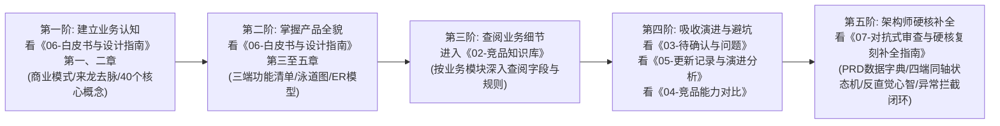

# 领星海外仓WMS竞品调研与产品复刻全景资料库

欢迎阅读本套海外仓WMS竞品调研与产品架构设计全景资料库。本套资料专为**新接触海外仓与跨境物流的产品经理、系统架构师及研发人员**打造，旨在帮助读者在完全没有海外仓背景知识的前提下，快速建立第一性原理认知，透彻理解三端协同架构，并直接指导自研海外仓系统（QS-WMS）的从零到一架构规划、原型绘制与PRD编写。

---

## 一、新手小白产品经理建议阅读路线

为了避免信息过载，建议按照以下**四阶进阶路线**顺序阅读：



1. **第一阶：建立业务常识与第一性原理（约30分钟）**
   - 阅读文件：[`06-海外仓系统全景白皮书与自研复刻设计指南.md`](./06-海外仓系统全景白皮书与自研复刻设计指南.md)（第一章与第二章）
   - 目标：搞清楚为什么海外仓能赚钱？为什么系统必须拆分为WMS（仓端）、OMS（货主端）、OMP（管理后台）？掌握SKU、FNSKU、中性条码、播种墙、子母件、Zone分区、阶梯仓租、体积进位等40个核心概念。
2. **第二阶：掌握三端产品架构与核心流程（约45分钟）**
   - 阅读文件：[`06-海外仓系统全景白皮书与自研复刻设计指南.md`](./06-海外仓系统全景白皮书与自研复刻设计指南.md)（第三章至第六章）
   - 目标：看懂入库、代发、换标三大端到端泳道图；对照三端35+48+28个核心页面功能矩阵，直接用于自研系统的原型菜单规划与实体ER建模。
3. **第三阶：深入业务模块查阅实操细节（按需查阅，字典型）**
   - 阅读目录：[`02-竞品知识库/`](./02-竞品知识库/)
   - 目标：需要写具体某个模块的PRD时（如入库上架、波次分拣、多货主计费），直接翻看对应的专项知识库，获取精确的字段含义、状态机流转、校验规则与边界。
4. **第四阶：避坑指南与竞品演进前沿（约20分钟）**
   - 阅读文件：
     - [`03-待确认与访问问题.md`](./03-待确认与访问问题.md)：看懂上架死锁、欠费不自动重推等四大设计缺陷；
     - [`05-版本更新记录与产品演进分析.md`](./05-版本更新记录与产品演进分析.md)：看懂近两年半70期更新的演进脉络；
     - [`04-竞品能力对比.md`](./04-竞品能力对比.md)：了解行业40项标准化能力评估基准。
5. **第五阶：架构师级建表与研发落地（约40分钟）**
   - 阅读文件：[`07-架构师级对抗式审查与硬核复刻补全指南.md`](./07-架构师级对抗式审查与硬核复刻补全指南.md)
   - 目标：掌握物理级表结构字段字典（英文键名/数据类型/强校验约束）、四端同轴状态机映射矩阵、出库四大节点拦截现场防呆闭环、波次缺货剥离算法、以及五大反直觉架构心智模型。

---

## 二、资料库完整文件目录索引

```text
├── README.md                                    # [本文件] 新手产品经理必读导读指南与阅读路线
├── 00-抓取清单.md                                # 全量273篇官方帮助手册抓取与解析索引
├── 01-原始页面/                                  # 273个独立保真Markdown原始页面库
├── 02-竞品知识库/                                # 结构化业务知识库体系 (1主干 + 10专项)
│   ├── 领星WMS产品知识库.md                       # 竞品知识库总览与三端协同主文档
│   ├── 01-入库业务全链路.md                       # 入库预报、到仓扫描、收货组托、新品量方、上架管理
│   ├── 02-库内与库存管理.md                       # 产品/箱/退货库存形态、锁定分配策略、静态盘点、序列号SN
│   ├── 03-出库履约业务.md                         # 一件代发、备货中转、波次规则、播种墙分播、包裹复核称重
│   ├── 04-逆向退件与FBA换标.md                   # 退件质检分流、FBA退货专属库、换标组分页打印、扫旧出新
│   ├── 05-特色增值业务与工单.md                   # Temu Y2直邮单、中性码换单、越库转运、增值工单自动计费
│   ├── 06-基础数据与主数据建模.md                 # 商品中心、组合商品、平台配对、客户四级风控、仓区货位
│   ├── 07-计费结算与财务规则.md                   # 阶梯库龄仓租、4级体积进位、多维操作费、分区物流费、成本对账
│   ├── 08-系统配置与作业策略.md                   # 全局单据开关、最低价打单比价、智能包裹尺寸、理论FIFO仓租
│   ├── 09-生态集成与外部对接.md                   # Ship123打单底座、官方承运商直连、电商平台API、TEMU合作仓
│   └── 10-移动端PDA作业与报表.md                  # 手持PDA作业流、PDA免扫库位、移动小程序、不可逆收发存台账
├── 03-待确认与访问问题.md                        # 11项未说明业务疑点与四大设计缺陷深度反思
├── 04-竞品能力对比.md                           # 10个业务域、40项能力标准化横向对比矩阵
├── 05-版本更新记录与产品演进分析.md              # 2024-2026两年半70期更新日志逐条精读与演进趋势
├── 06-海外仓系统全景白皮书与自研复刻设计指南.md  # 商业模式、概念地图、三端功能矩阵、泳道图、ER模型
├── 07-架构师级对抗式审查与硬核复刻补全指南.md    # 物理数据字典、四端同轴状态机、4大异常拦截闭环、5大反直觉机理
└── 领星WMS版本更新记录.json                      # 70期版本更新公告结构化原始数据源
```

---

## 三、核心价值与知识产权说明

本套资料所引用之原始事实数据均来自公开产品文档与系统合法授权访问界面，仅用于自研海外仓系统产品架构设计、行业技术调研与功能对齐参考。
