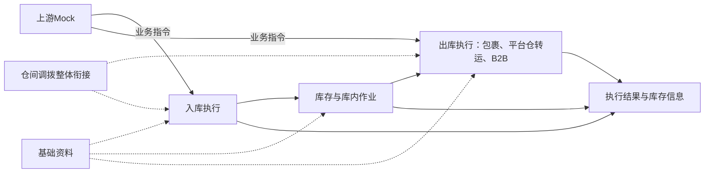

# 强盛WMS需求分析总览

> 状态：项目级范围初稿。已确认边界可作为模块分析输入；模块BR、FR、AC尚未形成，本文不表示需求体系已经完成或验收已执行。

## 一、项目级分析结论

强盛WMS服务强盛自有仓网，为自营和外部货主管理仓内实物作业与库存。一期同时覆盖香港、美西、美东、德国四仓，兼容轻小件、大件和异形货，完成入库、库存与库内作业、包裹履约、平台仓转运、B2B批发及仓间调拨的仓库执行。上游业务指令由Mock模拟推送，暂不支持WMS自行导入上游业务指令。交付是可运行演示系统，允许分批开发，但全部一期范围完成才算一期完成。

以上依据[项目定位与范围](../../01-全局背景信息/02-项目定位与范围.md)“一期范围”和[阶段规划与交付边界](../../01-全局背景信息/05-阶段规划与交付边界.md)“一期交付方式”。OMS客户端在二期建设；退货与增值服务、深圳仓及商业计费不进入一期。集团全局库存协同归业务ERP，正式财务核算归财务ERP，仓外运输与配送归物流系统。

## 二、模块职责与核心链路

| 模块／前缀 | 需求职责 | 双文档索引名称 | 当前阶段 |
| --- | --- | --- | --- |
| 基础资料 MD | 货主、商品、仓库及库区货位等前置资料的需求；资料变化对下游的影响由后续分析明确 | 基础资料需求调研／需求分析 | 待创建，范围已定 |
| 入库业务 IN | 正常入库从接收需求到入仓的仓库执行要求 | 入库业务需求调研／需求分析 | 待创建，规则待分析 |
| 出库业务 OUT | 分别研究包裹履约、平台仓转运和B2B批发的仓库执行要求 | 出库业务需求调研／需求分析 | 待创建，规则待分析 |
| 库存与库内业务 INV | 实物库存记录、查询及仓内业务需求；库存影响的共同定义由本模块维护，执行模块引用 | 库存与库内业务需求调研／需求分析 | 待创建，具体清单待分析 |
| 仓间调拨 TRF | 调出仓与调入仓之间的整体衔接及责任；仓内执行要求引用IN、OUT，不重复维护 | 仓间调拨需求调研／需求分析 | 待创建，衔接规则待分析 |
| 系统集成与对接 INT | Mock上游指令、执行结果交接及外部服务边界；不替代业务模块定义执行规则 | 系统集成与对接需求调研／需求分析 | 待创建，交接要求待分析 |
| 公共能力 COM | 归纳确需跨模块共用的机制；具体能力及范围须逐项分析确认 | 公共能力需求调研／需求分析 | 待创建，模块划分为整理建议 |

上表为文档职责划分，双文档尚未建立，因此暂列名称，不提供不存在的链接或编号。模块成稿后补上文件链接和核心BR／FR编号。管理端与仓内作业端是使用端，不单独复制一套业务需求。

图表示需求研究的主链与依赖，不规定库存生效时点、单据顺序或调拨状态。调拨涉及的出入库处在不同仓库，整体衔接由TRF维护；它不是所有入库或出库的必经步骤。

## 三、一期范围与共同原则

一期包含四仓、多货主、多品类及上述入库、库存、出库和调拨执行能力，以及支撑演示的基础资料和Mock协作。公共能力按主链需要分析，不能因设立目录就默认审批、导入或全部权限功能均已纳入。

一期明确不包含OMS客户端、退货接收与退货质检、换标换包装及退货重新入库、商业计费与结算、深圳仓。正常入库验收不因排除退货质检而被排除。WMS不承担渠道经营、ERP层面的全局库存协同、仓外运输管理或法定财务核算。

以下PRJ编号为项目级原则索引，不代替模块BR、FR、AC。适用条件、实现行为和例外在对应模块形成后引用回来。

| 编号 | 共同原则 | 依据与承接模块 |
| --- | --- | --- |
| PRJ-01 | 一期共同覆盖四仓，能够区分仓库与货主；不采用先单仓试点再扩仓的阶段方案 | SRC-02“一期范围”、SRC-05“一期交付方式”；MD、INV及各执行模块 |
| PRJ-02 | 自营作为普通货主使用共同能力，不建设面向其他仓储运营商销售的软件产品 | SRC-02“一期范围”；MD、COM |
| PRJ-03 | 包裹、平台仓转运、B2B及调拨均需获得需求覆盖，不以单一包裹流程代表全部出库 | SRC-02“一期范围”；OUT、TRF、IN |
| PRJ-04 | 一期由Mock模拟上游推送业务指令，暂不提供WMS自行导入上游业务指令的能力 | SRC-02“一期范围”、SRC-03“一期演示架构”；INT、IN、OUT、TRF |
| PRJ-05 | 调拨纳入仓库执行，集团全局库存调度和仓外运输管理不由WMS承担 | SRC-02“系统职责边界”；TRF、INT |
| PRJ-06 | 分批交付服务于完整一期目标；演示业务必须可运行，不能把静态页面或已有样板当成一期完成 | SRC-05“一期交付方式”“一期完成的宏观判断”；全部模块 |

SRC具体文件与性质见[调研总览第一节](强盛WMS需求调研总览.md#一定位范围与事实来源)。PRJ-04不自动规定基础资料或仓内业务能否手工维护；不得扩展解释为WMS内任何对象都不能创建。

## 四、跨模块待决策与后续确认

以下问题是分析工作中的待决策点，不表示相关功能已采纳。确认责任人尚未指定；表中时点是后续工作必须完成确认的阶段门槛，不是已承诺的日历日期。

| 编号 | 事项与问题类别 | 已定边界与待明确内容 | 影响与承接位置 | 确认方／最迟时点 |
| --- | --- | --- | --- | --- |
| DEC-01 | 外部服务与设备：交付方式 | 可运行演示已定；承运商、扫码及打印采用真实接入还是模拟待定 | INT分析稿及相关执行模块；影响实施与验收条件 | 未指定；相应接入设计前 |
| DEC-02 | Mock交接：跨模块责任 | 推送入口已定；各业务需接收什么、结果交给谁、失败由谁确认待定，不在这里选定接口协议 | INT分析稿主记，IN、OUT、TRF引用 | 未指定；交接需求确认前 |
| DEC-03 | 多货主与跨仓：业务权限 | 区分货主和仓库已定；哪些角色可查看、处理哪些业务范围待定 | COM分析稿主记，MD及执行模块引用 | 未指定；公共权限及关联业务设计前 |
| DEC-04 | 商品约束：服务深度 | 轻小件、大件、异形货纳入已定；带电安全及SN适用要求需依据调研明确 | MD分析稿与IN、INV、OUT；影响作业要求 | 未指定；相关模块需求确认前 |
| DEC-05 | 调拨衔接：数量与责任 | 调拨仓库执行纳入已定；调出与调入如何对应、差异由谁确认待分析 | TRF分析稿主记，IN、OUT、INV、INT引用 | 未指定；调拨及关联库存业务设计前 |

退货属于二期还是三期、深圳仓扩展时点及计费归属仍由[阶段规划](../../01-全局背景信息/05-阶段规划与交付边界.md)维护，不复制为一期阻塞项。模块内的页面、设备操作及字段细节放对应正文，不升级为项目级决策。

## 五、整体验收与阅读顺序

这里列需求体系的完成条件和演示覆盖维度，不是已经执行的测试记录，也不代替模块AC。

| 维度 | 需求体系完成时应满足的条件 |
| --- | --- |
| 来源与分层 | 现状证据、沙盘设定、目标决定和竞品参考可区分，结论能定位到具体来源；没有把Mock当生产证据 |
| 诉求处理 | 每条原始诉求都有采纳、不采纳或后置结论及理由 |
| 需求追溯 | 每条已采纳的系统类BR关联FR，每条FR关联可判定的AC，跨模块编号和依赖一致 |
| 业务覆盖 | 四仓、多货主、轻小件／大件／异形货以及一期各业务类型均有对应模块需求和验收；不要求虚构每个仓库经营全部品类的事实 |
| 业务衔接 | Mock指令、仓内执行、库存影响及结果交接的需求可以对应；调拨两端与差异责任有明确结论 |
| 阶段边界 | 不将二期OMS、退货或计费设为一期完成前提；各交付批次合起来覆盖完整一期 |
| 验收可执行 | 模块AC按“条件与操作→预期结果”书写，列明演示方式及模拟范围，不能只写“正确”“合理” |
| 未决项 | 影响范围、数量、责任或算法的未决项已说明影响和最迟时点；到对应设计阶段前完成确认 |

当前只完成项目级总览初稿，尚不满足以上需求体系完成条件。后续模块文档补齐后，应把整体验收维度关联到实际模块AC，不能只凭本表宣布一期可验收。

阅读顺序：先读全局背景中的项目定位与阶段规划，再读调研总览了解来源和缺口，接着读本分析总览。模块按基础资料、入库、库存与库内、出库、调拨逐步展开；集成与公共能力随主链同步阅读和维护。每个模块先读调研稿，再读分析稿。
